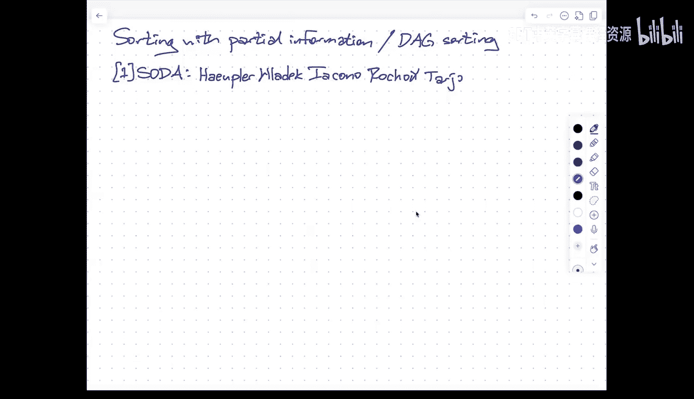
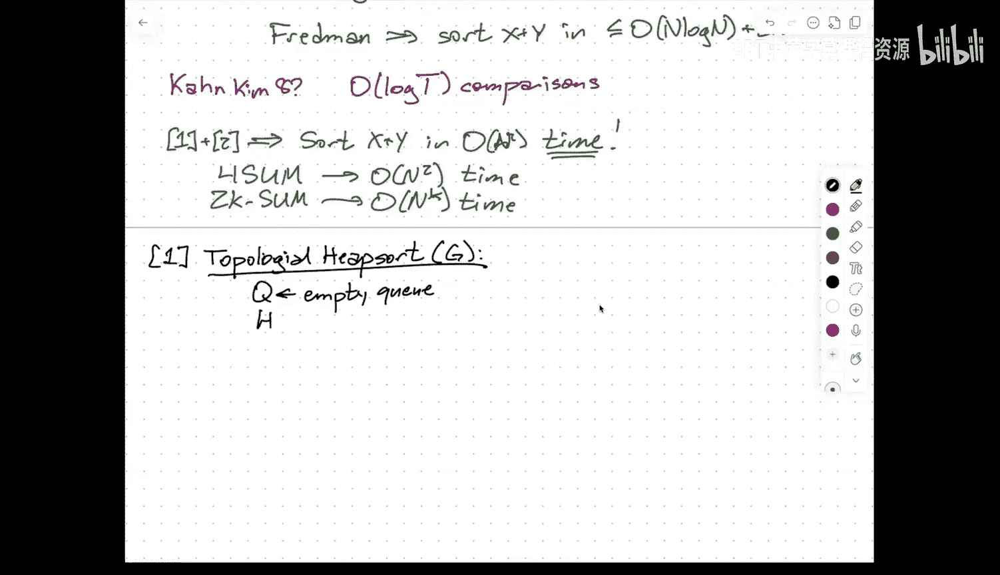
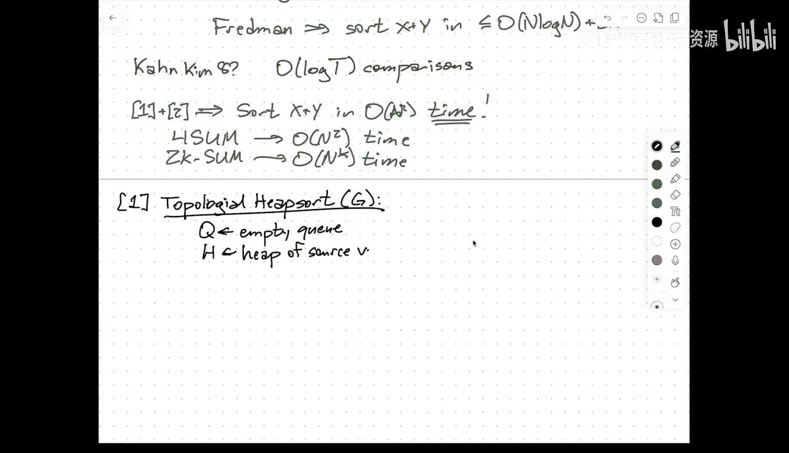
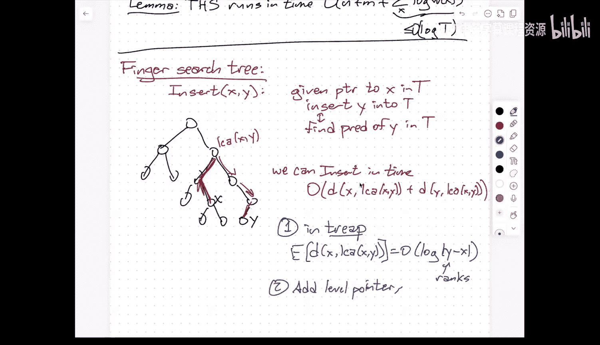
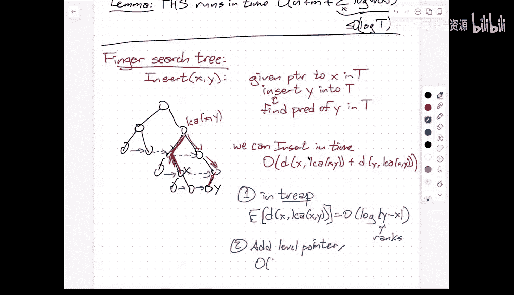
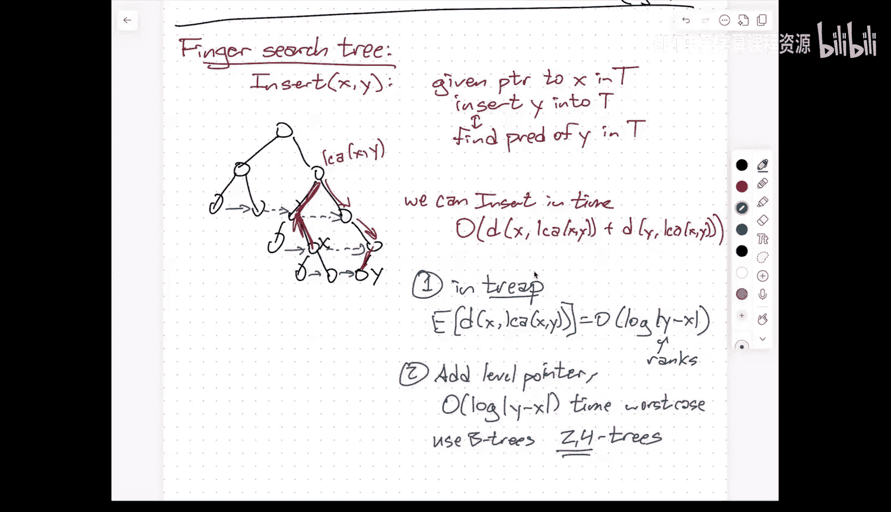
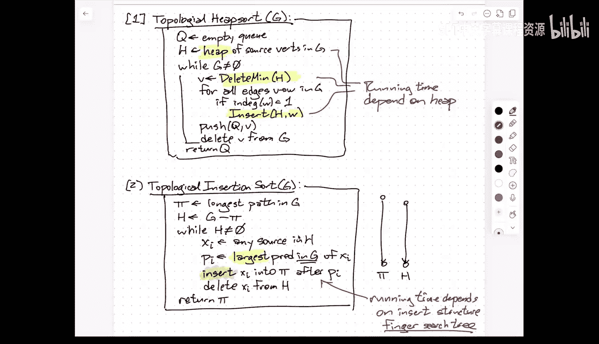

# 算法导论：017：基于部分信息的排序


在本节课中，我们将学习一个非常新的排序问题：**基于部分信息的排序**，有时也称为**DAG排序**。我们将探讨两篇发表于2025年的论文，它们以不同的方式解决了同一个问题，并最终实现了最优的时间复杂度。这个结果的一个直接应用是，它首次在50年内改进了经典的“排序X+Y”问题的算法。



---


## 问题定义

我们被给定一组 **N** 个待排序的项目。同时，我们还预先知道了其中 **M** 对项目的比较结果（例如，A < B）。这些已知的比较结果定义了一个**有向无环图**，其中每个顶点代表一个项目，每条有向边 `A -> B` 表示已知 `A < B`。

我们的目标是：**确定这N个项目的完整、正确的全序排列**。

这个DAG定义了一个**偏序**。我们最终要找出的全序，必须是这个偏序的一个**线性扩展**。设 **T** 为与该DAG一致的所有可能全序（即线性扩展）的数量。

我们的目标是设计一个算法，其运行时间为 **O(N + M + log T)**。这个界是最优的，因为：
*   `N + M` 是读取输入所必需的。
*   `log T` 是信息论下界：我们需要通过二元比较，从T种可能性中确定唯一正确的排序。

---

## 应用：排序 X+Y 问题

这个问题的一个经典应用是“排序X+Y”问题。给定两个已排序的数组 `X` 和 `Y`，每个数组包含N个数字。我们希望生成所有 `N²` 个和 `X[i] + Y[j]` 的排序列表。

*   **朴素算法**：计算所有和，然后排序，时间复杂度为 `O(N² log N)`。
*   **新视角**：我们可以将这个问题建模为DAG排序。每个和 `(i, j)` 是一个顶点。已知的比较信息是：
    *   对于固定的 `i`，有 `(i, j) < (i, j+1)`（因为 `Y` 已排序）。
    *   对于固定的 `j`，有 `(i, j) < (i+1, j)`（因为 `X` 已排序）。
    这形成了一个 `N x N` 的网格状DAG。
*   **关键**：这个特定DAG的线性扩展数量 `T` 远小于 `N²!`。事实上，可以证明 `log T = O(N log N)`。
*   **结论**：应用我们即将讨论的算法，可以在 `O(N² + log T) = O(N²)` 时间内解决排序X+Y问题，这打破了50年来 `O(N² log N)` 的最佳记录。这个改进还能推广到2k-SUM等问题。

---

## 方法一：拓扑堆排序

上一节我们定义了问题，本节我们来看看第一种解决方案：**拓扑堆排序**。这个算法结合了拓扑排序和堆排序的思想。






算法维护一个存放当前“源点”（入度为0的顶点）的堆 `H`，以及一个输出队列 `Q`。


以下是算法步骤：

1.  初始化一个空队列 `Q`。
2.  将当前DAG中所有的源点插入堆 `H` 中。
3.  当图不为空时，重复以下步骤：
    a. 从堆 `H` 中 **取出值最小的源点 `v`**（此操作涉及比较）。
    b. 对于图中每一条从 `v` 出发的边 `(v -> w)`：
        *   如果删除 `v` 后 `w` 的入度变为0（即成为新的源点），则将 `w` 插入堆 `H`。
    c. 将 `v` 追加到输出队列 `Q` 的末尾。
    d. 将 `v` 及其相连的边从图中删除。
4.  最终，`Q` 中存储的就是排序好的序列。

**算法理解**：
*   如果初始DAG无边，则所有顶点都是源点，算法退化为标准的堆排序。
*   如果初始DAG是一条链，则算法只是按顺序取出源点，退化为简单的遍历。

算法的效率核心在于所使用的**堆数据结构**。如果使用普通的二叉堆，每次插入和删除最小元素需要 `O(log N)` 时间，总时间为 `O(N log N)`。但我们需要更精细的结构来达到 `O(N + M + log T)` 的目标。

### 所需堆的性质

为了实现目标时间复杂度，我们需要一个支持以下操作的优先队列（堆）：
*   `Insert(x)`: 插入元素 `x`。
*   `ExtractMin()`: 删除并返回最小元素。

其**摊还**时间复杂度需满足：
*   `Insert`: **O(1)** 时间。
*   `ExtractMin` 对于元素 `x` 的耗时，与 `x` 的**工作集**大小有关。

**工作集** `W(x)` 定义为：在 `x` 被插入之后、被删除之前，所插入的所有其他元素的集合。其大小记为 `|W(x)|`。

我们需要 `ExtractMin` 操作对元素 `x` 的摊还代价为 **O(log |W(x)|)**。

这意味着，如果一个元素在堆中停留时间很短（工作集小），那么取出它的代价就低；反之则高。这种性质完美契合了我们的算法需求。

**如何实现**：论文中提到了**配对堆**（Pairing Heap）的一种变体（在满足特定条件下）可以满足这些性质。其分析比标准配对堆更简单。

---

## 方法二：拓扑插入排序

上一节我们介绍了基于堆的方法，本节我们来看看第二种思路：**拓扑插入排序**。这个算法模拟了插入排序的过程，但利用了已知的偏序信息来加速定位。

算法维护一个已排序的列表 `π`（初始时是DAG中的**最长路径**），以及剩余的子图 `H`。

以下是算法步骤：

1.  找到初始DAG `G` 中的一条最长路径，作为初始排序列表 `π`。
2.  令 `H = G - {π中的顶点及其出边}`。
3.  当 `H` 不为空时，重复：
    a. 从 `H` 中任取一个源点 `x_i`。
    b. 在原始图 `G` 中，找到 `x_i` 的所有前驱里，在列表 `π` 中**位置最靠后**的那个顶点 `p_i`（这可以通过比较得到）。
    c. 将 `x_i` **插入**到列表 `π` 中 `p_i` 的后面。
    d. 将 `x_i` 从 `H` 中删除。
4.  最终，`π` 就是排序好的序列。

**算法理解**：
*   如果初始DAG就是一条路径，那么算法第一步就完成了。
*   如果初始DAG是两条链（即合并两个已排序列表），那么算法本质上就是归并过程，可以高效完成。

算法的效率核心在于第3.c步的**插入操作**。我们不能简单地用 `O(log N)` 的二叉搜索树插入，因为已知的偏序 `(p_i < x_i)` 给了我们一个“提示”：`x_i` 应该插入在 `p_i` 附近。

### 所需数据结构：指状搜索树



我们需要一个支持**指状搜索**的数据结构来维护列表 `π`。
*   **操作**：`FingerInsert(x, finger)`。给定一个指向元素 `finger`（即 `p_i`）的指针，将新元素 `x`（即 `x_i`）插入到正确位置。
*   **目标时间复杂度**：**O(log d)**，其中 `d` 是 `x` 的最终排名与 `finger` 的排名之差的绝对值。





**如何实现**：
1.  **随机化方法**：使用**树堆**。从 `finger` 开始，期望的搜索路径长度为 `O(log d)`。
2.  **确定性方法**：使用**B树**（如2-3-4树）。B树通过节点分裂（而非旋转）来保持平衡，这使得维护“同层指针”变得容易，从而可以实现确定性的 `O(log d)` 指状搜索。

---




## 核心分析工具：区间引理

无论是拓扑堆排序还是拓扑插入排序，其最终的时间复杂度分析都归结于一个关键的**区间引理**。

我们定义一系列区间 `[a_i, b_i]`（1 ≤ i ≤ N）：
*   **对于堆排序**：`a_i` 是项目 `i` 被插入堆的时间，`b_i` 是它被提取出的时间。区间长度 `(b_i - a_i)` 正比于其工作集大小。
*   **对于插入排序**：`a_i` 是前驱 `p_i` 的最终排名，`b_i` 是项目 `x_i` 的最终排名。区间长度 `(b_i - a_i)` 反映了插入时的搜索距离。

基于这些区间，我们构造一个新的DAG `I`：如果区间 `[a_i, b_i]` 完全在区间 `[a_j, b_j]` 的左边（即 `b_i ≤ a_j`），则有一条边从 `i` 指向 `j`。

设 `T(I)` 是DAG `I` 的线性扩展数量。可以证明，原始DAG `G` 的线性扩展数量 `T ≥ T(I)`。

**区间引理**指出：
```
∑_{i=1}^{N} ln(b_i - a_i + 1) ≤ ln T(I) + O(N) ≤ ln T + O(N)
```
其中 `ln` 是自然对数。

**证明概要**：
1.  想象一个随机实验：独立、均匀地生成 N 个随机数 `r_1, ..., r_N` ∈ [1, N]。
2.  考虑事件 E：对于每个 `i`，随机数 `r_i` 都落在其对应的区间 `[a_i, b_i]` 内。
3.  事件 E 发生的概率是 `Π_{i=1}^{N} ( (b_i - a_i + 1) / N )`。
4.  如果事件 E 发生，那么将随机数 `{r_i}` 按大小排序后得到的排列，必然是 DAG `I` 的一个线性扩展。
5.  所有 N! 种排列是等可能的，因此 DAG `I` 的线性扩展数量 `T(I)` 至少为 `N! × P(E)`。
6.  对不等式 `T(I) ≥ N! × Π ( (b_i - a_i + 1) / N )` 两边取自然对数，并利用斯特林近似 `ln(N!) ≈ N ln N - N`，即可推导出引理。

这个引理将算法中各个操作的代价（`ln(区间长度)`）之和，与问题固有的信息论下界 `ln T` 联系了起来，从而完成了算法的整体分析。

---

## 总结

本节课我们一起学习了**基于部分信息的排序**问题。
*   **问题**：在已知部分比较结果（构成一个DAG）的前提下，完成排序。
*   **目标**：达到 `O(N + M + log T)` 的最优时间复杂度，其中 `T` 是符合已知偏序的全序数量。
*   **两种算法**：
    1.  **拓扑堆排序**：按拓扑序从堆中提取最小源点。关键在于使用具有**工作集敏感**提取操作的堆。
    2.  **拓扑插入排序**：维护一个已排序列表，并按拓扑序插入剩余源点。关键在于使用支持**指状搜索**的树结构。
*   **核心分析**：通过巧妙的**区间引理**，将数据结构的操作代价总和与信息论下界 `log T` 关联起来。
*   **重大应用**：该成果直接带来了**排序X+Y**问题的 `O(N²)` 时间算法，打破了50年来的记录，并可能影响一系列相关问题（如2k-SUM）的算法上界。



这个工作展示了如何通过结合经典的算法思想（拓扑排序、堆排序、插入排序）并精心设计底层数据结构，来解决一个看似简单但长期未决的理论问题。