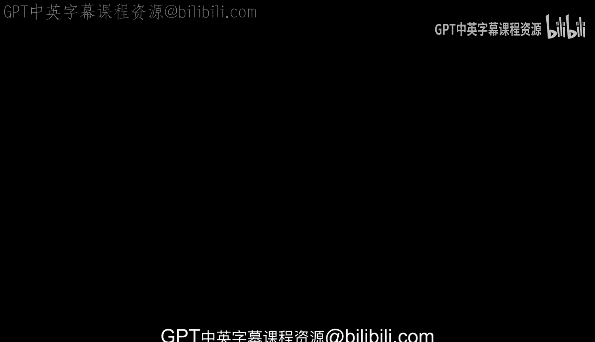
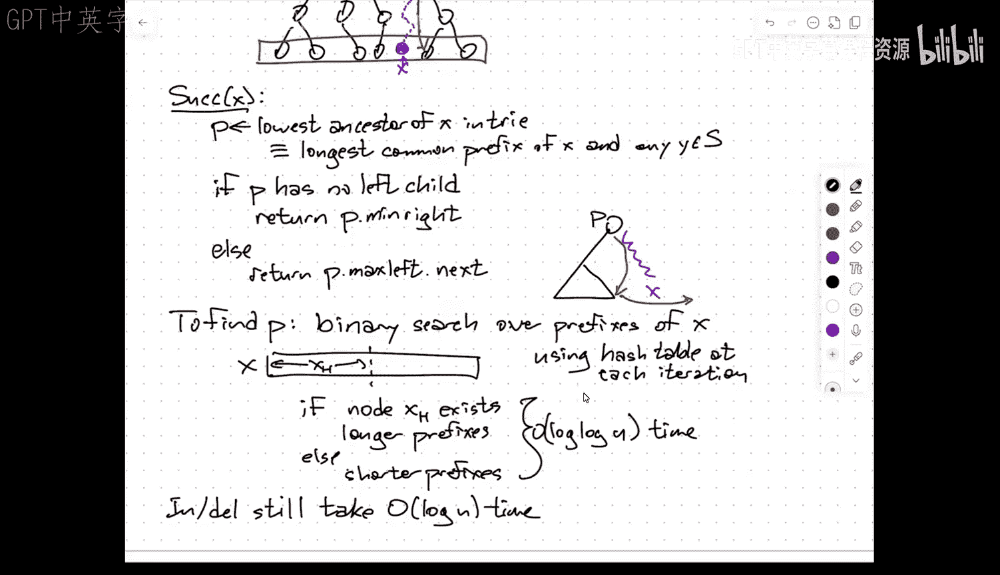

# 018： van Emde Boas trees and x-fast tries.zh_en -BV1kWFGzsEmN_p18-

So， a couple of。

Administrative things。Um。This afternoon。Really， I guess I should say this evening。After class。

mThe B a。Form on the course web page to。A。Register project groups。U。

This is just so that I know how many。Presentations we need to schedule in the last few meetings of the semester。

I'm going to ask for。啊。The names of everybody in the group and at least a tentative。One you know。

 six word title and a one or two sentence description。Of what the what the project is likely to be。

 I'll have the form set up in a way that you can update your you can resubmit because as you things always change on the fly。

As your project evolves， so this is not asking you to commit。

To any particular thing to either present in class or submit a report on at the end of the semester。

This is just trying to get a feel for where everybody is， in particular with the formation of groups。

And。Their。呃。Are either four or five lectures left， including today。

 depending on how many people show up and I'll also ask in the form about availability during reading day because we could at least in principle use。

This space or another room that I'll have to find on that Thursday before exam week starts to do any last minute presentations。

嗯。I。So， but that does mean that。You know， project presentations。Essentially， start。In two weeks。嗯。

So if I ask everybody when they want to present。I can confidently predict that 100% of the class will say。

 I want to present on the last possible day。That won't work。Um。If we have few enough。Groups， then。

 you know， we can start later。But my guess is that some people are going to be presenting either two weeks from the day or two weeks from this Thursday。

 and so again， the forum is going to ask about availability preferences or if you think there's any chance of being able to present any progress by then。

So please try to be flexible again， please understand that the presentation is supposed to represent progress。

 not the final outcome。嗯。So that's one thing。The second thing。呃。So if you remember on Thursday。

 I described this result about sorting with partial manipulation and one of the motivations that I gave for that problem is this problem called sorting X plus y。

 I kind of wondered why the authors，Didn't describe。Their solution to the sorting X plus Y problem。

 given that it seemed to follow directly from their results。

 so I wrote the author and said hey you guys you solve this 50 year old open problem and one of them very kindly wrote back said yeah。

 that would be nice， but no， we didn't。And the。哦。The place where I went off the rails beside just not reading very carefully。

Is if you look at the x plus Y Dg。It's this directed grid。

With one row for every element of x and one column for every element of y。The only information。

That this dag。嗯。Remembers that it stores。Is the fact that you have an end by N grid of numbers where every row is sorted and every column is sorted。

But it turns out if that's the only information you have。So every。Row and column is sorted。

That still allows。4， sorry。Two to the n squared log n。啊。Topological orders。The x plus Y problem。

It is true that the information in the X plus Y problem only allows two to the exponential and n log N total orders。

 but that's because there's additional information that's restricting the possible total orders。

Any two adjacent items？That are adjacent along the same column in the x plus y matrix have exactly the same difference。

But the dag doesn't record that information。 The dag only says the thing on the left is smaller than the thing on the right。

 and the thing above is smaller than the thing below。So there's more freedom allowed。By the Dg。

Then is allowed by the sorting X plus Y problem。And so even though sorting X plus Y。

 there are really only so many topological orders， that information is not in the DAG。

 and so the DAg sorting algorithms can't take advantage of it。I think it's the short version。

So that n squared log n in that exponent。Means that。Either of the DAg sorting algorithms。Gives you。

a cansort x plus y in n squared log n time。But of course， that's。We already know how to do that。

Just write down the n square numberss and sort them。

So the reason why they didn't describe this solution to a 50 year old open problem in their paper is because they didn't solve the 50 year old open problem。

 its still。What's really embarrassing about this is in the 1975 paper called sorting X plus Y that introduced this problem。

 they actually explained this。That just sorting a matrix with sorted rows and columns that that doesn't really give you any advantage。

 but the sort， you know， the x plus Y matrix has this additional structure that。

Ought to be exploitable somehow， and we know how to exploit it in terms of the number of comparisons。

 but not in terms of overall time。So。The 50 year old Uproim problem is still open。

Nothing has there's no more advances since the sort of obvious。

Trivial algorithm that was known in 1974。So I apologize for getting a little overexted。

 all the other stuff works， it's just this one application。I went off the rails。It happens。

It's a tenure moment。嗯。Any questions about this？Ok。So what I want to start talking about today。

Is integer data structures？So。This。嗯。I want to step away from。

The abstraction that we've used through most of the semester where the things that you're comparing are atomic objects and you can do constant time things with them like comparisons。

 but you can't look。At the internal structure， we violated that that abstraction a couple of times already。

 but I want to really dive into how much we can get away with if we avoid that that that if we break that abstraction。

 So in particular， I'm going to look at。Order dictionaries。4。Some set of elements that belong。2。

The set of integers between one and you。So I mean， just because assumed that my universe。

Are the first U positive integers？嗯。And I'm going to try to exploit the fact that I know that they're integers and in particular every element of S。

I。A。Log you bit word。So I am going to assume。that。I can do word operations。In constant time so。

I'm going to assume every memory address can store at least blog U bits and simple operations on memory words like addition subtraction。

 multiplication， comparisons， mod。A bit wise exclusive or these things can be done on words。

By exploiting the hardware in my machine in constant time。嗯。Now。

One simple way that one can think about how to exploit this is。

And I'll go into more detailed examples that do this now that use this trick。

But I want to sort of expose this trick。So here's my word， it's got log U bits。

But let's suppose just for the sake of illustration that I've actually kind of reduced。

The size of my items down to only one fourth of log U bits。So within a single word， I could store。

The numbers A， B，C and D， and maybe。Just。To。Pad this out， I can inject ones into the bit。

 so I can pack these small integers。Into a single word。

 four small integers that can pack into a single word。 And then similarly， I could。嗯。他。

For other small integers， a prime。Be prime。C prime。And D prime。Into this word。Now， if I subtract。

These the second integer from the first， remember that's a single word operation。

 and so this iss happening in constant time。And only look at these bits here in the middle。

So in the thing that the top integer， I've inserted ones as spacers in the bottom integer I've inserted zeros as spacers。

 so when I do this subtraction，I don't really care too much about this part of the result。

But if I get a one here， that means that a is bigger than a prime。Or equal if I get a zero here。

 that means b is less than b prime。So。By doing a single comparison。

I'm actually performing four multiplications or sorry， four comparisons simultaneously。

And so versions of this trick。Allow you to speed up algorithms that are based on comparisons。

As long as you can somehow decrease your key space to the extent that you can pack multiple things in a single word。

 then you can compare all those multiple things in a single operation。

And so like the n log n comparison lower bound for sorting。Doesn't apply in this setting。

Because I don't need a constant time to do each comparison。系。嗯。

The thing that I'm going to talk about today。Is a slightly different way of approaching this。嗯。

Which is。For。Order dictionaries。This means that I need to be able to find predecessors or successors。

 and I need to be able to do insertions and deletions because I want to do things dynamically。嗯。

Not just membership queries。So the order of things matters。

So if I if I have some subset of of say eight bit integers and I want to look for。Successor。

Of this eight bit integer。There's two possibilities one is。That the successor。Starts with the same。

For more most significant bits。In which case， what I really want to do is sort of a recursive successor query。

To find the correct lower order bits。Yeah。嗯好好。好。Well。

 imagine I did four comparisons in one step now imagine that four is actually something like log log U。

Yeah， it doesn't have to be conscious any number of things I can pack in there on doing all those comparisons at once。

Or the other possibility。Is that。The successor doesn't start with the same prefix。

But then whatever the successor is。The higher bits are。

As small as possible while being larger than the small the higher order bits of my。Query target。

 so I just need to do。A recursive successor in the high order bits。And then。

To find the low order bits。I just need to find the smallest number that starts with those four high order bits。

 so there's kind of a recursive min here。系。嗯。So this is a very， very high level sketch。

 but the idea now is that if I want to。嗯。Look at the time to find a successor where my universe has size U。

U。I'll describe how to distinguish between these two cases in constant time。

 This is going to be constant。Plus。Well， I need to do one successor query on half as many bits。

So now my universe size has gone down by square root。嗯。嗯。And again。

 the men over there will actually end up being constant time。So this turns out to be。Log， log you。

So at a very crude， intuitive level， by exposing the bit representation of my keys。

 I can find successors not by doing binary search over the， over the values in my set。

But by doing binary search over the bit positions。To find essentially what it turns out to be if you unroll the recurrence is you're finding the longest common prefix between the element that you're looking for and the numbers that I'm storing in my data set。

Okay， so I've turned binary search over the N keys into binary search over the log U bits。😡。

Was my representation。系。So。The second trick is the one that I'm actually going to describe in more detail。

 we'll see the first trick either on Thursday or next week， depending on how far I get today。

But this is the basic intuition of a couple of things that you can do by doing what the first one is usually referred to as bit level parallelism。

 the second one， I guess it's a bit level。Binary search。嗯。So。

I'm going to start with just like the really， really simple structures for order dictionaries。

The sort of simplest data structure that you can imagine。Is just a bit vector。Of length。You。系。Now。

 obviously， if I normally want to think about the size of data structures as a function of the number of items that I'm storing。

 and this is immediately violating that， even if I'm storing nothing。

I still need to use order to use space。I will come back to this point later closer to the end of the lecture。

 I'll improve the data structures I'm developing so that the space is only dependent on N and not on U。

 but for now let's just walk through the data structure and stages。😡，So I just say like。Be of you。

Equals one。If and only sorry of x equals1， if and only if x is in my set S。可。So。If I want to find。😡。

You know， is a given number x in my set or I want to do an insertion or I want to do a deletion。

 these all take constant time。if I look at x and I look at the x bit， if my vector， if it's1。

 the x is there， it's0， the x is not there， if I want to insert x， I just set that bit to1。

 if I want to delete x， I just set that bit to zero。Reucible。On the other hand。

 if I want to do a successor or a predecessor。In the worst case。

I need to spend time proportional to the length of dip array。

If the array happens to be empty and I say find me the successor of five。

 I start at five and I start scanning。Either I hit a one and I report that or I fall off the end and I say there is no successor。

There's not much。You know， to do here。So what I'd like to avoid is that brute force search。

 this is why we have binary search trees， but I want to develop this in a different direction。

So I'm going to use something called a tiered bit vector。Okay， so。The idea。Is I'm going to split。

My bit vector。Into chunks of size square root of view。And then at the top。

 I'm going to have a summary structure also of length square root of view。

That has a zero in in it if this is empty and it has a one in it if the corresponding chunk is。

Not empty。Okay。😊，This is I think reasonable， think of it if you like as a bee tree where B is square root of n。

It's kind of what it is all of these things。We're kind of used to building structures by trying to evenly partition rank space。

 the imagine sorting the items I want to split the binary search tree like the left。

 the lower half and the upper half within that sortded order of items。

 here what I'm doing is instead trying to evenly split the overall universe of keys。系。嗯。Okay。

So what I'm going to write。I need some notation here。I'm going to split any integer X。

And like hespace。This is a log U bit integer into two smaller integers each with half as many bits H sub x is the high order bits。

 a x sub L is the low order bits， so X is。啊。You can think of it if assuming you is a power of two。

This is。H of x times squared of u plus x of L。嗯。But I really。

 I'm going to sort of treat it as concatenation of those bit strings。All right， so。Let's write。

These bit strings， this will be bit strings from one to square root to u， and that'll be nice。

 I'll make the zero indexed。嗯。And this I'll call the summary again from zero to square root of u minus one。

helello。So if I want to find X。I return。U。呃。Is it？B of X。H of X L equals。Okay。

 so this is really I'm using the standard representation in forchan or C of a two dimensional array as you know row by row concatenation。

 so I'm going to treat it like a two dimensional array in the。Chunk at position X of H。

 I will look up the bit at position X of L， and if that's a1 I return truth。

 that's a zero return false。嗯。So if I want to find the successor of X。嗯。

I'm going to need one additional operation here， I'll use it and then I'll back up and I'll describe how to how to。

嗯。How to implement it？So M is going to be the maximum element。Of。B of X of H。Okay。

 so I look at the higher order bits of x， I look in that chunk。And I pull out the largest element。系。

U。Now there are two possibilities here。It could be that that chunk is empty in which case it doesn't have a max。

Or。If。M is too big。Sorry， if make sure I get this right。Neat the maximum thing with the。Too small。

 Yes， thank you。 Okay， If M is smaller than the low order bits of x。Okay， then I'm in。

This situation over here。Okay， there isn't a successor。Within the chunk that should contain eggs。

Either there's nothing in the chunk that contains X。

Or the largest entry in that chunk is smaller than X。Yeah， have twos there is no difference so okay。

 remember that that there's a meme from the office。

 the boss wants us to find a difference between these two pictures。

 a two dimensional array and a concatenation of virtual one dimensional arrays。

They're the same picture。Yeah， okay， so it's yes。Okay， so in this case。

 what I need to do is I need to find。The successor of the low order bits。Oh， sorry。

Ah with the logic wrong。Now， the race， there we go。This isn't。And。And this is， in fact， greater than。

嗯。Okay， so this is the case on the left。And then I'm going to return。X of H concatenated with S。系。

If the trunk that should contain X is non empty。And its largest element is bigger than the lower half of x。

That means the successor of x is represented in that block， in that chunk。

 and so I recursively look for the successor of the lower half of x in that chunk。

And then concatenate it with the upper half effects。Otherwise。Oh。

I find recursively the successor of the upper half of X。In the summary structure。And then I return。

That upper half。Concateated with the min elements。Yin。😔，That blocks。

In the smallest element that's in that corresponding block。Okay。Now。

 there are two things that I haven't described how to do， that's finding the max and finding the in。

U。啊。But Max and Min are essentially two recursive calls。

So if I want to find the largest integer in this。That's represented by this tiered bit vector。

 the first thing I do is find the maximum index in the summary that has a one in it。

That gives me the upper half of the maximum element。And then I go to the corresponding block。

 and I find the maximum index in that block that has a one in it that gives me the lower half so similarly with。

So the I or well， I'll just do it this way。Ah no， I won't do it that way， trying to be clever。

 don't be clever。H is。呃。The maximum。Of。Well， so this is max of the whole thing， some max of X。

This is Max in the summary structure。And then the low order bits are。The max in the bit vector at H。

And then I return。H compose e。嗯。So。Notice what I've done here。Okay。

 so this means that the time to do a successor in a universe of size U。

 this is proportional to the time to do a successor in a universe of size squared of U plus twice。

 you min and max are completely symmetric， so I'll just write a little M here。

 turn to do this over a universe of size squared of U。Pluss a constant。And here。

 the time for a max or a min the universe of size U is twice the time for a max in universal of size squared U plus order one。

Now， if it weren't for needing to find the in in the max。

This recurrence that I have for the time for successor that would resolve to log lu you。

I'm making one recursive call in a universe of size square root of u。

 the number of times you can take the square root of u before it reaches one is log log U， great。

 but I have this call to min and then later are called Max and later are called to min so I need to answer those min max bug and unfortunately this works out to be log U。

So if I make two op calls to universal sizei squared of U。It turns out that。

You get an increasing geometric series with log log U terms。😡，I'm doing one call at the root。

 two calls at the next level down， four calls at the next level down and so on。

 so the whole thing is going to be dominated by two to the depth of the recursion。

 just two to the log log U that's log U。系。So that means that the successor time is log U。UmThat's。

Better。Then just you。But it's hopefully intuitive。Or at least feels wrong that finding the successor of something。

 the hard part of that is finding the largest element in the entire structure。给る。

But it as it's on here。I'm not sure I understand and song as just can we also hear as yeah。

 so I mean， what've I sort of immediately skippped to the recursive view here。

Where each one of these bit vectors of length square root of view is actually stored as a recursive data structure。

They're not actually bit vectors right if they were really bit vectors then the recursive successors aren't recursive successors at all。

 they're just scans of the root you things and so the running time is squared of U and likewise the max is scanning two bit vectors of length squared of u and so the running time is squared of u so I might as well write that down without recursion。

This is order squared of u time。And this is order square root of u time。So again。

 this is better than what you would get from a raw bit vector by a square root。

So sort of obvious thing to do is to replace those things not with bit vector calls。

 but with recursive calls。And now everything is now only logarithmic in the size of the universe now we have a much simpler way of doing logarithmic in the size of the universe。

 you build a big binary search tree， it has at most u nodes in it therefore the predecessors successor search takes log U time so this is not very satisfying and in particular the min in the max being the bottleneck。

😡，I is not very satisfying。I'm going to yes。That you can figure out how to make men and Max faster。

How would I make mini Max faster？So just as a warm up exercise。

Suppose instead of an order dictionary， I was maintaining a priority cue。

 one of the things I need for a priority cue is to be able to find the minimum element。

How do I do that quickly？In every priority queue。But why does that work？Right。

 the men is right there。There's a place in the data structure where the min is stored。Great。

 so I'm going to add a place in the data structure that just stores the min。

And another place in the data structure that just stores the Mac。Okay， yeah。Yes。

 when we get to insertions and deletions， we have to be very careful to update that information。

 but let's get there a step at a time okay so this is。What's called Van Em Debois tree。

Anam Du Bois described this in what was at 75。Okay， so。The idea。Is。I'm going to store。Min。

I'm going to store the max。I'm going to sort a summary。Which is a recursive。V M De Bois T。

And I'm going to store an array of what I'll call clusters。These are also recursive venom debo trees。

嗯。Now。The way you should think of a single mode。If you like in this in the data structure is okay。

 there's something the min over here， there's a max over there and then。

There's the summary data structure and the clusters。Intuitively， you're going to treat these as。

An array of bits and an array of pointers。But in fact， it's not in rave bits。

 it's a recursive structure。嗯。The pointers are going to point。To smaller venom debo trees。

 the summary is actually smaller venom debo trees， but every recursive venom debo tree is over a universe that requires half as many bits to represent。

Okay。Now。I'm going to add this as a technical condition， the min and the max。Are not。Represented。

In the recursive structures。Okay， so what this means is。If my venom debo tree has only one item。

It's only storing one item， that item is the min and the max。

And the recursive summary structure is empty， and all the recursive clusters are empty。

If I only if I have no items whatsoever， if I have an empty structure。

 that's easy to detect because the min and the Mac are both going to say none。😡，Or equivalently。

 the min says infinity and the max says negative infinity， some signal value。

If I only have two items in my venom debo tree， I saw one of them in the min。

 the other one in the max， and everything else is empty。

OkayThis is actually going to be important for the analysis of insertions and deletions。

 I have to know that if I'm inserting something for the first time into a anom deestry。

That only takes constant time， I just need to set in and max。

If I'm deleting something from a venom Debo tree and that makes the Vanom De Bo tree empty again。

 that only takes constant time。Because all they did was change mini max to none。嗯。

For purposes of doing successors and predecessors， though， this is not an important technical point。

 it's just for insertions translation lesions to be efficient。系。嗯。So now。啊。

Finding the max in a vanom detry takes。Constant time。Okay， which means now with that improvement。

This goes away。And my time for successor。Now becomes log log U。可。😊，The same algorithm。

I just changed how I implement Min and Max。As just lookups。Okay。

 I'm just going to throw this out again， the size of this data structure is still order U。

Still the size of the universe。But already。This is in practical situations。

 a performance improvement， if the things that I'm storing are integers between one and n。

So I have at most end things， but each of them is， say， an index into an array of LinkedIn。

Then in order end space， I can do predecessor and successor queries in log， log N time。

If my keys are between one and n squared， then well I need n squared space and I'm still getting log log n and query time。

But at least in the sort of most constrained case where。The number of items。Is or sorry。

 the size of the universe and the number of items are within constant factor of each other。

Then I get an exponential improvement over binary research。Really。

 if you have a density Portland like log in over you log you over you yeah， I mean。

 it's you can figure out where the right trade off is。嗯。Eventually。

 I'm going to get that space using a different data structure down to order N。

With same the same successor time。Great。U。O。So I'm going to walk through。

At least the main part of doing an insertion right This is not the complete algorithm because I'm leaving out some bookkeeping for the mins and maxes。

 I'm just going to。Do the hard part。系。嗯。So。Well， okay， right， so let if the stores。

Less than two items。Update。The men。And。Vm。And then return。Okay。

 so that's all I'm going to write here。U。There's a small technical point that if say。

 the maximum element stored in my vanom de tree is say 500， and I insert 666。

That's changing the maximum element stored in the data structure。

 so I need to change the explicit max that I'm storing to 666。😡。

And then take the old max and insert it into the structure。Okay， so there's a little bit of。

If x is bigger than v dot max。Then I'm going to swap。X and V dot max。And likewise。

 if x is smaller than v dot min， then I'm going to swap X and v dot min。So this is， again。

 to make sure that the thing I'm inserting is actually strictly between the min an the max。Okay。Um。

Okay， so if。V dot cluster。Of X H。Is empty。And remember， that means it's。Min equals none。

so is something that can be tested in constant time？啊。Then I need to if if the high order。

Bits of x are not represented anywhere in the venom debo tree。

 then I need to insert those high order bits of x into the summary structure。

So I'm going to recursively insert into V dot summary。The high order bits of x。Um。And then finally。

 I'm going to insert。Into the cluster corresponding。To the higher bits of x。

I'm going to insert the lower order orbit bits of x。There's my insertion algorithm。Now。

 you'll notice that。In the worst case， the insertion algorithm makes two recursive calls。But。

Let me call this recursive call one and recursive call two， so if we call one。Then。2 runs。

In constant time。Because we are storing them in and Mac。It's empty， I mean I'm creating a new。

 I'm inserting something into that cluster for the very first time。

 so I'm just going to write into the Min and max and be done。So in fact。

There's only one non trivial recursive call。And so this means。啊。This all happens in log， log U time。

Right， the time to insert。When my universe has size U。

I do one non tri recursive call for a universal size square root of view and everything else takes constant time。

That comes out to log log U。系。U。Deletion is symmetric I'm not going。Walk through the details。

But it also runs in log L U time。Yeah。How we updateOkay so。There are。Two possibilities。

If the min is equal to none， that means that the structure is completely empty， I set v into x。

 I set v max to x and I return。If min and max are equal。

 that means the structure is only storing that one value。

Then I update either min or max depending on whether x is bigger than the old item or smaller than the new item。

 and then I return。表关了一则是。Insertion， oh， okay， so， so yeah， deletion is a is a。嗯。You are。

When you delete。Then say I delete the maximum element in my tree。

 then the new maximum element is going to have its upper half at the maximum element of the summary and the lower half as the maximum element of the corresponding cluster。

😡，And those are stored constant time， so I do need to delete those from the recursive structures because I'm not recursively representing the max in those recursive structures。

😡，So when I'm deleting the Mac， it looks like I just got Max， done。

But I still end up having to do recursive calls， and again。

 only one of those two recursive calls is actually nontri。Okay， so again， I end up with log log U。嗯。

Okay。So。The summary here。😡，Is。You get all。Quries。And updates。In。Log。Log。You time。Uing。

Order you space。嗯。😊，So that's great if you is。Only N。Not so great otherwise so the。Second。

 slightly different approach。This is something proposed。By。Willard in '82。

 a few years after Vanom Nabo。Um。Here， again， I'm going to start with a basic data structure and improve it。

😡，So the basic data structure here is not just an array of bits。But a binary。Try。Okay。

 so the idea is。At its core。I have a binary search。

Tree or something that looks like a binary search tree， it's a rooted binary tree。

But the way that I navigate the tree is by looking at the bits of my search key one at a time。

If the first bit is a zero， then from the root， I branch to the left， if it's a one。

 then I branch to the right。Okay， so zero， one， zero， one， zero， one， so on。Okay。But。

Let's just imagine that I'm only storing 001010。呃。And  one11。So my universe is all three bit strings。

 but I'm only storing three of them。Then I'm going to delete。

Any node that doesn't have a descendant that is stored in my sat。Okay， so see。Bineary。Tree。Of depth。

Exactly log based two of you。Each leaf。Corresponds to a word。A binary string of。佢就。B string。

Of length。Lord is two you。But I keep。Only the ancestors。Of leaves in my set S。Okay， so in this case。

嗯。This node would be deleted， this node would be deleted。This all that subre would be deleted。

 that node would be deleted。And so the overall。T would only contain。These vertices and ets。嗯。嗯。

So if I wanted to find whether something is in a try。

I use the standard off the shelf algorithm for searching a binary tree。

I look at the first bit zero branch left if zero branch or right if one。

 if I ever try to follow a pointer that isn't there， I know my target isn't in the set。Okayy。啊。

Insertionions and deletions are a little bit more complicated。

 but say you know if I want to insert the string 10，0， that means that。I need to like actually add。

All of the bits that aren't there anymore， but I do essentially need to walk my way down the tree。

 okay。So I can do find。Insert。Delete。With a little bit of extra work。Predecessor， successor all in。

Order， log you time。So this is better than the starting with the bitmap。

But the more interesting thing is the space。So each item。

Is potentially going to give you log U bit log U notes。

So every item is going to have an ancestor at every level of the tree。

And if the items are widely spaced， most of those ancestors for different items could be destroyed。

But so analog log U is clearly an upper bound。So I count every ancestor of each item in S independently。

 I know that's over counting because I know the root is unique。

But this is actually a tight worst case， upper bound， for example。

 if n is square root of U and I have square root of u evenly spaced things。

 then everybody's going to have log you over to distinct ancestors。Um。

So the universe size is still showing up here。But already。

 if I am searching over a polynomial size universe， I'm getting log n queries。Using N log end space。

It's muchuch better than whatever query is using polynomial space。Okay。Um。

But log U is not great in terms of time， I'd really like that to be log log U。And so again。

 I want to try to figure out a way of doing a binary search over the bit representation。

So this is the idea that Willard had called an X fast try。Okay， so I'm going to modify。

The binary try as follows。Okay， so a couple of things。Any node？Without a right child。Points。To。

The maximum。Left。Lish。So if I have a node that only has a left child。

Then the right child pointer is going to be， hey， this is not a child pointer now。

 this is a descendant pointer， it's going to point to the maximum leaf in the left substratere。Now。

 if a node doesn't have a left child or a right child， the node doesn't belong in the tri。

That means it doesn't have any leaves， so at the bottom level， it's not representing any set of X。

 any item in S。Right， so symmetrically。Any node。Without a left。Child。啊。Points to the minimum leaf。

On the right。た。Um。Each leaf。Points。To its predecessor and its successor。

so when I get down to the bottom。I've got a w length list here。

 this allows me to do insertions deletions predecessor queries。

 successor queries if I know an item I find it successor just by chasing a pointer。

 for who insert an item I need to insert it into this list。

 but I'm going to have handles on the predecessor and successor so that that'll take constant time。

And then the part that is a little frustrating。啊。Each level。Has。A hash table。Of its notes。Okay。

 so when I'm building this binary tree。At every level。

I'm going to have a hash table that tells me exactly which nodes are at that level and now how to I identify a node。

 well this is node00， this is node 01， this is node 10。

 the labels of the nodes you get by following the path down from the root。

 each of those labels is a string of at most log U bits and therefore it fits in a single word。😡，ok。

So，The hash table here at level two is going to store those three items。

 the hash table down here at level four is going to store those six four bit。Strengths。Okay。Now。

 the fact that this is a hash table immediately means。That。The state structure is randomized？

That everything I say about running times happens only in expectation， maybe with some extra work。

 you could get it to be high probability， but since that would require extra work right for now I'm just going to say hash table things happen in constant time。

 but remember my usual warning that's constant expected time。

 maybe constant time with high probability depending on how the hash table is actually implemented。嗯。

嗯。On Thursday I will tell you how to get rid of the randomization。

 so there's another data structure called aff fusion tree that has the same performance as the ones that I'm talking about now。

 but that doesn't require randomization。嗯。So。These things don't change the space， right。

 so I'm still using analog log U space。Because I'm only adding a constant amount of information to each node。

 each node has either one or two pointers added to it at most。

 and the total size of the hash tables is proportional to the total number of nodes in the hash table。

嗯。A， swe。U。Let's see。So how do I find？The successor of X in this X fast tribe， but before I go on。

 are there questions at all about the structure？It's morally it's just a binary tree。

But I've got extra pointers hanging off whenever I have null pointers。

 I've got level link I've got links between adjacent leaves。

And I've got some hash stuff to help me navigate。Yeah， what do we have to do。Yeah。

 the hash table is only answering yes no。So and the point of the hash table is I need to be able to point at the address of a node and ask。

 is that node there？That's all I'm going to add use the hash table for。

 so if you're willing to tolerate some error， you could use something like a blue filter for this。

But blue filters were invented you know， 25 years later， so yeah。I that's the whole thing not really。

 but again， that's sort of the point of fusion trace。

So I want to get through how to do it if if yeah， I agree the hash tables kind of like， I how fine？嗯。

But let's see what we can do with this， okay。So if I want to find the successor of X。Okay。

 x is a leaf。In the complete binary tree。So if I'm looking for， I don't know， x is over。

Say x is here。喂。嗯。I want to find the predecessor of X， so the thing that I need to be able to do。

Is figure out， you if this were in the in the tree。

 where would it connect up with the rest of the tree？哎。

So this is going to be equivalent to saying what is the longest prefix of x that is shared by one of the elements that's stored in my set？

😡，Right。If， if。Two elements in my set have two bit strings， have K bits in common。

 then the search path through the try is going to coincide for the first K nodes。

 and then it's going to split。Okay， so I want to find。The lowest。Ancestor。Of X in the try。

Which is equivalent to saying I want to find the longest。Common。Prefix。Of X and。Something。You know。

 any string in us。系。Um。Now， once I've found that lowest ancestor。

 I'll explain how to do that in a second。It's going to be roughly in the situation that you've seen here that lowest ancestor is only going to have one child。

And x is going to be， if it were in the tree， it would be in the other subtree that's missing。Okay。😊。

So。And' say if P has no left。Child。诶。Then。If I follow。The pointer to the smallest thing on the right。

I will find the successor of X。Okay then return。呃。P dot。啊。Men， right。Right， so this will be。

this will point there。On the other hand， if。啊。X is a descendant on the right side of the node。Right。

 so the other the other case is。Here's P。X would be down here。系。

Then P has a pointer to the maximum leaf in its left subtre。That's the predecessor of X。

 but the predecessor of x has a pointer to its successor。That's the successor of X。Okay， so else。

Return。P doc。Max left。Dot next。Okay。😊，So all I have to do is figure out how to find that node P。😡。

Okay， so to find。To find P， I'm going to use binary search。Over。The prefixes。Of X。Okay， so here's X。

I first look at the high half log U bits， and that gives me the address of a node at the middle level of the try。

If that node exists。Then I search down recursively， if that node doesn't exist。

Then I search up recursively。That ofhtThat's the purpose of the hashtag。Right， so。Using。

The hash table。At each iteration。Okay， so。So if I take some prefix here， XH。You know， if node。

XH exists。啊。Look at longer。Refixes。Else， I look at shorter prefixes。

So I'm doing binary search over the log U bit positions。😡。

Each step is a constant time look up in the hash table， so overall it's going to be logo on yeah。好。

It's always a middle that was actually like。对对。要话意思。明白我看。log and level。Well。

There's probably some tricks you could do if you know， for example。

 that multiple levels have the same pattern of nodes。then you could just say， oh， just。

You could coalesce those into a single hash table。嗯。The problem is that more generally。

 what might happen is different levels will differ only a little bit。

And now it's much less clear how you would like collapse redundant information。So I'm not saying no。

 just saying it's not immediately obvious。How you would figure out what's redundant and get rid of it in a way that would preserve at least the simplicity of the algorithm。

嗯。嗯。Okay， so this is finding the successor and incidentally also the predecessor。嗯。

So this also means that when I want to do an insertion。

The first thing I do is I find the successor and the predecessor that tells me where to。

 you know I can insert the new leaf in between them in constant time。

 and then I need to walk up the tree。To add the new notes。And update the hashtags。Okay， so。呃。

Inserions or deletions。啊。Still， take。Order， log you time。Which is not great。

So there's a couple of things that are not good about this data structure。

 I mean it's great we got successor and predecessor queries in log log U time。Oh。

 if I just want to know whether something is there。

 I literally just look in the hash table at the leaves that so at least membership queries I getting in constant。

And it's only discuss certain predecessor where I need log log。啊。

So a couple of things that are not great about the structure。

 one is that the size of the data structure still depends on the size of the universe。

For polynomial size universe， I'm spending n log n space。

I'd really like that to be only order N and the second thing is that insertions and deletions take me log U time。

On Thursday， I will show you the。Indirection trick。That solves both of those problems。

But right now we're out of time。I'm happy to answer more questions about XF triesries or about randomom noies。

 but we are at a quarter tell so。Thank you， I'll see you on Thursday， then。

