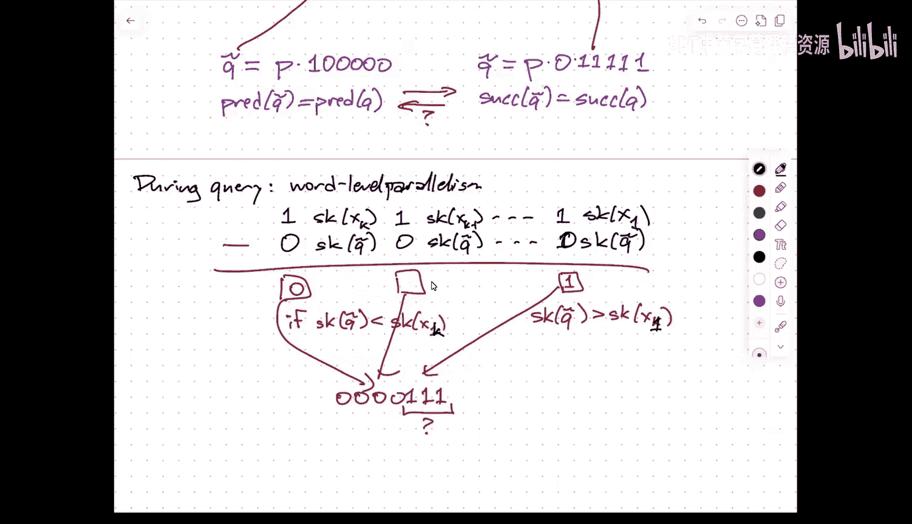

# 数据结构：019：Y-Fast Tries 与 Fusion Trees

在本节课中，我们将学习两种用于整数集合上高效前驱/后继查询的高级数据结构：Y-Fast Tries 和 Fusion Trees。我们将了解它们如何利用整数的位表示来超越传统对数时间的界限。

## 课程管理公告

课程网页上链接了一个表格，用于注册项目小组。请在周一前填写此表格。

我计划在下周二发布初步的演示日程安排，因为第一次演示将在一周半后开始。我希望至少能提前一周通知大家进行演示。

关于演示的预期：演示时长约为15分钟，大约对应10张幻灯片。演示内容应是项目进展报告，而非最终完成的描述。在演示时，你应该已经明确了目标问题，并能简要介绍该问题的现有技术、相关解决方案，以及你的初步计划。如果已有初步观察结果或已排除某些思路，也可以进行分享。

准备演示时，请制作幻灯片。建议提前练习并计时，以确保内容精炼。在正式演示时，请放慢语速。

演示日程计划：如果每次演示能控制在15分钟内，我们可以在三个讲座日内完成所有演示。如果时间紧张，可能会使用阅读日作为备用。调查表会询问团队在阅读日是否绝对无法进行演示。

## 回顾：X-Fast Tries

上一节我们介绍了X-Fast Tries。它是一种用于有序字典的数据结构，利用了整数在底层由比特表示的特性。

X-Fast Tries可以在 **O(log log U)** 时间内完成前驱/后继查询，在 **O(log U)** 时间内完成插入和删除操作，使用 **O(n log U)** 空间。其中，U是全集的大小，n是集合中元素的数量。

其核心思想是构建一个覆盖全集的二叉Trie树，但只保留包含集合中元素的节点。每一层使用一个哈希表来记录该层存在的节点。**O(log log U)** 的查询时间来源于在Trie树的 **O(log U)** 个层级上进行二分搜索，以找到查询值Q与集合中某个元素X共享的最长前缀。

## 引入：Y-Fast Tries

X-Fast Tries在空间效率上存在不足。本节中，我们来看看Y-Fast Tries，它通过间接（Indirection）技术改善了空间和更新时间的效率。

Y-Fast Tries可以在 **O(log log U)** 时间内完成查询和**摊还**的更新操作，同时仅使用 **O(n)** 空间。其核心思想是将数据集分块。

### 数据结构构建

以下是构建Y-Fast Trie的步骤：

1.  **分块**：将有序集合S分成大约 **n / log U** 个块。每个块的大小在 **(1/4) log U** 到 **4 log U** 之间。这种范围是为了给插入删除操作留出缓冲空间，便于后续的摊还分析。
2.  **选择代表元**：从每个块S_i中选择一个代表元y_i。
3.  **构建上层结构**：为所有代表元 `{y_1, y_2, ..., y_k}` 构建一个X-Fast Trie。
4.  **构建下层结构**：为每个块S_i构建一个平衡二叉搜索树（如AVL树、红黑树）。

### 查询操作

要查询Q的前驱：

1.  在X-Fast Trie中查询Q的前驱和后继代表元。这需要 **O(log log U)** 时间。
2.  这确定了Q可能位于的两个块（前驱代表元和后继代表元所在的块，它们可能相同）。
3.  在这两个块的二叉搜索树中进行搜索。由于每个树大小约为 **O(log U)**，此步骤也需要 **O(log log U)** 时间。

因此，总查询时间为 **O(log log U)**。

### 插入操作

以下是插入一个新元素Q的步骤：

1.  查询Q应属的块S_i。需要 **O(log log U)** 时间。
2.  将Q插入块S_i的二叉搜索树中。需要 **O(log log U)** 时间。
3.  如果插入后块S_i的大小超过 **4 log U**，则将其分裂为两个大小各约 **2 log U** 的块。
4.  需要更新X-Fast Trie：删除旧代表元y_i，并插入两个新块的代表元。此操作需要 **O(log U)** 时间。

**摊还分析**：分裂操作代价较高，但分裂后，每个新块需要至少再进行 **Ω(log U)** 次插入才会再次触发分裂。因此，可以将分裂的代价摊还到之前的多次插入操作中，使得每次插入的**摊还**时间仍为 **O(log log U)**。

### 删除与空间分析

删除操作类似，涉及合并过小的块。空间方面，X-Fast Trie存储 **n / log U** 个元素，占用 **O(n)** 空间。所有二叉搜索树总共存储n个元素，也占用 **O(n)** 空间。因此总空间为 **O(n)**。

## 深入：Fusion Trees

Y-Fast Tries 需要预知全集大小U并使用随机化哈希。Fusion Trees 则提供了一种确定性的解决方案，在特定模型下实现了更快的查询。

Fusion Trees 支持在 **O(log n / log w)** 时间内进行前驱/后继查询，使用 **O(n)** 空间，且是确定性的。这里，w是机器字长（每个元素最多w比特），n是元素个数。它工作在**字RAM模型**上，支持算术运算、位运算和移位操作。

### 核心思想：高位压缩与字级并行

Fusion Tree 是一棵B树，其分支因子B约为 **w^(1/5)**。每个节点存储大约B个键（w比特整数）。关键创新在于“**Sketch**”（概要）技术：

1.  **构建Sketch**：考虑存储在该节点中的所有键构成的二叉Trie。只保留那些在Trie中实际产生分支的比特位。由于只有B个键，这样的分支位最多有B-1个。
2.  **压缩存储**：每个键的Sketch仅由这些关键比特位组成，因此长度远小于w。例如，B = w^(1/5)，则每个Sketch长度约为 w^(4/5)。可以将B个这样的Sketch打包进一个w比特的字中。
3.  **并行比较**：查询时，计算查询值Q的Sketch。通过巧妙的字级并行操作（如一次减法配合位掩码），可以在常数时间内确定Q的Sketch位于节点中哪两个Sketch之间，从而决定进入哪个子树。

### 查询过程与挑战

直接比较Sketch的顺序并不能完全等价于比较原始键的顺序。因此，Fusion Tree引入了一个“**去Sketch化**”的步骤：

1.  根据Q与相邻键在Trie中的最长公共前缀，构造一个辅助查询值 `Q_twiddle`。
2.  `Q_twiddle` 的性质保证了：基于Sketch比较为 `Q_twiddle` 找到的前驱/后继，就是原始Q的正确前驱/后继。
3.  在节点内，通过将 `Q_twiddle` 的Sketch与节点中打包的Sketch字进行特殊的并行比较，可以在常数时间内确定下一步要进入的子节点。

### 技术细节与权衡

*   **为什么B是w^(1/5)**？这是为了确保Sketch的长度、打包后的字长以及后续并行比较中所需的各类常数时间位操作（如计算前导1的个数）都能在w比特的字内完成。这是一个平衡计算复杂度和存储压缩的技术选择。
*   **字级并行**：通过乘法等操作，可以模拟出一些在标准C指令集中不直接支持，但在硬件中易于实现的位操作（如`find most significant set bit`）。这使得算法在理论上仅用字RAM的标准操作就能实现常数时间的节点内搜索。

## 总结

本节课我们一起学习了两种突破比较模型下Ω(log n)下限的整数集合查询数据结构。

*   **Y-Fast Tries** 通过结合X-Fast Tries和分块思想，以随机化为代价，实现了 **O(log log U)** 的查询和摊还更新时间，以及线性的空间复杂度。
*   **Fusion Trees** 则利用位压缩和字级并行，以确定性的方式实现了 **O(log n / log w)** 的查询时间。它代表了在字RAM模型下对前驱查询问题的深刻理解，尽管其实现细节较为复杂。

这两种结构都展示了如何通过深入利用数据的底层表示（比特串）和机器的计算模型（字操作）来设计出异常高效的数据结构。