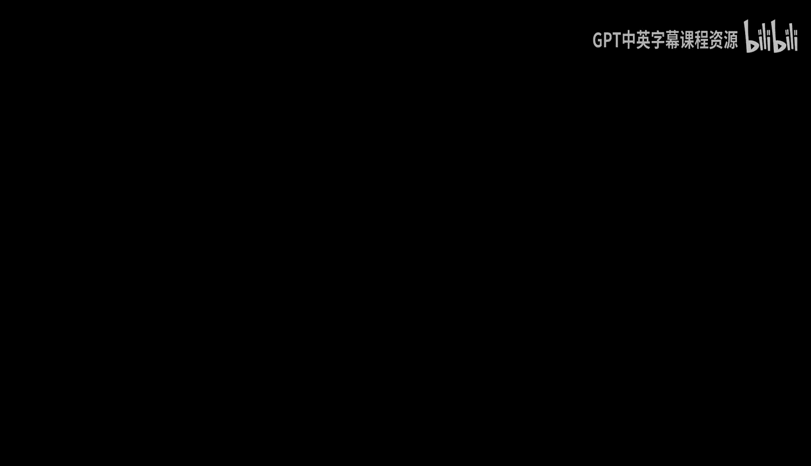
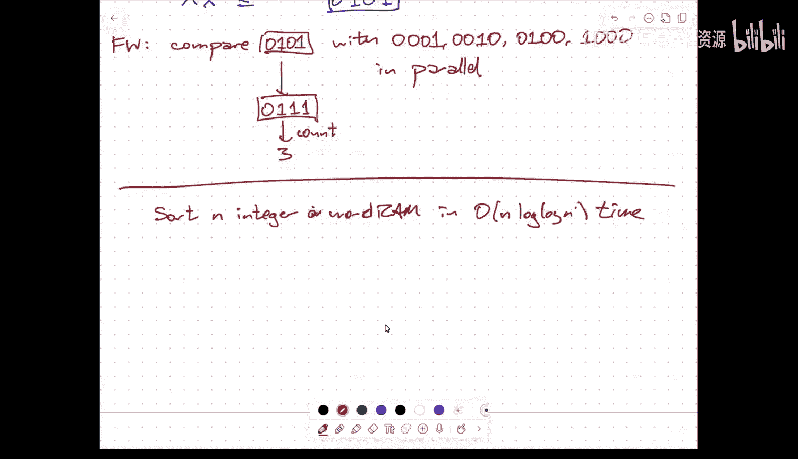

# 020： Fusion tree details.zh_en -BV1kWFGzsEmN_p20-

All right。So first some logistics。As of this morning， only nine。

Of the 19 people registered for the class had registered their。Project groups， so。

And almost everybody said I can't present next Tuesday so the。

Two things I'll announce on Thursday when the presentations are。

 the first presentations will be next Thursday， we will be using sometime during reading day and if we need to overflow that just means that we may need to go later than usual on that Thursday afternoon。

Um， uh， you should have all gotten an email from me saying。

 please register your project group if you haven't already。

So I'm going to like set up an initial schedule， but if there are people who。

Still haven't registered， I'm going to leave space for them next Thursday。嗯。So。

Even if you still aren't sure exactly what your presentation is going to be about。By now。

 you should know who your group is。So please do。Um， registergister。That so。You know。Excuse me。嗯。

Please register。我这个。嗯。The presentations。Will be。Thursday， May 1。Tuesday， May 6 and。Thursday， May 8th。

This one is。Reading day， so it may or may not be in this room， but it will be at this time。嗯。

Hopefully。嗯。Thank you for those of you who have turned in the registration form already。

And in particular， I know that there's at least one group who cannot present。

During the week of readinging day， you're presenting next Thursday。

I think that's all in terms of the logistical announcements。

I should perhaps let you know that I'm not entirely firing on all cylinders。

My daughter's in the hospital， she just got out of surgery about an hour ago。

 so I'm going to be a little bit spacey， I'm going to be making probably more mistakes than usual。

And I will need to leave right after class。Okay。So。Last time we started talking about。Fusion trees。

This is this data structure by Fredman and Willard。

 and the point of fusion trees is basically to show that without the use of randomization。

It's possible to do things that binary search trees do faster than binary search trees do them。

Provided that the objects that you're rest storing are integers that fit into a single word so。

TheInteger。Ordered dictionaries。嗯。Where。You can do either predecessor or successor or insertion or deletion in time log n divided by log W。

 where W is the number of bits in a single word in your memory。And we're assuming here that。Any。

Your hardware can manipulate W bit integers in constant time with a limited vocabulary of operations that's essentially given by what you can do and see。

So addition subtraction， multiplication， shifting， Boolean。

 arithmetic or sort bit wise boolean operations， and that's it。so at u。At a very high level。

It's a bee tree。Where B is approximately the fifth of W。

And I will actually get to why it's a fifth root and not just a square root later today。So。Each node。

Stores。Just to be consistent with my notes， I'm going to call this number k。

Each node stores K pivot values。Plus a sketch。So this was a point of confusion last time it is explicitly starting the pivot values。

But it is then also storing a sketch of the pivot values that fits in a single word。嗯。

And to just quickly remind you how this sketch is defined。

 at least for the sake of initial intuition， I'll explain why this is not quite an accurate picture in the moment。

So the sketching is defined by a。Binary try。So。I'm going to build a complete binary tree with depth W。

But。These represent all possible words。But when I store。You know， some subset of the items。

I'm only going to actually keep。The nodes that matter for that subset。嗯。

So any node that doesn't have one of the values。嗯。In the。

Subset as a descendant is just being thrown out。嗯。We've seen a version of this already for XF tries and YF tries。

And then I identify any level。Of the try where there's a split。

Meaning there's a node that has more than one child。As a splitting。Level or yeah， splitting level。

Because there are only k marked leaves， there are only k minus1 nodes that have two children。

 so there are most k minus1 splitting nodes。And that means that I only need。

What the way my sketch is going to be defined is by only looking at。The oh， sorry。

The values of the bits at the splitting levels。So0，0，0，010。0， sorry， one。0，0，1，0，1。1，1，1。U and。

These sketches have the property that they're in the same sorted order as the actual pivot values。

Okay， so。If I have Xi minus1 less than Xi， that's going to imply that the sketch of x minus1 will be less than the sketch of Xi。

And so what I'm actually going to store。In my。Compressed representation of the single node。Is。嗯。

alterternating between single one bits。And sketches of the various pivots。And again。

 I'm going to arrange。Right now it looks like the sketches are。Have length。K minus1。

So and I'm storing k of them， so altogether this is using K squared bits。

But and so you might wonder if I need to fit k squared bits into a w bit word。

 why don't I set K to b squared of W， but we won't be actually be able to get away with the sketches in exactly this form。

Okay。All right。Now， one of the big problems is that if I'm now。Searching for。Some query value Q。

What I can do is compute。The sketch of Q。And Philip， again， a word。With K squared bits。

Alternating now with zeros and sketches of Q。Once I compute the sketch of Q。

 then I just need to multiply it by an appropriate constant to get all these copies。

And then if I look at the difference。Anytime。The sketch of。

Q is larger than the sketch of the corresponding pivot value I'm going to see a zero at least in this significant bit。

And so at some point。there's you know the stuff that I'm drawing lying through here is just garbage bits。

 I don't care， but that that leading bit that is in the positions of the separating ones and separating zeros。

 this one here means that the sketch of Q is less than the sketch of Xi and this zero。

I think it's strictly less than or equal to this zero means that the sketch of Q is greater than the sketch of let's call this J and this I。

系。So in a single comparison， I can find the sketch of Q in the sortded order of the sketches。

And intuitively， at least， I now know which branch of the be tree to follow。so it's a very。

 very high level。I'm assuming that。I can compute the sketches in constant time。

Assuming that I can that the sketches。Maintain the order relationship even for a new query value。U。

And assuming that given a bit string of this form。I can figure out how many ones are in it because that will tell me which of my children I need to follow。

If I could do all of those things and I could do all of those things in constant time。

 then I've dealt with a single node in my bee tree。In constant time。So again， intuitively。嗯。We spend。

Order one time。At。Each。Beere node。But because theerity of the bee tree is fifth root of W。

The complete bee tree only has five levels。Right because。Is that right？Oh no， sorry。

 the B tree has sorry， the B tree has log n over log W levels。So the depth of the bee tree。

Is big O of。Log n divided by log W。 that's really log W to the one fifth。

 but the one fifth comes out and gets swallowed by the biggo。嗯。U。

So one thing I do want to point out here。Even if all of this worked perfectly and all of the big O constants were ones this。

Because this is a one fifth。There's a five。Hanging out in the log。

Which means that this only can help you even in principle if log W is bigger than five。

So on a 32 bit machine， you're already dead。Even if everything else happened in constant times。

 so this is really only a theoretical thing， this is not something that is going to actually be more efficient in practice。

Unless somehow you find yourself working on a machine that uses 32，000 bit words。Then maybe。

In that case， logW is about 15 or 16， and you might actually save some time。Maybe。Right。

 this is more of the theoretical result that。诶。That log barrier is not really a barrier when we're dealing with integers。

But as I said， there's a couple of obstacles， one is how do we compute。Sketches。In constant time。

And in particular， it's not so hard to figure out what the relevant bits are。

 the hard part is I need to fuse the relevant bits down into single contiguous block inside my word。

Okay， so the hard part。Is。Compacting。Or fusing。The relevant bits。The second thing is。That。

If I do this。A。I figure out the predecessor and successor of the sketch of my query value among the sketches of my pivot values that does not actually imply that I know。

The successor and predecessor of the actual query value among the actual pivot values。

 So I need to do a little bit of extra work there。 I talked about that。

Before and got a little confused， I'll draw a picture that I think will hopefully clarify how that works。

And then the， the last bit。Is I either need something that can count the number of ones or find the index。

Of the most significant bit。In constant time。And if I'm lucky enough to be working on a processor that just implements that great。

 but that didn't happen in the 1970s， so I need to spend a little bit of time。

Talking about that so I think the first thing I want to do just to sort of recover from some confusion last time is talk about how to fix the sketch ordering thing。

 but before I go on is anybody have any questions up to sort of the high level overview of how fusion trees work。

Okay， cool。All right，The ideas， the following。So let's suppose I'm looking for。some。Integer Q。And。

At some point in the path。Down to Q。So Q follows and let let， here's Q。系。Um。

One of the things that can happen。Is that。So first of all， let me assume here this is not。

At splitting level。So even though it's a place where the search path diverges from the search path to other stuff。

The splitting levels are only determined by where the search paths to the pivot values split。

What that means is that that divergence is not going to be visible in the sketch。Okay。

 so the sketch of Q。Might only say， oh， well here's a place where I go to the right。

 here's another place where I go to the right and here's a place where I go to the left。

 here's a place where I go to the right。And those are the only levels that actually make any difference and in the。

Other tree。I've got another path that。Does something similar？

And this eventually leads me down to say， x sub I and then there's you know x sub y minus1。

 and then there are you know other splits。Dongnan。Something like that， maybe。so。What it looks like。

Is the sketch of Q coincides with the sketch of Xi？8。So。the sketch of Q ends up here in order。

 so when I do the parallel comparison， I don't actually find a successor of Q。

 I find something else in some other sub。嗯。So in this case。

 what I want to do is define a new number Q， so there's this prefix P before the first split。

So let me define。呃。P to be the longest。Common。Prefix。Of Q and X I。

And then I'll define Q twiddle in this case because。The pathicq diverges to the left。

 there's a symmetric case where it diverges to the right。Q will be defined by concatenating P。

 followed by a1 and a bunch of zeros。So Q Twiddle is here。In the leftmost node in that right subte。

Now， because I have this divergence， there are no pivot values in that left subt。Okay， so there are。

嗯。啊。You know， no x's。In this subte。That sub is not part of the pruned try at all。嗯。

And so what this means now is that。If I look at。The successor of Q Twiddle。Among the pivot values。

 it is actually the successor of Q。So there no intervening pivot the values。Okay， so and moreover。

 now the sketches all look correct because whenever I'm going down。Except for the prefix P。

 which is in common with everybody so we can ignore it。

Every branch leading to Q Twiddle is to the left， it has a zero bit， and so it's going to be less。

Either it's going to equal the corresponding bit of some sketch in that tree or it's going to be further to the left。

诶。Um， so。If， if。If I find the successor and predecessor among the sketches。

This is going to imply not only。That。嗯。Not only the sketches behave correctly。But actually。

 I've successfully found the successor and predecessor of the original。Query value。系。

There are obviously some technical details I'm waving my hands at， but this is the main idea。嗯。

You'll notice that one of the things that I need to do here。

The most important thing I need to do is find the longest common prefix of Q index I that's the same as it's fundamentally equivalent to finding。

Most significant one bit。In Q exclusive or Xi。So all the bits where they disagree and the prefix is 0。

0，0，0，0， and then there's a one that's the first bit where they disagree， those zeros。

Are the bits that I want to keep those positions that I want to keep for my loveest common prefix。

So this is a place where finding the most significant bit。Actually matters。So most significant bit。

Okay。So once I've done this， as's a little bit of a dance going on here。

 I do a search with the sketchch of Q。Then I play these prefix games and get a modified query value。

 Then again， I do a parallel comparison to find。To do a search for the sketch of this modified queue。

That tells me。At least in some form， the index of the child that I need to follow in the be tree。U。啊。

But you'll notice the way that。The again， the way that the parallel comparison results are given to me have a bunch of zeros followed by a bunch of ones。

 and I need to know where that one is。 again， that's a most significant bit thing。嗯。Okay。And again。

 this is also assuming that I can compute sketches in constantant time。All right， so。嗯。Like I said。

 the hard part of computing the sketches is not figuring out， so when I'm doing the preprocess。

 I can figure out within each node what the relevant bit positions are。

The problem is somehow routing those bit positions that are spread out through the word down to a single block。

 okay？嗯。So I can do it。If I'm allowed to use， you know。嗯。Specialized hardware。

 so if I get to design my chip using AC0 circuits， then I can do it that way and use the exact sketches。

 but nobody's going to let me build my own hardware just to do predecessor searching so I need Fredman Willer describe something that uses only standard hardware standard operations but it builds a sketch that's somewhat larger。

Okay， so。The idea now is。So let B0 b1 up through b k minus1 be the relevant。B。It positions。Okay。

 so for any pivot value x， this is the sum over all i from0 to k minus1 of two to the B spot。1。嗯。So。

What I'm going out， sorry times。X sub b sub I。And what I'd want as my ideal sketch。To be。

Some from i equals0 to k minus1 of just to2 to the I times x sub bi。Here。

 x sub whatever means the whatever bit of x， not the whatever x。

So I'm just referring to the subscripts now we indicate bit positions。Okay。

So I can't quite get that so what I'm going to do instead。Is let's。You know， so let M be another。

Word that has exactly K minus1 bits。I'll describe in a second how that word。

Is going to be constructed， but for now。A。I'm going to let M sub I M0 up through M k minus1。

 those are the positions of the1 bits in M and the resulting integer I'll call M。Okay。

 and let's think about。The product of X and M。This is well。It's this。Times。This。

Which I can rewrite as some of are all I， some of are all J， x b sub I times 2 to the B plus MJ。

Now this。啊。The idea now is。By multiplying by this other。Number M。I'm duplicating the bits。

 the relevant bits of xs。At multiple positions。And the hope is that these multiple positions don't collide with each other。

 and somehow I can find a small window that contains some copy of B0， followed by some copy of B1。

 followed by some copy of B2 and so forth。Okay， so。the claim。Blemma。Is that？

We can choose this multiplier M。So that it satisfies three properties。First of all， BI plus MJ。

 these K squared different values are all distinct。

There are no collisions between these pairwise sums。It's actually a stronger than we need。

 but this is somewhat easier to prove this way， okay？The second condition is。That these sums。

Are ordered？So in particular， not B plus Mj， but B plus MI。

 so I take the I relevant bit position and the I bit position in this mask。Um。

Those sums are ordered by the subscript I。And then the last condition is that if I look。

At the difference between the largest and smallest sums。This is going to be。Order K to the fourth。

So right。Yeah。Okay。So。嗯。If I could do things you know perfectly that I would only need， you know。

 this is。Only K bits。But I can't get away with it perfectly。

 so I'm going to lose a bit of a polynomial function。

 it's going to be spread K bits are going to be spread out over K to the fourth bit positions。

But once I've done this calculation， I know where those K to the fourth bit positions are。

And so I get a sketch that has length k to the four。

 and I need to pack k to k of those larger sketches into a single word。So altogether。

 I need K to the fifth bits。To pack into a single word。And so that's why K is w to the 1/ fifth。Okay。

 so this implies we can。Fit K。Sketches。Into。Order K to the fifth。Bits。

whichch implies that we should set K to be about end the1 fifthth。Wュ one。Okay。

So I don't want to walk through the proof of this claim in complete detail。

 but I do want to at least give you a sketch of how you would do this。嗯。The first idea。

I'm going to choose。Somewhat relate， you know， not the Ms directly， but。I'll choose。

Slightly different bit positions。Um。I want to choose these so that B plus M prime J。Distinct。Maud。

K cube。U this is。Basically， you could do this inductively using a pigeonhole argument。

 So just to give you an idea， if I've already chosen。All but the last of these M prime values。

Then there are only roughly k squared of these K cubed bit positions that have been poisoned。

And so I can always find another bit position where the。

The vector of K bits that I get by multiplying the B fits in between the holes。Like I said。

 this is here the details。嗯。Okay。And in particular。

 these are all because I'm doing everything mod K cubed， these are all less than K cubed themselves。

Okay， so these are relatively small integers compared to。Compared to the eventual word size W。

Then I'm going to define M sub I to be。啊。M subi prime plus i times k cubed。

So I'm taking all these numbers that are between0 and K cube minus1。

 and I add an appropriate copy of K cubes， so these will actually spread them out。

This is going to imply both。Yeah， if they're different modb K cubed， then they're different。

And then adding multiples of K cube isn't going to change that。

But spreading them out by multiples of k cubed ensures that they're in the correct order。

 and it also ensures。That the smallest and largest pairwise sums are not going to be that far apart。

Okay， so the difficult part is that inductive Pionhole argument。嗯。Which。

It should not be that difficult to figure out。Based on just given what I've told you。Okay， so。Now。

 once I've got this。Then the actual sketch。That I'm going to use。Is。X times M。

And then I'm going to mask out only the interesting bits。So this is2 to the B plus MI。

And then I'll shift down by0 plus M0， so the lowest interesting bit is at index zero。

So this is just in the end going to be。A constant that I compute during preprocess。

 so it's not taking order k time， it's just bang done。So actually computing the sketch now。

 you can just read off the instructions。But it takes constant time。Bm。Questions about。

Either how or why when we're computing these approximate sketches。Okay。All right。

 so this now we've got something we can actually compute in constant time to use as a sketch because I'm keeping the bits。

 the relevant bits in the right order and I can mask them out using this and the sum they're still going to behave the way perfect sketches do in terms of preserving the order。

 it's still going to behave the same with respect to this weird Q Twiddle thing that I did for figuring out how to navigate with the query value。

Really the only thing that's left。Is to。Talk about how to do the， the most significant bit thing。

So I'm going to warm up to this。By kind of explaining why multiplication is really the key to making all of this work。

This this whole operation does not that this whole data structure falls apart if you can use all of the other operations。

 but you can't use multiplication or division。嗯。So。啊。Multipplication tricks。Um， so。Suppose。You know。

 one thing that I might want to be able to do。Is to take。A bit sequence， say ABCD。And spread it out。

So I want A in a bunch of zeros， B in a bunch of zeros， C in a bunch of zeros。

 D and a bunch of zeros。So what I can do is。Multiply this。By an appropriate constant。

This is going to give me。Just duplicating。Everything。And then I could end that with 10，000，10。0，1。

 zero， zero， zero， zero，1 and probably what I want to do。Is this really？

And then what I'm going to get is a it' a bunch of zeros， B and a bunch of zeros。

 C and a bunch of zeros， D and a bunch of zeros。Okay， so I can take any。Short。Word。

And spread its bits out。By doing multiplication and masking。嗯。The opposite of that。Is。

 let's say I've got， you know。These this word in this form， A at a bunch of zeros。

 B in a bunch of zeroes， me， I think this actually more readable if I write the zeros out。

So apologize for that zero000。So I've got four zeros。嗯。After each bit。

To fuse what I'm going to do now is multiply this by a number that has only three zeros。Between。

You know， each bit。Um and。What that's going to do is。It's going to copy each bit。

 but it's going to copy it three bits up。Um。So the bottom four bits are all going to be zero。U。

 but then you'll notice I've arranged for the the position of bit C to be immediately before the second occurrence from the right of。

A bit D。And then bit B will'll show up here。And then bit A will show up here。

And what'll happen going off in this direction， you'll see ABC，00， AB，000A。

But right here in the middle。You've got all four bits packed together。Now。

 this does require me to do sort of double precision， but again。

 I'm kind of assuming that double precision is multiplication is something that I can do reasonably。

 or if you like， I can split the。The word into two half words and do a constant number of single precision multiplications and sew everything up or just find the piece in the middle that I need。

嗯。But in。You know， I can set up these bit masks。Sort of in advance。

 because it's always going to be exactly the same pattern that exactly the same spacing so I can I can compress things that are positioned at regular intervals。

The other thing I can do。Is count。So here。The idea is。If I'm given my bit stringing ABC。

 actually make it a little bit longer to be interesting， I'll first spread it out。So we'll get a。

 a bunch of zeros， B， a bunch of zeros， Z， C， D， E。F。And now I will multiply this by。

Something that has。One's in the same positions as the relevant vectors。All right， so if this is。

Kbits。I'm going to make sure that this distance。You might as well make it at least K。

 I actually turns out I only need to have that be bigger than log K but。Fine。

 we've got enough room to play with here。嗯。No， all the dashes are zero bits。

 so when I do the multiplication， it's really just going to behave like integer multiplication。

Where all of my digits just happen to be zeros and ones， so what's going to have。

 what's going to show up in this position is F。What's going to show up here is the binary representation of E plus F。

What's going to show up here is D plus E plus F。C plus D plus E plus F and and so。

Essentially what I'm doing here is。d of convolution of the original bit stringing and a bit string of ones。

But I need to spread them out so that the results of that convolution actually have room to breathe inside the resulting bit strength。

 so this is only going to be log K bits long， but I can then pull out exactly the relevant log K bits。

By masking and shifting。可。嗯。If I。Right， so， so。That's going to be- these are going to kind of ingredients。

In the constant time algorithm to compute。嗯。Most of these get bits。

 but already you have an algorithm here for counting bits。

So if it happens that the word that you're looking at。This is like all zeros followed by all ones。

Which is what you get out of a parallel comparison。

This already gives you a way of figuring out which branch in the beer you need to take。

It's not quite sufficient to make everything work because of the sketching stuff。

 but it's one of the applications of most significant bit you can already do。

Questions about this before I go on to the more general trick。Yeah。

F means I've got a bunch of spread out things and I push them together。So they're contiguous。Compact。

But this is the reason they're called fusion traits， so I'll say fus。Yeah。O。So。嗯。the most。

Significant。Bit。All right。Again， I have a w bit word。Again， I'll just call it X。

So independently of all the other ways we've been splitting up words。

I'm now going to split up the word X。Into。Chunks， each of the appropriate size。

 so I'm going to split X into square root of W chunks。With square root of w bits each。Um。And then。

Essentially， the first step is to find。The啊。Most significant。Non zero chunk。

And then the second is to find the most significant bit in that chunk。

And then I'm basically done Okay， so if if this the index of this is C and the index of this is D。

 then in the end。I need to return C times squared of W plus D。

As the index of the most significant bit。D turns out to be。Much easier。

 It looks like I'm doing something recursive， but I'm not。The reason is that。

The chunk I'm looking at is only really squared of w bits long。

 so I can sort of duplicate it use and fill up the word with a bunch of relevant things that I can compute quickly。

 so let me walk through this here step by step。And I'm going to do this mostly by chasing an example。

So here's a 16 bit example， I'll just draw these bars here to separate the chunks。

And I'm deliberately using an example that illustrates。All of the cases。That the algorithm exercises。

系。So。The first part of step one。Is to figure out which chunks have their lead bit equal to one。

And then I'll figure out which chunks have their not lead bits。Not equal to zero。

And then I'll bo those things together okay so I'll define a bit mask which the they call F。

 this is just one in the in the high bit of each chunk。And zero everywhere else。So X and F only。

Records。The high bits。Or sort of。Okay。I'm going to call this number y。

 so I'm going to refer back to it later。嗯。Oh sorry， this is not what I want to call why。

I'm going to call something else why。Okay， so immediately I have implicitly now identified which chunks have their hot most significant bits set to one。

 the leftmost bits set to one， that's not quite enough for what I want。呃。

So now what I'm going to do is look at x。And F。Exclusive or X。And this is what I'm going to call why。

So this is going to set。High order bit。To zero and leave all of the other bits of x intact。开。嗯。

So I'm going to。Highlight。The important bits in these partial results okay。Okay。

Now let's look at F minus y where。Why is that number green just above？

So if the high order bit of a chunk of y is zero。Then。Or sorry， if。A chunk of y is all zeros。

Then F minus y， I'm just going to see one followed by a bunch of zeros。

If a chunk of F minus y is not all zero。Then I'm going to be subtracting something from one followed by a bunch of zeros。

 which means。I'm going to see a zero in the lead bit of the difference。嗯。0，1， zero one。And again。

These are the。Bits that are sort of significant。One in this position means that the low order bits of the chunk are all zeros。

 a zero in that position means the low order bits are not all zero。Uh well。So at this point。

 I could write。嗯。I's select Z be F minus Y， I'm going to mask out all the bits that aren't F。

Art in F。 and I will exclusive or that with F。 And now what I will get is 0，1，0，1。嗯。

And everything else is zeros。And then finally， if I take。X and F。Or Z。I'll get0，0，0，0。1，0，0，0。1。

 zero， zero， zero。One， zero， zero， zero。嗯。And so in these important bit positions。

 you'll see a zero if that chunk is equal to zero。And you'll see a one if that chunk was not equal to zero。

Beng。Now these are in lovely little。嗯。呃。Evenly spaced bit positions。

 so I can compress it down to a single square to W bit work。

Using the multiplication trick I showed you earlier。

So I've now taken these squared to W chunks each of size squared to W and sketched them。

With a single square rootd W bit string that has a zero that corresponds to chunks that are equal to zero and a one corresponding to chunks that are not identicalally zero。

系。Great。嗯。So。Now， the next thing I need to do is somehow turn that into a three。

So instead of doing the compress， I could also use。the counting trick。

 the multiplication trick that I used earlier。And just count again。

 because everything is even the interesting bits are evenly spaced。 again。

 using multiplication tricks， I can pull out the number of1 bits。

This is the value C that I referred to earlier。系。UmAnd so without too much trouble， then。

 I can also figure out。A。A maskask。Well， actually。I need to subtract that from Ka， sorry。

 so this isn't C， but。In this case， it's block one out of four that I want to find。

ThatThat's the one with the most significant one in it。

 so if I take you know4 minus three equals one and that's that's what I'm calling C but yeah。

And so given given that integer 3， it's easy enough to prepare a mask that looks like this。

By one shift left square root to w minus1 that gives you square root to W1s shift left squared to W times that three minus1。

so I can prepare this in constant time， which means now if I now end this with my original X。

I'm going to pull out。Only。That block。And then now， again， given， given this block， now。

 this is an arbitrary。B bit string or sorry， squared to W bit string again， I could spread this out。

And then use the counting trick。But what？The way Fredman and Willard do it is actually they do a parallel comparison。

To。So they compare。啊。The way Fredman and Willard do this。Is。Compare this。Chunk。With a。

All the powers of two。In parallel。There are square root of W of these h square root W bits long。

 so I can do exactly the same parallel comparison that I get to navigate through the B tree。

And then the result of this。Would turn into after compression。Would fill out。

All of the bits after the most significant one with ones。And at this point， I can count。嗯。Now， count。

And I guess。ree。Again， I need to do a little bit of index arithmetic to turn that into the correct index for that most significant one bit。

And that's it。So。It's constant。The constant turns out to be。呃。Only two digits。But there's like。

Half a dozen multiplications shifts， half a dozen shifts， half a dozen subtractions。

 half a dozen Boolean bitwise operations。That that and， and then the final bit of。

 of arithmetic to fit everything together。 But ultimately。

 this gives me a constant time algorithm in C to compute the most significant bit without knowing。

I guess I need to know what squared root of W is。In order to do this。

I think that's something you could figure out on the fly at runtime。In the preprocessing phase。

This is not how you should actually do it if you ever actually need to do this and C。

 don't do it this way。This is not how to compute the most significant one bit in practice。

In practice， you know how many bits there are， and you could write a hard coded routine for 32 bits or 64 bits that's much faster than this。

But this is the final piece of the puzzle for fusion trees。Once you have this。This sort of。

Dit manipulationip stuff with multiplication， then I can compute sketches in constant time。

 I can compare sketches in constant time， I can interpret the results correctly as integers or indices into the branches leaving a node in my B tree。

 which means I can handle each comparison at each B tree node in constant time。

 which means that the running time of my algorithm is only going to be the running the proportional to the depth of my B tree。

 which is log n over log W。嗯。嗯。My theory is that。This is something that only Fredman and Willard could have done。

Partly because Fredman and Willard were comfortable getting down and dirty with the data structure stuff。

 but also because Fredman and Willard。Learned to program。I'm guessing in the 1970s。

Or maybe even in the 1960s where this sort of low level bit manipulationd stuff actually mattered。

 people actually learned as the in the equivalent of what is now。Haer rank。

Hackerers learned all these bit tricks to be able to do things efficiently。

 partly because they were down possibly soldering circuits together dealing with things at that really。

 really low level and so I think only somebody who grew up。

Playing with this bit manipulation would have had the insight to do all this。嗯。

It feels very much like looking into the past where as a grad student。

 my dad would toggle code into the accumulator at the front panel。嗯。啊后。

So not something I think would have been discovered in the 21st century。嗯。

I may talk about on Thursday。Another level that people put on this more recently to make things dynamic efficiently。

 I've talked about doing insertions and deletions at all。Um。

I may not because this is already getting。You know， pretty down in the bit fiddly guts。Onng。But。

 a lot of。Integer algorithms and integer data structures。

Either use or adapt fusion trees under the hood。So anytime you see a data structure like that。

 it's got this going on in it。Which means from a practical standpoint。

 it may not actually be that interesting。The one thing I will point out is that that you know。

 one of the logical。Successors of this。Is。Consortt n integers。Again。On a word ram。In N log。

 log N time。This requires more steps than just plugging in a fusion tree。

 but plugging in a fusion tree would give you n log n over log W。😡。

So this is more efficient than that for any reasonable W。U。ThisThis sorting algorithm actually。

Has been implemented in a reasonable number of lines of sea。

 like less than 100 and is measurably faster。For sorting 32 bit integers， then say Q sort。

So even though the underlying infrastructure historically has these really awful constant factors。

 and most of the results you'll see in the literature have buried inside them really ugly constant factors。

 there are more practical things that have come out of it that actually are faster in practice。

So I'm actually more likely to try to talk about this algorithm on Thursday than to go more into the data structure dynamic stuff。

um。That's all I have time for today， I'm happy to answer any questions。Okay， if not。please watch for。

An announcement on Thursday for the top schedule and if you haven't， you know。

 please register your group so I can put you into the schedule。All right， thanks。你你听唔到。

Whateverever we take a picture。