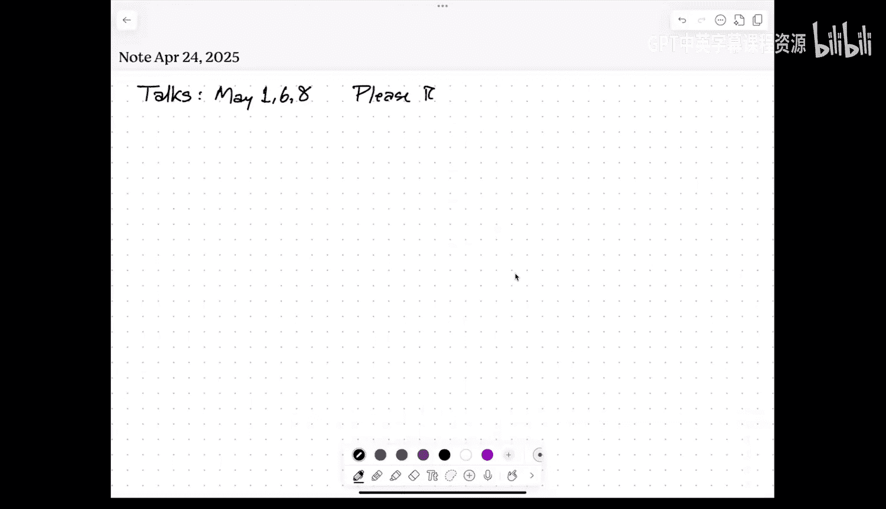
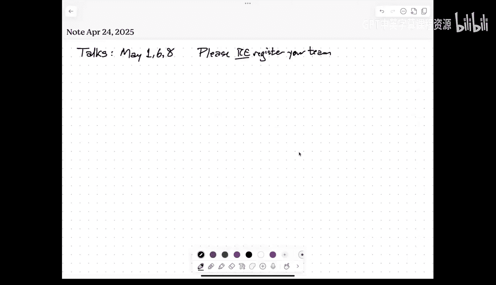
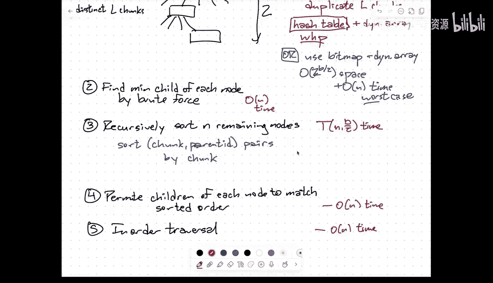
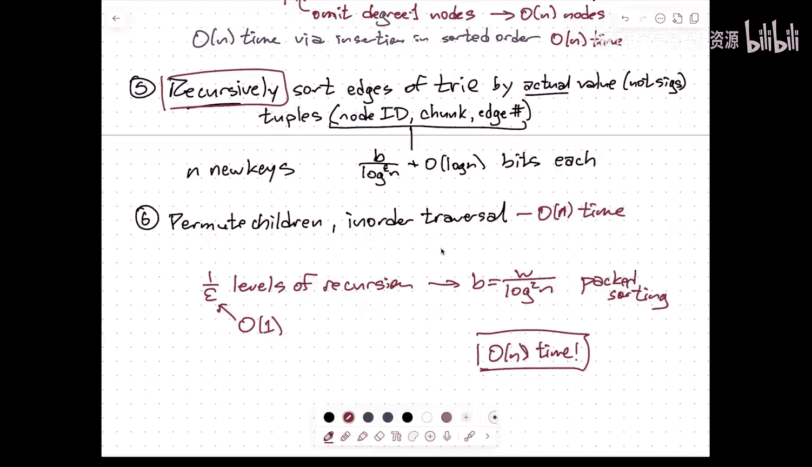

# 整数排序算法：021：快速整数排序 — 范围缩减与签名排序

在本节课中，我们将要学习两种针对整数集合的快速排序算法：Kirkpatrick-Reisch 的范围缩减排序和 Albers-Hagerup 的签名排序。我们将探讨如何利用整数的位表示和机器的字长特性，实现比传统基于比较的排序更快的算法。

## 范围缩减排序 (Kirkpatrick-Reisch)

上一节我们介绍了整数排序的基本背景，本节中我们来看看 Kirkpatrick-Reisch 算法。该算法的核心思想是通过递归地将长整数键拆分为更短的片段，从而减少排序问题的规模。

### 算法概述

该算法旨在排序 N 个 B 位的整数键。其运行时间由递归式 **T(N, B) = T(N, B/2) + O(N)** 描述，基础情况是当 **B = O(log N)** 时，我们使用基数排序。

### 算法步骤

以下是该算法的具体步骤：

1.  **拆分键值**：将每个 B 位的键拆分为两个 B/2 位的块（高位块和低位块）。
2.  **构建字典树**：基于这些块构建一个深度为 2 的字典树。根节点的子节点对应不同的高位块，每个子节点下又有子节点对应不同的低位块。为了在线性时间和空间内构建此树，需要使用哈希表或位图技巧来高效检测重复的块。
3.  **提取最小子节点**：对于树中的每个内部节点，找到其最小的子节点（根据块值）。将所有“非最小子节点”的节点收集起来。可以证明，这样的节点恰好有 N 个。
4.  **递归排序**：递归地对这 N 个“非最小子节点”进行排序。此时，每个节点由其 B/2 位的块值标识，同时需要附带其父节点的信息，以便后续重组。
5.  **重组与遍历**：根据递归排序的结果，对每个内部节点的子节点列表进行重排，使其符合排序顺序。最后，对树进行中序遍历，即可得到完全排序的原始键序列。

### 性能分析

通过递归，每次都将键的位数减半。经过 O(log (W/log N)) 层递归后，键的长度将降至 O(log N)，此时使用基数排序可在 O(N) 时间内完成。因此，总时间复杂度为 **O(N log (W/log N))**。当字长 W = O(log N) 时，该算法为线性时间；当 W 较大时，性能优于传统的 O(N log N) 比较排序。

---

## 签名排序 (Signature Sort)

上一节我们学习了通过递归减半位数进行排序的方法，本节中我们来看看一种更高效的算法——签名排序。它通过哈希将键大幅压缩，并利用打包排序技术，在字长足够大时实现线性时间排序。

### 算法前提

签名排序在以下条件下运行：字长 **W** 显著大于键长 **B**，具体来说，要求 **W = Ω(B log² N)**。其核心是利用多余的字长空间并行处理多个键。

### 算法核心：打包排序

首先，我们介绍一个关键子过程：打包排序。假设每个键的位数 **B** 很小，满足 **B ≤ W / (log N log log N)**。

以下是打包排序的步骤：

1.  **打包**：将 **K = Θ(log N / log log N)** 个键打包进一个字中。
2.  **归并排序**：对打包后的字数组进行归并排序。但这里的基础情况是当子数组能放入一个字时（即包含 K 个键）。
3.  **高效合并**：合并两个已排序的打包字时，使用 **Batcher 的双调合并网络**。这是一个深度为 **O(log K)** 的比较交换网络，由于所有比较交换操作都在单个字内，可以通过位并行操作在常数时间内模拟一步网络深度。因此，合并两个打包字仅需 **O(log K)** 时间。

通过用 O(log K) 时间的合并操作替换标准归并排序中 O(K) 时间的合并，整体运行时间减少为 O(N log N * (log K / K))。代入 K 的值，可得时间复杂度为 **O(N)**。

### 完整签名排序算法

现在，我们将打包排序与范围缩减结合：

1.  **哈希压缩**：将每个 B 位的键分割成 **L = O(log^ε N)** 个块。对每个块应用一个随机哈希函数（如通过乘法取模），将其映射为一个 **O(log N)** 位的“签名”。将所有这些签名拼接起来，形成一个长度约为 **O(L log N) = O(log^{1+ε} N)** 位的压缩键。通过精心设计的哈希，可以在常数时间内并行计算所有块的签名。
2.  **排序签名**：现在我们需要排序的是这些更短的压缩键。由于其长度已降至 **O(log^{1+ε} N)** 位，并且我们有 **W = Ω(B log² N)** 的假设，可以满足打包排序的条件。因此，使用打包排序在 **O(N)** 时间内对这些签名进行排序。
3.  **构建压缩字典树**：根据排序后的签名序列，构建一个深度为 L 的压缩字典树。压缩意味着省略只有一个子节点的内部节点，确保树中节点数为 O(N)。可以按顺序插入签名在线性时间内构建此树。
4.  **递归排序边**：字典树中的每条边对应原始键的一个块。我们现在需要根据这些块的原始值（而非其签名），对每个节点的子节点（即出边）进行排序。为此，为每条边创建一个元组（父节点ID，原始块值，原始子节点索引）。大约有 N 个这样的元组。
5.  **递归调用**：递归地对这些元组进行排序。此时，每个元组的位数是原始块长度 **B/L** 加上 O(log N)。通过设置参数，经过常数级（例如 1/ε）的递归后，键长将缩减到足以直接应用打包排序。
6.  **重组与输出**：根据递归排序的结果，对每个节点的子节点列表进行重排。最后，对最终的字典树进行中序遍历，输出原始键的排序结果。

### 性能总结

签名排序通过哈希大幅缩减键的表示长度，并利用打包排序处理短键，在 **W = Ω(B log² N)** 的条件下，实现了 **O(N)** 的线性时间复杂度。这是目前已知限制最少的线性时间整数排序算法。

---

## 算法对比与开放问题

本节课中我们一起学习了两种高效的整数排序算法。

*   **Kirkpatrick-Reisch 范围缩减排序**：通过递归减半键的位数工作，时间复杂度为 **O(N log (W/log N))**。它在字长 W 接近 log N 时是线性的，但在 W 较大时性能会下降。
*   **Albers-Hagerup 签名排序**：通过哈希和打包排序工作，在字长 **W** 足够大（**W = Ω(B log² N)**）时，实现了 **O(N)** 的线性时间复杂度。

目前存在一个有趣的开放问题：对于字长 **W** 满足 **ω(log N) < W < o(log² N)** 的情况，是否存在线性时间的整数排序算法？这仍然是理论计算机科学中一个未解决的问题。

总而言之，利用整数键的位级特性和机器的字操作能力，我们可以设计出远超传统比较排序算法性能的专用排序算法。