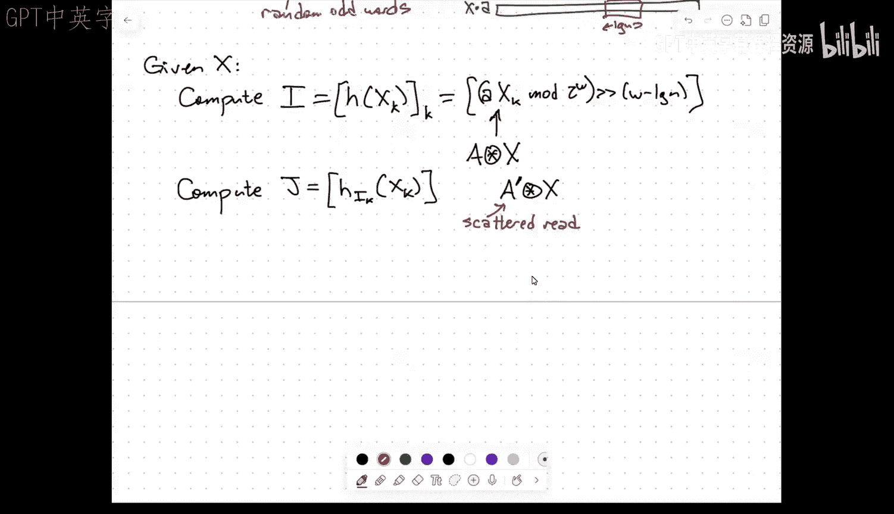
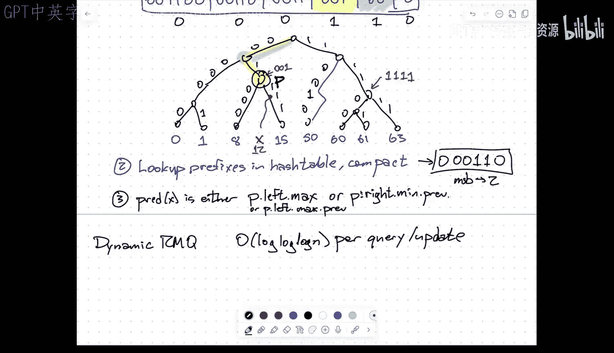

# 超宽字RAM上的前驱搜索：022：超宽字RAM模型与动态有序字典

在本节课中，我们将学习一种扩展的字RAM模型——超宽字RAM模型，并探讨如何在该模型上实现支持常数时间查询的动态有序字典（前驱/后继查询、插入和删除）。我们将从模型定义开始，逐步构建一个支持并行成员查询的哈希表，并最终将其与压缩字典树结合，实现高效的前驱搜索。

## 模型定义 🧠

上一节我们介绍了课程背景，本节中我们来看看超宽字RAM模型的具体定义。

超宽字RAM模型是标准字RAM模型的扩展。在标准模型中，内存由一系列**W位**的字组成，支持常数时间的常规操作（如加法、减法、乘法、位移、布尔运算等）。超宽字RAM在此基础上引入了称为 **U字** 的寄存器。

*   **U字**：每个U字包含 **W²** 位。你可以将其视为W个标准字拼接在一起。
*   **数量**：内存中主要是标准字，但允许使用**少量**（常数个）U字寄存器。
*   **核心操作**：除了标准运算外，模型支持关键的新操作——**分散读写**。

### 分散读写操作

在标准字RAM中，给定一个W位的地址，可以加载或存储该地址处的W位字。U字**不能**直接用作地址（地址空间仍为2^W）。分散读写操作允许你同时处理多个地址。

*   **分散读**：给定一个U字，其中每个分量（W位）都是一个地址，该操作能并行地读取所有这些地址的内容，并将结果（W个W位字）打包成一个新的U字返回。
    *   形式化描述：给定U字 **A**，其中 **A[i]** 是地址，操作返回U字 **R**，其中 **R[i] = memory[A[i]]**。
*   **分散写**：给定两个U字，一个包含地址，一个包含要写入的数据，该操作能并行地将数据写入对应的地址。
    *   形式化描述：给定地址U字 **A** 和数据U字 **D**，操作执行 **memory[A[i]] = D[i]** 对于所有i。

这些操作在常数时间内完成。该模型旨在模拟具有大规模向量处理能力的硬件（例如，某些架构支持1024到4096位宽的向量寄存器）。

### 其他支持的运算

基于模型的基本运算（特别是乘法），我们可以构建一些有用的并行操作：

1.  **压缩**：给定U字 **X**，提取每个分量字的最高位（符号位），组成一个W位的标准字 **x**。
    *   公式：**x[i] = leftmost_bit(X[i])**
    *   这可以通过U字乘法实现，类似于融合树中的技巧。
2.  **分量算术与比较**：
    *   **分量加法**：**Z[i] = (X[i] + Y[i]) mod 2^W**
    *   **分量比较**：生成一个U字 **C**，其中 **C[i]** 是一个W位字，如果 **X[i] < Y[i]** 则其最低位为1，否则为0。也可以压缩成一个表示比较结果的位向量。
3.  **分量乘法**：处理稍复杂，因为两个W位数的乘积是2W位。该操作通常假设输入U字的奇数分量为0，然后计算偶数分量的乘积，并将结果的低W位和高W位分别存入输出U字的连续分量中。
    *   形式化描述：设 **X[2i]** 和 **Y[2i]** 为操作数，**Z[2i]** 存储乘积模 2^W（低W位），**Z[2i+1]** 存储乘积除以 2^W（高W位）。

有了这个强大的计算模型，我们就能探索比标准字RAM更高效的算法。

## 并行成员查询哈希表 🗂️

在标准字RAM上，动态前驱搜索的最佳时间复杂度约为 **O(log log N)**。超宽字RAM模型的目标是实现**常数时间**的操作。我们首先忽略“顺序”，解决一个更基础的问题：如何构建一个支持**并行成员查询**的字典。

我们希望维护一个包含n个W位字的集合S，除了支持插入和删除，还能处理以下查询：
*   **并行成员查询**：输入一个U字 **X**（包含W个待查关键字），返回一个U字 **R**，其中 **R[i]** 指示 **X[i]** 是否在集合S中。

我们的目标是实现 **O(1)** 的查询时间，以及摊销期望为 **O(1)** 的更新时间，空间复杂度为 **O(n + W)**。这比传统哈希表（需要O(W)时间进行W次独立查询）快了一个W因子。

### 数据结构基础：两级完美哈希

实现并行查询的核心是一个经典的两级哈希表结构（Fredman, Komlós, Szemerédi, 1984）。

以下是该结构的关键组件：
1.  **一级哈希表**：大小为 **n**。使用哈希函数 **h₁** 将关键字映射到桶中。
2.  **二级哈希表**：每个一级桶 **i** 关联一个独立的二级哈希表，其大小约为 **nᵢ²**，其中 **nᵢ** 是散列到桶i的关键字数量。二级表使用哈希函数 **h₂ᵢ**。
3.  **无冲突保证**：通过精心选择哈希函数族（如全域哈希），可以高概率保证每个二级哈希表内部**没有冲突**。这使得查询只需计算两次哈希值即可定位元素，实现常数查找时间。
4.  **空间**：二级表大小平方和的总期望是线性的，即 **O(n)**。

为了支持动态操作，我们采用一种特定的、结构良好的哈希函数族：**乘数移位哈希**。
*   对于一级哈希：**h₁(x) = ((a * x) mod 2^W) >> (W - log n)**，其中a是随机奇数。
*   对于二级哈希（每个桶i）：**h₂ᵢ(x) = ((aᵢ * x) mod 2^W) >> (W - log nᵢ)**，其中aᵢ是随机奇数。

### 并行查询过程

现在，我们利用超宽字RAM的并行能力，一次性计算W个关键字的哈希值并进行查询。

以下是并行查询的步骤：
1.  **计算一级哈希值**：给定输入U字 **X**，我们需要计算包含所有 **h₁(X[k])** 的U字 **H**。这涉及 **A * X** 的分量乘法（**A**是每个分量都是a的U字），然后进行掩码和移位操作。通过处理奇偶索引、使用乘法模拟移位等技巧，可以在常数时间内完成。
2.  **获取二级哈希函数盐值**：根据一级哈希值 **H**，我们需要为每个关键字获取对应的二级哈希盐值 **aᵢ**。这些盐值存储在一个大小为n的数组（一级表）中。我们使用**分散读**操作，以 **H** 作为地址向量，一次性读取所有对应的 **aᵢ**，得到U字 **A'**。
3.  **计算二级哈希值**：计算 **A' * X** 的分量乘法以获得二级哈希值。这里面临的挑战是每个分量需要移位的量（**W - log nᵢ**）可能不同。解决方案是将其转化为先乘以不同的2的幂（右移不同量），再进行一次统一的左移。
4.  **执行并行查找**：现在，对于每个关键字，我们有了其所在的一级桶索引和二级桶内的位置。通过另一个**分散读**操作，我们可以从所有对应的二级哈希表中并行读取内容。
5.  **生成结果**：将读取到的内容与原始关键字 **X** 进行分量比较。如果相等，则说明关键字存在。如果需要返回值，可以再进行一次分散读来获取存储的数据。

通过这种方式，我们实现了常数时间的并行成员查询。插入和删除操作需要更细致的处理（如重建哈希表、处理散列冲突），但核心思想是利用相同的并行原语和哈希函数特性，在摊销期望常数时间内完成。

## 构建动态有序字典：X-Fast Trie 变种 🔍

仅有并行哈希表无法支持前驱查询。为了引入顺序信息，我们转向一种类似 Willard 的 X-Fast Trie 的数据结构，论文中称之为 **X-Fast Trie**（拼写略有不同）。

我们假设关键字是 **W-1** 位（可通过简单变换处理W位情况）。数据结构的高层设计是一个**压缩字典树**。

### 压缩字典树

压缩字典树是标准二叉字典树的压缩版本：
*   只存储**具有多个子节点的内部节点**、**叶节点**和**根节点**。
*   树边不再标记为单个比特，而是标记为一个**比特串**（即从父节点到子节点路径上的比特序列）。
*   每个节点 **v** 关联两个值：**min(v)** 和 **max(v)**，分别表示以该节点为根的子树中的最小和最大叶节点关键字。

数据结构由两部分组成：
1.  **双向链表**：将所有叶节点（即集合S中的所有关键字）按排序顺序链接起来。这便于在找到近似位置后快速找到前驱或后继。
2.  **并行哈希表**：存储**所有压缩树中所有节点的路径标签**（填充至W位）。对于每个节点键，哈希表中存储的数据是该节点的 **min(v)** 和 **max(v)**。

### 前驱查询算法

查询关键字 **x** 的前驱过程如下：

1.  **生成所有前缀**：构造一个U字，其中包含 **x** 的所有可能前缀（从长度为0到W-1），并将每个前缀填充或处理为W位的形式。这可以通过复制、掩码等U字操作在常数时间内完成。
2.  **并行前缀查询**：使用上节构建的**并行成员查询哈希表**，一次性查询所有这些前缀是否存在于压缩树的节点哈希表中。返回的结果是一个位向量，指示哪些前缀是树中节点的路径。
3.  **定位最长匹配前缀**：从位向量中找出**最高位**的“1”，它对应于 **x** 在压缩树中的**最长匹配前缀节点**，记作节点 **p**。这本质上是找到了 **x** 与树中关键字的最长公共前缀所在的节点。
4.  **确定前驱**：根据 **x** 在匹配前缀之后的下一个比特，以及节点 **p** 的子节点信息，可以确定前驱。
    *   情况分析：前驱要么是 **p** 的左子树中的最大关键字（`p.left.max`），要么是 **p** 的右子树中的最小关键字的前一个节点（在双向链表中）。通过访问节点 **p** 存储的 **min/max** 信息以及双向链表，可以在常数时间内完成这一步。

整个查询过程的关键在于第2、3步：利用超宽字RAM的并行能力，一次性检查所有前缀，从而在常数时间内找到最长匹配前缀。一旦找到该节点，剩下的工作只是简单的指针访问和比较。

## 总结与延伸 🎯

本节课我们一起学习了超宽字RAM模型及其上一个强大的应用：常数时间的动态有序字典。

*   **模型**：我们介绍了超宽字RAM，它通过引入**U字**（W²位）和**分散读写**操作，扩展了标准字RAM，能够高效模拟向量化并行计算。
*   **基础构件**：我们构建了一个支持**并行成员查询**的哈希表，利用**两级完美哈希**结构和**乘数移位哈希**函数，在常数时间内回答W个并行查询，比传统方法快W倍。
*   **有序字典**：我们将并行哈希表与**压缩字典树**的思想结合，设计了X-Fast Trie的变种。通过并行查询关键字的所有前缀，我们能在常数时间内定位到最长匹配前缀节点，进而利用节点信息和双向链表确定前驱。

这个结果突破了标准字RAM上前驱搜索的 **Ω(log log N)** 下界，展示了更强大的计算模型如何催生更优的算法。

论文还提到了在此模型上的其他结果，例如**动态区间最小值查询**可以达到 **O(log log log N)** 的时间复杂度。超宽字RAM模型仍然是一个富有潜力的研究领域，为许多经典问题提供了新的优化视角。