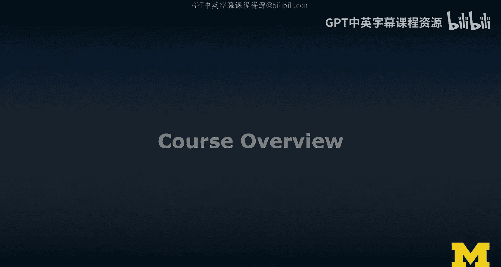
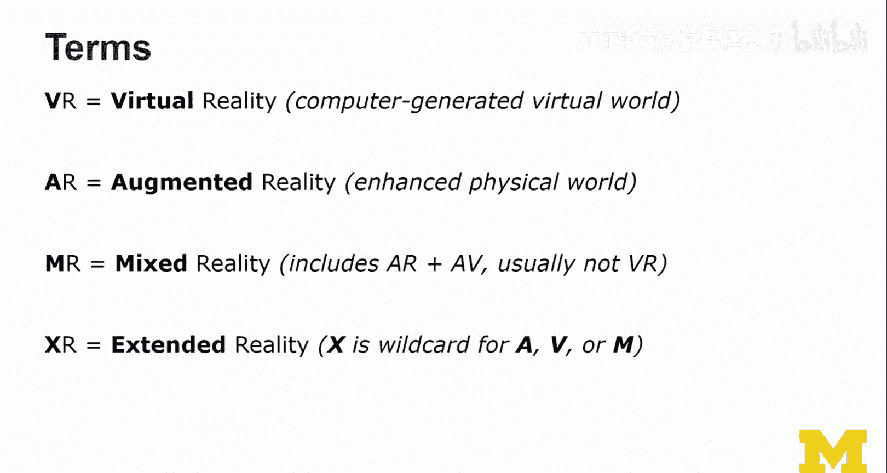
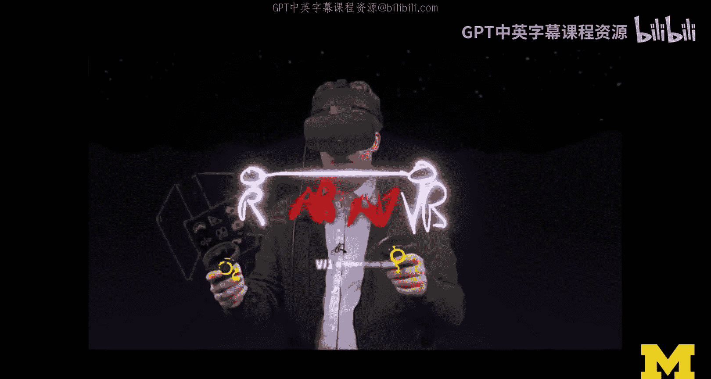
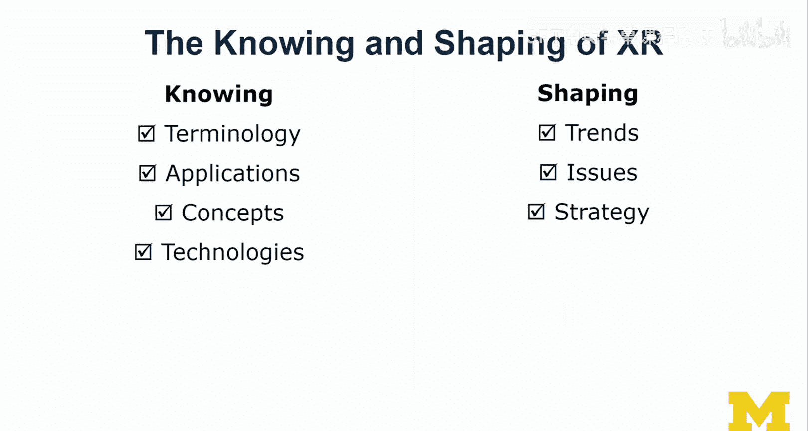
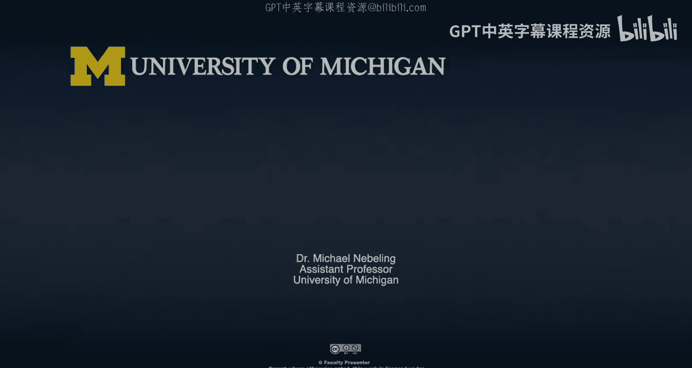

# 002：课程概述

在本课程中，我们将学习扩展现实（XR）的基础知识，涵盖其术语、技术、应用、趋势、问题以及相关策略。课程旨在为初学者提供全面的理解，以便能够参与关于XR的讨论并为其未来发展做出贡献。

## 课程结构

本课程分为四个主要模块，每个模块聚焦于XR的一个关键方面。

以下是各模块的简要介绍：

1.  **术语与应用**：我们将首先学习XR的核心术语，并探索其多样化的应用场景。
2.  **概念与技术**：深入探讨虚拟现实（VR）和增强现实（AR）的具体概念与支撑技术。
3.  **趋势与展望**：分析当前XR领域的发展趋势，并展望其未来方向。
4.  **问题与策略**：批判性地审视XR技术带来的社会、伦理等问题，并讨论个人与团队如何制定学习与发展策略。

## 学习目标与评估

完成本课程后，你将能够理解XR的基本术语，区分VR与AR，了解相关技术与工具，并能够就XR的趋势、问题和发展策略进行有意义的讨论。

课程将通过以下方式评估学习成果：

*   **模块测验**：每个模块结束后设有测验，以巩固所学知识。
*   **荣誉路径**：提供额外的实践活动与练习，供希望深入探索的学习者选择，以更批判性地参与内容并深化知识。

## 详细学习内容

上一节我们介绍了课程的整体框架，本节中我们来看看具体会学到哪些内容。

我们将围绕三大知识支柱展开学习：**术语与应用**、**概念与技术**、**趋势与问题**。

### 术语与应用

首先，我们将厘清关键术语的定义与区别。

以下是本课程将重点讲解的核心术语：

*   **虚拟现实 (Virtual Reality, VR)**
*   **增强现实 (Augmented Reality, AR)**
*   **混合现实 (Mixed Reality, MR)**
*   **扩展现实 (Extended Reality, XR)**

我们将通过传统讲解和沉浸式演示（例如在VR工具Tilt Brush中绘制“现实-虚拟现实连续体”）两种方式来学习这些概念。

### 概念与技术

在掌握了基本术语后，我们将深入XR的技术全景。

我们将从以下四个维度考察XR技术生态：

1.  **设备**：市面上有哪些XR硬件设备。
2.  **平台**：支撑XR应用运行的操作系统与软件框架。
3.  **应用**：XR技术在游戏、生产力等领域的实际用例。
4.  **工具**：用于创建XR内容的开发与设计工具。

例如，我们将通过《Beat Saber》等游戏应用来理解VR的交互与体验，通过《Pokémon GO》来认识AR的大众化应用。同时，也会接触如Apple Reality Composer这样的创作工具，了解如何在AR环境中直接进行3D内容编辑。

### 趋势、问题与策略

最后，我们将以人机交互的视角，从**用户**、**任务**和**技术**三个角度分析XR的发展趋势。我们也将直面XR技术带来的挑战。

我们将重点讨论以下几类问题：

*   **社会与伦理关切**
*   **可及性与公平性**
*   **隐私与安全性**

课程最后，我们将转向策略思考，探讨如何围绕**知识**、**设备**、**团队**和**用户**四个维度制定个人或团队的XR成长策略，例如如何提升团队XR知识、如何选择合适的设备以及如何推广XR技术以培养更多用户。

## 总结

本节课中，我们一起学习了“扩展现实入门”课程的整体概述。本课程内容丰富，旨在从多角度全面介绍XR。无论你对设计、开发感兴趣，还是仅仅希望理解这项技术以便参与相关讨论，本课程都将为你奠定坚实的基础。掌握这些知识，将使我们能够更批判性地思考XR的影响，并共同塑造一个XR技术融入日常生活的未来。