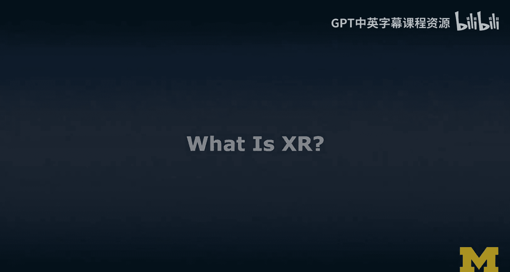
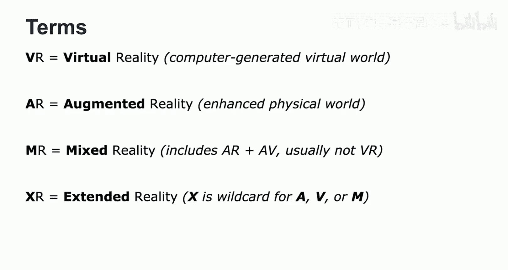
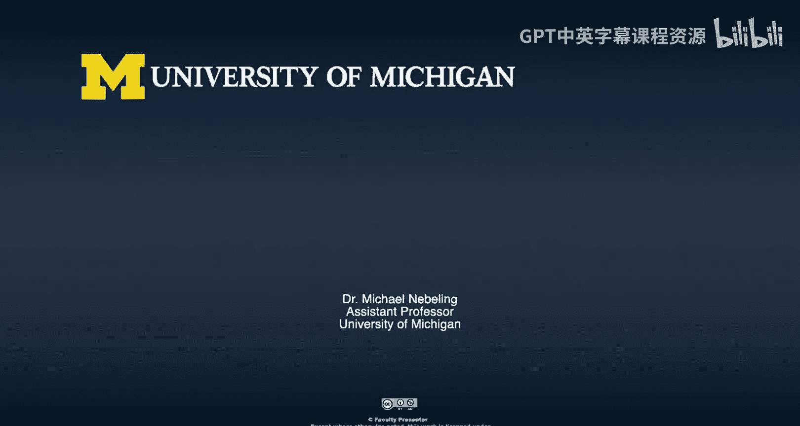

# 003：XR技术定义解析

在本节课中，我们将要学习扩展现实（XR）领域中的几个核心术语与技术定义。我们将详细解析虚拟现实（VR）、增强现实（AR）和混合现实（MR）的概念、特征与区别，帮助你建立一个清晰的知识框架。

## 什么是XR？

“什么是XR？”这是一个经常被问到的问题。本节作为XR的入门介绍，旨在让你了解该领域的主要术语和技术。

你目前可能最熟悉的术语是虚拟现实和增强现实。我们常将它们并称为AR/VR，但实际上，这些术语背后关联着截然不同的技术。

## 虚拟现实（VR）详解

上一节我们提到了VR，本节中我们来看看它的具体定义。当提到虚拟现实时，其核心思想是**替换**用户周围的现实环境。这是通过提供一个计算机生成的虚拟环境来实现的。用户不再看到真实世界，只能看到虚拟视图。

虚拟现实主要由三个主要特征来定义。

以下是虚拟现实的三个核心特征：

1.  **自主性与能动性**：用户始终处于控制地位。这是通过**头部追踪**和**以身体作为输入**来实现的。例如，佩戴VR头显时，设备在三维空间中被追踪，用户可以使用身体动作（通常通过VR控制器，或直接用手势）和语音作为输入。
2.  **自然的交互方式**：虚拟现实通过手势（使用控制器、手或手指）和语音作为输入，提供自然的交互体验。
3.  **临场感**：虚拟现实给予用户一种“身临其境”的感觉。当我们进入虚拟世界时，便沉浸其中。这种沉浸感是通过刺激我们的多种感官实现的，包括**视觉**、**听觉**，以及更先进的**触觉反馈**，甚至**嗅觉显示**。

## 增强现实（AR）详解

与替换现实的VR不同，增强现实旨在**增强**现实。用户同时看到真实世界和虚拟世界，它们仿佛融合在一起。这种真实与虚拟的结合，我们称之为**复合视图**。

有趣的是，VR中的“R”并非指真实世界，而是指**合成的、计算机生成的世界**；而AR中的“R”才是指我们周围的**物理现实世界**。

增强现实同样由三个主要特征来定义。

以下是增强现实的三个核心特征：

1.  **虚实结合的复合视图**：增强现实将真实物体与虚拟物体结合，产生一个复合视图。这种叠加不仅是视觉上的，也可以是音频信息。
2.  **实时交互性**：增强现实支持实时交互，包括**显式交互**和**隐式交互**。显式交互类似于VR中的手势和语音交互。隐式交互则基于摄像头，当我移动设备时，设备必须确保虚拟内容看起来像是真实世界的一部分。
3.  **三维空间注册**：为了实现虚实物体的空间对齐，使它们看起来属于同一个世界，增强现实需要在三维空间中进行**注册**。

## 混合现实（MR）辨析

另一个你可能遇到的术语是混合现实。这个术语常常引起混淆。事实上，在与专家、研究者和设计师交流后，我们发现了至少六种不同的工作定义。

其中一种流行的定义是米尔格拉姆提出的**现实-虚拟连续统**。根据这个定义，混合现实是指从没有任何增强的真实环境，到完全由计算机生成的虚拟环境之间的整个谱系。

*   **增强现实**：我们看到的主要是物理世界，并引入了虚拟内容。
*   **增强虚拟**：我们看到的主要是虚拟内容，并引入了物理内容（可以看作是增强现实的反向操作）。
*   **混合现实**：这个术语指的是该谱系中很大的一部分，**包含了增强现实和增强虚拟**，但在米尔格拉姆的最初定义中，它通常**不包含纯粹的虚拟现实**。因此，混合现实本质上是物理世界与虚拟世界以不同程度的增强进行融合。

为了更直观地理解，可以从显示设备的角度来思考混合现实在连续统中的位置。

以下是不同显示设备在现实-虚拟连续统中的大致映射：

*   **靠近真实环境端**：有形交互显示或空间投影显示。
*   **AR到AV的过渡区域**：平板电脑和智能手机。它们通过显示摄像头画面（形成穿透式显示）并在其上叠加虚拟内容来实现增强现实。
*   **靠近虚拟环境端**：洞穴式自动虚拟环境、房间大小或墙壁大小的环绕显示，或者我之前展示过的头戴式显示器（典型的VR头显）。

## 课程总结

本节课中，我们一起学习了几个关键术语：

*   **VR（虚拟现实）**：指计算机生成的虚拟世界。
*   **AR（增强现实）**：指用虚拟内容增强物理世界的理念。
*   **MR（混合现实）**：根据米尔格拉姆的定义，包含增强现实和增强虚拟，但通常不包含纯粹的虚拟现实。

而**XR**是一个统称术语，其中的“X”是一个通配符，可以代表增强、虚拟或混合现实。