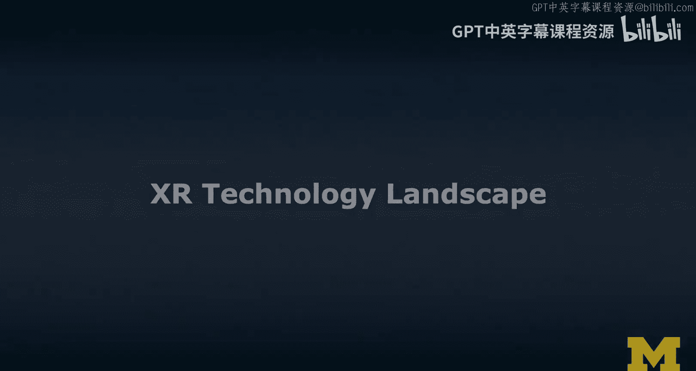
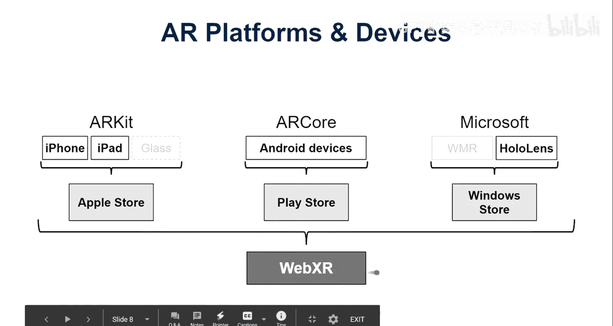

# 005：XR技术生态全景 🗺️

在本节课中，我们将学习如何理解和分类广阔的扩展现实技术生态。我们将介绍四种主要的技术类别，帮助你建立一套分析工具，以便更好地评估和比较不同的XR设备、平台、应用和工具。

## 概述

XR技术领域非常庞大且发展迅速。为了清晰地理解这个领域，我们需要一套分类工具。本节将介绍四种核心类别：**设备**、**平台**、**应用**和**工具**。掌握这些分类方法，将帮助你拨开营销宣传的迷雾，更准确地评估技术的实际能力与局限。

## 设备分类

首先，我们从XR设备开始。设备是用户直接交互的硬件，我们可以从两个维度对它们进行分类。

以下是主要的设备类型：

*   **内置/独立式 vs. 外接/适配器式**：独立式设备（如HoloLens 2, Oculus Quest）集成了所有必要的计算组件，可以独立运行。外接式设备（如Google Cardboard, Oculus Rift）则需要连接到智能手机或电脑才能工作。
*   **有线连接 vs. 无线独立**：传统VR设备（如HTC Vive）通常需要有线连接到高性能电脑。而现代设备（如Oculus Quest）虽然可以无线独立运行，但也能通过线缆（如Oculus Link）连接到电脑以获得更强的图形处理能力，这体现了分类的混合性。

上一节我们介绍了设备的基本分类，本节中我们来看看支撑这些设备的软件环境——平台。

## 平台分类

平台是连接硬件与软件的桥梁，决定了应用能在哪些设备上运行。平台主要分为特定平台和跨平台解决方案。

以下是主要的平台类型：

*   **特定平台**：如Oculus、HTC Vive或Magic Leap，它们通常与自家设备深度绑定。为这些平台开发的应用，技术实现上各有不同。
*   **跨平台方案**：如SteamVR、Windows Mixed Reality或WebXR。它们旨在构建一个通用层，让开发的应用能够兼容多个不同厂商的硬件设备。

了解了设备和平台后，我们来看看最终呈现给用户的产品形态——应用。

## 应用分类

应用是用户直接使用的XR程序。我们可以根据其功能范围和集成方式进行区分。

以下是主要的应用类型：

*   **纯XR应用**：如《Beat Saber》或Snapchat的AR滤镜，其核心功能完全围绕XR体验构建。
*   **集成XR功能的应用**：许多传统移动应用现在也加入了XR视图或模式。例如，宜家（IKEA）和亚马逊（Amazon）的购物应用都内置了AR功能，允许用户在家中预览家具或商品。

最后，为了创造上述所有内容，开发者需要借助一系列工具。

## 工具分类

工具是用于设计和开发XR体验的软件。它们不同于最终的应用，而是创造应用的“武器”。

以下是主要的工具类型：

*   **设计工具**：用于在XR环境中直接进行创作，例如VR绘画工具**Tilt Brush**和**Quill**，以及AR设计工具**Adobe Aero**和**Apple Reality Composer**。
*   **开发工具**：用于编程和构建完整的XR应用。本课程将重点介绍几个核心开发工具，包括基于网页的**A-Frame**，以及功能强大的游戏引擎**Unity**和**Unreal Engine**。

## 技术生态图景

现在，让我们将学到的分类知识应用到实际的技术图景中，并看看它们如何分布在“现实-虚拟现实连续体”上。

### VR设备与平台

在VR方面，设备从简单的智能手机适配器（如Cardboard）到需要连接电脑的系留设备（如Oculus Rift），再到可以独立运行的设备（如Oculus Quest）。平台则形成了各自的生态，如Oculus Store、Viveport和Windows Store。跨平台开发可以通过**SteamVR**或**WebXR**实现。

### AR设备与平台

在AR方面，设备包括智能手机适配器（如HoloKit）、内置AR功能的移动设备（如搭载ARKit的iPad）以及独立的头戴式设备（如HoloLens）。平台主要由**ARKit**（iOS）、**ARCore**（Android）和**Windows Mixed Reality**（HoloLens）主导。**WebXR**是当前最主要的跨AR平台解决方案。

### 在连续体上的定位

我们可以将这些技术放置在从“真实环境”到“完全虚拟环境”的连续体上：

*   **Google Cardboard**：偏向虚拟环境端，但沉浸感不如高端VR设备。
*   **Oculus Quest**：更靠近虚拟环境端，提供六自由度（6DoF）追踪和控制器，沉浸感更强。
*   **HoloKit**：位于真实环境与增强现实之间，提供简单的虚拟内容叠加。
*   **HoloLens**：明确位于增强现实频谱内，支持更先进的交互（如语音、手势追踪）。
*   **智能手机AR**：位于AR与AV（增强虚拟）之间，因为它通过摄像头捕捉真实世界画面再进行增强，视图介于真实与虚拟之间。

## 总结

本节课中我们一起学习了分析和理解XR技术生态的框架。我们将其分为四大类：**设备**、**平台**、**应用**和**工具**。通过这个框架，我们审视了当前市场上主流的VR和AR设备与平台，并将它们定位在现实-虚拟现实连续体上。掌握这些分类知识，能帮助你在面对层出不穷的新技术时，保持清晰的判断力，理解其真正的创新点与局限性。在接下来的课程中，我们将深入其中一些具体的工具和平台，开始动手创造自己的XR体验。