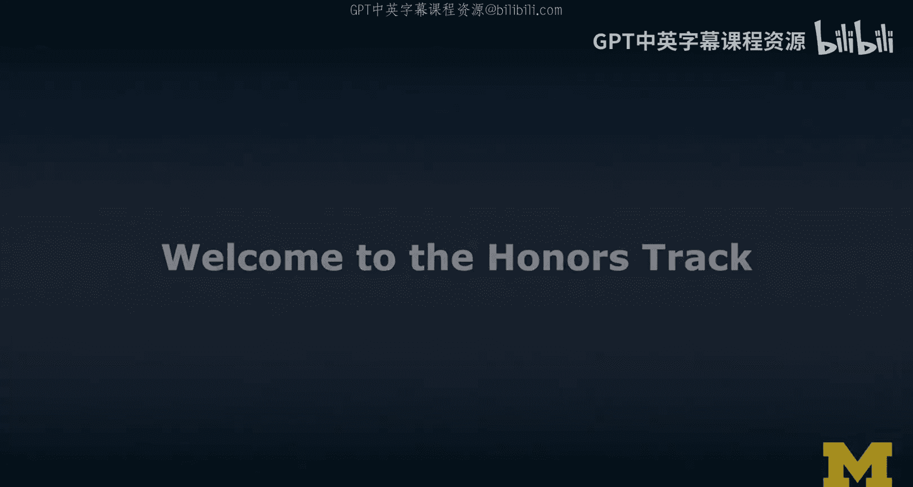
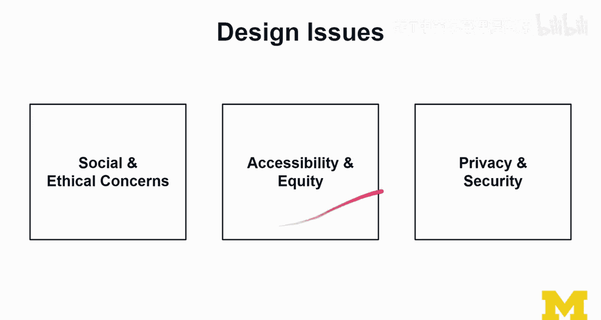
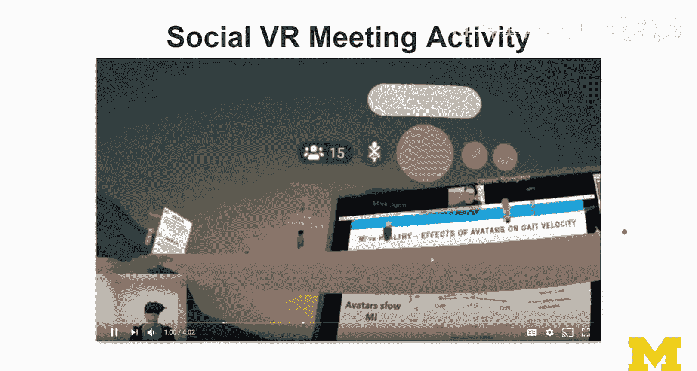
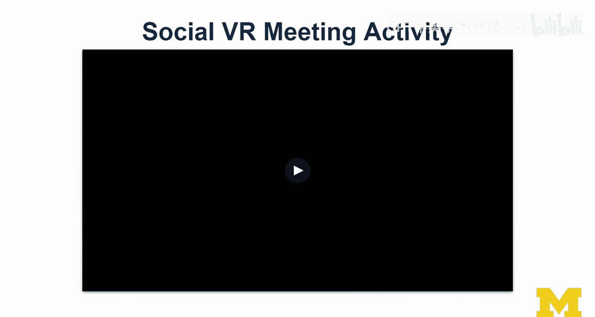
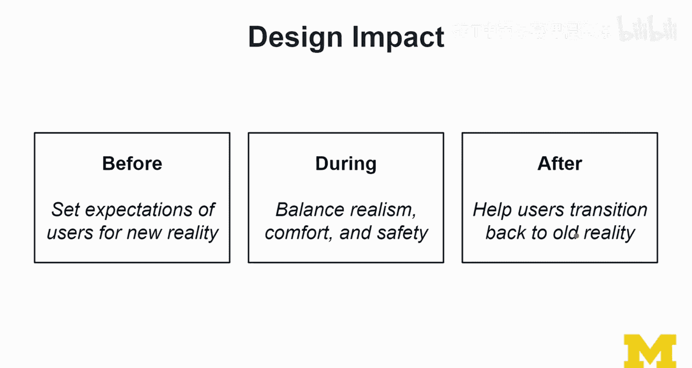
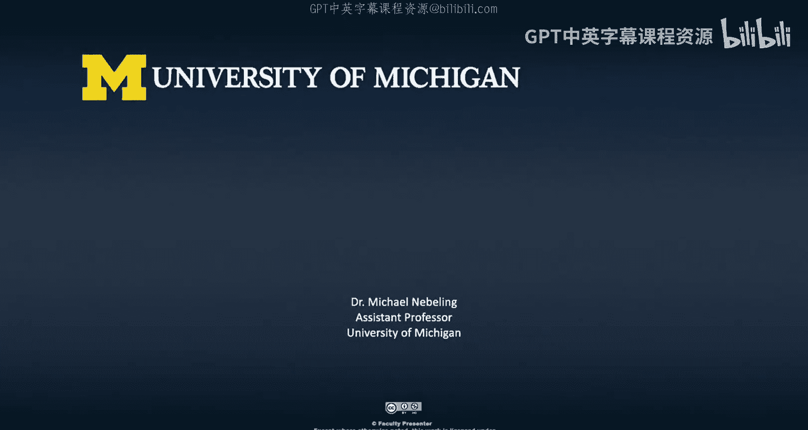

# 006：荣誉课程说明 🏆

在本章中，我们将详细介绍本课程的“荣誉课程”学习路径。与标准路径相比，荣誉路径将引导你进行更深入的实践探索，通过完成具体的任务和活动来巩固对核心概念的理解。我们将介绍荣誉路径包含的三个主要活动：应用分类、技术选择以及关键议题探讨。

## 课程概述

在荣誉课程路径中，我们将通过一系列动手实践活动来深入探索扩展现实（XR）的各个主题。通常，我会要求你完成某项具体的活动或实际任务，并明确描述任务内容以及预期的成果。我们旨在通过这些活动，理解其背后的学习目标、重要性以及参与的意义。

与专注于设计和开发的后续课程不同，本课程不设置正式的同行评审环节。在那些需要你创建项目的课程中，同行评审是一项主要活动。我们充分理解同行评审的重要性，但认为在本入门课程中可以省略这一正式评估环节。这并不意味着你不应与同伴讨论问题，事实上我们鼓励你这样做，只是你不会被同伴正式评分。这是荣誉路径与其他课程路径的一个主要区别。

## 课程结构安排

本课程是第一门课，目前我们正在探索XR的术语和应用。在接下来的两周，我们将更深入地研究VR和AR的概念与技术。之后，我们将讨论XR的趋势与议题，这部分内容将使课程更具前瞻性，并构成课程的核心塑造部分。为此，我们将要求你完成一项应用分类活动，并在学习所有概念和技术后，基于你当前的理解提出一些建议。我会提供几个场景供你分析。

最后，我们还将揭示XR领域许多重要的关键议题，并希望围绕这些议题展开充分且深入的讨论。在本课程结束时，我们会进行更多探索，讨论策略以及如何着手新的XR项目与计划，这部分内容将更具开放性。

## 荣誉路径核心活动

那么，本课程的荣誉路径具体包含哪些内容？主要包括应用分类、技术选择和关键议题探讨三项活动。

以下是具体活动介绍：

*   **应用分类**：你需要体验一款XR应用，然后根据“现实-虚拟连续体”对该应用进行分类。
*   **技术选择**：我将提供若干个场景，由你来建议应使用哪些技术。为了完成这项任务，你需要进行一种名为“QOC分析”的方法，即问题、选项和标准分析。我会提供阅读材料来指导你完成这个过程。
*   **关键议题探讨**：我们将讨论三大类议题：伦理与社会关切、可及性与公平性（这是XR领域中非常重要的问题），以及隐私与安全性。你可以选择聚焦于哪一个议题，并完成三项关键活动，从不同角度进行评估。这将非常有趣，希望你能从中有所收获。

## 活动一：应用分类详解

首先，我们来谈谈应用分类活动。在这个活动中，我会向你展示“现实-虚拟连续体”，你可能已经开始接触这个概念了。

你所使用的设备显然是一个重要指标，它能强烈暗示你体验的应用在连续体上可能处于什么位置。请注意，在第二个模块（也就是下周的内容）中，你需要选择最具体的术语进行分类，而不是使用像“MR”或“XR”这样宽泛的术语。

## 活动二：技术选择与QOC分析

在第二个模块中，我们将更关注概念以及实现这些概念的技术，即真正理解AR和VR技术。为此项活动，我设计了几个场景。

以下是其中一个例子：**家居装饰场景**。你可以想象使用多种不同的移动设备，或许还能与家人协作。那么，在AR方面，哪些技术是合适的呢？你将运用我介绍的技术树来思考。我们会更深入地了解在AR和VR方面我们拥有的各种不同选项。

主要目标是让你思考：在为技术方案提供建议时，应该考虑哪些问题？我们将基于MacLean等人于1991年提出的QOC论文进行分析。QOC代表问题、选项和标准，这是一种系统化探索设计空间的方法。我将向你介绍其表示法，以及如何实际做出决策、如何进行评估。

## 活动三：关键议题探讨

最后，我们将讨论XR领域的议题，主要有三大类：社会与伦理关切、可及性与公平性，以及隐私与安全性。显然，随之而来的还有信任、安全等各类关切。

我要求你从以下三项活动中选择一项完成（当然你也可以完成更多）：
*   **社交VR会议活动**：我希望你实际进入一个社交VR平台。我会向你展示我如何在2020年虚拟参加IEEE虚拟现实会议的经历，包括一些现场片段和印象。我希望你能获得类似的体验，以便随后分析这类活动所关注的一些问题。
*   **可及性评估**：评估一款XR应用对于不同能力用户的包容性。
*   **隐私安全分析**：分析某XR体验中的数据收集与安全措施。

思考现有解决方案的设计影响非常重要，我希望能引导你像设计师一样思考。设计思维是我希望为你铺垫的，显然，本专项的第二门课程将重点聚焦于此。

对于任何这些活动，思考活动**之前**、**期间**和**之后**发生什么都非常重要：
*   **活动前**：作为用户，你如何为活动做准备？作为设计师，你会做什么来为用户设定他们对即将进入的“新现实”的期望？
*   **活动期间**：观察你自己的感受是很有趣的，比如你认为所使用的应用是否为你做好了充分准备。同时，留意你使用过程中的所有想法和关切。
*   **活动后**：作为设计师，我们需要在真实感、舒适度和安全性之间取得平衡，而安全性是我们必须解决的首要问题。最后，当用户回归现实时，帮助他们平稳过渡回原有的、真实的现实，这也是你应该考虑的一点。

## 总结与展望

希望这个荣誉课程路径会充满乐趣。如果你能完成整个XR专项课程，甚至完成所有相关的荣誉路径内容，那将会非常棒。我期待与你的讨论，期待看到你得出的各种成果，并希望在荣誉课程路径中见到你。