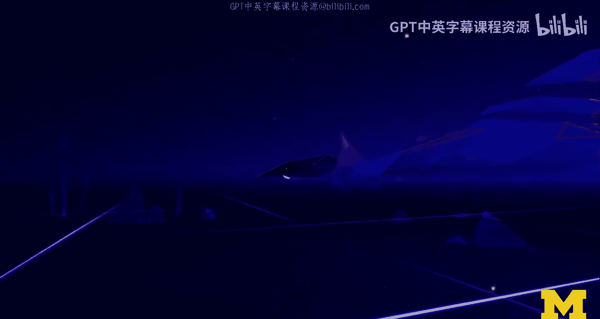
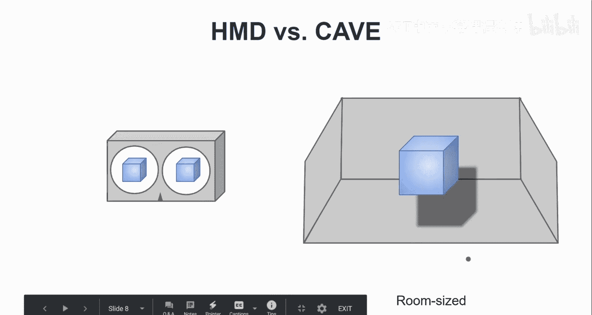

# 009：虚拟现实导论 🚀

在本节课中，我们将要学习虚拟现实（VR）的基本概念。我们将从初次体验VR的视角出发，探讨其核心定义、关键特性、技术分类以及发展历程，帮助你建立一个清晰、全面的VR知识框架。

---

## 初次VR体验 🎮

当你决定购买一台虚拟现实头显并首次使用时，通常会有一个教程或引导程序。我们以Oculus的“第一步”教程为例，来感受初次接触虚拟现实是怎样的体验。

你戴上头显，开始适应周围这个全新的虚拟环境。环顾四周，你看到了自己的“双手”。实际上，你看到的并非真实的双手，而是某种手部模型或抽象表示。它们随着你的动作而移动，并且匹配得相当准确。这令人惊讶：你只是握着控制器，它是如何做到的？

这种效果得以实现，主要归功于控制器上的按钮布局。系统可以根据你手指按压的位置，估算出手指的姿势并进行相应的渲染。因此，我们甚至可以隐藏控制器本身。在最新的头显中，已经支持**手部追踪**技术，可以直接追踪你的双手，不再需要控制器。但在早期的Oculus Rift等设备上，体验就是如此。

接着，你开始熟悉这个虚拟现实环境。按下按钮，物体凭空出现，就像魔法一样。你捡起它们，四处投掷，并对它们的行为（比如总是会飞回来）感到惊奇。然后，你可能会尝试其他物体，比如纸飞机。在虚拟现实中操控纸飞机飞行，是此阶段一个有趣且直观的互动。

---

## 定义虚拟现实：5W分析法 ❓

“虚拟现实”这个术语值得我们深入探讨。在本节中，我们将通过经典的5W分析法（Who， What， When， Where， Why）来确立虚拟现实的基本定义。

*   **Who（关键参与者）**：目前VR领域的主要参与者包括Google、Oculus（现属Facebook）、HTC和Microsoft等。他们推出了关键产品，为VR的发展铺平了道路。
*   **What（是什么）**：VR是一种沉浸式的3D交互方式，用户通过头戴式设备进入一个虚拟环境，并能与之进行自然互动。
*   **When（发展历程）**：VR的发展经历了三波浪潮。第一波在20世纪60年代，出现了早期的头戴显示器概念。第二波在90年代，以VR主题电影和游戏（如任天堂Virtual Boy）为代表。第三波即当前浪潮，始于2012年Oculus Rift的众筹成功，并逐渐走向消费级市场。
*   **Where（应用场景）**：VR最初主要用于研究实验室和企业环境。现在，它正越来越多地被普通消费者和学生使用，包括在线课程。
*   **Why（为何重要）**：VR的魅力在于它能将用户“传送”到不同的地方，并提供一种以用户为中心的、沉浸式的3D交互界面。技术进步、大公司推动以及设备价格变得可承受，是当前VR得以普及的关键原因。

---

## VR的核心特性与概念 🧠

上一节我们介绍了VR的宏观定义，本节中我们来看看构成VR体验的一些核心特性与概念。

根据经典定义，VR主要关乎**自主性**或**能动性**，即赋予用户控制权。这是通过**头部追踪**和**身体输入**（如手势、语音、眼动）实现的，从而带来**自然的交互**。

另一个核心概念是**临场感**，即“身临其境”的感觉。这主要通过**沉浸感**来实现。沉浸感不仅指视觉上的包围，还包括**多感官刺激**，如音频、触觉（力反馈），甚至嗅觉，从而创造出更逼真的体验。

然而，VR并不必须追求极致的真实感。它可以被看作是一个**虚拟环境**，用户在其中进行三维空间内的任务或交互。我通常将VR与以下要素关联：
*   **头戴式显示设备**。
*   **立体视觉**（为每只眼分别渲染图像）。
*   **六自由度**移动能力（不仅可环顾，还可行走）。
*   **沉浸式任务**：专注于空间内的交互，不受外界干扰。

从人机交互的角度看，VR是一个非常有趣的**交互模态**和**设计领域**。

---

## VR显示技术分类 🖥️

在深入讨论关键概念前，我们先快速了解一下VR显示技术的两种主要类型。

我们可以区分**头戴式显示器**和**房间规模的VR环境**。

以下是两种技术的简要对比：

*   **头戴式显示器**
    *   **描述**：设备佩戴在头上，屏幕随用户移动。
    *   **原理**：为每只眼睛提供独立的渲染图像，产生立体视觉。
    *   **示例**：Google Cardboard， Oculus Quest等。

*   **房间规模VR（CAVE）**
    *   **描述**：用户站在一个房间内，墙壁、地板（有时包括天花板）都是投影面。
    *   **原理**：基于投影，用户佩戴追踪器，系统根据用户位置实时调整所有投影面的画面，以保持正确透视。
    *   **特点**：外部观察者看到的画面透视不正确，体验仅为身处CAVE内的用户设计。

---

## 总结 📚

本节课中我们一起学习了虚拟现实的入门知识。我们从一次典型的初次VR体验开始，理解了其交互的奇妙之处。接着，我们使用5W分析法定义了VR的范畴，回顾了其发展历程。然后，我们探讨了VR的核心特性，如自主性、自然交互、临场感和沉浸感。最后，我们介绍了两种主流的VR显示技术：头戴式显示器和房间规模的CAVE系统。这些基础知识将为我们后续深入学习VR的设计与开发打下坚实的根基。