# 011：虚拟现实关键技术 🚀

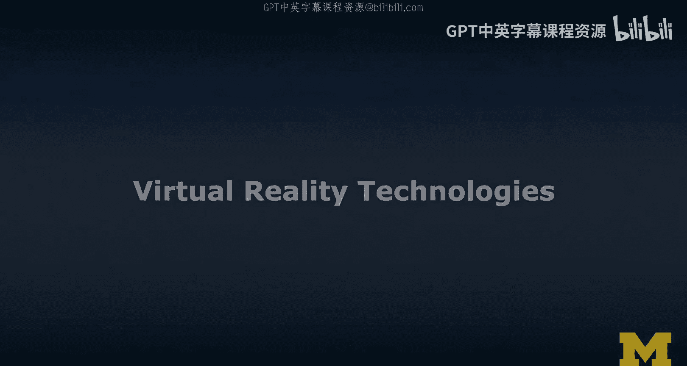

在本节课中，我们将学习构成虚拟现实体验的核心技术。我们将探讨从视觉呈现到空间追踪等一系列关键技术，了解它们如何共同作用，创造出沉浸感和临场感。

---

## 360度照片与视频 📸

上一节我们介绍了虚拟现实的整体概念，本节中我们来看看其内容基础。360度照片和视频本身并非虚拟现实，它们通常与虚拟现实相关联，但只有通过立体视觉设备观看时，才成为虚拟现实体验的一部分。

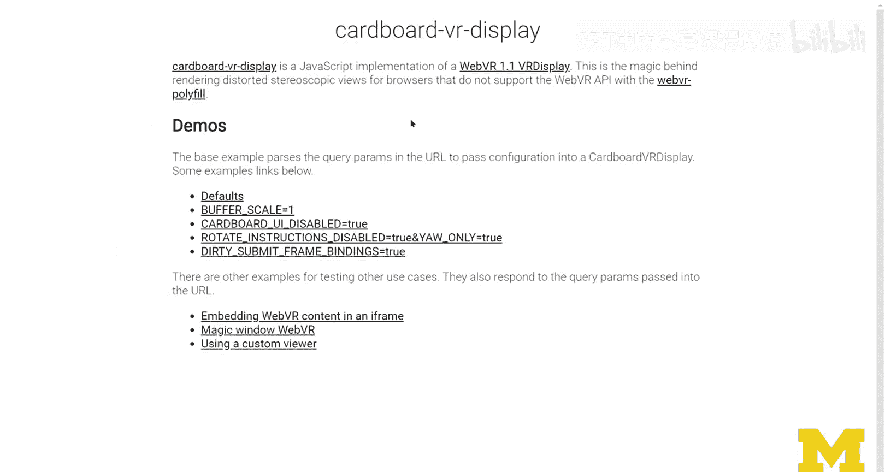

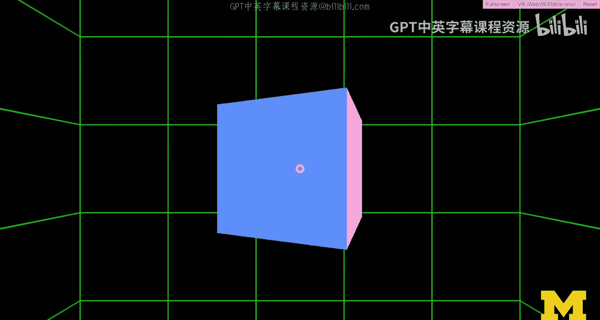

在360度视频中，用户拥有自主控制权。视频内容围绕摄像机全方位录制，用户可以选择观看视角。

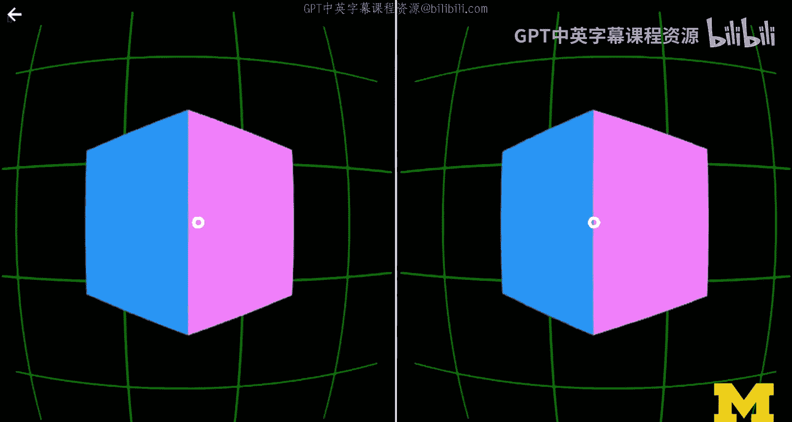

---

## 立体显示技术 👓

接下来，我们探讨立体显示技术。其核心概念是为每只眼睛渲染略有不同的视图。双眼瞳孔之间存在微小位移，这种位移为我们的眼睛创造了深度感。

以下是立体显示的关键原理：
*   **立体渲染**：为左眼和右眼分别渲染视图。
*   **瞳距**：两个视图之间的微小偏移与瞳距有关，部分头显设备支持调整此参数。
*   **深度错觉**：当用户佩戴设备时，大脑会将两个视图融合，感知到一个具有深度的单一图像和光标。

立体显示是Cardboard等设备背后的主要技术。手机放入设备后，会为每只眼睛渲染带有桶形畸变的图像，用户便能感知深度。

---

## CAVE系统 🏛️

另一种不同的显示技术是CAVE系统。CAVE是“洞穴自动虚拟环境”的递归缩写。用户步入一个由投影墙包围的空间，系统根据用户佩戴的追踪器（如光学追踪系统）实时调整投影，为用户创造深度感。物体离用户越远，视图偏移越大；越近则重叠越多。

这与3D电影的原理类似。3D眼镜通过快门显示等技术，快速交替为左右眼显示图像，利用视觉暂留形成具有深度的3D图像。

---

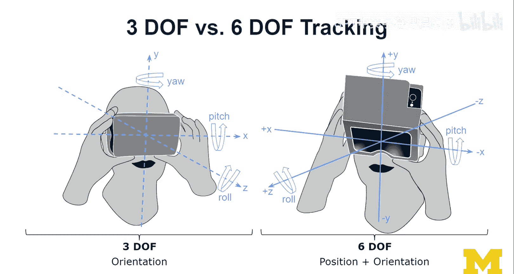

## 三自由度与六自由度追踪 🎯

现在，我们来看看头部和控制器追踪。虚拟现实运动控制器可以进行三自由度或六自由度追踪。

以下是两种自由度的区别：
*   **三自由度**：仅追踪旋转。例如Cardboard，可以追踪沿X轴（俯仰）、Y轴（偏航）和Z轴（翻滚）的旋转，但无法追踪在这些轴向上的位置移动。
*   **六自由度**：同时追踪旋转和位置。例如HoloKit，除了旋转，还能通过SLAM（同步定位与地图构建）等算法，确定设备在X、Y、Z轴上的位置移动。光学流等技术通过分析摄像头像素的移动向量来计算设备位移。

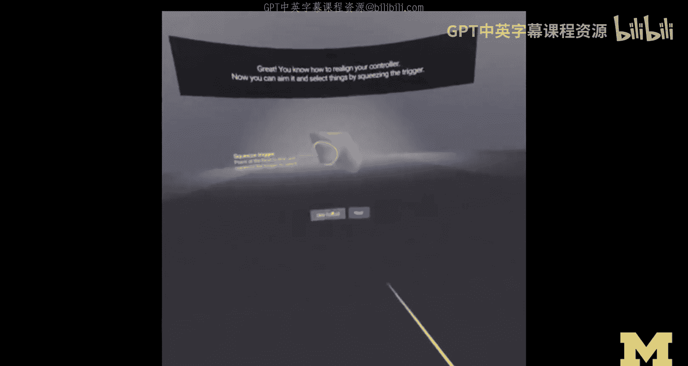

拥有六自由度追踪，用户就能够在3D空间中行走，而不仅仅是环顾四周，这为用户在内容中提供了极高的自主权。

以Oculus Go为例，它是一个三自由度设备，其控制器也只能旋转。用户可以通过激光指针交互远距离操作物体，但控制器的位置移动无法被追踪。

而Oculus Quest支持六自由度追踪。用户划定安全边界后，可以在其中自由行走，控制器在3D空间中的移动也能被精确追踪。

---

## 由外向内与由内向外追踪 🔄

追踪技术主要分为由外向内和由内向外两种模式。

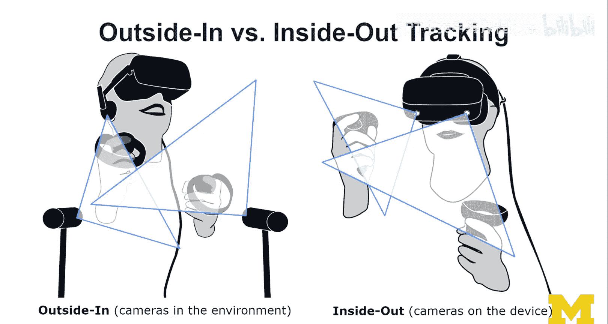

两者的核心区别如下：
*   **由外向内追踪**：将传感器（如摄像头、激光基站）放置在环境中，指向用户，在一个被传感器覆盖的区域内追踪用户。例如初代Oculus Rift需要将传感器放在桌上，追踪头显和控制器发出的光点。
*   **由内向外追踪**：将摄像头等传感器内置在设备本身。例如Oculus Rift S和Quest，设备上的摄像头直接追踪周围环境和控制器，无需外部传感器。这提供了更大的活动范围和灵活性，但控制器若移到摄像头视野外（如背后）则无法被追踪。

HTC Vive也采用了一种由外向内追踪形式，通过环境中的基站进行追踪。

---

## 手部追踪 ✋

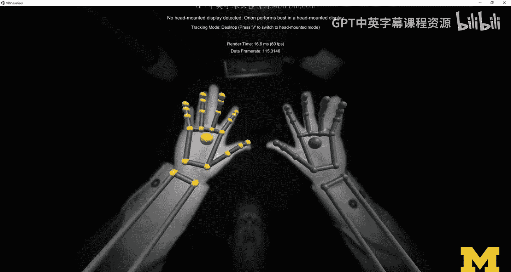

手部追踪技术正在迅速改进，并已成为许多新一代VR设备的标准功能。

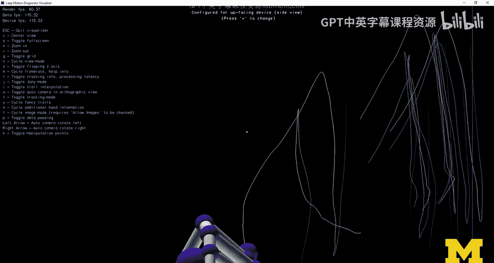

手部追踪的发展分为两个阶段：
1.  **外置设备阶段**：如Leap Motion，它是一个通过USB连接、可安装在头显上的外设，在其视窗范围内提供精确的手部关节追踪。
2.  **内置集成阶段**：如Oculus Quest，手部追踪功能已直接内置。用户放下控制器，注视双手即可被识别。系统支持捏合拖动等手势，用户可以在手部追踪和控制器使用之间无缝切换。

VR手套的目的不仅是追踪，更重要的是提供触觉反馈，通过将物理环境与虚拟对象对齐，创造触摸感。

---

## 空间音频 🎧

虽然虚拟现实以视觉为主，但创造沉浸感的一个非常重要的部分是围绕用户的音频。空间音频能根据声音在虚拟空间中的位置和用户的朝向，提供具有方位和距离感的听觉体验，极大地增强临场感。

---

## 技术整合示例：Beat Saber 🎮

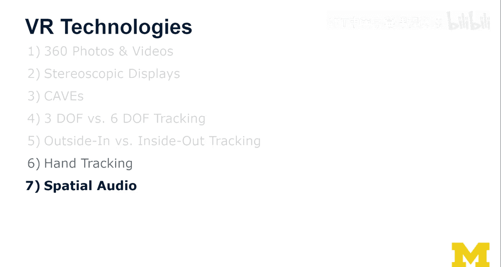

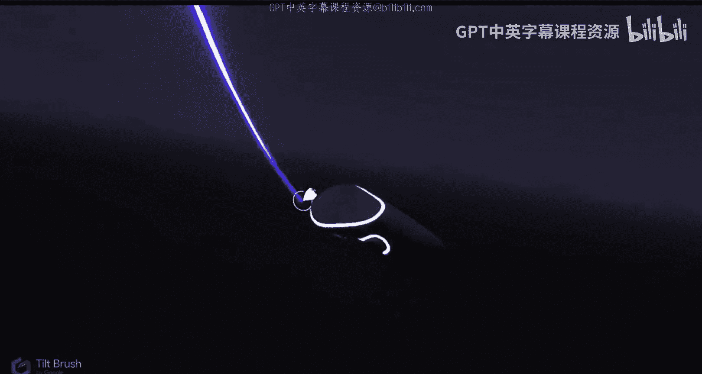

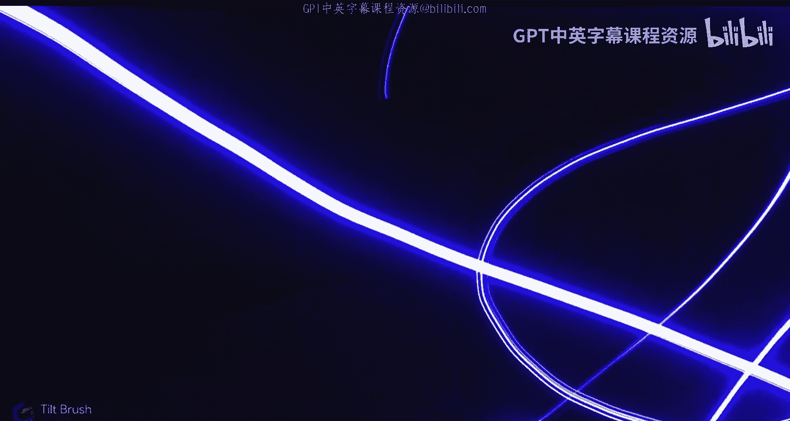

现在，我们回顾一下学到的所有技术，并以游戏《Beat Saber》为例进行整合分析。

《Beat Saber》集成了多项关键技术：
*   **立体显示**：通过头显为每只眼睛提供不同的视图，创造深度感。
*   **六自由度追踪**：用户需要在空间中移动和挥动光剑，精确的位置追踪至关重要。
*   **由内向外追踪**：演示中使用Oculus Rift S，利用其内置摄像头追踪用户动作。
*   **空间音频**：游戏中的音乐和音效与玩家的动作和游戏视觉元素紧密结合，增强了节奏感和沉浸感。

这些技术共同作用，为用户创造了一个高度沉浸、富有动感的虚拟现实体验。

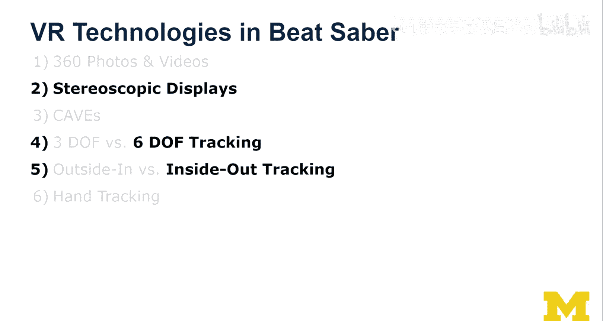

---

本节课中，我们一起学习了构成虚拟现实的核心技术。从创造深度视觉的立体显示和CAVE系统，到实现自由移动的三自由度和六自由度追踪，再到由外向内、由内向外两种追踪模式，以及日益重要的手部追踪和空间音频技术。最后，我们通过《Beat Saber》看到了这些技术如何整合，共同打造出令人沉浸的虚拟现实体验。理解这些基础技术，是设计和开发优秀VR应用的关键。