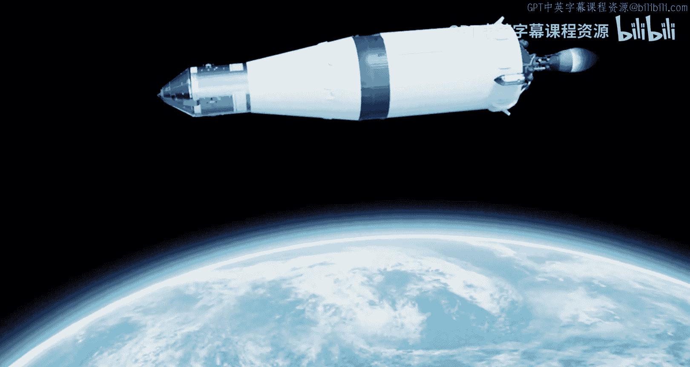
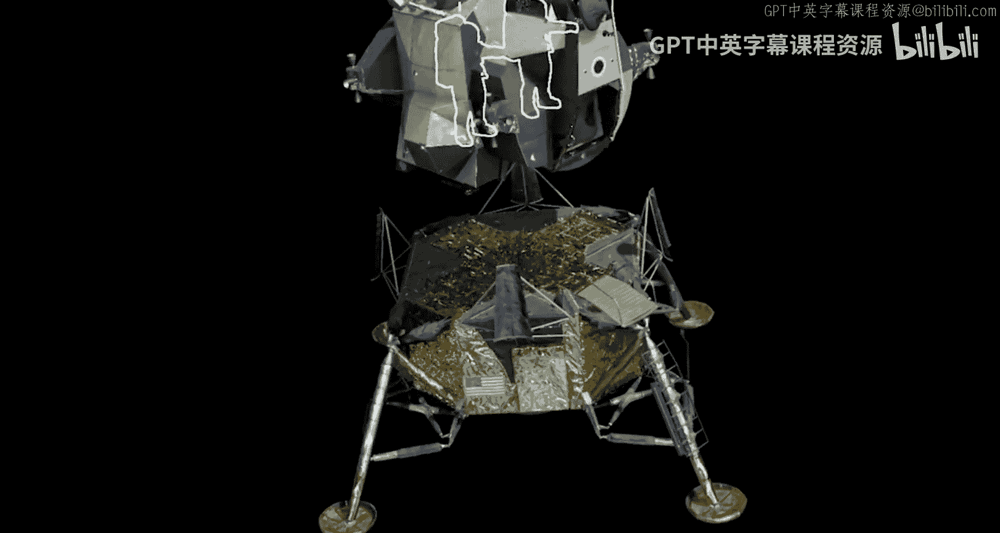
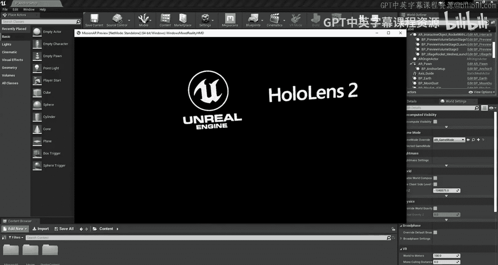
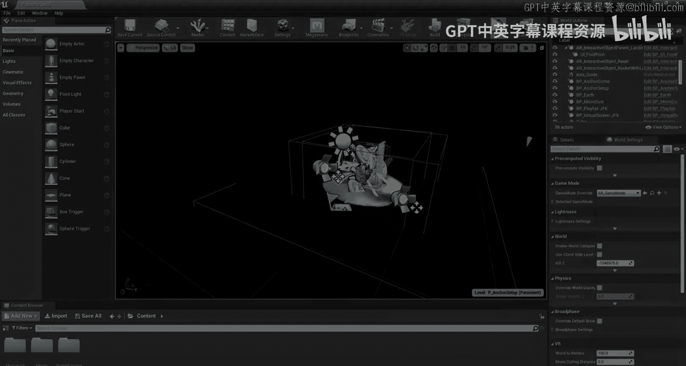
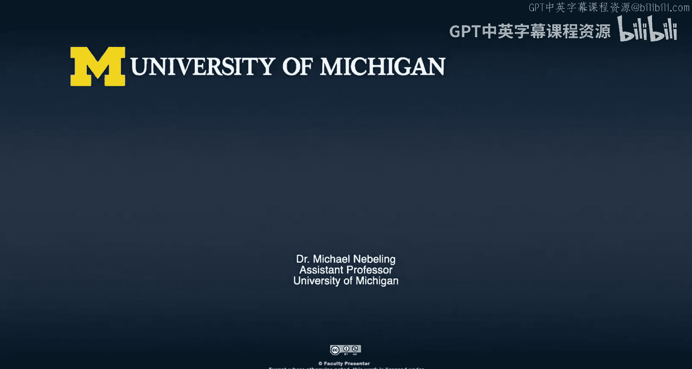

# 012：AR技术演示 🚀

在本节课中，我们将通过一个具体的增强现实（AR）应用演示，来了解AR技术如何将虚拟信息叠加到现实世界，创造出沉浸式的交互体验。我们将跟随一个模拟阿波罗11号登月任务的AR演示，学习其核心交互流程。

## 概述

这个AR演示应用将用户带入阿波罗11号的登月之旅。它通过叠加3D模型、动画和交互提示，在现实环境中重现了火箭发射、轨道飞行、登月舱分离以及月球漫步等关键历史时刻。用户可以通过触摸屏幕上的特定虚拟物体来推进剧情，体验交互式叙事。

---

上一节概述了演示的基本框架，本节中我们来看看演示的启动与火箭发射阶段。

演示始于著名的肯尼迪总统演讲引言：“我们选择在这个十年间登月并完成其他壮举，并非因为它们轻而易举，而是因为它们困难重重。”

土星五号火箭是一个三级火箭。每一级都在从地球到月球的旅程中扮演着关键角色。

当您准备好观看其工作原理时，请触摸土星五号底部发光的部分以启动发射序列。

以下是启动后的关键步骤：
*   **点火序列开始**：所有发动机启动。
*   **升空**：火箭升空。
*   **程序转弯**：火箭执行程序转弯，将阿波罗11号送入正确航向。

第三级火箭首先点火，将阿波罗11号送入环绕地球的驻留轨道。在进行了数小时的系统检查后，第三级火箭再次点火，推动飞船踏上前往月球的旅程。

---

在经历了激动人心的发射后，我们来看看飞船在太空中的关键操作：指令舱与登月舱的分离。

准备好继续后，请按指令舱上的“分离”命令。

由于登月舱专为太空真空环境飞行设计，它无需具备空气动力学外形，因此重量被降至绝对最低。其舱壁厚度仅相当于几层铝箔。

宇航员甚至没有座椅，他们站立着驾驶飞船，这本质上是一次从轨道开始的受控降落。

---

上一节我们看到了登月舱的独特设计，本节将体验登月与月球漫步的历史性时刻。

当您准备好继续时，请按鹰号登月舱的舱门。

七小时后，指令长沿梯子向下，站在了登月舱的支脚上。在月球六分之一的重力下，指令长及其宇航服的总重360磅仅相当于60磅，这使得移动极为轻松。

最后，指令长为人类迈出了一小步，为人类迈出了一大步，踏上了月球表面。

这个脚印代表了近40万人十年工作的成果，这是人类历史上最伟大的探索时期之一，并且这个脚印很可能至今仍留在那里。

当您准备好结束演示并返回地球时，请按这个脚印。

---

## 总结

本节课中，我们一起学习了一个完整的AR技术演示案例。通过这个阿波罗11号登月演示，我们看到了AR技术如何：
1.  **叠加虚拟内容**：将火箭、飞船等3D模型融入真实环境。
2.  **设计交互叙事**：用户通过点击特定虚拟对象（如火箭底座、分离按钮、脚印）来推进故事发展。
3.  **传递知识与情感**：生动再现复杂的历史与科技事件，提供沉浸式教育体验。

这个演示清晰地表明，AR的核心在于**将数字信息与物理世界无缝融合，并通过直观的交互创造出身临其境的体验**。

