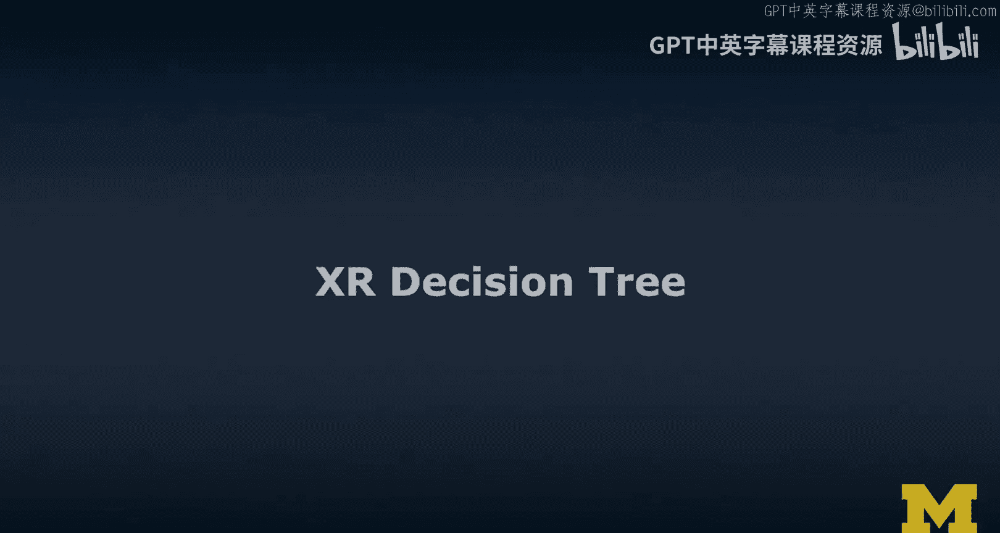
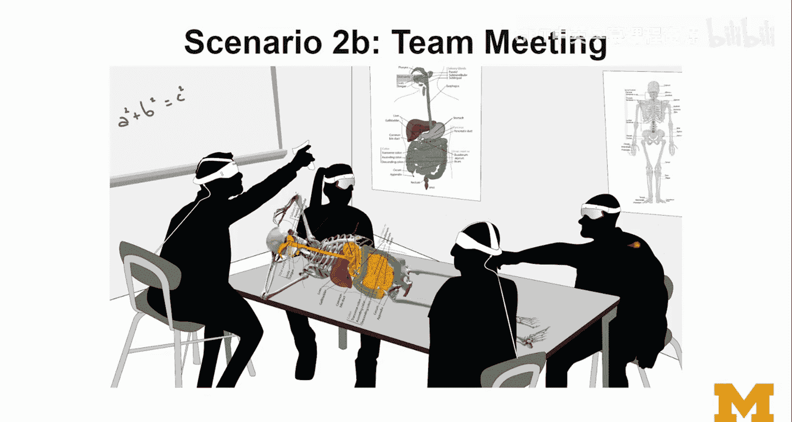

# 019：XR技术决策树 🧭

在本节课中，我们将学习如何为XR项目做出技术决策。我们将介绍一种名为“问题-选项-标准”的分析框架，帮助你系统地思考显示、追踪、导航、交互和协作等关键问题。通过具体的场景分析，你将学会如何权衡利弊，为你的项目选择最合适的技术方案。

---

## 动机与目标

上一节我们探讨了各种XR技术，本节中我们来看看如何系统地选择它们。我设计这个额外决策树的动机，是为你提供一个思考框架。

首先，明确我的目标：
*   提供一个系统化、技术上可靠，但无需深厚技术背景的思考框架。
*   提供具体且有代表性的技术选择示例。

同时，需要说明非目标：
*   并非涵盖所有可能的平台、设备和工具。
*   并非提供一个适用于所有项目的通用解决方案。

我的方法是将其视为一个设计空间问题，并引入一种名为“问题-选项-标准”的设计空间分析工具。

---

## 理解“问题-选项-标准”框架

“问题-选项-标准”是一个帮助你理清设计思路的工具。它通过提出具体问题、列出可行选项、并依据明确标准进行评估，来辅助决策。

以下是该框架的基本结构：
1.  **问题**：关于具体设计元素的疑问。
2.  **选项**：相互排斥的设计备选方案。
3.  **标准**：可客观评估和权衡的准则。

例如，对于“如何显示某个元素”这个问题：
*   **选项A**：永久显示。
*   **选项B**：基于事件或交互触发显示。

评估标准可能包括：
*   **用户操作负担**：`选项A`负担低，`选项B`负担高。
*   **界面简洁性**：`选项A`可能造成界面混乱，`选项B`有助于保持简洁。
*   **持续反馈**：`选项A`能提供持续反馈，`选项B`可能无法提供。

通过权衡这些标准，你可以根据项目具体情况做出最佳选择。选定一个选项后，可能会引出新的问题（例如“如何让它出现？”），从而形成层层递进的决策树。

---

## 核心决策领域与评估标准

现在，让我们将QOC框架应用到XR的几个核心决策领域。以下是XR项目中常见的关键问题及其对应的选项和通用评估标准。

### 显示技术选择

**问题**：如何显示内容？选择何种显示技术？

以下是主要的显示技术选项：
*   **头戴式设备**：VR头显、AR眼镜。
*   **手持设备**：智能手机、平板电脑。
*   **屏幕空间**：2D界面（如手机AR）、360度视频。
*   **世界空间**：内容锚定在真实世界中的固定位置。
*   **跟随模式**：内容随用户视角移动（如Hololens或Oculus的主菜单）。

评估这些选项时，可以考虑以下标准：
*   **用户熟悉度**：用户是否容易上手？
*   **用户舒适度**：包括人体工学和可用性。
*   **用户移动性**：用户需要坐着还是可以走动？是否考虑无障碍访问？
*   **用户负担**：需要用户佩戴或携带多少设备？
*   **环境要求**：需要对环境进行多少改造或部署？
*   **显示特性**：屏幕尺寸、分辨率、视场角、刷新率。
*   **设备要求与成本**：是否需要特殊或昂贵的设备？

### 追踪技术选择

**问题**：如何追踪用户或物体？

以下是主要的追踪技术选项：
*   **自由度**：3DoF（仅旋转） vs. 6DoF（旋转+平移）。
*   **追踪方式**：由内向外追踪、由外向内追踪。
*   **基准类型**：基于标记点、无标记点、基于面部、基于身体。

评估这些选项时，可以考虑以下标准：
*   **用户/环境负担**：是否需要用户佩戴标记，或在环境中布置传感器？
*   **环境限制**：是否有物理空间或照明条件的约束？
*   **设备要求与成本**：是否需要特定或昂贵的硬件？

### 导航（移动）方式选择

**问题**：用户如何在虚拟内容中移动（导航）？

以下是主要的导航方式选项：
*   **真实行走**。
*   **重定向行走**。
*   **瞬移**。
*   **菜单选择**。

评估标准与显示和追踪技术类似，需特别考虑**移动自由度**、**舒适度**（防晕动）和**环境空间要求**。

### 交互（操控）方式选择

**问题**：用户如何操控虚拟内容？

以下是主要的交互方式选项：
*   **VR控制器**。
*   **徒手交互**。
*   **语音控制**。
*   **眼动控制**。
*   **基于标记的物理道具**。

评估时需考虑**交互精度**、**自然度**、**学习成本**以及额外的**传感技术要求**。

### 协作模式选择

**问题**：如何支持多用户协作？

协作可以从两个维度考虑：
1.  **空间维度**：`同地协作` vs. `远程协作`。
2.  **时间维度**：`同步协作` vs. `异步协作`。

评估时需考虑**网络要求**（延迟、带宽）、**数据存储需求**（用于异步协作）以及**用户体验的一致性**。

---

## 场景应用示例

掌握了框架和核心领域后，我们通过具体场景来看看如何应用。

### 场景一：家居装饰AR应用

**背景**：一家人聚在一起，使用各种AR设备商讨如何装饰客厅。

**关键问题**：如何实现追踪？

**选项分析**：
*   **选项A：基于标记的追踪**。
*   **选项B：无标记追踪**。

**评估与决策**：
| 评估标准 | 基于标记追踪 | 无标记追踪 | 决策倾向 |
| :--- | :--- | :--- | :--- |
| **设备兼容性** | 适用于任何有摄像头的设备。 | 需要特定设备支持（如ARKit/ARCore）。 | - |
| **环境负担** | 需要在空间中放置标记。 | 无需改造环境。 | **支持B** |
| **移动自由度** | 受限于标记必须在摄像头视野内。 | 用户可自由移动。 | **支持B** |
基于评估，在此场景下可能更倾向于选择**无标记追踪**，因为它提供了更大的移动自由且无需准备标记。

### 场景二与三：公共空间中的XR

**场景A（教室）**：老师想展示太阳系，学生使用各种AR设备观看。
**场景B（会议室）**：团队在会议室协作，共同查看和操作AR内容。

**需要思考的问题**：
*   **显示**：是每人一个视图，还是共享一个公共视图？
*   **追踪**：使用标记还是无标记？标记放在哪里？如何为所有用户工作？
*   **协作**：如何确保所有人都能看到并指向同一内容？能否支持VR用户加入？
*   **环境**：用户大多是坐着的，这对技术选择有何影响？

这些场景涉及更多权衡，例如共享视图可能降低个人设备要求，但会牺牲交互的个性化。

---

## 总结与练习

本节课中，我们一起学习了如何运用“问题-选项-标准”框架来为XR项目构建技术决策树。我们探讨了在显示、追踪、导航、交互和协作等核心领域如何提出关键问题、列出可行选项，并依据客观标准进行评估与权衡。

记住，没有放之四海而皆准的“最佳”方案，只有最适合特定项目目标、用户需求和上下文约束的选择。最好的决策来自于系统化的分析和清晰的权衡。

我邀请你将这些知识付诸实践：选择一个XR场景，尝试构建你自己的决策树。提出关键问题，脑暴各种选项，并定义你的评估标准。这是一个绝佳的方式来巩固所学，并为你的项目规划打下坚实基础。