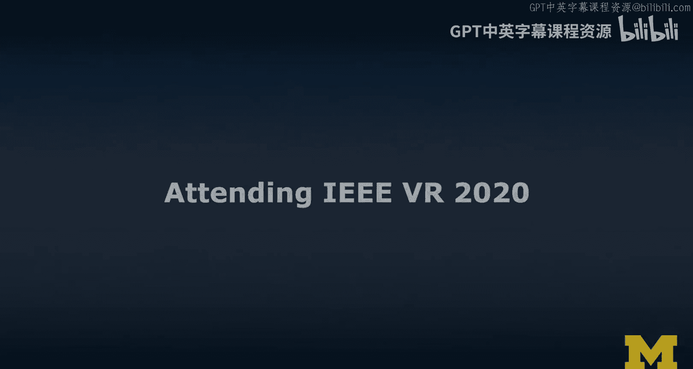
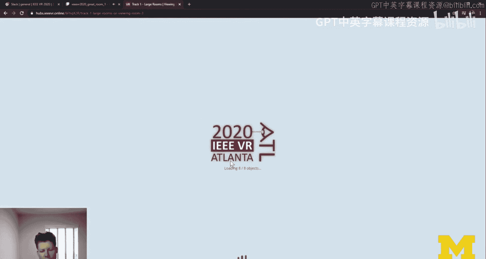
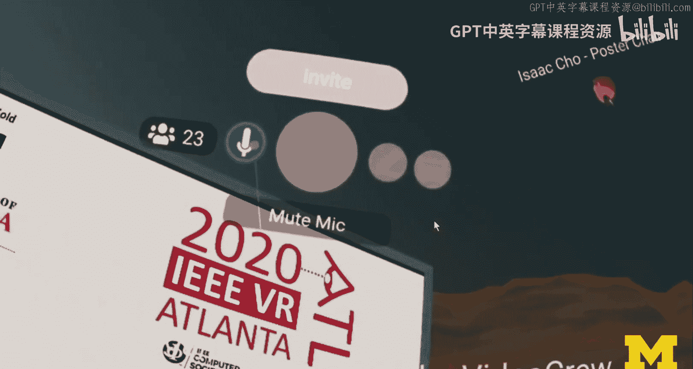
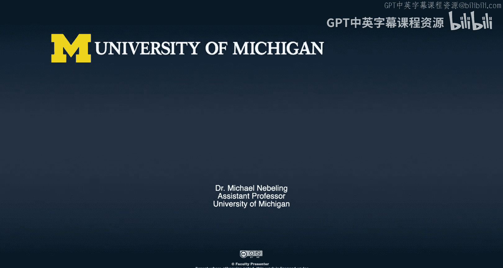

# 021：IEEE VR 2020虚拟参会实践 🎮




在本节课中，我们将跟随讲师的实际体验，了解如何在虚拟现实中参加一场关于虚拟现实的学术会议。我们将看到具体的参会流程、互动方式，并分析这种新型会议形式的优缺点。

---

## 概述

这段视频记录了讲师参加2020年 IEEE 虚拟现实会议（IEEE VR）的完整过程。该会议原定于亚特兰大举行，后因疫情转为线上虚拟会议。讲师使用 Mozilla Hubs 平台，以虚拟形象参会，并分享了从登录、探索、社交到听报告的完整经历。本节内容将作为我们探讨虚拟社交、会议设计与可访问性等议题的实践案例。

---

## 虚拟参会初体验

上一节我们介绍了课程背景，本节中我们来看看讲师是如何开始他的虚拟会议之旅的。





首先，讲师需要登录会议网站并选择自己的虚拟形象。这个过程本身就很有趣：就像参加实体会议前需要挑选正装一样，在虚拟会议中，你需要为自己选择一个**虚拟化身（Avatar）**。

```javascript
// 概念上，选择化身是一个设置用户表示的过程
user.avatar = selectAvatar(avatarOptions);
```

随后，讲师进入由 Mozilla Hubs 构建的虚拟会议空间。他最初的体验包括探索不同的“房间”、寻找演讲厅以及尝试与虚拟环境互动。即使是虚拟现实，一些设计问题依然存在，例如虚拟楼梯难以行走，这提醒我们**可访问性（Accessibility）** 在虚拟空间设计中同样至关重要。

---

## 会议中的探索与社交

在熟悉环境后，讲师开始尝试会议的社交功能，这模拟了现实会议中的咖啡休息环节。

以下是讲师在虚拟咖啡角尝试的一些互动：
*   **尝试发起对话**：讲师试图以茶和咖啡的话题开启聊天。
*   **与学生会合**：讲师与他的学生Schweda在虚拟空间中会面，并一同探索。
*   **遭遇技术问题**：他们遇到了常见的音频问题，Schweda一度听不见声音，这反映了远程协作中普遍存在的挑战。

在探索过程中，发生了一些有趣的插曲。例如，讲师和他的学生无意中站在了虚拟空间的同一位置，导致彼此“看不见”对方，这是一种在现实世界中不会发生的奇特体验。讲师还尝试使用虚拟激光笔等工具与海报互动，这些工具增强了演示和讲解的体验。

---

## 对虚拟会议体验的反思

在体验了多日的虚拟会议后，讲师对整体经历进行了批判性总结。这与参与传统实体会议的体验既有相似之处，也有显著不同。

**积极的方面包括：**
*   **更高的参与度**：线上形式吸引了比往年更多的参会者。
*   **创新的海报环节**：虚拟现实中的海报展示变得格外引人入胜，学生和年轻研究员得到了更多关注。
*   **多元的参与渠道**：组织者提供了VR（Mozilla Hubs）、Twitch直播、Slack聊天等多种参与方式，兼顾了包容性。

**面临的挑战与问题包括：**
*   **注意力分散**：多个并行的交流渠道（如VR空间与Slack）容易分散参会者的注意力。
*   **社交体验差异**：通过虚拟化身互动，无法进行真实的眼神交流或读取面部表情，社交深度受限。
*   **隐私与礼仪问题**：在虚拟公共空间中录制影像的伦理边界模糊，且存在他人麦克风未静音等干扰。
*   **与现实生活的整合**：在不同时区参加虚拟会议，需要协调虚拟活动与线下现实工作，具有一定挑战性。

核心问题在于，虚拟现实会议在努力**模拟（Simulate）** 现实体验的同时，也**复刻（Replicate）** 了现实会议中的许多问题，甚至引发了一些新的问题。

---

## 总结



本节课中，我们一起学习了以第一视角体验虚拟现实学术会议的全过程。我们看到了从选择化身、探索场景到学术交流的具体步骤，也深入分析了这种形式在提升参与度、创新展示方式方面的潜力，以及在社交深度、技术稳定性、隐私伦理和可访问性方面面临的持续挑战。这次实践表明，扩展现实技术为远程协作和活动提供了新的可能，但其设计与应用仍需充分考虑人性化体验与实际需求。