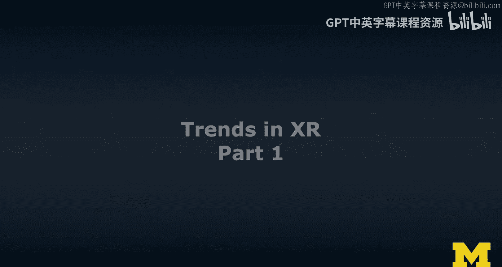
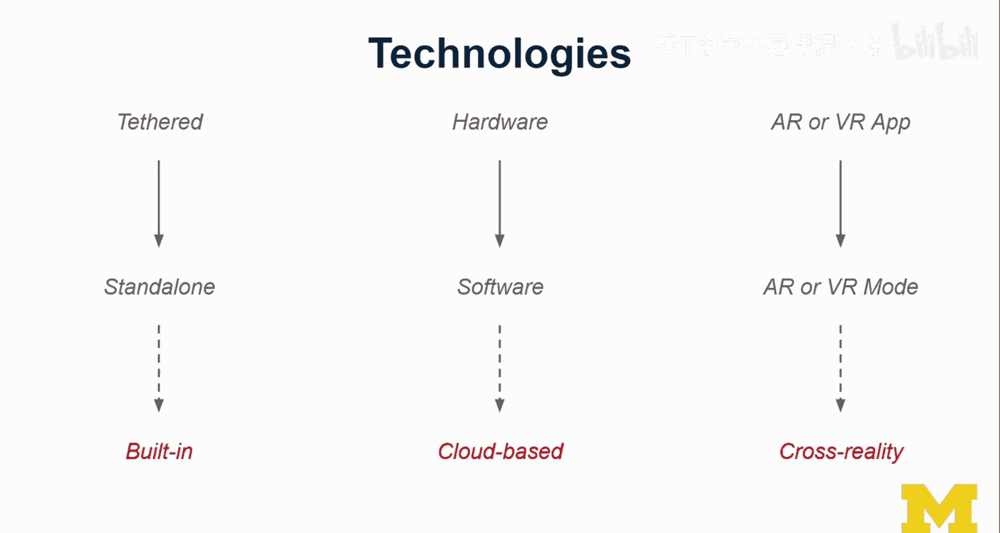
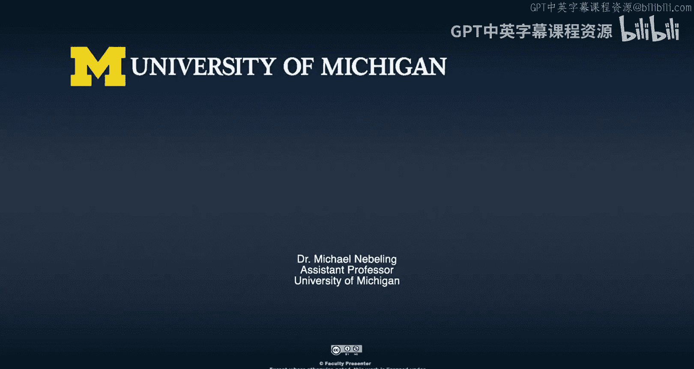

# 022：XR发展趋势第一部分

在本节课中，我们将探讨扩展现实（XR）领域的发展趋势。我们将尝试展望未来，看看技术将走向何方，并讨论其中涉及的一些问题。本节课主要侧重于前景展望，关于具体挑战的深入讨论将在后续课程中专门进行。现在，让我们先来窥探一下XR的未来。

## 建立参考框架：人、任务与技术三角模型

在探讨趋势之前，首先建立一个参考框架或坐标系非常重要。作为一名人机交互研究者，我倾向于从三个主要实体来思考：**人**、**任务**和**技术**。

我在此使用了一个由我同事马克·纽曼（Mark Newman）改编的三角模型图示，我非常喜欢它。它将“人”置于三角形的一角，而“任务”和“技术”则分别位于另外两个角。

这个模型的趣味在于，我们可以探索这三个实体之间的关系。人机交互领域（我的研究方向）的核心问题通常是：**我们如何利用对用户、其任务以及技术能力的理解，来设计更好的系统？** 这是一个设计问题，同时也涉及技术视角。

这个三角模型的每一“边”都代表了一个值得探索的关系领域。

上一节我们介绍了分析XR趋势的三角模型框架，本节中我们来看看这个模型的第一条边：人与任务的关系。

## 从“人”的角度看趋势

从“人”的角度出发，我们关注用户本身及其互动方式的变化。以下是当前观察到的一些趋势：

*   **从单用户到多用户再到社会化体验**：目前，XR体验多为单人模式。用户戴上头显，进入独立的世界。但多用户体验正在增多，这些用户通常是远程的。下一步将是社会化XR，即大量用户在公共场合使用XR设备进行互动。虽然社会可能尚未完全准备好接受这一点，但合适的设备形态和技术将推动其实现。
*   **从健全用户到普适包容性设计**：当前技术主要面向身体健全的用户。未来的趋势是服务于所有用户，包括有特殊需求或存在障碍的用户。障碍也可能是情境性的，例如在自行车或汽车上使用AR/VR设备，会带来显著的操作限制，使健全用户也面临挑战。目前大多数XR体验在此类情境下难以安全使用。

从“人”的角度我们看到了用户群体和互动模式的变化，接下来，让我们从“任务”的角度审视XR应用场景的演进。

## 从“任务”的角度看趋势

“任务”指的是用户使用XR技术完成的活动或场景。当前的设计思路正在不断拓宽：

*   **应用场景的扩展**：目前，XR设计主要针对特定、受限的环境，例如坐姿或桌面AR体验、站立式或房间规模的VR体验。我们开始看到一些移动中的场景支持（如在火车或飞机上）。像《Pokemon Go》这样的世界规模AR游戏已经出现，允许用户在公共场合游戏和互动。未来，任务支持将扩展到更大规模。
*   **支持跨场景的任务连续性**：未来，应用将能够支持更广泛的上下文环境，而不仅仅是传统的桌面或房间环境。用户可以自由选择在桌面、房间甚至不同地点之间切换并继续同一任务。例如，一个任务可以从桌面开始，无缝过渡到整个房间，甚至延续到邻居家。这需要技术进步，也需要在设计中赋予用户更多控制权。

了解了任务场景的扩展方向后，支撑这些体验的技术本身也在经历深刻的变革。最后，我们从“技术”的角度来观察核心趋势。

## 从“技术”的角度看趋势

从技术演进来看，可以观察到三条主要趋势线：

*   **趋势一：从有线到独立，再到内置集成**
    *   早期因计算需求，设备多为有线连接。
    *   随后出现独立的专用设备，如Oculus Quest或HoloLens。
    *   当前趋势是将XR技术（尤其是AR）**内置集成**到现有设备中，如智能手机、平板电脑，未来甚至包括机器人。更多传感器（如LiDAR）正变得普及和廉价。

*   **趋势二：从硬件到软件，再到云端计算**
    *   早期依赖专用硬件（如Google Tango的深度摄像头）。
    *   转向软件解决方案（如ARKit和ARCore），利用算法实现类似功能。
    *   未来趋势是**云端计算与渲染**。将传感数据发送到云端，由强大的服务器集群进行复杂计算和高保真渲染，再将结果流式传输回设备，以实现本地设备无法达到的图形质量。

*   **趋势三：从单一现实模式到跨现实应用**
    *   目前应用多为纯粹的AR应用或VR应用。
    *   未来，更多应用将根据具体任务的优势，**同时集成AR和VR模式**。用户可以根据偏好、上下文和当前任务，在应用内无缝切换AR与VR体验。这种能力可称为“**跨现实**”，它能让XR技术更灵活地支持各种生产力场景。

## 总结

本节课中，我们一起学习了如何从**人**、**任务**和**技术**三个角度分析XR的发展趋势。我们看到，用户体验正朝着**社会化**和**普适包容**发展；应用场景在不断**扩展**并追求**跨场景连续性**；而技术则沿着**集成化**、**云端化**和**跨现实融合**的方向演进。理解这些趋势有助于我们把握XR领域的未来方向，并为设计和开发下一代XR体验做好准备。