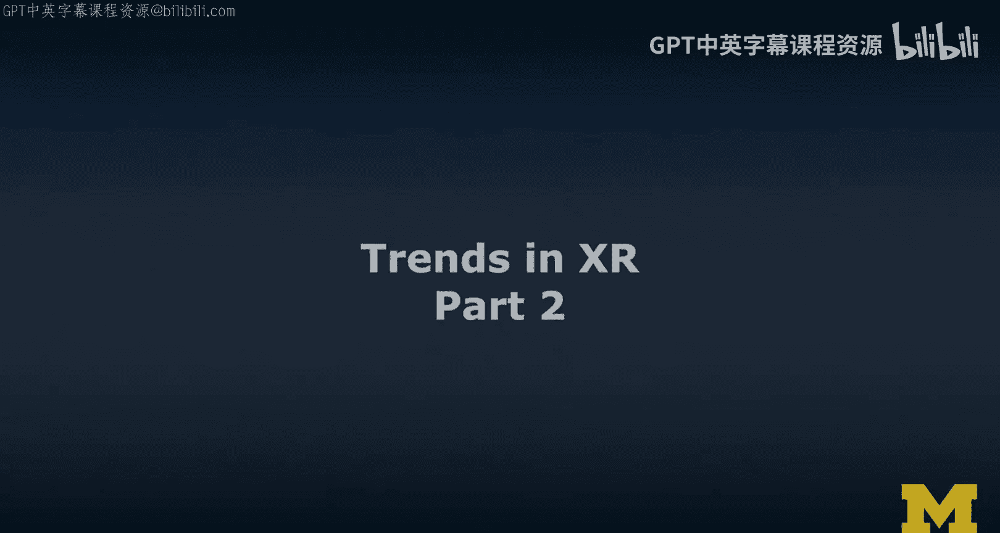
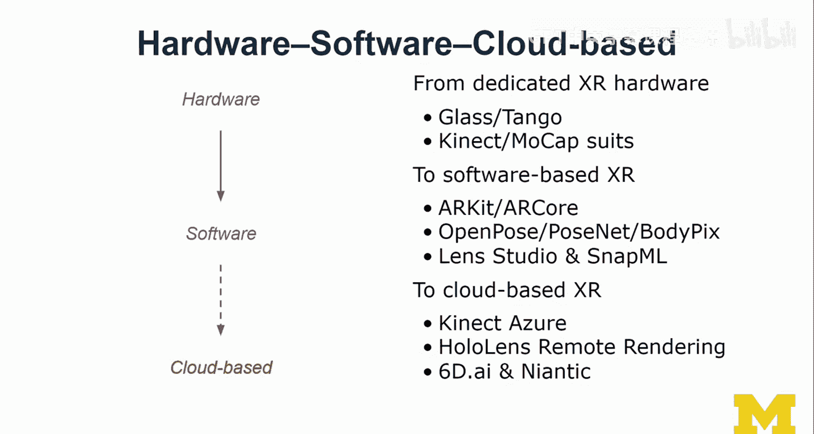
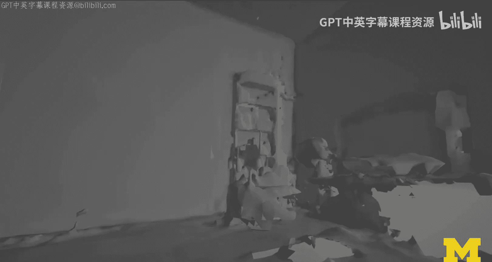
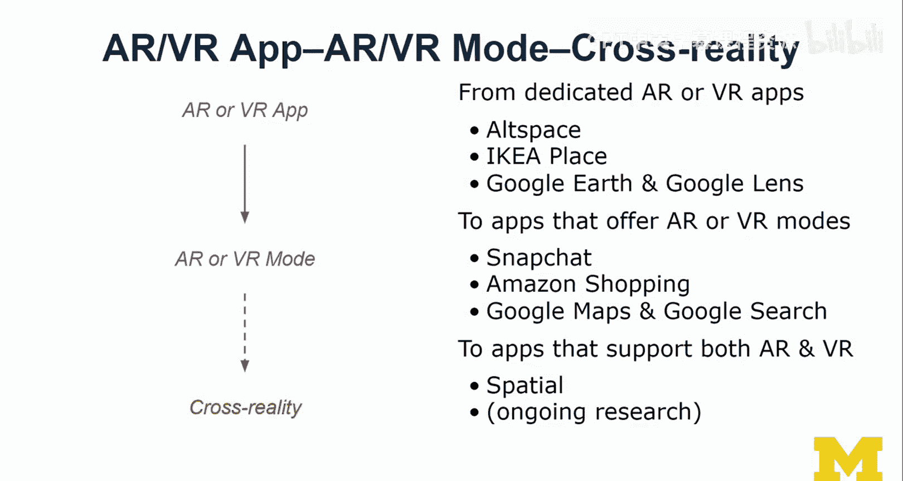
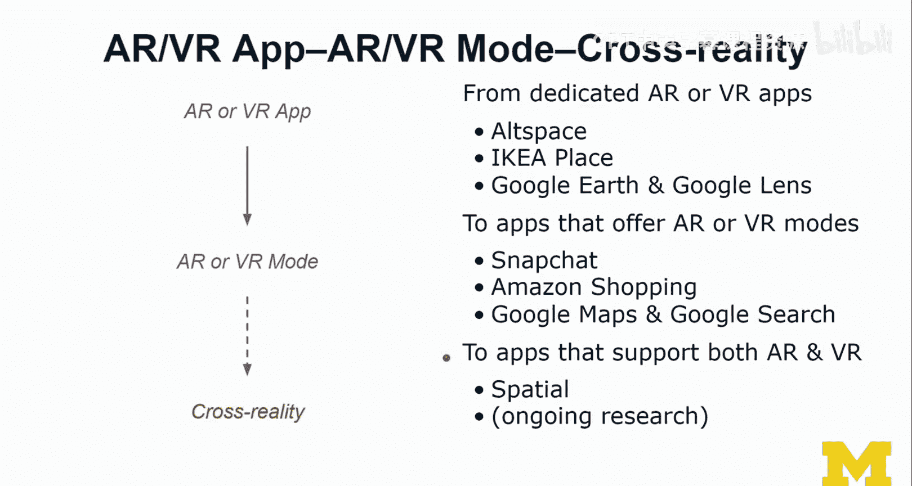
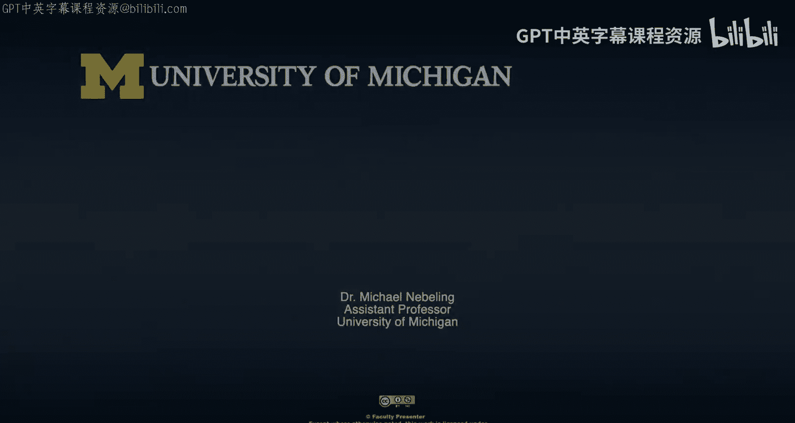
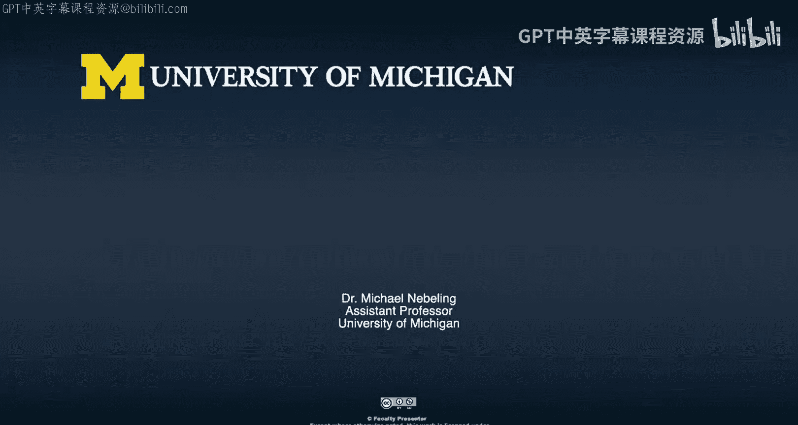

# 023：XR发展趋势第二部分 🚀

在本节课中，我们将深入探讨XR领域的三大技术发展趋势，并了解这些趋势如何从硬件、软件和应用层面塑造XR的未来。

上一节我们介绍了从人员、任务和技术角度观察XR趋势的框架。本节中，我们将重点展开分析技术层面的具体趋势。

## 趋势一：从有线到独立，再到集成式设备 🔌➡️🎧

XR设备的发展经历了从有线连接到独立运行，再到集成化的过程。

以下是该趋势的具体演变阶段：

*   **有线VR头显**：发展初期以Oculus Rift和HTC Vive为代表，需要连接高性能电脑。
*   **智能手机AR**：随后出现了基于智能手机的AR体验，例如Google Cardboard、GVR和Daydream。如今，Google和Apple通过ARCore和ARKit平台继续推动手机AR的发展。
*   **独立VR头显**：以Oculus Go和Quest为代表的新浪潮。它们是独立的移动计算机，需要充电，但无需连接外部设备。
*   **集成式AR/VR能力**：最新的趋势是将XR功能集成到日常穿戴设备中。早期例子包括Snap的Spectacles和North的Focals。Spectacles更像一个头戴式相机，而Focals被Google收购，其发展路径类似早期的Google Glass，目前AR功能有限。未来，我们预计会看到更多集成XR功能的智能眼镜甚至隐形眼镜。

## 趋势二：从硬件到软件，再到云端 ☁️

XR的实现方式正从依赖专用硬件，转向以软件和云计算为核心。

以下是该趋势的具体表现：

*   **专用XR硬件**：例如Google Glass、Tango项目、Kinect以及动作捕捉服。这些硬件在XR乃至电影制作等领域都有应用。
*   **软件化XR**：趋势转向基于软件的XR解决方案，例如ARKit和ARCore。同时，出现了大量与此相关的软件框架，例如用于人体姿态和手势识别的OpenPose、PoseNet和BodyPix。
*   **云端XR**：最终趋势是向云端迁移。微软将广受研究人员欢迎的Kinect技术以Azure Kinect的形式重新带回，作为一个深度摄像头，将大量的图像处理和语义理解工作放在云端完成。HoloLens也支持远程渲染。另一个例子是Niantic（《Pokemon Go》的开发商）收购了专注于用智能手机进行3D场景重建的初创公司6D.ai，这预示着未来可能通过众包方式在云端构建庞大的3D世界地图。

上一节我们探讨了设备形态和实现方式的演变，接下来我们看看应用层面的融合趋势。

## 趋势三：从独立应用到融合模式，再到跨现实体验 🔄

XR的应用形态正从独立的AR或VR应用，发展为应用内的特定模式，并最终走向支持用户在AR与VR之间无缝切换的跨现实体验。

以下是该趋势的具体案例：

*   **独立XR应用**：例如VR社交应用AltspaceVR或Second Life，AR家具摆放应用IKEA Place和Wayfair。Google Earth VR和Google Lens也是典型的专用VR和AR应用。
*   **应用内的XR模式**：越来越多的应用开始集成XR功能作为其特性之一。Snapchat本质上是一个通讯应用，但其集成了各种AR“镜头”作为娱乐和内容创作工具。亚马逊购物应用也加入了AR产品预览功能。
*   **跨现实体验**：最前沿的趋势是支持根据任务上下文和用户偏好，在AR与VR之间平滑过渡。Google地图整合了街景（VR）和实时视图（AR），让用户能以混合现实的方式探索世界。Google搜索在特定关键词下也提供AR预览功能。Spatial是一个支持用户通过不同设备（VR或AR头显）进入同一虚拟会议空间的跨现实应用。此外，学术界也在探索相关方向，例如与Mozilla合作研究的XR浏览器项目，旨在探索如何在网页浏览中自然地过渡到沉浸式体验。

本节课中我们一起学习了XR技术发展的三大核心趋势：设备日益轻便集成化，实现方式转向软件与云端，应用体验走向融合与跨现实。这些技术进步在带来更强大、更便捷体验的同时，也引入了新的挑战，例如数据隐私、云端安全、算法偏见以及技术与社会更深度交织所引发的伦理问题。理解这些趋势有助于我们更好地预见和思考XR技术的未来发展方向及其广泛影响。