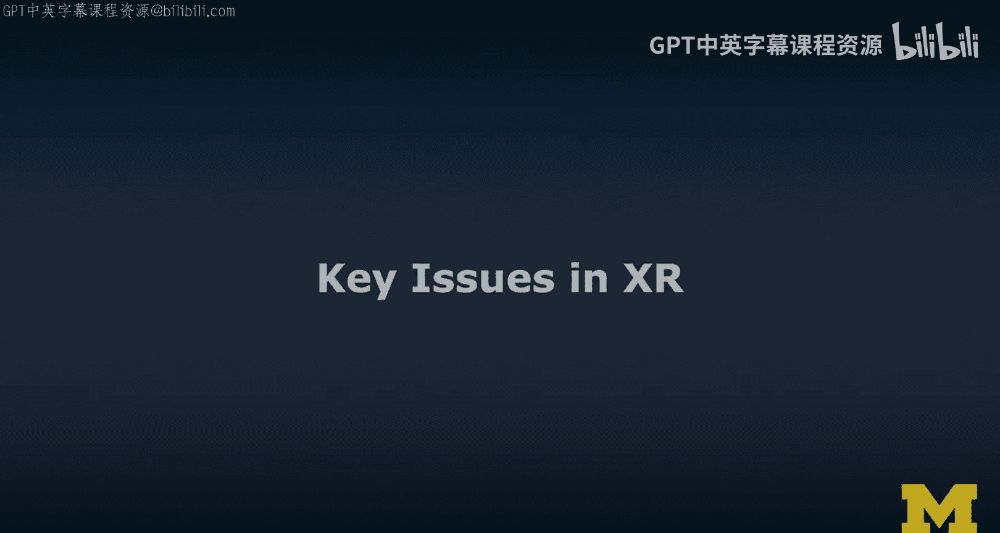
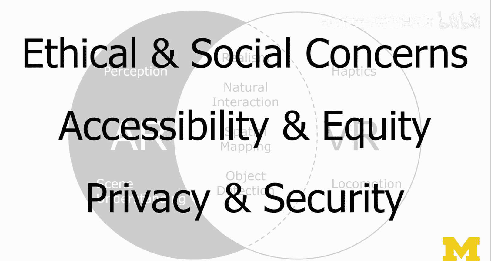

# 024：XR关键议题 🎯

在本节课中，我们将探讨扩展现实（XR）领域面临的一系列关键议题。我们将超越技术本身，审视其设计、技术、用户采纳以及更广泛的社会伦理影响，帮助你建立一个全面的批判性视角。

上一节我们介绍了XR的概念与技术趋势，本节中我们来看看这个领域面临的实际挑战与问题。

## 技术层面的挑战 🛠️

尽管XR技术发展迅速，但仍面临诸多技术挑战。以下是几个核心的技术议题。

### 平台碎片化
平台碎片化是一个显著问题。目前市场上有众多不同的XR设备，且少数关键供应商试图以各自的方式控制市场。这导致了与过去（乃至现在）移动设备领域相似的问题。

**核心问题**：对于开发者或设计师而言，用户使用的是Android类设备还是iOS类设备至关重要。大多数情况下，你必须为每个平台创建特定的应用程序。在XR领域情况类似。虽然现在有一些跨平台解决方案，但供应商特定的设备SDK仍然存在，它们能提供最新功能的访问权限，而这些功能需要时间才能整合到Unity、Unreal甚至WebXR等通用解决方案中。

### 设备局限性
许多XR设备目前功能仍相当有限，经常被过度宣传。许多宣传视频中存在大量过度承诺，这本身就是一个问题。我们在推广这些技术时并不总是诚实的。

### 真实感与交互
我们在真实感方面正在取得进展，开始体验到临场感。许多体验具有明确的沉浸感。我们在支持自然交互（如手势和语音等基于身体的交互，而非鼠标键盘等间接交互）方面也相对较好。我们拥有大量直接操作方式，虽然仍有控制器，但感觉也相对自然。

### 空间映射与物体识别
我们在空间映射方面也取得了良好进展。这更多是增强现实（AR）世界的重点，即映射用户周围的环境以增强体验。在虚拟现实（VR）方面，我们同样需要做得更好。Oculus已经开始展示能识别房间内障碍物的功能，因为在VR环境中，障碍物不仅会破坏用户体验，实际上也非常危险。

物体识别能力也在提升。我们现在有更多的语义理解能力。我们知道我身后的是一面墙，这可能是一个架子。但更复杂的识别，例如判断一个物体是否危险，或者计算其轨迹和速度以警告用户，目前这些技术尚未完全内置到现有设备中。

### VR特定挑战：触觉与移动
在VR方面，我们在触觉反馈上取得了相当好的进展。市面上有多种控制器，例如类似外骨骼的手套，它们能附着在身体部位并提供触觉反馈（类似于力反馈），让你在虚拟现实中触摸物体时有真实感。

在移动方面，我们现在拥有六自由度（6DoF）内向外追踪技术，无需在环境中放置任何外部传感器。我们在重定向行走等更先进的技术上也取得了进展，这使我们能在较小的物理空间内创造更大的虚拟体验，本质上是通过巧妙地欺骗用户的感官来实现，且不让用户察觉。

## 增强现实（AR）的特定挑战 👓

现在我们来具体谈谈AR。感知是指所有与我们在观看AR界面时如何感知事物相关的议题。

### 遮挡
遮挡是一个非常重要的问题。显然，如果一个虚拟物体在我身后，我的身体应该遮挡它，就像我的身体会遮挡我身后的真实椅子或其他任何东西一样。如果这些是虚拟物体，它们显然应该像在物理世界中一样做出反应。

### 光线估计
感知方面的另一个大问题是光线估计。为了让增强现实内容看起来像是真实世界的一部分，我们需要弄清楚那里（与这里相比）的光照条件，并设置合适的主光和补光，这可能会非常不同。我们需要想办法让内容融入环境，本质上是为了解决一些感知问题。

### 场景理解
最后是场景理解。我认为这是我们取得大量进展的领域，因为这是目前机器学习与AR（如计算机视觉）令人兴奋的交汇点。其理念是计算机可以观察事物并真正理解它们看到的是什么。例如，识别我身后是一面墙，我坐在椅子上，我是一个人。人物分割就属于这一范畴，我们正在取得进展。

场景理解本质上是空间映射和物体检测识别之上的语义层，这非常困难。你可能认为我们在绘制世界地图方面取得了很大进展，这在外界是事实，但室内定位和地图绘制一直是个问题。对于AR，我们很多人在家中等更私密的环境中使用这些技术。场景理解涉及大量计算，问题在于这些计算发生在哪里。这引发了各种问题。

## 更广泛的社会与伦理关切 🤔

以上只是技术问题。我们还应该关注一些更广泛的关切，包括伦理和社会关切，以及可访问性与公平性、隐私与安全等重大议题。

### 伦理与社会关切
这包括你个人可能持有的伦理关切，也包括在更公共的场合使用这些技术时所引发的社会关切。例如，如果有人戴着虚拟现实头显走进咖啡馆，你会怎么想？或者，如果飞行员说：“大家好，这是飞往西雅图的航班，欢迎各位登机。顺便说一下，这是我第一次实际飞行，之前我只在虚拟现实中接受过训练。”虽然我们已经有飞行模拟器，但你会信任那位飞行员吗？这些都是我们必须认真关注和思考的有趣问题。

### 可访问性与公平性
这是一个巨大的议题类别。可访问性指的是，有些人通常受益于屏幕阅读器和其他软件，以使应用程序和用户界面对他们更易访问。而在AR/VR领域，我们目前做得还很差，基本上排除了整个重要的用户群体。这让我非常困扰，因为它也直接影响了整个教学体验。

公平性显然也是一个问题。大多数这些技术仍然非常昂贵，与之相关的高成本不仅在于设备本身（如果你能负担得起400到500美元），还包括学习所有这些知识、设置设备等额外成本。例如，如果我想教一门课，并说“让我们一起在AR或VR中看看这个”，我该怎么做？目前大多数环境实际上都没有配备这些设备。

### 隐私与安全
这是一个无处不在的重大议题类别。隐私和安全问题非常突出。

## 总结 📝

本节课中，我们一起探讨了扩展现实（XR）领域的关键议题。我们从技术挑战（如平台碎片化、设备局限性和感知问题）入手，进而审视了更广泛的社会与伦理关切，包括用户采纳、可访问性、公平性以及至关重要的隐私与安全问题。理解这些议题对于负责任地设计、开发和采用XR技术至关重要。在接下来的课程中，我们将通过具体案例进一步深化对这些问题的思考。