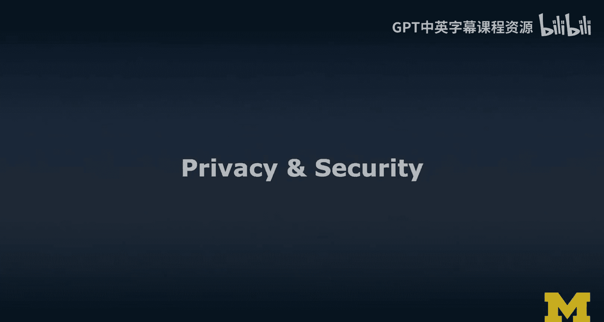
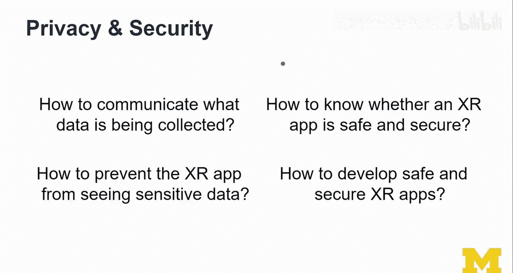
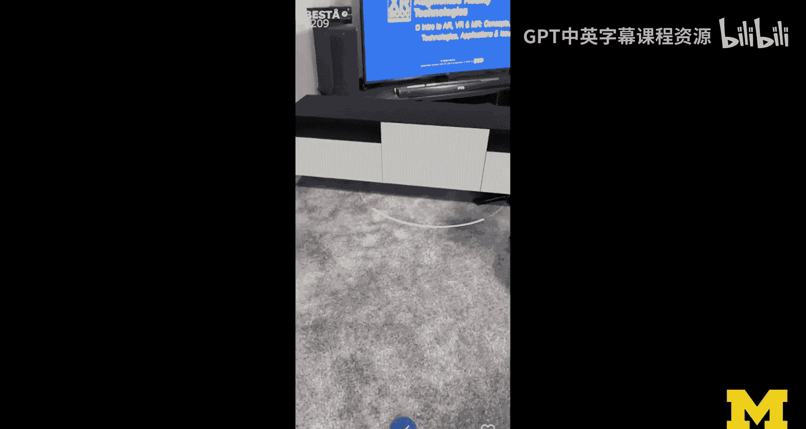
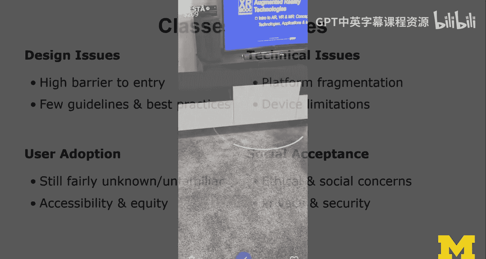
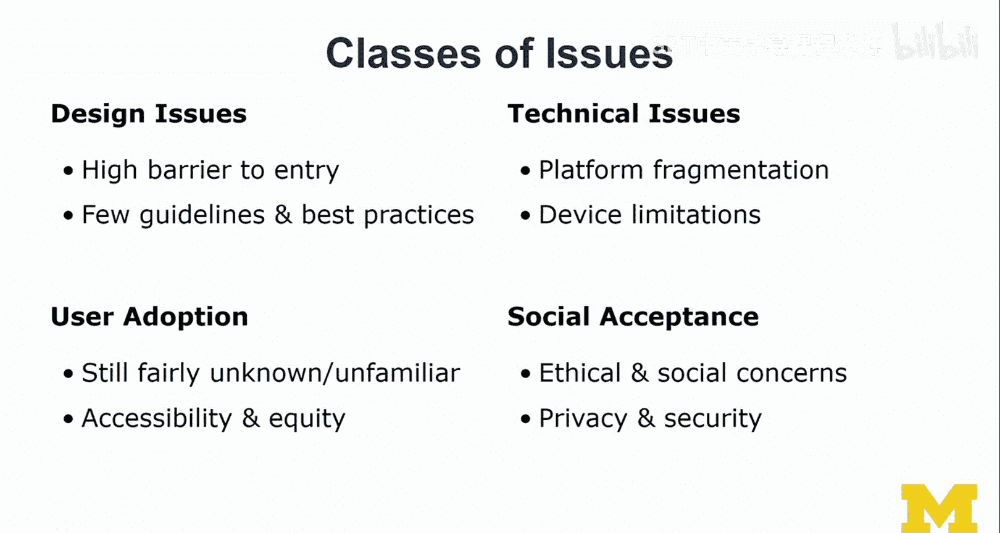

# 027：隐私与安全性 🔒

在本节课中，我们将探讨扩展现实（XR）领域一个至关重要的话题：隐私与安全性。我们将了解XR应用在收集和处理数据时可能带来的风险，并思考如何设计更安全、更尊重用户隐私的XR体验。

---

## 概述

随着XR技术日益融入我们的生活，它能够捕捉我们周围环境的丰富数据，这引发了关于隐私和数据安全的重大关切。本节将深入探讨XR开发者与设计师在创建应用时必须面对的几个核心隐私与安全问题。

---

## 核心问题探讨

上一节我们介绍了XR的广阔前景，本节中我们来看看其背后隐藏的隐私与安全挑战。主要问题集中在以下几个方面：

### 如何沟通数据收集内容

一个核心问题是：如何清晰地向用户传达正在收集哪些数据。目前常见的做法是提供冗长的服务条款和隐私政策，但用户很少仔细阅读。这是否是沟通的最佳方式？征求用户许可的频率应该是多少？是否存在标准化的交互界面，还是每个应用都需要自行设计？

Mozilla等组织在推动Web浏览器兼容XR时，正在深入思考如何与用户沟通、如何请求摄像头权限以及权限授予的时效性。然而，这些方式仍相对技术化。许多用户并不完全理解“需要访问您的摄像头”意味着什么——应用不仅能拍照，还能实时进行**三维场景重建**，甚至估算环境中所有物品的价值。因此，清晰地传达数据收集的范围和用途至关重要。

### 如何防止XR应用窥视敏感数据

当您佩戴头戴设备在空间中行走时，设备上的摄像头会看到您所见的一切，甚至更多（因为其视野可能比人眼更广）。如何防止应用看到敏感信息呢？

从设计角度思考，是否可以应用一些遮蔽技术？例如，在数据被任何应用获取之前，就对源数据进行模糊处理（如模糊人脸）。但这引出一个问题：如果人脸并非最敏感的数据呢？如果周围有重要文件或私人笔记，我们如何确保XR设备不会“看到”这些内容？最直接的方法可能是不在存在敏感信息的环境中使用XR设备。这凸显了问题的复杂性。

### 如何确保XR应用本身是安全的

这里存在一个假设性场景：利用“重定向行走”技术，攻击者可能远程入侵您的设备，误导您的感知，将您引向障碍物，造成物理伤害。这虽然是极端情况，但说明了建立安全防护措施、控制机制和伦理审查的必要性。

在学术研究中，新项目必须经过伦理审查委员会的评估，以确保参与者的安全与权益。我们或许应以同样的审慎态度来对待XR应用的开发。在后续关于设计伦理的课程中，我们将再次讨论这种方法。

### 如何开发安全可靠的XR应用

我们需要更多的知识和最佳实践来指导设计师和开发者。需要建立更完善的流程和工作规范。虽然现有的应用商店审核和用户评分机制有一定作用，但总有方法可以绕过这些限制（例如，通过类似 **`SideQuest`** 的工具直接安装未经官方商店审核的应用包）。这就像电影《侏罗纪公园》里的台词：“生命总会找到出路”，在这个领域，非官方的分发渠道也总是存在。因此，我们可能需要更官方、更标准化的安全认证方式。

---

## 一个实际案例

关于“如何沟通数据收集”和“防止窥视敏感数据”的问题，这里有一个IKEA Place应用的实际体验案例。

有趣的是，在不同平台上的体验差异很大：
*   在iPad上，需要经历完整的流程：同意所有条款、授予摄像头权限。
*   在支持ARCore的Android手机上，应用没有发出任何警告或请求许可就直接运行了。

一种体验可能过于繁琐（无人阅读所有条款），而另一种则完全忽略了用户的知情权，两者都引发了不同的思考。

---

## 总结与反思

本节课我们一起学习了XR领域中隐私与安全性的核心挑战。我们讨论了数据收集的透明沟通、敏感信息的防护、应用安全性的保障以及开发流程的规范化需求。

必须认识到，XR是一片既充满趣味又危险的领域。作为创造者，我们对用户负有重大责任，但我们常常缺乏足够的知识和经验。目前，该领域有很多爱好者和创新者，但尚未建立起足够的规范和成熟的工作流程来保证体验质量。

我们正在共同探索这个领域，需要从正面和负面的案例中学习。我们必须承认，并非当前所有的XR应用都是好榜样。由于并非每个人都有平等的机会尝试这些技术，因此需要时间才能分辨哪些应用是合理的，哪些可能正在探索错误的方向。这是一个持续学习和完善的过程。