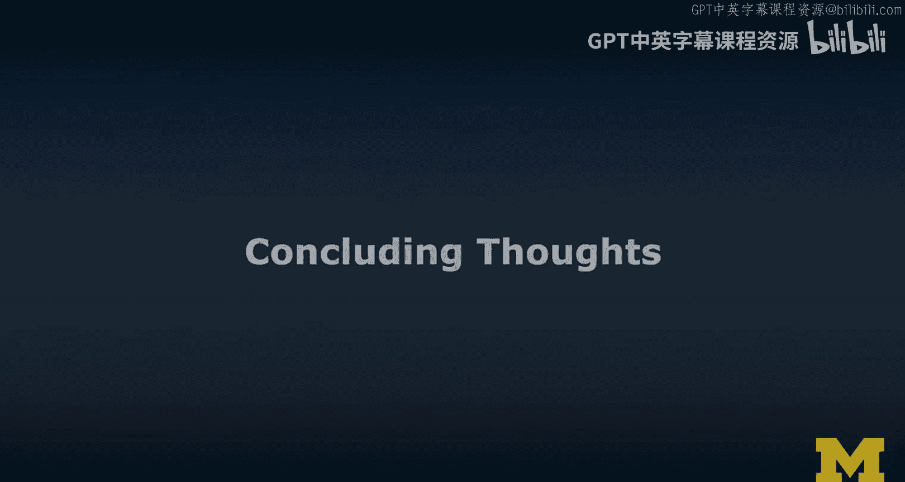
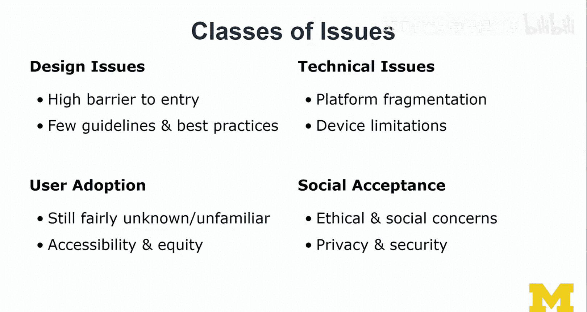
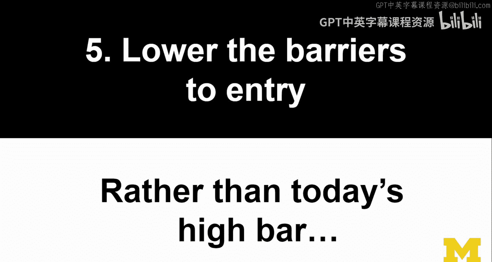
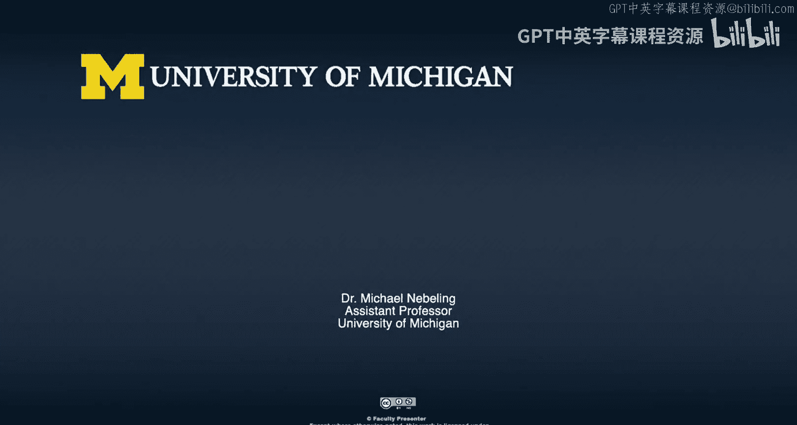
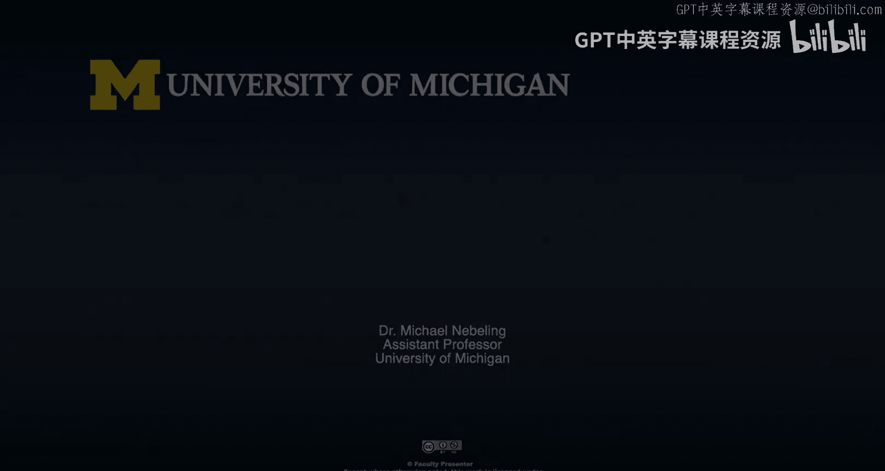

# 028：总结与展望 🎯

在本节课中，我们将对扩展现实（XR）领域当前面临的挑战进行总结，并探讨未来可能的发展方向。我们将重点关注如何从移动和网络平台的经验中学习，以及如何构建一个更具包容性、互联性和实用性的XR生态系统。

---

上一节我们讨论了XR领域存在的诸多问题。本节中，我们来看看讲师提出的几点未来发展的思考与建议。

**首先，应用移动与网络平台的经验教训。**
讲师指出，当前XR领域的一些问题，如平台割裂、标准不一，与早期移动和网络世界遇到的问题惊人地相似。与其重蹈覆辙，我们应该积极应用从那些平台发展中学到的经验。例如，`WebXR`标准的出现虽然稍晚，但正是为了避免各厂商构建封闭生态（如特定SDK）所导致的问题。这种割裂曾给设计师、开发者和最终用户带来巨大困扰。

**其次，构建互联的虚拟生态系统。**
目前，大多数AR/VR应用都存在于各自独立的小生态中，拥有自己的应用商店且互不兼容。例如，为Oculus Quest购买的应用无法在HTC Vive上运行。未来的方向是构建一个**共享的虚拟生态系统**，让XR设备能更好地与我们现有的其他设备（如电视、智能手机）集成，并融入更广泛的物联网（IoT）和边缘计算框架中。当然，这也会引发诸如数据所有权（**谁拥有映射的空间数据？**）、存储和处理等“AR云”相关的重大挑战。

**第三，设计工具需要更好的工作流整合。**
从设计角度看，许多XR创作工具试图建立自己封闭的工作流程。但设计师和开发者通常使用多种工具。理想的情况是，新工具应该思考如何融入现有的、更庞大的工作流（如Unity或Unreal引擎的生态），并确保良好的连接性和集成度，而不是期望用户完全改变其工作习惯。

以下是关于应用内容创作的一些具体建议：

*   **超越玩具示例**：目前许多XR应用只是用于展示某项新技术（如人物分割、实时3D重建）的“玩具”示例。虽然它们能激发灵感，但我们需要更深入地思考如何在实际的、关键的领域（如**医疗、危机模拟、护理、教育**）创造真正有价值的体验，并清晰地传达这些技术的实用价值。
*   **降低准入门槛与提升包容性**：为了让更多人能够使用并从XR技术中受益，我们必须努力降低其创作和使用的技术门槛。这与之前讨论的**可访问性**问题紧密相连。我们需要确保技术更具包容性，从而吸引关键用户群体，形成规模效应。这也意味着设计师和开发者肩负着更重大的责任。

---

本节课中，我们一起学习了如何从更宏观的视角审视XR的未来。我们探讨了借鉴历史经验、构建开放互联的生态系统、改进工具链整合、创造深层价值应用以及推动技术普及与包容的重要性。解决这些问题需要跨学科的大型团队协作，也需要业界和学术界投入更多精力进行负责任的、符合伦理的设计与开发。尽管前路充满挑战，但积极应对这些问题是推动XR技术健康、可持续发展的关键。