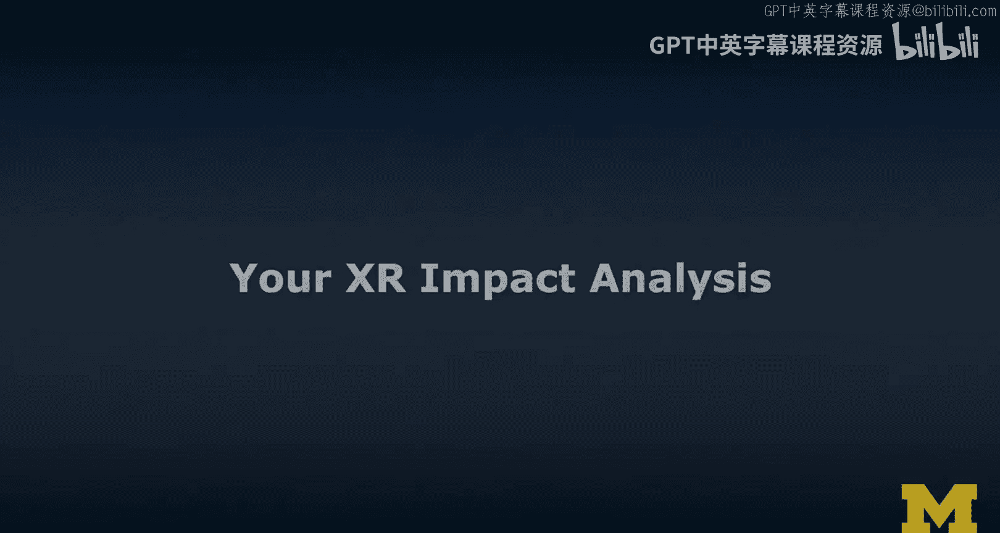
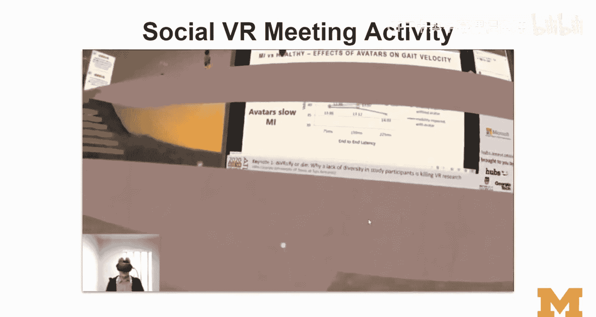
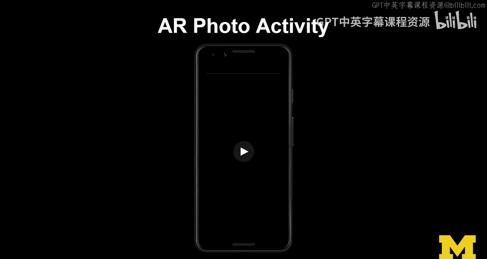
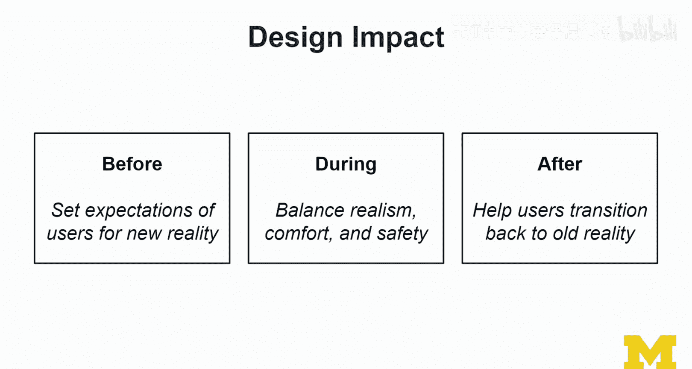
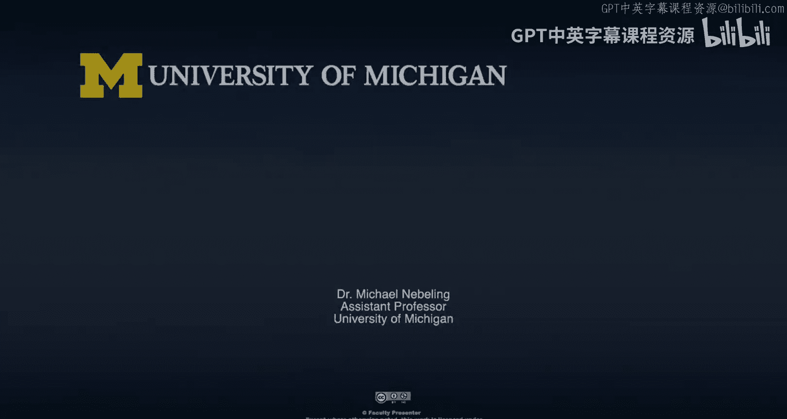

# 029：XR影响分析实践 🧠

在本节课中，我们将进行一项名为“XR影响分析”的实践活动。我们将通过具体的体验活动，来识别和反思XR技术可能带来的关键问题，例如社会伦理、可访问性与公平性、隐私与安全等。通过“出声思考”和撰写分析报告，我们将学习如何以活动为中心来发现问题，并初步思考解决方案。

---

## 概述

在前面的模块中，我们的练习主要集中于更好地理解XR技术本身。现在，随着课程进入最后部分，我们将开始思考如何塑造XR的未来。为了做到这一点，我们需要理解当前的趋势和问题。本节课的实践活动将引导我们反思一些关键议题。

我们将执行一项“XR影响分析”，聚焦于关键问题。你需要考虑所有主要的问题类别，选择你最感兴趣的议题，并通过完成一项建议的活动来进行深入思考。

---

## 关键问题类别（分析视角）

在开始活动前，我们首先需要明确分析的视角。以下是三个主要的问题类别，它们将作为你分析活动的“透镜”：

1.  **社会与伦理问题**：例如，XR体验如何影响社会互动、行为规范，或可能引发哪些伦理困境。
2.  **可访问性与公平性**：考虑不同用户（如残障人士、不同社会经济背景的人）能否平等地获得和使用XR体验。
3.  **隐私与安全**：关注XR应用如何收集、使用和保护用户数据，以及可能存在的安全风险。

你可以选择其中一个或多个视角来分析接下来的活动。

---

## 建议的活动

以下是三项设计好的活动，用于作为你进行分析的具体场景。请选择其中一项来完成。

### 活动一：社交VR会议体验

上一节我们介绍了分析的视角，本节中我们来看看具体的活动。第一项活动是体验社交虚拟现实（VR）会议。

*   **描述**：尝试加入一个社交VR平台（如VRChat, AltspaceVR等），参与一次虚拟会议或社交活动。观察并记录你的体验。
*   **示例**：就像讲师在2020年IEEE VR线上会议中的体验一样，尝试在虚拟空间中行走、与他人互动（如挥手、握手）。
*   **分析点**：在体验时，请从你选择的视角（如社会伦理、隐私安全）思考可能出现的问题。

### 活动二：物体识别活动

接下来，我们看看第二项活动，它涉及计算机视觉和增强现实（AR）技术。

*   **描述**：使用手机上的AR应用（如Google Lens、IKEA Place）扫描你环境中的一个物体，让应用识别它或将其虚拟放置到你的房间中。
*   **示例**：用IKEA Place应用扫描一把椅子，然后在你的客厅里预览虚拟家具的摆放效果。
*   **分析点**：思考这个过程背后的技术原理。例如，**`谁告诉了手机这是什么家具？它查询的是哪个数据库？`** 从隐私或公平性的角度，这可能会引发哪些担忧？

### 活动三：增强现实（AR）照片/滤镜活动

最后一项活动与面部识别和图像处理相关，在社交媒体中非常常见。

*   **描述**：使用一款带有AR滤镜的应用（如Snapchat、Instagram），拍摄一段使用面部特效滤镜的视频或照片。
*   **示例**：应用一个改变你外貌或添加虚拟元素的滤镜。
*   **分析点**：关注应用如何追踪你的面部，以及背景环境是否也被捕获。从隐私、安全或社会影响的角度分析这种体验。

---

## 活动执行与记录指南

现在，你已经了解了活动和视角，以下是执行和记录分析的具体步骤：

1.  **选择并声明议题**：首先，明确你将要重点关注哪一类或哪几类问题（社会伦理、可访问性与公平性、隐私与安全）。
2.  **执行活动并“出声思考”**：选择一项活动进行体验。在体验过程中，请“出声思考”——即大声说出你的即时想法、感受、疑虑或惊喜。例如：“这个功能很酷，但它会不会收集我的房间布局信息？” 这些想法是发现问题的重要线索。
3.  **撰写影响分析报告**：将你的主要思考和担忧整理成几段文字。报告应包含：
    *   你选择的活动和议题。
    *   你在体验中观察到的具体现象。
    *   从你选择的视角出发，分析这些现象可能带来的潜在影响或风险。
    *   初步的解决思路或缓解担忧的建议。
4.  **（可选）变换视角或活动**：为了更全面的分析，你可以尝试用不同的视角再次分析同一活动，或者选择另一项活动并用相同视角进行分析，然后将新发现补充到你的分析报告中。

---

## 设计的全局考量：体验前、中、后

在进行影响分析时，除了体验本身，还应从一个设计者的角度，考虑整个用户体验周期：

*   **体验前（引导）**：如何为用户设置合理的期望？例如，通过教程、示例预览或明确的警告来引导用户，为“新现实”做好准备。
*   **体验中（平衡）**：如何在追求体验的“炫酷”与真实感的同时，坚决保障用户的**舒适度与安全性**？思考你体验的活动是否在这两者间取得了平衡。
*   **体验后（过渡）**：如何帮助用户平稳地从XR体验过渡回现实？例如，提供“离场”简报或过渡期支持，这对于长时间沉浸式体验（尤其是对儿童）尤为重要。

---

## 本次练习的预期收获

我们进行这项练习，希望你能获得以下收获：

*   掌握一种**以活动为中心**的方法来发现XR技术中的潜在问题和担忧。
*   能够基于具体实例，而不仅仅是泛泛而谈，来展开关于议题的讨论。
*   开始初步构思如何**解决这些问题和缓解相关担忧**，从而培养你的设计思维。
*   促进**符合伦理和负责任的设计**理念。在后续更偏重技术开发的课程中，我们很容易忙于实现功能而忽略这些方面，因此现在建立这种意识至关重要。

---

## 安全与分享提示

XR领域发展迅速，请注意以下事项：

*   **安全第一**：请谨慎选择体验平台和内容。社交VR平台可能存在骚扰等风险。本次推荐的活动应相对安全，但请保持警惕。
*   **互相帮助**：这是一个快速发展的领域，如果你发现了新的、有价值的（或需要警惕的）应用或体验，请在课程社区中与大家分享和讨论。
*   **积极反思**：你的体验不必是极端负面的才能进行有价值的反思。即使是愉快的体验，也值得从不同视角进行批判性思考。

---

## 总结

在本节课中，我们一起学习了如何进行“XR影响分析”。我们明确了社会伦理、可访问性与公平性、隐私安全这三大分析视角，并提供了社交VR、物体识别和AR滤镜三项具体活动作为分析场景。通过“出声思考”和撰写报告，我们实践了如何从具体体验中发现问题，并初步思考设计解决方案。

这标志着本课程第一个核心轨道的结束，但仅仅是XR学习之旅的开始。请考虑继续学习后续关于XR设计和开发的课程，在那里我们将把这些批判性思维应用到实际创作中。下周，我们将更多地讨论XR战略，并有一些精彩的专家和学生小组讨论，期待与你再见！