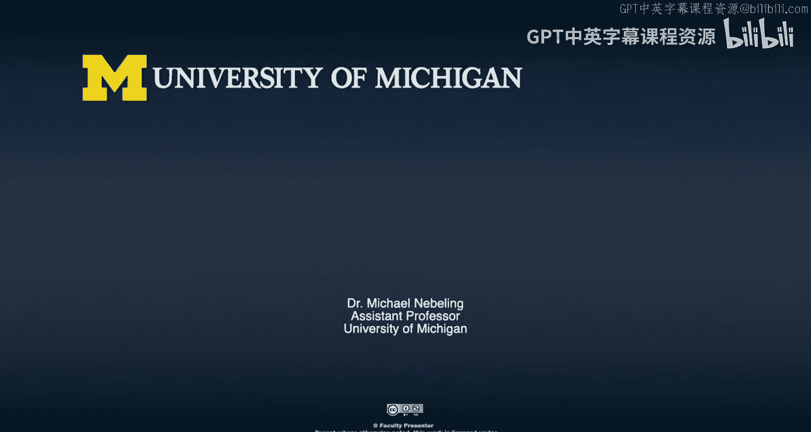

# 031：规模化实施路径

在本节课中，我们将与密歇根大学的几位专家一起探讨扩展现实（XR）技术在大学层面的规模化实施策略。我们将了解当前正在进行的项目、面临的挑战以及如何通过不同的方法和合作来推动XR技术的广泛应用。

---

大家好，我期待与几位受邀专家、教职员工、管理人员以及密歇根大学的相关人员进行讨论。密歇根大学目前正在大力投入XR领域，在本节中，我将剖析这对在大学不同层级工作的人员意味着什么。

我将围绕两个主要主题来组织这次讨论。第一个主题是关于当前现状，即我们现在正在做什么，目前有哪些类型的倡议正在进行。

现在，我想先简要介绍一下今天参与讨论的各位。

好的，让我们开始吧。请各位介绍一下自己以及在密歇根大学的工作。

我的名字是米歇尔·拉伯斯特，我是护理学院的临床教授，同时也在信息学院任职。我很高兴今天能来到这里，我的大部分学术工作都集中在基于模拟的教育领域，包括许多XR方面的工作。

我是乔安娜·默基·马林奇，我是工程学院本科教育的副院长，同时也是材料科学与工程系的教授。我的角色一方面是进行XR研究，我们实验室致力于利用XR教授材料科学概念；另一方面，作为副院长，我也负责开发方法和技术设施，帮助教师们能够应用这类技术于他们自己的课堂。

我的名字是丹·费斯·海安，我是北校区德特中心一个中心的副主任，领导新兴技术小组。我也是工程学院IT部门（KaAN）的成员。我的角色是帮助推动技术发展，我们参与XR领域已有很长时间。我的团队开发空间，并且我们实际上有一个开发人员团队，为校园内的不同用途构建应用程序。

我的名字是杰里米·尼尔森，我是密歇根大学XR计划的主任。我们肩负着三大目标：为我们的19个学院和安阿伯校区的住宿课程带来用于教学和学习的XR技术；将这些技术引入我们快速发展的在线课程；以及创建创新的公私合作伙伴关系。

这太棒了，今天有这么好的参与者阵容，我们可以从中学到很多东西。

因此，我想首先围绕“规模化”来组织这次讨论。当谈到XR时，我们通常从小规模开始，但在大学层面，我们确实希望快速扩大规模。我想向各位学习，这在你们的每个项目中意味着什么，以及当我们扩展到整个大学时，这又意味着什么。

米歇尔，我想从你开始，了解你的一些XR项目和倡议，以及你如何处理那里的规模化问题，无论是涉及多少学生还是多少科目。请告诉我们一些关于项目、参与者、技术以及你如何处理规模化的信息。

规模化问题在考虑XR技术时确实非常重要，有时我认为这也可能驱动你所选择使用的技术类型。

我目前正在进行的两个项目，它们的规模略有不同。我最初启动的第一个项目是一个虚拟现实程序，重点是帮助执业护士、医生和药剂师学习团队合作与沟通。这个环境是一个儿科急诊室，它将支持多人在线协作，小团队将使用Oculus或HTC等高阶设备聚集在一起练习技能、沟通和团队合作。虽然我们希望许多团队参与这个项目，但其规模将受到我们拥有的高端设备（如Rift和Vive）数量以及能够聚集人员的能力的限制。因此，我将这个项目视为较小规模。

我们参与的另一个项目，刚刚通过AI获得资助，我们将与合作伙伴共同进行。这个项目旨在帮助护士和药剂师理解化疗药物在静脉注射时，如果出现问题，这些强效的危险药物泄漏到血管或端口外，对皮肤和内部组织造成的破坏性影响。虽然我们可以解释并展示其破坏性，但人们无法真正看到体内发生的情况，所以我们称这个项目为“皮肤之下”。我们希望大规模推广这个项目，希望能让60名参与我们研讨会的人员、100名护理研究生以及药剂师使用。为此，我们选择了Oculus Go，因为我们可以获得许多头显并广泛分发。所以对我们来说，有时是需求驱动，然后决定使用何种复杂程度的设备。

这很棒，也呼应了我的一个观察：大规模通常意味着低技术含量，因为这是在预算限制下实现规模化的一种方式。这种“最低共同标准”方法是一种途径。

乔安娜，现在我们来谈谈学院层面，特别是密歇根大学的工程学院。我知道你们正在进行的一项倡议是AVMR诊所，我想了解你如何在该层面处理规模化问题。

这是个很好的问题。正如之前听到的，你可以采用不同类型的技术，比如Rift或Oculus Go等。我们早期的一个想法是使用移动设备进行增强现实，这是我作为个体研究者最初开始的工作。当我担任副院长职位后，我开始意识到，当进入不同类型的课堂和情境时，学生需要理解如何与混合现实本身互动，而我们目前还没有很好的方法来实现这一点。还没有一个规范的情境，就像在演讲厅里，人们知道要面对前方的屏幕或黑板听讲座，那是规范的情境。但对于XR类应用，目前还没有规范的情境。我认为我自己无法找出最佳的规范情境，相反，我们需要让许多不同的人在这些空间中尝试，以找出最佳的规范情境。因此，我们的方法是尽可能让更多人接触这些工具，让不同的教师思考在他们的情境中什么是有意义的。通过进行大量小规模实验，并真正降低在课堂中采用这些技术的门槛，我认为我们将能够达到一个使XR学习有意义的情境。所以，我们的方法不是让一个人思考在特定情境下的最佳方式，而是降低门槛，让人们与像丹·费斯·海安小组中的开发人员合作，与了解教学法和教育研究的博士生合作，共同理解在不同情境下部署这类技术的最佳方式。这既相似又不同，我们试图让技术尽可能多地掌握在人们手中，这就是我们处理规模化的方式。

谢谢你，乔安娜。我知道你们一直在做的一件可能看似微小但意义重大的事情是举办一系列研讨会，将那些想学习如何实际教授或如何实际使用AVMR或XR技术的人们聚集在一起。我想知道，从与想学习XR的教师和学生举办研讨会中，你学到了什么？

我学到的是我们还有太多东西需要学习。真正让我印象深刻的是，这是一个如此广阔的开放空间，没有人真正有答案。外面有很多不同的想法，也有很多相互矛盾的研究发现，没有单一的方法。这意味着我们需要更多的人进入这个领域，需要更多的人生成更多的数据和经验，我们需要彼此之间更多的互动，以找出最佳和最差的方式，这样我们就可以摒弃那些似乎效果不佳的东西，转而开始进行对学生真正有影响力的不同类型的工作。

现在，杰里米，在某种程度上，你可能拥有密歇根大学的全景视角。你与我们共事已有一段时间，我知道你的第一步实际上是接触并和很多人交谈。所以，你首先面临的一个大问题似乎是：密歇根大学目前的XR工作规模到底有多大？然后我们如何可能扩展和加速它？你能告诉我们一些关于你的步骤、第一步以及你如何理解密歇根大学XR工作规模的信息吗？

是的，谢谢。我首先真正想了解的是那些专业领域在哪里，谁在构建这个空间，谁在使用这些技术进行教学。我认为今天在座的各位正在引领这个领域。我确实尝试与尽可能多的教职员工、学生以及这个领域的其他非学术单位会面，以真正了解技术构建者在哪里，消费者是谁，他们想探索什么，我们拥有什么类型的设备。这真的是为了尝试建立那种社区感，同时也与那些甚至还没有开始考虑的学院的教师会面，以帮助他们了解他们在采用阶段或思考步骤中处于什么位置，然后与他们分享我们在其他地方看到的情况，以帮助建立那种兴奋感和兴趣。显然，密歇根大学的工作并非始于XR计划，多年来一直有很多工作在进行，我真正尝试的是将这些工作整合起来，看看哪里有我们可以支持的关键群体。

我正在思考一些方法，比如创建框架、流程或工具集，以帮助实现规模化，使教师能够开始将他们的资产或概念带到平台或他们可以带入课堂的技术上。特别是在360度视频方面可以做很多工作，我们正在探索一些平台，你可以在其中使用传统视频方法并插入数字元素和数字交互，以扩大该阶段的开发。此外，我们还启动了一个种子基金来刺激创新和第一轮项目。我们刚刚宣布了六个正在进行的项目，米歇尔的项目是其中之一。我们将帮助核工程专业构建一个虚拟核反应堆，与音乐、戏剧和舞蹈学院的人员合作创建沉浸式音频工具包，与物理系合作创建物理实验室。这些都是非常令人兴奋的项目，旨在让学生开始使用并建立在乔安娜所说的让更多经验掌握在教师和学生手中的基础上，这样我们才能继续学习。

好的，这很棒。谢谢分享。现在，丹，你一直耐心地和我们坐在一起，我知道你也是在这个领域活跃了很长时间的人。

我想直接具体地问你一个问题：我知道你已经运行XR实践社区有一段时间了。所以我想从“规模化”过渡到“方法”，我想了解更多关于我们如何实施这种规模化，其他人如何从我们正在做的事情中学习，以及其他人如何可能改进我们正在做的事情。这个XR实践社区，我想知道，在你想聚集谁、你从外部引入了谁以及你如何描述在该实践社区中正在进行的交流和学习的想法方面，最初的构想是什么？

我启动这个实践社区的目标是，正如我们所熟悉的，密歇根大学是一个庞大而多样化的机构，鼓励人们进行本地化思考和发展想法，但在很多方面，我们在很多地方确实存在大量的重复工作。这个想法是，我们长期以来一直在进行评估，并且被视为在XR开发方面处于领导地位。我想开放一个平台，让我们能够分享我们正在做的所有工作、我们已经完成的所有工作，但同时也要邀请那些在他们的实验室和课堂使用中做着出色工作的其他人，分享他们的知识、发展方向以及未来两三年可能做的事情，这样我们就可以将社区聚集起来，构建一个每个人都可以利用的脚手架，而不是建立许多孤岛，重复发明轮子。

这就是概念。看到它的发展真是太好了。我们刚刚将其开放，我们有教师参加这些会议，有学生参加，有在实验室工作支持教师工作的员工参加。通常我们为他们提供一个平台来展示他们的想法，并且我们有意设计让会议可以在校园内轮流举行，这样我们就可以去你的实验室、你的空间、你的环境，分享你正在研究和实验的内容。这对我们来说是一个很好的方式，有时通过电子邮件组产生交流，人们会问“你见过这个吗？”。看到它随着时间的推移而发展真是太好了，这就是最初的意图，我认为它一直在发展以满足这些需求。

是的，这很棒。我也知道我们经常收到外部的请求，人们希望进来展示一些技术，我认为这是向很多人传播知识的一个非常好的方式。

我想问你一个关于方法的更具体的问题。这是一个相当困难的问题，但我想丹你是回答这个问题的最佳人选。在你管理团队、从事各种XR项目的能力范围内，你已经工作了一段时间。

我知道当你问我这个问题时，我会告诉你每个项目都是具体的，需要量身定制的策略和特定的方法。现在我的问题是：当你反思这项工作时，你认为在接手一个新的XR项目时，是否有共同的方法？是否有你寻找的一些共同指标或关键组成部分？还是每个项目都如此不同，以至于没有共同的策略？

这在一定程度上也触及了你关于规模化的问题。我总是回到德特中心的使命，这是我试图推动我们身份认同的核心：我们应该处在一个实验和思考事物发展方向的空间，而不是事物当前所在的位置。在很多方面，我们应该像福奇博士引用格雷茨基的话那样：我们应该去冰球将要去的地方，而不是冰球现在所在的地方。这驱动了我们所做的很多事情。

我们使用一些标准来评估收到的项目，因为我们没有能力承担所有希望我们承担的项目。一些关键标准包括：这个项目是否会探索我们尚未尝试或校园内其他人未见过的技术的独特用途，从而能够开启对话？例如，如果我们与护理学院的米歇尔合作，但我们看到这个想法实际上可以应用于许多其他学科，那么我们就会承担这个项目，比如米歇尔的VR心脏项目，它是关于一群人查看特定患者以及他们如何相互沟通的协作工作环境。这种工具在许多学科中都有应用。当我们承担它时，我们会思考如何构建这种协作VR环境，然后我们学到的知识实际上将帮助我们应用于其他学科。所以这些是关键点，意味着如果我们开发这个，它不仅仅是一次性的东西，它实际上有潜力在其他领域发展。

我只是想呼应你刚才所说的。例如，当我们进行诊所项目时，我们选择支持的提案也是基于类似的标准：这个项目是否会从使用XR中受益，还是使用其他技术同样容易，而XR并非关键？其次，它如何能移植到其他情境？因为在这个阶段，最重要的是确保我们以尽可能广泛适用的方式开发这些工具，而不是仅仅创建一个很酷但只适用于一个特定且非常有限情境的应用程序。

工程学院诊所资助的一个项目是如何将360度视频与交互性整合到VR环境中。乔安娜资助了我们的努力，让我们能够说：好的，我们有一个工具包可以做很多很酷的事情，但我们从未真正有机会实现交互式360度内容。我们开发了它，因为我们认为360度视频将是那些低垂的果实之一，人们将能够说：我有一些内容，我有一些相机拍摄的素材，我想把它带入VR环境，我该如何使用它？构建这个平台将允许我们将其扩展到更大的用例中。另一个标准是基于我们的能力，比如我们有一些独特的资源：动作捕捉设备、摄影测量设备等，这些在许多其他地方并不具备。所以，如果一个项目找到我们说，比如一个电影制作课程想使用动作捕捉来捕捉演员表演的场景并嵌入到VR环境中，那么没有其他地方能做到这一点，因为很多地方没有Vicon动作捕捉设备。这些因素驱动了我们承担的许多项目。最终，能力和我们是否拥有实际执行计划的专业知识也是考虑因素。这些是我们与教师和研究人员接触时，思考他们是否可能通过XR寻求潜在途径的大致概述。

好的，这很棒。这也突显了我们团队之间以及我们所在位置的一些协同效应。我认为我们甚至有更多的故事可以分享。

我认为我们在这一部分很好地讨论了规模化问题，观察到规模化最终意味着（至少在这个阶段）可能做出低技术含量的选择，并确保我们能够触达更多人。我们讨论了方法以及如何定义什么是一个有趣的项目。有时对于刚开始接触XR的人来说可能会感到失望，认为“我的应用程序很有趣，不是吗？”。作为研究人员、管理者或院长，在资助项目时所做的选择，我认为这些都是宝贵的见解，我希望与我们的学习者分享。

谢谢大家参与我们讨论的第一部分。