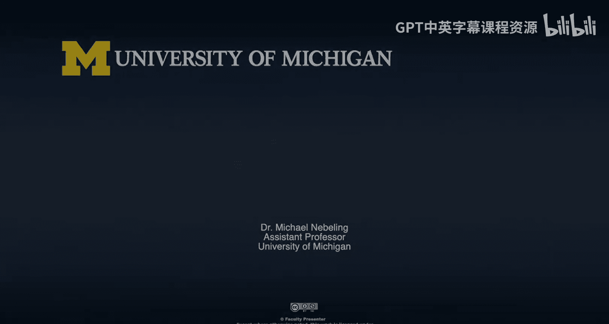

# 032：成功要素分析

在本节课中，我们将与密歇根大学的特邀专家们继续讨论，聚焦于如何定义和衡量XR项目的成功，并一同展望未来的发展方向。

上一节我们探讨了XR项目的应用场景，本节中我们来看看如何评估这些项目的成效。

## 定义项目成功

首先，我们向米歇尔提问：对于您之前描述的具体项目或其他正在进行的项目，您是如何定义其成功的？无论是在研究层面还是与教学结合方面，是否有具体的衡量指标或目标来展示成功？

这是一个很好的问题。审视整个“成功”的概念以及如何判断XR项目是否成功，我尝试从一些基础层面入手。每个项目都是独特的，其目标也各不相同。

以下是我考虑的几个方面：
*   **学习成果**：明确项目试图实现的目标。例如，在我们的心脏VR项目中，最重要的目标是让学习者有机会练习沟通技巧和团队合作技能。
*   **次要目标**：例如，练习儿科高级生命支持算法。我们明确该项目不涉及任何基于任务的学习（如练习心肺复苏技能），这指导了我们的开发方向。
*   **衡量方法**：评估成功的方式包括，学习者的沟通技巧是否得到展示并随着多次练习而改善；是否能在临床环境中观察到技能迁移（尽管这很难测量）；以及通过问卷调查了解学习者是否感觉更有信心。
*   **研究问题**：有时研究问题与教育问题是一致的。XR在“观点采择”方面非常有效。例如，我们有一个项目旨在帮助医疗保健提供者理解听障人士就诊时的体验，目标是增进理解而非直接教授具体技能。

关键在于审视你想要实现什么，然后匹配相应的技术。对我们而言，360度视频足以实现“观点采择”的目标，无需创建更昂贵的虚拟现实动画环境。

## 衡量成功的标准

接下来，我们询问乔安娜：在您决定为项目提供资金的角色中，是否有具体的标准来衡量项目成功？

确定项目是否成功，我主要从两个层面思考：
*   **项目特定标准**：每个项目都应有某种机制来衡量其是否实现了既定目标。
*   **技术迁移**：该技术是否被移植到另一个应用场景中，这对我而言是最终的成功标志。例如，如果米歇尔的360度视频应用场景或从中获得的经验，能被应用到另一门关于以消费者为中心或社会赋能设计的课程中，那将是巨大的成功。

目前我们尚未达到这种程度的成功，因为项目仍处于早期阶段，我们仍在根据各自的标准评估单个项目的成功。

## 从“失败”中学习

丹分享了一个研究案例，其中包含了反直觉的发现，这引发了更深层次的思考。

我们的研究旨在帮助学生理解材料科学中的重要概念——晶体结构，这需要空间推理能力。我们假设使用虚拟或混合现实来呈现晶体结构，能帮助学生更好地发展空间理解能力。

实验进行了两年，我们确实观察到，在特定任务中使用VR操纵物体的学生，在该任务上表现更好。然而，当我们进行前测和后测以检验这些增益是否保持时，发现使用VR的学生并未保留优势，反而未使用VR的学生在后测中表现更好。

这个反直觉的发现提出了许多引人入胜的问题：这种心理操纵是否反而固化了学习？我们如何改变实验或学习活动以避免增益流失？这虽然是个别案例的“失败”，但长远来看将产生更积极的连锁反应，推动我们更深入地理解XR如何有效促进学习。

## 未来发展与扩展能力

我们讨论了当前面临的一个问题：与规模扩展相关。现有的学生导向XR空间（如Duderstadt中心）容量已接近饱和。那么，我们如何提升能力，在未来进行更多更好的XR实践？

丹解释了可视化工作室的建设思路：其初衷是创建一个能支持多学科、展示XR潜力的环境，而非专注于特定学科。这个模型可以作为蓝图，供校园内其他学院和部门根据自身特定需求进行演化和发展。短期策略是增加工作站数量以缓解压力，但长期战略是推动其他单位规划并建设他们自己的XR支持空间。

杰里米补充道，可以在丹的蓝图基础上，在校园其他部分（如中校区）建设更多空间，包括大型协作空间和小型迭代空间。此外，随着Oculus Quest等更实惠、易用的设备出现，以及大多数学习者已拥有具备AR功能的智能手机，我们应思考如何利用现有设备扩大规模。同时，必须考虑设备维护、安全、更新和内容分发等挑战。

丹提出了另一个策略：利用校园内数百台分布的工作站，提供专门的XR设备外借服务。学生可以借阅头显，在任意实验室即插即用（尤其利用Inside-Out追踪技术），或使用他们自己的高性能笔记本电脑，这能极大地扩展参与范围。

乔安娜最后强调，当前投资硬件不仅是为了硬件本身，更是为了开发内容、理解XR的最佳应用场景、并解决安全性和可访问性等问题。当XR未来普及时，我们才能知道如何以最佳方式部署它。

本节课中，我们一起学习了如何从学习成果和技术迁移等角度定义XR项目的成功，认识到从“失败”中汲取教训的重要性，并探讨了通过建设多元空间、利用普及设备和建立外借服务等策略，来扩展XR能力、面向未来发展的多种途径。