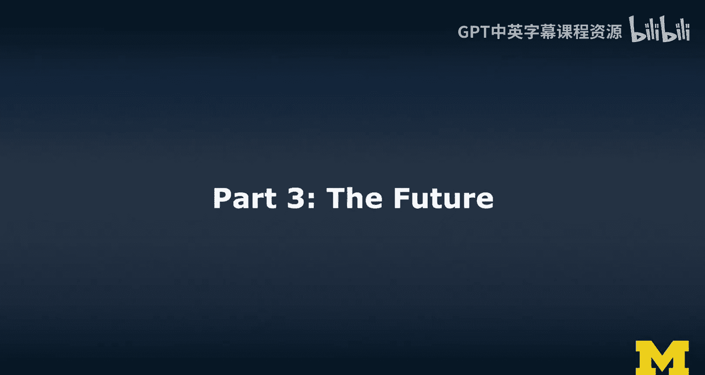
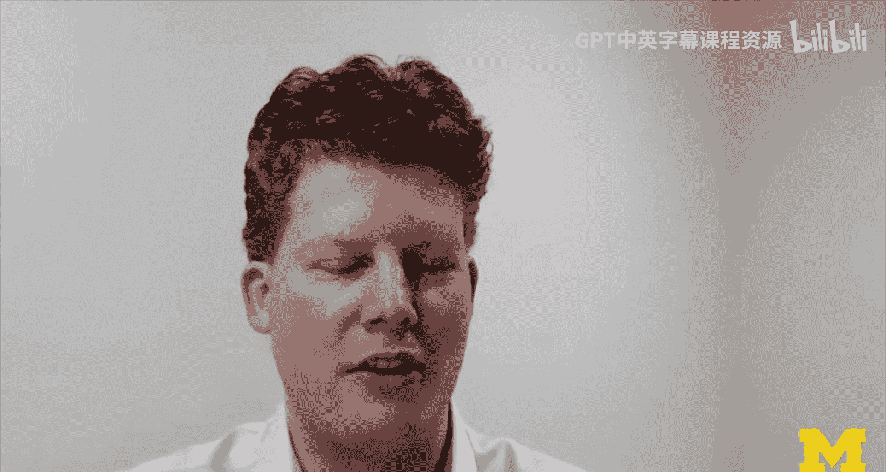
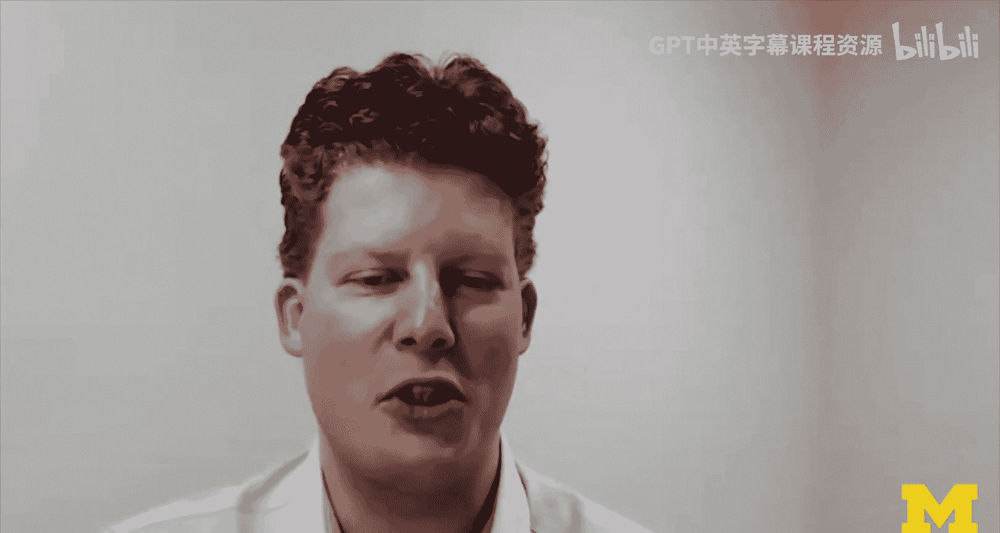
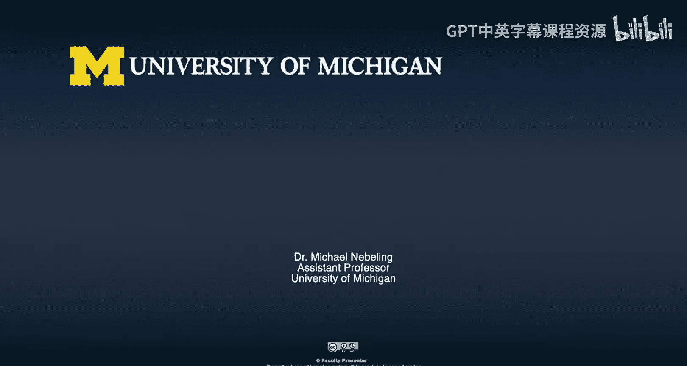

# 033：未来发展方向 🚀

在本节课中，我们将探讨扩展现实（XR）技术的未来愿景与发展方向。几位来自密歇根大学的专家将分享他们对未来5到10年内XR技术如何塑造社会、教育、医疗等领域的预测与期望。

---

## 当前努力与未来展望

上一节我们了解了密歇根大学在XR领域的当前努力。本节中，我们来看看几位专家对未来的共同展望。大家一致认为XR技术将继续存在并变得更加普及。

---

## 医疗保健领域的愿景 🏥

首先，我们来听听米歇尔（Michelle）对XR在医疗保健领域未来的设想。她认为XR技术，特别是虚拟现实（VR）和增强现实（AR），将在医疗培训和实践中扮演关键角色。

*   **即时培训工具包**：她希望开发一个“即时培训”工具包。这不仅适用于在校学生，让他们能在校外为能力评估做准备，也适用于一线医护人员。
*   **技能演练**：当医护人员需要执行一项生疏的操作时，他们可以随时进入虚拟环境进行“演练”。这比观看视频或阅读资料更有效。
*   **提升患者安全**：XR技术被视为模拟训练的高级演进，能帮助从业者（无论是学生还是前线人员）提供更有效、更安全的患者护理。
*   **课堂应用**：她设想未来课堂上，每个学生都能通过笔记本电脑和头戴设备（如Oculus Go），实时查看和交互学习内容，例如解剖结构或心力衰竭的虚拟案例研究。

米歇尔相信，这些并非不切实际的愿望，而是即将实现的未来。

---

## 思维范式的变革 💡

接下来，乔安娜（Joanna）从更宏观的认知层面分享了她的看法。她预测XR将催生全新的思维方式。

*   **类比智能手机**：她将XR的未来影响力类比于智能手机。十年前我们无法想象没有智能手机的生活，未来XR也可能变得同样不可或缺。
*   **三维知识组织**：当前的知识组织方式（书籍、屏幕）本质上是二维的。XR允许我们从三维空间直接构思、草图和呈现信息，无需将三维现实投影到二维平面。
*   **降低学科门槛**：科学、技术、工程和数学（STEM）领域通常需要抽象的思维方式。XR允许直接操纵物理空间，这可能降低这些领域的入门门槛，向更多人开放。
*   **与微积分类比**：微积分提供了用严谨的一维方程（代码）描述多维空间的方法。公式 `f'(x)` 表示变化率，`∫f(x)dx` 表示面积。而XR可能让我们无需经过这个“多维转一维”的认知转换步骤，直接在多维空间中工作。

乔安娜对XR开启全新物理世界认知方式的前景感到非常兴奋。

---

## 技术融合与伦理挑战 ⚖️

然后，另一位专家（根据上下文推测为Dr. Mahajan或其他参与者）从技术融合和社会影响角度进行了补充。

*   **技术加速**：增强现实（AR）和XR整体将在未来5到8年改变许多事情的运作方式。这与人工智能（AI）和机器学习的加速发展密切相关。
*   **硬件普及**：随着视觉系统日益复杂，搭载激光雷达（LiDAR）等传感器的设备（如新iPad、iPhone）将更加普及，软件也会更精密。
*   **远程医疗变革**：这些工具将改变远程医疗的方式，例如远程指导外科手术。
*   **同理心机器**：VR可以成为强大的“同理心机器”，让人亲身体验他人的处境（例如，通过项目让学生体验《汤姆叔叔的小屋》中角色的逃亡经历）。
*   **隐私问题凸显**：随着设备配备众多传感器并收集海量信息，隐私问题将变得空前重要。机构和个人都必须密切关注数据如何被使用和共享。

他提醒，在享受XR带来的便利时，必须高度重视随之而来的数据与隐私挑战。

---

## 硬件演进与共创未来 👓

最后，杰里米（Jeremy）对硬件发展和XR的社会角色做出了预测。

*   **硬件加速与普及**：计算设备的普及和硬件的发展，将使我们最终拥有能够改造世界、将人们联系在一起的智能眼镜。
*   **临场感重塑**：虚拟或增强的“临场感”将改变交流方式，不再局限于面对屏幕。
*   **AR与VR的分化**：增强现实（AR）可能会更普遍地渗透到世界各地，而虚拟现实（VR）则会在模拟、培训等特定用例上更加精炼。
*   **大学的角色**：大学等机构的作用是帮助厘清XR的最佳应用场景，并教导学生如何在这个空间学习和成为“共同创造者”。
*   **共创时代**：就像社交媒体一样，学生和大众将成为XR内容的共同创造者，工具将变得更加可用，供人们在此基础上进行建设和增强。

杰里米认为，现在是帮助塑造这个未来的激动人心的时刻。

---

## 总结与反思

本节课中，我们一起学习了多位专家对XR技术未来的展望。大家普遍对XR持积极态度，认为它不会消失，反而会变得普及、廉价且易于获取，甚至可能增强部分人的能力。

讨论中也提出了重要警示：我们在二维矩形界面设计上刚刚变得成熟，现在必须从头开始学习为三维空间设计。我们日常生活在三维空间中的知识和技能并不能直接转化为良好的设计，我们需要新的、更好的设计指南。

总的来说，XR的未来潜力巨大，但也伴随着隐私、伦理和设计等需要认真对待的新议题。感谢专家们分享他们的知识与见解，也期待与学习社区的各位一起，继续探讨大家对XR未来的疑问、担忧、梦想与愿望。