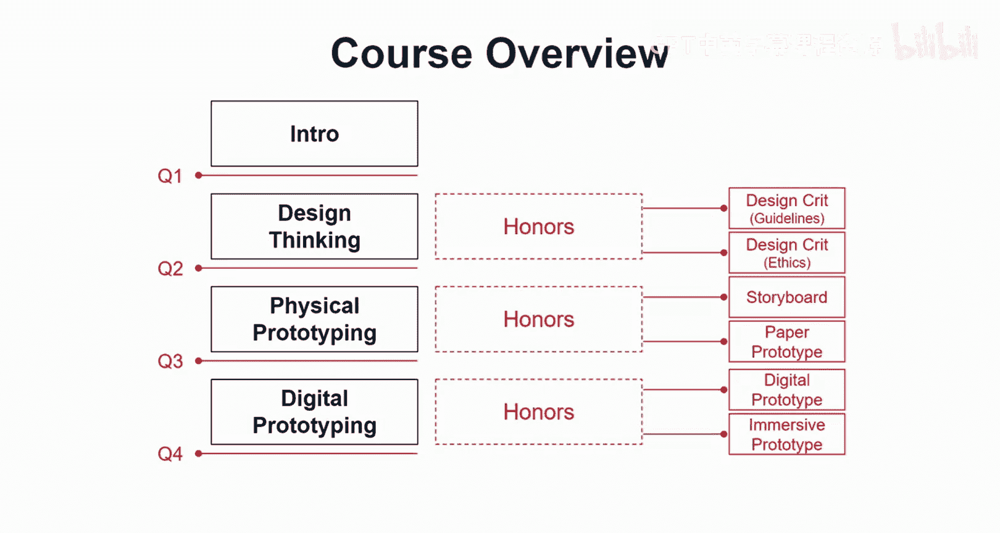
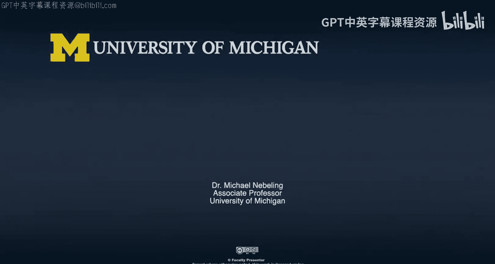

# 038：课程概述 🚀

在本课程中，我们将学习如何将传统的用户体验与交互设计原则、方法和工具，过渡并应用到扩展现实（XR）领域。XR包括增强现实（AR）、虚拟现实（VR）和混合现实（MR）。我们将探讨设计思维、物理与数字原型制作等核心主题，帮助你掌握为XR环境设计有效体验的技能。

## 课程结构与目标

上一段我们介绍了课程的整体方向，本节中我们来看看课程的具体安排和学习目标。

本课程的结构分为四个主要模块。

以下是各模块的简要介绍：
*   **模块一：引言**：我们将讨论进行XR设计涉及的内容、如何找到你的设计流程，以及如何真正开始。
*   **模块二：设计思维**：我们将探讨源自斯坦福设计学院的六步设计思维方法，并研究如何将其应用于XR设计，应对XR特有的挑战。
*   **模块三：物理原型制作**：我们将学习使用纸张、透明胶片、纸板等物理材料进行原型制作，这是一种有趣且有效的方式，可以在投入编码前深入思考用户体验。
*   **模块四：数字原型制作**：我们将探索使用数字工具进行原型设计，包括传统的桌面二维设计，以及直接在头戴设备中进行“沉浸式原型制作”的新方法。

在每个模块结束后，都会有测验来评估你的学习成果。

## 实践内容与价值

上一节我们概述了理论模块，本节中我们来看看配套的实践练习及其重要性。

除了课程视频和测验，选择“荣誉课程”路径的学员还可以访问额外的实践活动。

以下是三项核心实践练习：
*   **设计思维练习**：这是一个分为两部分的练习，重点在于设计批判。首先基于设计准则对现有界面进行批判，然后更深入地探讨伦理问题。
*   **物理原型制作练习**：从故事板和线框图出发，进行纸质原型制作。这是一个发挥创意、探索XR体验的绝佳方式，能帮助你在真正开始编码前，与利益相关者一起走查和验证设计思路。
*   **数字原型制作练习**：我们将制作两种数字原型。一种是使用桌面工具设计并可在AR/VR设备上预览的原型；另一种是直接在沉浸式环境中进行的“沉浸式原型制作”，允许你在3D空间中直接草图绘制。

这些技巧并非相互替代，而是互为补充。通过故事板、纸质原型、数字原型乃至沉浸式原型的逐步推进，你将在每一步中更深入地理解设计，明确需求，并最终接近我们所说的**最小可行产品**。

## 总结

本节课中，我们一起学习了《扩展现实用户体验与交互设计》课程的概述。我们了解了课程将如何引导你从传统设计过渡到XR设计，介绍了以设计思维、物理原型和数字原型为核心的四大模块结构，并预览了配套的实践练习。这些方法旨在帮助你高效探索设计思路，避免过早投入开发，从而节省时间并找到真正适合XR的解决方案。