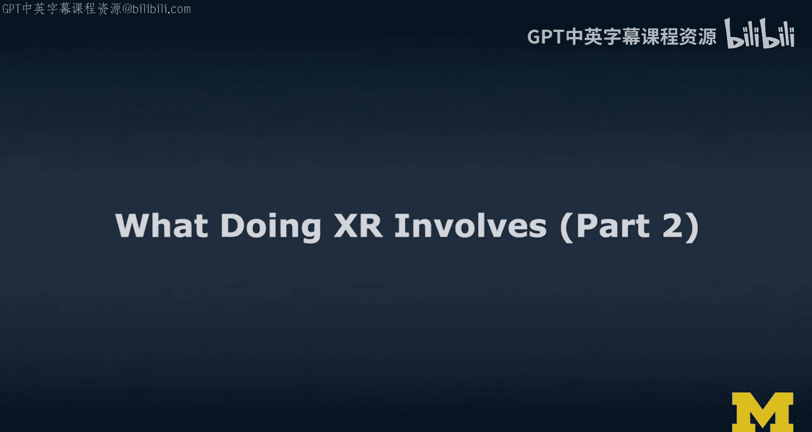
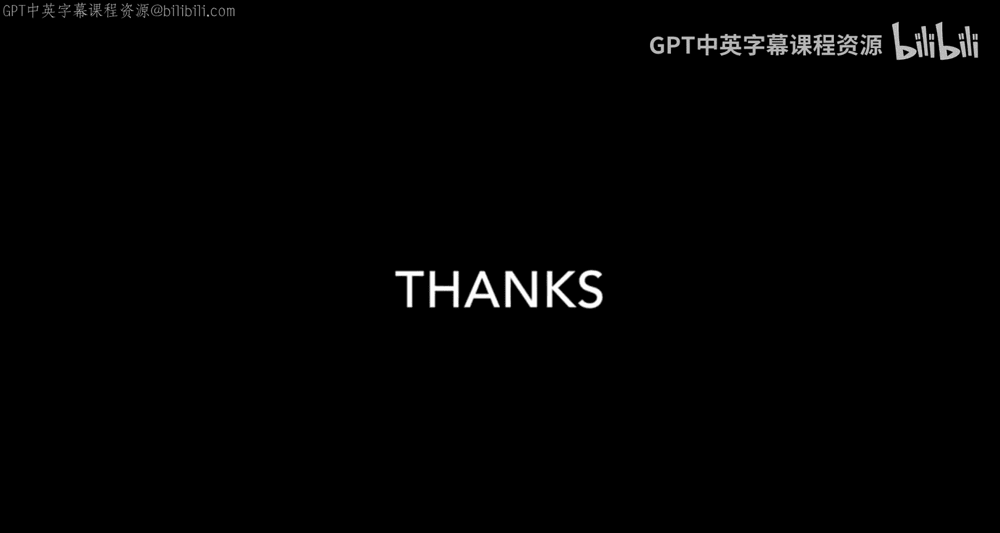
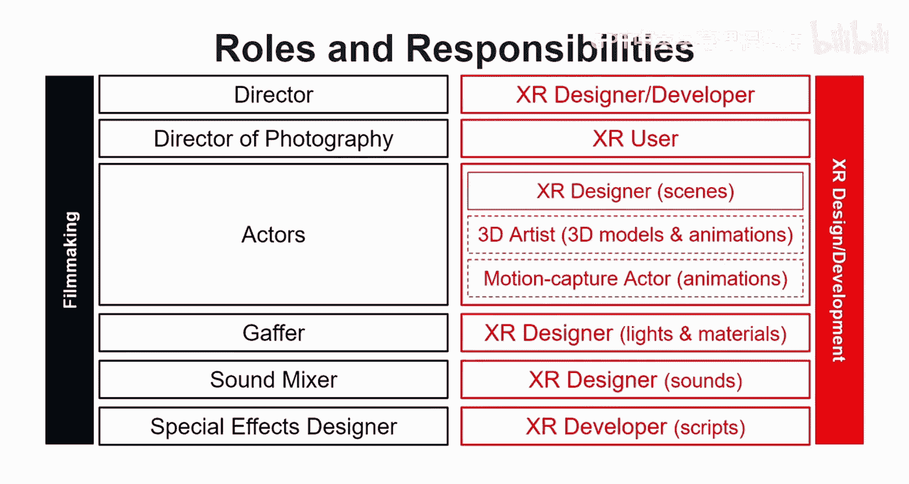
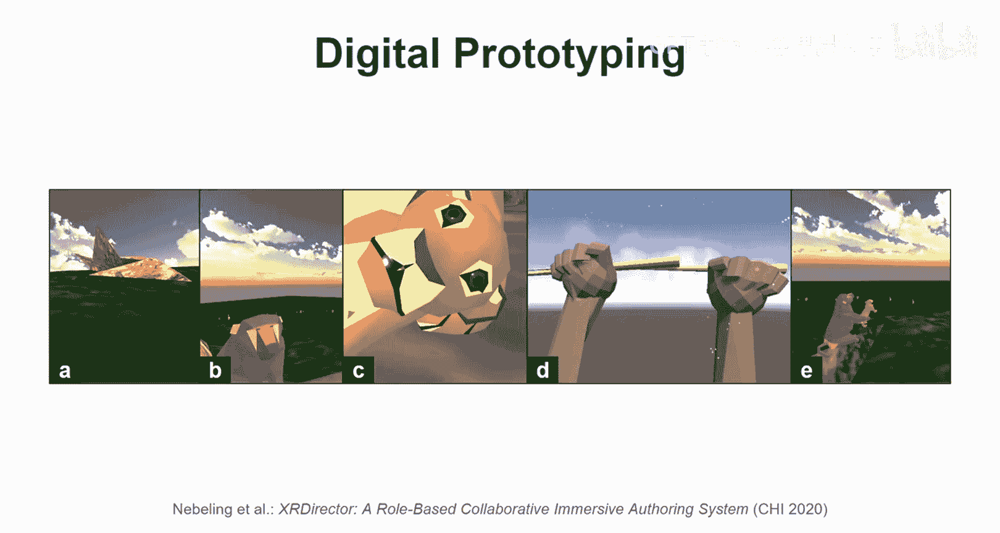
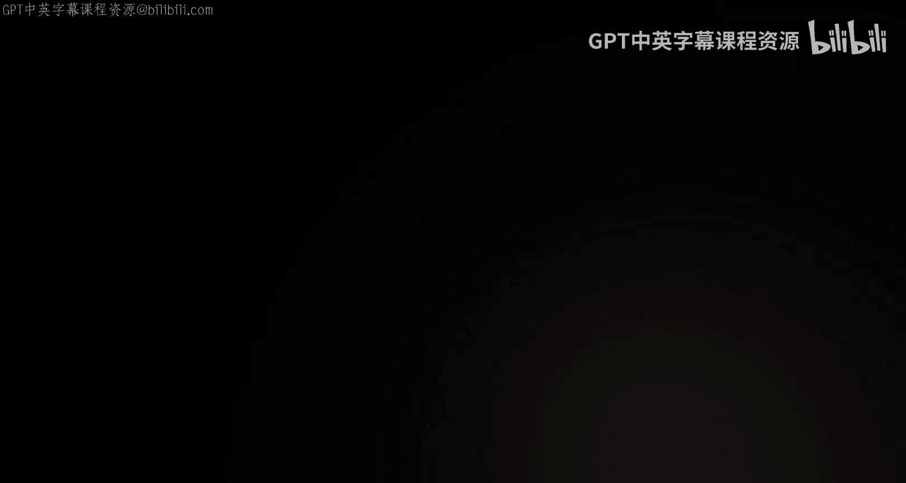
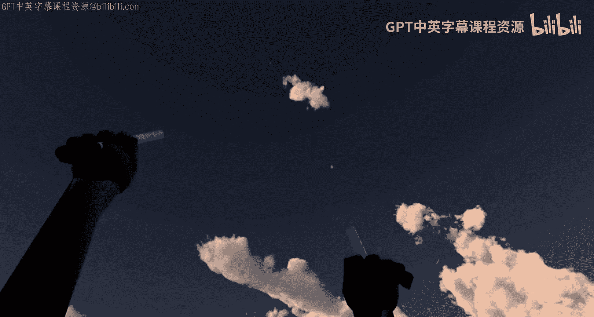
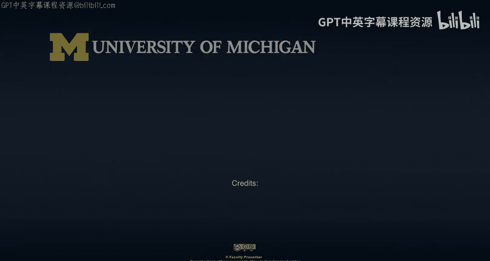

# 040：XR开发要素解析第二部分

## 概述
在本节课中，我们将通过一个具体的案例研究——《狮子王》2019年重制版，来深入解析XR体验的创作过程。我们将了解从构思到原型制作的完整流程，并探讨XR开发中各个角色的职责与传统电影制作的异同。

---

## 从电影制作到XR开发的角色映射

上一节我们介绍了XR开发的基本要素，本节中我们来看看这些要素如何具体应用于一个实际项目中。

在电影制作中，我们拥有导演、摄影师、演员等多种角色。这些角色在XR开发中是如何体现的呢？以下是其映射关系：

*   **导演**：在XR项目中，通常是项目负责人。在个人项目中，XR设计师或开发者可能同时承担导演的职责。
*   **摄影师**：这是XR与电影最大的不同点。在XR中，**摄影师的角色实际上由最终用户承担**。用户拥有在虚拟空间中自由探索、选择视角的自主权。这带来了独特的设计挑战，设计师必须通过视觉、音频等线索来引导用户的注意力。
*   **演员**：在XR中，“演员”通常是设计师编排的3D模型。如果需要定制化角色，则需要与3D艺术家合作，进行建模、绑定和动画制作。另一种方式是使用动作捕捉技术，由专业演员表演。
*   **灯光师/音效师/特效师**：在XR中，这些职责通常由XR设计师承担。具体工作包括：
    *   为3D模型设置合适的**材质**、**纹理**和**光照**。
    *   在三维空间中布置**空间音频**源，并确保声音能根据虚拟环境的几何结构被正确遮挡和传播。
    *   实现粒子效果、着色器等**特殊效果**，这通常需要一定的脚本编程能力，更偏向开发者的角色。

---

## 案例研究：《狮子王》XR原型制作

为了更具体地说明上述过程，我将分享我们实验室进行的一个研究项目。我们以《狮子王》2019年重制版为案例，探索了多设计师在AR/VR环境中协作创作XR体验的方法。值得注意的是，这部电影本身就是在虚拟现实中导演和拍摄的，因此它是一个极佳的研究对象。

### 第一步：故事板与线框图

任何XR项目通常都始于规划和构思。我们的流程始于传统的**故事板**和**线框图**绘制。

我们分析了电影预告片，在纸上勾勒出想法。这个过程帮助我们确定：
*   所需的镜头运动。
*   涉及的角色及其动作关系。
*   要选取的故事序列。

以下是我们在这一阶段的工作方式示例：

### 第二步：实体原型制作

在构思之后，我们进入了实体原型制作阶段。这超越了纸面规划，是在三维物理空间中进行的故事板活动，对于AR/VR项目尤为重要。

我们利用有限的预算（约25美元），购买了卡纸、透明胶片等材料，将纸板改造成舞台，制作了角色模型。学生们像一个小型电影剧组一样协作，测试和拍摄场景。例如，制作木法沙被推翻的场景就非常具有挑战性，需要精细的角色动作和慢镜头拍摄。

通过实体原型，我们可以在没有任何数字技术介入的情况下，初步感受虚拟世界的氛围和节奏。

### 第三步：数字原型制作

在实体原型的基础上，我们开始构建数字原型。我们使用了多种工具，将每个场景数字化。

我们涉及的工具和技术包括：
*   **Unity**：用于构建交互式场景。
*   **A-Frame 和 WebXR**：用于创建基于网页的XR体验。
*   **Blender**：用于3D建模和修改。许多模型来自Google Poly，它们本身是用Google Blocks或Tilt Brush等沉浸式建模工具创作的。

以下是我们创建的数字原型示例，其中包含了脚本控制的动画：

虽然这个数字原型被评论为“粗糙的程序员美术”，无法与迪士尼的成品相比，但它已经包含了大量的工作，并能有效地帮助我们设想最终的XR体验。你可以看到拉飞奇爬上荣耀石、辛巴出现等动画，以及镜头的旋转运动。

---

## 总结

本节课中，我们一起学习了XR开发的核心流程，并通过《狮子王》案例进行了具体分析。我们了解到：
1.  XR开发继承了电影制作的许多角色，但关键区别在于**用户成为了摄影师**，这带来了引导用户注意力的设计挑战。
2.  XR体验的创作是一个从**构思（故事板）** 到**实体原型**，再到**数字原型**的迭代过程。
3.  实体原型制作能有效帮助团队在早期感受空间和叙事，而数字原型则依赖于Unity、Blender等多种工具的组合。
4.  一个完整的XR项目需要融合设计思维（如场景构图、用户体验）和技术实现（如3D建模、动画编程、空间音频）。

通过这个案例，希望你能够对“创作一个XR体验究竟涉及什么”有一个更具体、更直观的理解。