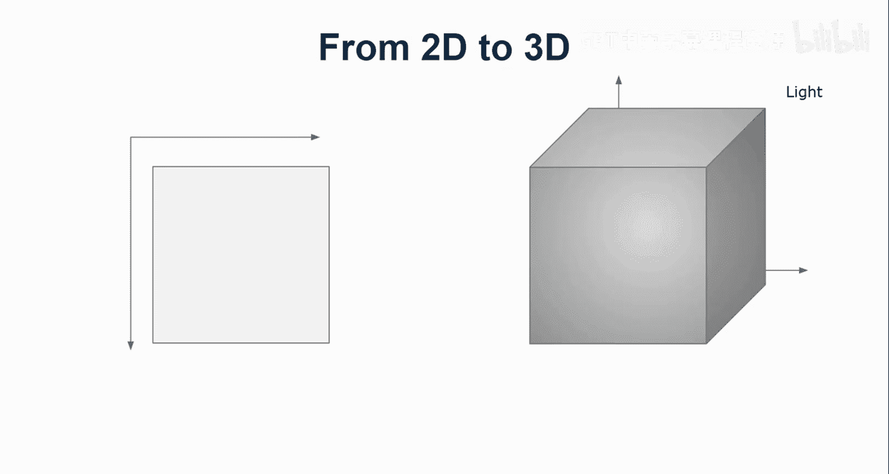

# 042：如何开始你的XR之旅 🚀

在本节课中，我们将探讨如何开始学习扩展现实。许多对XR感兴趣的人常常感到困惑，不知从何入手。本教程旨在梳理初学者面临的关键挑战和障碍，并提供成为XR创作者的清晰路径。

## 概述：初学者面临的六大障碍

在深入细节之前，我们先来了解初学者进入XR领域时普遍遇到的六个主要障碍。理解这些障碍有助于我们找到克服它们的方法。

以下是初学者在XR领域起步时常见的六大挑战：

1.  **寻找起点**：不清楚应该从哪里开始，使用什么工具。
2.  **从2D到3D的过渡**：如何将熟悉的2D设计知识和技能应用到3D环境中。
3.  **寻找优质示例**：难以找到高质量、可参考的XR设计或开发案例。
4.  **工具选择的困惑**：面对众多工具，不清楚哪种最适合自己的需求和用例。
5.  **平台碎片化问题**：不同设备和平台（如Oculus、Vive、iOS ARKit、Android ARCore）的兼容性问题。
6.  **评估用户体验**：如何判断自己创建的AR/VR体验是否优秀，缺乏成熟的评估标准。

## 深入探讨：起点问题 🧭

上一节我们概述了主要障碍，本节中我们来看看第一个也是最基本的问题：如何找到正确的起点。学生们经常询问应该学习Unity还是Unreal，以及哪个工具更好。

我认为这不是正确的问题。首先，Unity和Unreal本质上是游戏引擎，对XR的支持是后续添加的。虽然支持非常全面，但对于初学者来说，这些工具界面复杂，术语繁多，同时学习复杂工具和3D概念可能会让人不知所措。因此，它们可能不是最佳的起点。

我个人经常使用WebXR进行工作，因为它具有跨平台和快速原型设计的优势。但这也不是唯一的答案。

关键在于，你需要退一步思考自己的角色定位：**你更偏向设计师还是开发者？** 根据不同的定位，关注点会有所不同。

*   **作为设计师**，你更关心设计流程、方法、创作工具、设计指南和可用性评估技术。
*   **作为开发者**，你更关注开发流程、开发工具包、编程语言、设计模式如何转化为代码架构，以及如何优化性能（如渲染效率）。同时，你也会考虑如何通过数据追踪和分析来评估体验。

这两者如同阴阳，需要紧密结合。根据你的自我定位，你可以寻找不同的切入点，或者以不同的视角看待相同的问题。

## 成为XR创作者的路径 🛣️

在明确了自身定位后，我们可以根据不同的背景，选择进入XR领域的路径。

以下是根据不同技术背景推荐的XR入门路径：

*   **如果你有Web开发背景**：最直接的路径是基于**WebXR标准**。
    *   擅长JavaScript，可以选择 **Three.js**。
    *   喜欢声明式HTML，可以选择 **A-Frame**。
    *   想快速创建基于标记的AR体验，可以尝试 **AR.js**。
*   **如果你有游戏开发背景**：并且熟悉3D设计和建模，那么**Unity**或**Unreal**是你的天然选择。
    *   可以利用**SteamVR**开发跨平台VR应用。
    *   利用**AR Foundation**（Unity）可以同时为ARKit和ARCore开发应用。
    *   利用**混合现实工具包**开发头戴式设备体验。
*   **如果你有移动开发背景**：熟悉Android或iOS原生开发。
    *   可以直接学习 **ARKit** 或 **ARCore** 的SDK。
    *   也可以直接使用 **Oculus SDK** 或 **Vive SDK** 进行开发。

## 路径选择与难度评估 ⚖️

上一节我们介绍了不同背景的对应路径，本节中我们来评估一下这些路径的可行性。我将补充一些过渡路径，并讨论其难易程度。

以下是不同背景转向特定XR工具的路径与难度分析：

*   **Web开发者 → WebXR**：这条路径相对容易。A-Frame入门简单，Three.js需要较强的JavaScript能力，AR.js可以快速获得AR成果。
*   **游戏开发者 → Unity/Unreal生态**：如果你已熟悉C#或C++，那么掌握SteamVR、MRTK和AR Foundation是可行的。但直接使用原生SDK（如Oculus SDK）可能不是最佳首选，除非你需要针对特定平台进行深度开发。
*   **移动开发者 → 原生SDK**：对于有经验的移动开发者，直接学习ARKit、ARCore或头显SDK是“可以做到”的，但可能并非“容易”。你仍然需要花费大量时间理解XR概念。不过，直接使用原生SDK的好处是能第一时间用上平台的最新功能。

## 核心挑战：从2D思维到3D思维的跨越 🌉

无论选择哪条路径，几乎所有来自传统屏幕设计（网页、移动应用）的初学者都会面临一个根本性挑战：**从2D设计思维过渡到3D设计思维**。

在2D世界中，我们熟悉像素、X/Y坐标系和绝对定位。但在3D的XR世界中，一切都变了：

1.  **坐标系**：从二维(X, Y)变为三维(X, Y, Z)。原点(0,0,0)通常是应用启动时用户所在的位置，而非屏幕的固定角落。
2.  **单位**：从**像素**变为现实世界的**米**。模型和距离都需要以现实尺度来考量。
3.  **模型与材质**：需要处理3D模型，并确保它们具有正确的比例和**材质**，以便在光照下呈现应有的外观。
4.  **光照**：这是2D设计中几乎无需考虑的因素。在3D场景中，**没有光，就看不见任何东西**。环境光、定向光的设置对场景视觉效果至关重要。

这个跨越涉及对空间、尺度、材质和物理光照的全新理解，是XR学习曲线中陡峭但必须攻克的一部分。

## 总结 📚

本节课中我们一起学习了如何开始你的XR之旅。我们首先概述了初学者面临的六大障碍，然后深入探讨了如何根据你的背景（Web开发、游戏开发或移动开发）选择最适合的入门路径和工具。最后，我们强调了从2D思维过渡到3D思维是核心挑战，需要理解新的坐标系、单位、模型材质和光照系统。

记住，开始XR创作的关键是先明确自己的角色和背景，选择一条匹配的路径，并准备好迎接从2D到3D的思维转变。在接下来的课程中，我们将逐一深入这些主题，帮助你逐步构建XR设计与开发的能力。