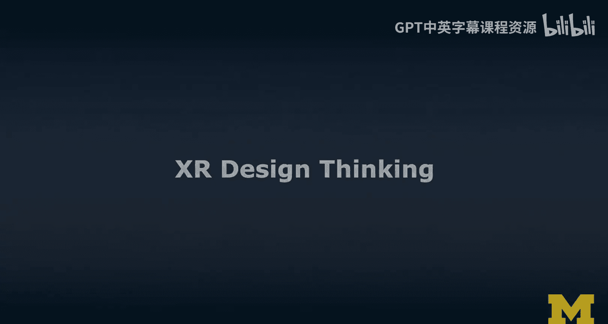
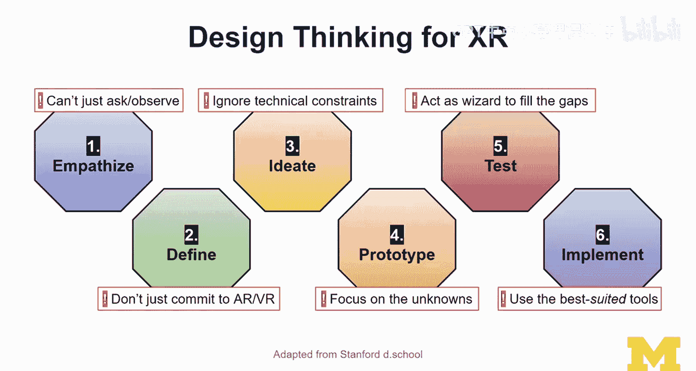

# 046：XR设计思维方法详解 🧠

在本节课中，我们将学习如何将经典的设计思维方法应用于扩展现实（XR）领域。设计思维是一种以用户为中心、强调共情和迭代的创新方法。我们将探讨其六个核心步骤，并重点关注在XR这一新兴技术背景下应用时需要注意的特殊事项。

## 概述：设计思维与XR的结合

设计思维是一种源自斯坦福设计学院的成熟方法论，多年来被广泛应用于创新产品开发和用户体验设计。它本质上是一种思维方式，核心在于与用户建立共情，真正聚焦于用户需求，并以此为基础推动后续工作。它更像是一种思考方式和处理问题的途径，而非一套固定的技术。

我们的目标是将设计思维的知识引入XR领域。这存在一些显著差异。例如，在创新和问题界定方面，XR作为一种新兴技术，常被视为解决各种问题的“万能锤”。然而，设计思维提供了一种通过深度理解用户来界定问题的特定方式。用户通常不会直接要求AR或VR，AR/VR只是可能解决问题的工具或技术手段。技术本身并不直接解决问题，但它可以成为解决问题的“赋能者”。

## 设计思维六步法详解

接下来，我们将概述设计思维的六个步骤。

### 第一步：共情

共情阶段的目标是深入了解用户。你需要尽力发掘用户的问题、痛点、现有方案的优缺点，并学习当前解决方案的应用场景，从而识别现有方案的不足、差距以及潜在的改进机会。这有助于你准确定义问题。

以下是常见的共情方法：
*   **用户访谈**：与用户直接交流。
*   **观察法**：观察用户在实际环境中的行为。
*   **焦点小组**：组织小组讨论。

这些都属于传统的人机交互和用户研究技术。

### 第二步：定义

在共情的基础上，我们需要准确定义要解决的核心问题。前三个步骤（共情、定义、构思）的核心是“问题界定”，而非“寻找解决方案”。目标是深入理解问题的本质，而不仅仅是表面症状。

### 第三步：构思

构思阶段通常与原型设计紧密相连。构思不仅仅发生在脑海中或讨论里，它更多地通过具体的形式来实现。

以下是构思阶段的常用技术：
*   **草图绘制**：快速勾勒想法。
*   **故事板**：以漫画形式描绘用户体验流程。
*   **线框图**：勾勒界面布局和结构。

这些方法能帮助我们有效地将想法可视化，并自然过渡到原型设计阶段。

### 第四步：原型制作

在原型制作阶段，通常从纸质原型开始，尤其是在XR背景下，这非常有用。你可以从纸质原型过渡到数字原型。即使是纸质原型，也可以用于用户测试。

需要记住一个关键点：**原型的保真度会影响你获得的反馈类型**。例如，一个看起来粗糙、低保真的原型，用户可能会更关注流程和界面组织等核心问题，而不是颜色等细节。你不希望原型看起来过于精美，因为如果某物看起来“已完成”，测试者可能会因为担心修改成本高而不愿提供更多反馈。

### 第五步：测试

严格来说，测试永远不会真正结束。我们通常将“实施”视为构建原型、测试原型，然后进行下一次迭代的过程。在XR中，我们最终会直接使用XR设备进行测试。

有趣的是，有一些方法允许你在构思和原型阶段就使用XR设备，例如**沉浸式原型设计**——直接在XR设备中创建界面并同步测试。这几乎是XR独有的、非常酷的能力。

### 第六步：实施

在实施阶段，我们将运用技术（对XR而言就是XR设备）来构建解决方案。

## XR设计思维的特殊考量

现在我们已经建立了共情、定义、构思、原型、测试、实施这六步法。接下来，让我们看看在XR背景下，每个步骤需要注意的问题。

### 共情阶段的挑战

如前所述，共情的常见方式是访谈和观察用户，以理解他们的挑战和痛点。

**XR面临的问题是：XR通常还不是一个现成的解决方案。** 如果你在优化一个现有的XR原型，或许可以观察用户如何使用它。但如果你审视一个现有问题，并试图引入XR作为潜在的新解决方案，你无法直接观察用户使用XR的情况。这与基于网页或移动端的设计非常不同，用户日常就在使用这些技术。目前，很少有人每天使用VR或AR进行生产性活动。因此，你无法像传统领域研究那样，通过“影子观察”或实地研究来直接观察XR相关问题的发生。

### 定义阶段：保持开放心态

在定义阶段，非常重要的一点是，不要只盯着问题或表面症状，然后生硬地将其塞进AR或VR的解决方案中。我们很多人有个人偏好，可能更喜欢VR或AR，并试图用其解决所有问题。

**关键是要保持开放心态。** 不要过早承诺使用AR或VR。在经过初步的需求发现后，你可能会发现AR和VR都不是合适的解决方案。这实际上是一个非常好的结果，可以避免大量的成本、时间和精力的浪费。

### 构思阶段：跳出技术限制

进入构思阶段时，至关重要的一点是：**在进行构思时，不要过早地被现有设备的技术限制所束缚。** 例如，如果你满脑子都是HoloLens等设备的扫描频率、环境重建精度或缺乏语义理解（难以可靠检测未知物体）等技术约束，你会严重限制自己的构思，产生偏见。

我喜欢在构思环节与多元化的团队合作，包括一些对XR经验有限、认为它充满魔力且无比强大的人。这种想法不会束缚他们的构思，我认为这对XR设计思维至关重要。

### 原型阶段：聚焦“未知的未知”

在与学生进行原型设计时，当我们有了设计概念、故事板和线框图，并准备从纸质转向数字原型时，容易倾向于先做那些已知的、基础的部分。

**不要先做登录界面。** 登录界面大同小异，数字化原型它们的意义不大。你应该做的是**聚焦于“未知的未知”**。你的设计概念中可能存在很多空白和不确定性，利用原型设计来探索如何填补这些空白才是最佳方法。

原型设计不一定要构建完整的原型。可以采用“水平原型”的方式，更像一个“门面”，专注于弄清楚整个前端和面向用户的所有选项。即使如此，也不要从已知的界面部分开始数字化。也许你可以用它来热身，但真正应该聚焦的是那些你还不知道如何在用户界面中实现的部分。

### 测试阶段：利用XR技术填补空白

测试阶段非常有趣。因为我们在设计XR，所以**可以利用XR技术来填补原型的空白**。想象一个近乎完整的界面，但你希望出现一些“魔法般”的效果，却还不知道如何原型化。除了使用视频编辑软件制作叠加效果外，你还可以使用更先进的AR或VR工具来引入这些叠加层。

**核心思想是：利用XR技术来填补你XR原型的空白。** 这是一种利用XR技术支持原型设计和测试的创新方法。目标是在测试阶段模拟一个近乎完整的用户体验。

如果你没有实现完整的原型，可以**利用“绿野仙踪”法来填补空白**。在“绿野仙踪”原型测试中，由真人（巫师）在后台模拟系统尚未实现的功能。这在XR中尤其有意义。

例如，我曾做过一个实验：我进入一个VR体验，对VR用户几乎是隐形的。我可以在VR中移动物体，为他们生成虚拟的平视显示器。他们以为所有屏幕都是动画，界面有响应，个人助理真的理解他们。但实际上，是我作为“巫师”在后台填补了计算机功能的空白。这是一种非常酷的模拟更完整原型以进行测试的方法。它可以是一个我们正在原型化的智能系统，能理解各种手势和语音命令。在此类测试阶段，即使我们尚未完全实现系统，也能模拟出近乎最终的用户体验。

### 实施阶段：选择最合适的工具

在实施阶段，一个常见的误区是：我们很多人非常熟悉某一种工具（例如Unity或Unreal），并试图用这个工具完成所有工作，认为它是最好的。

**我想强调的是：你应该使用最合适的工具。** 例如，对于早期原型，我们不一定非要立即使用Unreal的高端渲染能力或跳进Unity开始。你可以选择其他更偏向沉浸式原型设计的工具。拥有一系列工具选项并不可怕。尽管在不同工具间切换并不总是容易的，但**保持工具选择的灵活性，并掌握多种工具，实际上是一种优势**。这能丰富你思考问题的方式，让你不再局限于单一工具的视角，而是能从多个不同的角度看待问题。

## 总结

本节课中，我们一起学习了将设计思维方法应用于XR设计的过程。我们回顾了共情、定义、构思、原型、测试、实施这六个核心步骤，并重点探讨了在XR这一特殊领域应用每个步骤时需要注意的挑战和技巧，例如在共情时如何应对XR非现成方案的困境，在构思时如何跳出技术限制，在原型和测试时如何巧妙利用XR技术本身来填补设计空白。记住，保持开放心态、聚焦用户真实需求、选择合适工具，是成功进行XR设计思维的关键。