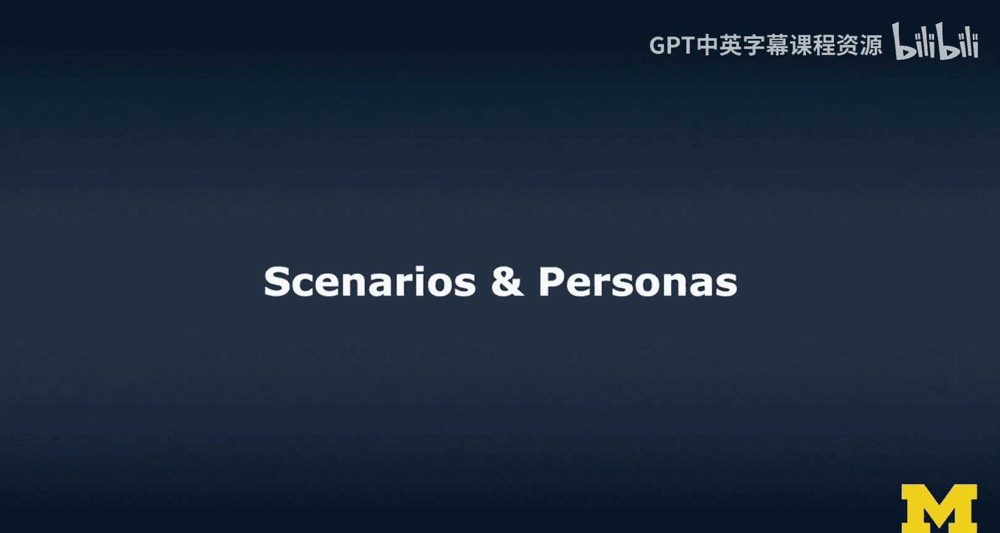
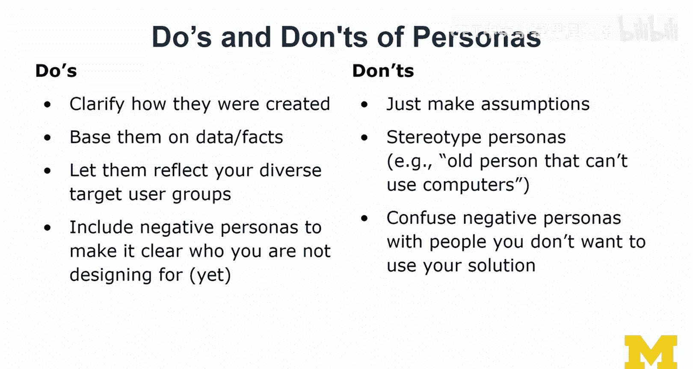
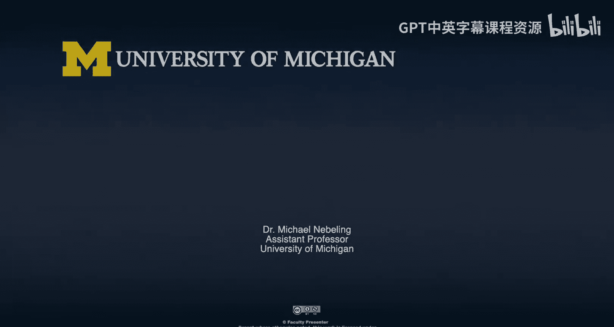

# 047：场景与用户画像 🧑‍🎨

在本节课中，我们将学习在扩展现实（XR）设计过程中，如何通过**场景**和**用户画像**来定义问题并理解目标用户。这是将模糊想法转化为具体设计方向的关键步骤。

上一节我们介绍了设计思维的整体流程，本节中我们来看看如何具体地定义设计问题和目标用户。

---

## 问题定义与用户理解方法概览

首先，我们需要明确要解决的问题。定义问题通常通过以下几种方法实现：

以下是常见的问题定义方法：
*   **场景与用例分析**：构想用户使用产品的具体情境。
*   **日记研究**：请用户记录日常生活中的相关活动与痛点。
*   **问卷调查**：进行大规模或特定用户群体的意见收集。
*   **面对面访谈**：与用户进行深入交流。
*   **焦点小组**：将不同的利益相关者聚集在一起讨论，共同框定问题。

在明确问题后，我们需要深入理解用户。定义用户身份的常用技术是创建**用户画像**。用户画像不应只是一张填满信息的表格，其背后基于数据和事实的构建过程才是关键信息所在。

以下是理解用户的其它方法：
*   **任务分析**：分解用户为达成目标所需执行的具体步骤。
*   **日志记录与分析**：通过现有原型收集用户行为数据。
*   **用户旅程图**：可视化用户完成目标所经历的全过程，包括活动、事件及其影响。
*   **利益相关者地图**：识别所有与产品或服务相关的人员及其关系。

---

## 竞争格局分析

接下来，我们需要理解竞争格局。即了解市场上现有的解决方案、它们的优点、缺点以及缺失的功能。

进行竞争分析的常见方法是**SWOT分析**，即分析优势（Strengths）、劣势（Weaknesses）、机会（Opportunities）和威胁（Threats）。

以下是了解竞争格局的途径：
*   **亲身体验**：下载并试用现有产品。
*   **查阅用户评价**：在相关论坛、社区（如Stack Overflow）查看用户的反馈与投诉。
*   **系统性文献调研**：阅读白皮书、博客文章或学术论文，建立对技术或解决方案领域的全面认知。

---

## 设计综合与分析

综合从问题定义、用户理解和竞争分析中获得的知识后，我们需要进行设计综合。这涉及将所有数据和事实整合起来，进行**设计空间分析**。

这里介绍一种称为**QOC分析**（Questions, Options, Criteria）的技术。即针对可用选项提出问题，并制定帮助选择最佳方案的标准。这是一种分析设计空间的绝佳方法。

如果你更偏向软件工程或系统思维，通常会考虑**功能性需求**和**非功能性需求**列表。
*   **功能性需求**：关于系统本身、可测量的指标，如系统性能、响应时间等。
*   **非功能性需求**：更多与用户特征或难以量化的“软性”要求相关。

---

## 深入探讨：场景分析

让我们更深入地看看场景分析。例如，在我们关于跨设备增强现实的研究中，曾使用过两个未来主义场景：
1.  一个家庭希望协作布置客厅的家具。
2.  一群朋友希望协作玩一款激光射击游戏。

我们将这些场景以视觉图像的形式展示给参与者（包括设计师、开发者和终端用户），请他们思考如何解决场景中的问题。这帮助我们驱动了许多需求，并最终构建了解决方案。

一个完整的场景应包含五个关键要素，以确保全面探索未来界面的使用情境：

以下是构成场景的五个关键要素：
1.  **情境**：活动发生的物理环境与系统状态。
2.  **角色**：执行活动的用户或代理。
3.  **目标**：用户希望通过活动达成的目的。
4.  **行动**：用户为达成目标所采取的具体步骤。
5.  **事件**：在活动过程中，由系统或环境触发的、发生在用户身上的外部事件。

许多场景描述只聚焦于用户或情境，但充分描述目标和行动能帮助我们更早地构想出潜在的解决方案。

---

## 深入探讨：用户画像构建

接下来详细讨论用户画像。用户画像传统上用于向团队传达系统的目标用户，其核心是基于访谈、观察、调查等收集到的事实和知识，提炼出用户的典型特征。

一份用户画像通常包含以下元素：一个描述性的名字、一张展示用户或环境的照片、一段最能代表该用户观点的引语，以及列出的目标、挫折、需求和动机（如激励、恐惧、成就、成长、权力等）。

我们需要区分几种不同类型的用户画像：

以下是主要的用户画像类型：
*   **主要画像**：设计完全满足其目标和需求的用户。
*   **次要画像**：设计大部分满足但未完全满足其目标和需求的用户。
*   **负面画像**：明确标识出当前设计**尚未**针对其目标或需求的用户。这有助于向利益相关者澄清设计范围。

在构建XR体验的用户画像时，需要特别考虑：用户的XR经验水平（新手还是专家）、衡量经验的指标（如自评量表、使用时长、使用频率），以及他们使用过的设备和应用示例。这些信息能帮助你更好地框定主要和次要用户。

例如，在我的研究中，常以**新手设计师**为主要画像，目标是让他们无需编程也能创建XR体验。**开发者**可能是次要画像，因为他们也能从快速原型技术中受益。而使用设计师所创作产品的**终端用户**，在当前研究中则可能属于负面画像——这并非不喜欢他们，而是意味着当前解决方案主要服务于XR创造者。

---

## 构建用户画像的注意事项

在构建用户画像时，有一些重要的准则需要遵循。

以下是应该做的事情：
*   **澄清构建依据**：说明画像基于数据事实还是构想。
*   **反映用户多样性**：确保画像能代表多样化的目标用户群体。
*   **包含负面画像**：明确说明当前不为谁设计。

以下是应该避免的事情：
*   **避免凭空假设**：不要基于刻板印象创造画像（例如，“不会用电脑的老人”）。
*   **避免歧视**：谨慎处理性别、种族等属性，避免歧视。
*   **正确理解负面画像**：负面画像不代表“不希望使用你方案的人”，而是“当前未作为设计目标的人”。未来迭代可能会专门为他们服务。

---

本节课中我们一起学习了如何通过**场景分析**来全面定义设计问题，以及如何通过构建**用户画像**（包括主要、次要和负面画像）来清晰理解目标用户群体。掌握这些方法，能为你的XR设计项目奠定坚实的研究与规划基础。