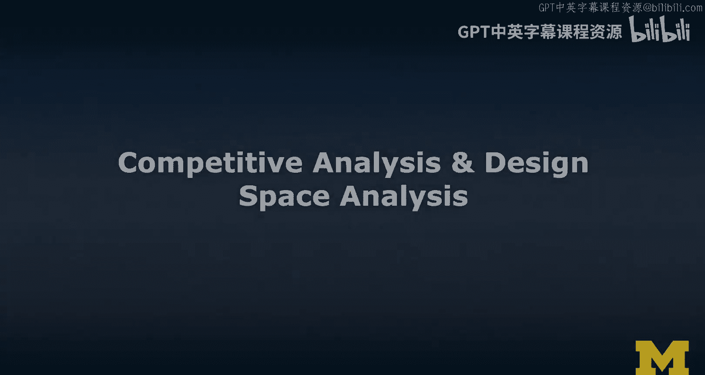
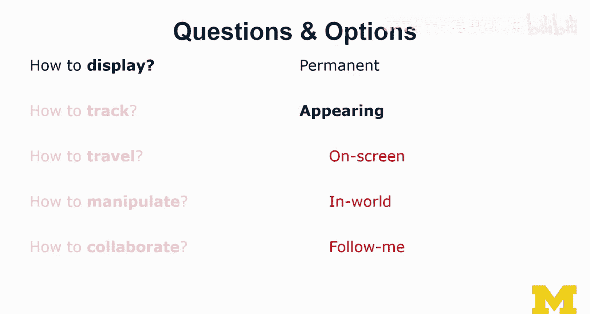

# 048：竞品分析与设计空间研究

在本节课中，我们将学习如何通过竞品分析来理解市场格局，并探索设计空间以做出明智的设计决策。我们将介绍分析竞争对手的方法，并学习如何系统地思考设计选项。

## 竞品分析

上一节我们介绍了用户画像，本节中我们来看看如何分析竞争对手。竞品分析有助于我们理解现有解决方案，并找到我们产品的创新机会。

我经常使用一种模板，在一侧列出竞争对手，在另一侧列出所有功能特性，甚至包括非功能性的缺陷，我称它们为“因素”。你可以将因素作为列，将竞争对手作为行。这里的竞争对手实际上是指现有的解决方案，比如市面上的XR应用。我通常不会只标记这些因素是否被支持，而是会写下它们被支持的程度以及具体的实现方式，这在不同解决方案之间通常存在差异。但为了本次演示的简洁性，我们仅用“X”来标记是否支持该因素。

与用户画像类似，我将竞争对手分为几类：直接竞争对手、部分竞争对手、间接竞争对手、平行竞争对手和类比竞争对手。这里的分类看似细致，但每类之间确实存在显著差异。

以下是竞争对手的主要类型：

*   **直接竞争对手**：这类竞争对手提供的功能和服务与你高度重叠，并且面向相同的用户群体。
*   **部分竞争对手**：这类竞争对手只支持你功能的一个子集，或者只面向你通过用户画像识别出的部分用户群体。
*   **间接竞争对手**：这类竞争对手试图解决相同的问题，但采用了不同的方法。由于他们瞄准的是同一个问题，因此仍然是竞争对手。
*   **平行竞争对手**：这类竞争对手与你的想法类似，但不一定是直接竞争关系。
*   **类比竞争对手**：这类实际上并非竞争对手。他们的解决方案面向不同的用户、目标和需求，但其设计中有某些元素能给你带来灵感。

我通常鼓励学生重点思考直接和部分竞争对手，也可以考虑一些间接和平行竞争对手。但更重要的是，要找到那些类比竞争对手——那些解决不同问题但设计上非常有趣、能激发灵感的现有界面。你可以考虑将这些灵感元素调整并融入到你自己的解决方案中。

进行竞品分析时，我所说的通常是通过SWOT分析来完成的，即识别优势、劣势、机会和威胁。

这里有一个我很多学生常犯的错误。我们在做竞品分析时，描绘了整个市场格局，然后我们的解决方案就试图面面俱到，把所有事情都做得更好。我们觉得所有因素都很重要，因此试图打造一个“超级解决方案”。这绝不是正确的思路。

正确的做法应该是寻找“缺口”。在某些因素之间必定存在缺口，现有方案未能真正满足用户需求或达成其目标，而这正是你需要创新的地方。因此，不要试图做一个集成所有功能的仪表盘，而应寻找一个更聚焦的解决方案，真正建立新的因素，这就是你的利基市场，也是你的XR解决方案应该瞄准的方向。

## 设计概念与心智模型

至此，我们已经研究了场景、用户画像的新例子，并完成了竞品分析。关于故事板，我将有单独的视频和模块来讲解，因此这里不涉及。但这四种类型的输入共同构成了我们所谓的“概念模型”或你的“设计概念”。这实际上是你作为设计师对解决方案的思考方式。

请记住，你所创建系统的“心智模型”是关键挑战。真正的挑战在于，也要在你的用户心中唤起同样的心智模型。事实上，大多数系统失败是因为用户的心智模型常常与设计师心中的概念模型大相径庭。如果两者能够匹配，那么你的工作就做得非常出色。

想想你对ATM机工作原理的理解：你插入卡片，要求取钱，它退回卡片，然后你拿到钱。而ATM机的设计师可能以非常不同的、更精细、更具体的方式来思考它，包括各种错误场景。假设某台ATM机吞掉了你的卡，你甚至不知道这有可能发生。你的心智模型是ATM机很好用，总能给你钱，你从未经历过账户没钱的情况。但那些经历过吞卡、余额不足或银行系统错误等破坏性用户体验的人，他们对ATM机的心智模型可能与那些总是有足够余额、从未被吞卡、从未遇到过问题的人截然不同。

下次当你使用ATM机时，一旦这些破坏性的用户体验发生在你身上，你会变得非常担心。我还有很多类似的例子，比如自助结账通道，人们总是对那些机器和指令感到紧张。

这些都是很好的例子，说明设计概念从设计师的角度看可能原则上是合理的，但所有这些破坏性的用户体验导致了用户对这些系统形成非常不同的心智模型，从而产生了有趣的冲突。

因此，有一个很好的方法来进行设计综合并构建这个概念模型。这个概念模型或你的设计概念，在某种意义上，就是你想要交给开发人员的“规格说明书”。这就是我对系统的思考方式，这就是我们需要为我们的XR解决方案实现的内容。

## 设计空间分析

我非常喜欢通过提问来进行设计空间分析这个想法。我们需要考虑针对任何问题我们有哪些选项，例如如何显示某些内容，我们可以选择永久显示或适时出现。然后，我们需要列出标准：在什么情况下使用哪个选项，每个选项的实际含义是什么。接着，我们需要权衡这些选项，最后为其中一个选项做出具体的设计选择。

例如，对于“适时出现”这个选项，已有相关研究，我提供了关于设计空间分析的参考文献。这实际上经常在设计师之间隐性地发生，我们总是在提问，总是在考虑选项。

对于XR设计来说，困难的部分在于提出正确的问题：如何显示内容、如何追踪、如何在VR和AR中移动、如何操控物体以及如何协作。这些是我在创建新的XR体验时通常会遇到并需要解决的一些重大问题。

让我们看一个例子。关于“如何显示”，显然我们刚刚提到了“永久”或“适时出现”。但当我们思考“适时出现”时，在XR中不仅仅是某物是否出现在屏幕上。我们还可以将物体放置在环境中。在AR中，这可能意味着将其绑定到某个物理位置；在VR中，则可能绑定到某个虚拟位置。它可能并不总是对用户可见，只有当虚拟摄像机将其移入视野时才会出现。我们也可能有这种折中的解决方案：一旦我们看到它，它就会跟随你移动，因此当你移动摄像机时，它也会随之移动。这些仅仅是针对“适时出现”这个例子，在XR中如何显示物体时，你需要考虑的一些选项。

## 总结

本节课中，我们一起学习了如何进行竞品分析以理解市场并寻找创新机会，探讨了设计概念与用户心智模型匹配的重要性，并介绍了通过提问和权衡选项来进行系统化设计空间分析的方法。这些工具将帮助你在XR设计过程中做出更明智、更聚焦的决策。