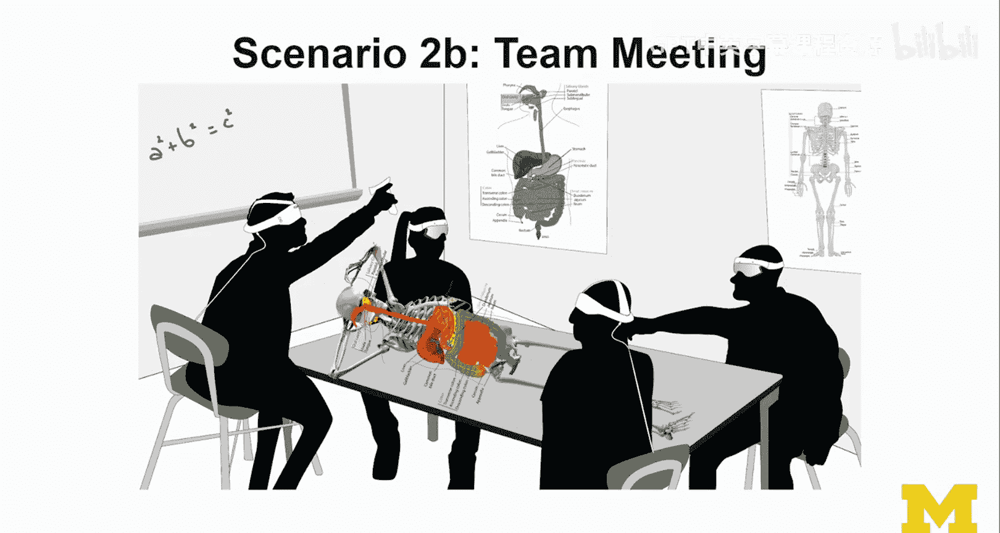

# 051：XR伦理审查机制 🧭

在本节课中，我们将学习如何进行XR项目的伦理审查。我们将探讨伦理审查的核心目标，并将其应用于XR设计的具体场景中，帮助你理解如何在设计过程中持续地、负责任地思考伦理问题。

---

## 伦理审查的核心目标

伦理审查旨在确保研究或设计项目以合乎道德的方式进行。其主要围绕三个核心方面展开。

### 明确研究目的、流程与时长

进行任何新用户研究时，必须明确定义其目的、流程和持续时间。这是关键信息。
*   **研究目的**：我们获取任何数据的目的是什么？
*   **数据收集流程**：你计划如何收集这些数据？需要仔细思考。
*   **数据收集时长**：我们需要收集数据多久？是单次会话还是多次会话？数据保留多久？是否有未来使用的意图？

### 确保知情同意

我们必须告知用户，并且不能仅仅隐藏在冗长的政策条款和使用协议中。我们需要思考如何在用户界面中更好地整合和体现这些信息。作为设计师，你可能了解这些选择的后果，但用户可能不了解。用户是否真的做出了知情决定？通常，用户只想运行你的应用，但这从伦理角度看是不够的。这必须是**知情同意**。

### 权衡收益与风险

伦理审查的另一个主要目标是真正理解项目是否能给用户带来直接收益。我们的目标是最大化收益并限制权衡。
*   **用户预期收益**：对用户的预期收益是什么？这些收益是直接的吗？用户能感知到吗？
*   **可接受的权衡**：在**真实性**、**舒适度**和**安全性**方面，哪些是可接受的权衡？这些权衡合理吗？

### 最小化参与者风险

伦理审查的第三个方面是切实努力最小化参与者的风险。
*   **用户潜在风险**：对用户的内容风险是什么？
*   **数据与实体限制**：如何限制数据以及收集、处理和管理数据的任何实体？这里的“实体”包括算法、流程中的所有步骤、以及涉及跟踪手势、理解语音命令等的各种不同解决方案和服务提供商。作为研究者，我通常会说，能访问研究数据的人只有作为调查者的我和我的研究团队。

### 赋予参与者自主权

最后，我认为这在伦理审查中可能有点独特或视角不同，即**能动性与自主权**的理念，旨在真正赋予参与者权力。
*   **用户控制权**：你如何让用户保持控制？例如，作为设计师，你可能追求高沉浸感，但可以想象让用户控制细节级别的方式，就像在任何电脑游戏中通常可以控制图形设置一样。

以上是我对XR进行伦理审查的版本。

---

## 设计伦理审查框架

现在，我想转换话题，谈谈进行设计伦理审查的理念，并提供一些思考和实施的方法。在我看来，主要有四个方面需要考虑。

### 情境与场合

首先要考虑的是情境与场合。XR设备在何处使用？用户周围有谁？

### 感官信息与数据

第二个重要方面是我们收集的感官信息和数据。XR设备“看到”什么？获取了何种类型的数据？这些都是你应该为你的设计回答的重要问题，并且答案可能因情境和场合的不同而有很大差异。这里的第一和第二象限之间存在有趣的依赖关系。

### 处理流程

接下来我们需要考虑处理流程。作为设计师，你可能会有些困扰，因为你使用的许多解决方案对你来说可能像个“黑箱”。这正是我鼓励你更多了解技术的地方。
*   **设备端处理**：在设备上发生了什么？这是一个非常重要的问题。什么类型的数据在设备上收集和处理？
*   **非设备端处理**：如果不在设备上处理，数据如何被处理？那么它必须在云端在线处理。这意味着数据将被传输给第三方。从用户的角度看，这就是第三方，因为他们可能不知道该方的参与。因此，这存在一定风险。云端发生了什么？谁管理云端？提供何种保护？服务级别协议是什么？这些都是你需要思考的问题。

### 数据所有权与治理

我们设计伦理审查的第四大主题必须是关于数据所有权与治理。
*   **数据归属与管理**：谁拥有和管理数据？
*   **用户知情权**：数据如何被使用？用户如何被告知？是明确告知还是隐含的？或者我们从不告诉他们？或者你还没考虑过？

这确实是我们应该思考的事情。非常重要的一点是，这种设计伦理审查应在整个设计过程中持续进行，而不仅仅是在所有决策都已做出的最后阶段。这是一种思维方式，你必须在做出设计决策并为这些决策形成理由时应用它。

---

## 设计伦理审查实例分析

让我们通过几个例子来应用我们刚刚学到的设计伦理审查框架。

### 实例一：家居装饰应用

第一个例子是家居装饰，灵感来自宜家的Place应用。假设一个家庭的所有成员都在使用他们的设备，共同决定购买什么家具以及摆放在哪里。本例中是客厅，但也可能是其他房间。

让我们根据所学进行一点设计伦理审查分析：
*   **情境与场合**：场景是客厅，涉及家庭成员。假设家庭每个成员都同意以这种有趣的方式一起使用设备。
*   **感官信息与数据**：用户和旁观者（家庭成员）都在场。应用会看到家具。我们可能从家具推断出一些信息（是否昂贵、数量、新旧等），这可能是敏感信息。应用还需要理解环境的几何结构，并进行基本的物体检测（主要是它已知的家具，例如宜家目录中的家具）。但这里可能出错，例如引入其他物体导致误分类等。
*   **处理流程**：在本例中，最初是基于标记的，但现在有无标记实现。基本上，设备自行扫描环境，目前在对场景的理解方面相对有限。
*   **数据所有权与治理**：显然，数据所有权可能属于应用开发者（可能是宜家）。关于用户如何被告知，显然是通过下载应用时的某种条款协议，以及通过一些可视化（例如，在检测到的表面上渲染一些图案，让你了解设备“看到”了什么）。但请注意，这只是设备相对确定的信息类型的可视化，它仍然可能看到许多未向用户可视化的东西。

这是我们针对第一个场景的小型设计伦理审查。

---

### 实例二：协作游戏场景

现在，让我们进入一个不同的场景，但仍在类似领域，例如人们一起在客厅里，现在他们正在玩一个协作游戏。这个场景的一个主要区别是，当你设计和装饰你的家时，你非常关注设备在看什么，你控制着设备；但当你玩游戏时，游戏可能会让物体出现在各处，甚至出现在你可能不希望摄像头看到的地方，但为了参与游戏，你不得不这样做。显然，你的移动速度更快，这使得设备感知和理解事物变得更加困难（但我们正在实现）。我想在这个场景中表达的另一点是，我们现在使用了非常不同的显示技术（例如头戴式显示器、投影和基于摄像头的系统、智能手机），每种技术都涉及非常不同的跟踪技术，这很有趣。

现在，我想引入另一个考虑因素：如果这些用户在不同的环境中，每个用户在自己家里参与这个协作游戏，这对数据意味着什么？现在无法在本地处理。这种信息收集、处理以及设备间的协调（使它们进入同一坐标系并确保它们可以协作）已经需要某种服务器端基础设施。但在远程设置中，情况不同：我们必须联网、处理数据并在用户之间传输数据，这引入了有趣的新问题。

对于这个场景，我不做完整的设计伦理审查，只想指出一些差异。我将对第二个场景的另外两个变体做同样处理。

---

### 实例三：课堂讲座与团队会议

第二个场景想象一个课堂讲座。这更像一个公共场合，例如你去演讲厅听讲座或参加会议，演讲者希望你能参与一个很酷的AR体验（例如观看太阳系）。用户使用各种不同的设备（手持式和头戴式），这是一个公共空间。

这个场景的一个不同变体是团队会议。你和团队成员进入一个较小的房间（可能是办公室、公共建筑甚至家中）。这会如何改变你使用这个AR应用的方式？需要考虑的因素包括：这可能是更私密或仍是公共的环境；你可能认识也可能不认识其他用户；你不知道这些设备上安装了哪些应用；还需要考虑这些不同的设备如何协同支持一个（例如）人体解剖学应用，以便我们学习人体解剖学。这里有许多有趣的事情需要考虑。

---

## 总结

在本节课中，我们一起学习了如何对XR项目进行伦理审查。我们首先探讨了伦理审查的核心目标，包括明确研究细节、确保知情同意、权衡收益与风险、最小化参与者风险以及赋予用户自主权。接着，我们介绍了一个实用的设计伦理审查框架，涵盖情境、数据、处理流程以及所有权四大方面。最后，我们通过家居装饰、协作游戏和公共教育等多个具体场景实例，应用并深化了对该框架的理解。记住，伦理审查不是一次性任务，而应作为贯穿整个设计过程的持续思维方式，以确保我们的XR设计既创新又负责任。