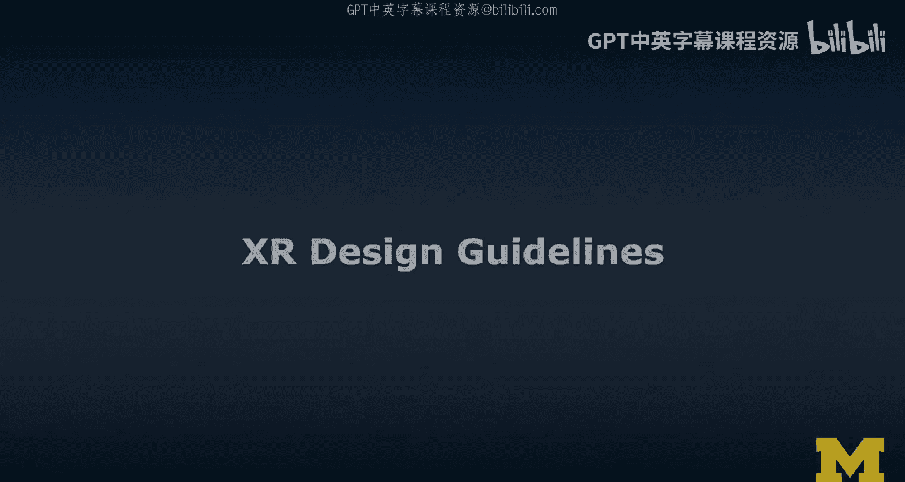
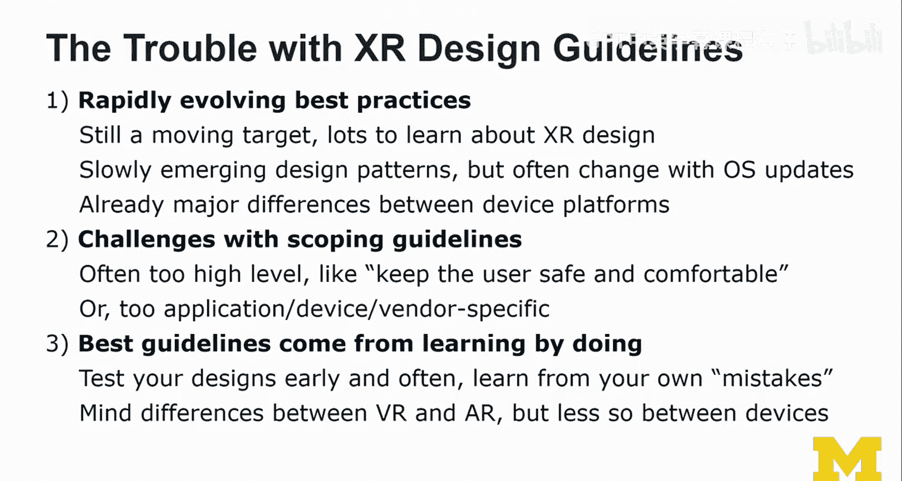

# 053：XR设计规范 📚

在本节课中，我们将学习扩展现实（XR）设计规范的重要性、现有指南的类型与特点，以及如何在实际项目中应用和批判性地思考这些规范。XR设计是一个快速发展的领域，理解并灵活运用设计原则对于创造优秀的用户体验至关重要。

---

## 现有指南的类型与来源

上一节我们介绍了XR设计规范的重要性。本节中，我们来看看目前有哪些类型的指南可供参考。通过研究这些指南，我们可以了解哪些是必须遵守的硬性原则，哪些可以灵活变通以推动设计创新。

以下是四种主要的指南来源：

*   **平台供应商指南**：由设备制造商（如Oculus、Google、Apple）发布，通常与特定平台深度绑定。
*   **设计师指南**：从人机交互和用户体验角度出发，更侧重于用户导向的设计原则。
*   **实践者指南**：基于项目经验总结，可能缺乏严格的科学验证，但具有很高的实用价值。
*   **研究者指南**：通过实验室用户研究或受控实验得出，通常具有实证基础。

接下来，我们将深入分析几个具体的供应商指南示例。

---

## 供应商指南示例分析

了解不同类型的指南后，我们具体看看几个由主流平台供应商提供的设计规范。这些示例能帮助我们理解不同平台的设计哲学和最佳实践。

### Oculus VR设计指南

Oculus的指南主要针对VR设计，提供了从渲染原理到具体交互的详细建议。

指南强调了几个核心设计原则，这些原则深受唐·诺曼理论的影响：
*   **可供性**：设计应提示其可能的用途。
*   **意符**：设计应提供清晰的操作线索。
*   **反馈**：系统应对用户操作给予即时、明确的回应。

在涉及手部追踪交互的部分，指南特别指出：
*   应通过限制输入自由度来提升可用性。
*   手不是控制器，针对手部交互的设计应与控制器交互有所不同。

### Google ARCore 增强现实指南

Google的ARCore指南专注于基于智能手机的手持式AR体验，提供了非常直观的图解。

指南涵盖了以下关键设计考量：
*   **环境限制**：如何处理光照、反射等影响平面检测的因素。
*   **体验尺度**：设计是针对桌面、房间还是世界规模。
*   **交互引导**：如何通过可视化表面和视觉提示来引导用户交互与探索。
*   **安全与舒适**：避免让用户向后移动等可能引发不适的操作。

### Mozilla WebXR 指南

Mozilla的指南围绕WebXR标准，旨在实现跨平台的AR/VR体验，内容上更偏技术性。

该指南的独特价值在于：
*   同时考虑AR和VR的设计共性，如虚拟摄像机的操控。
*   借鉴电影制作手法，通过视觉效果（如淡入淡出、边缘模糊）来减少晕动症。
*   为构建跨平台、基于Web的XR应用提供了重要参考。

---

## XR设计指南面临的挑战

分析了具体示例后，我们需要认识到，当前XR设计指南领域仍面临诸多挑战。理解这些挑战有助于我们更批判性地使用现有规范。

目前存在的主要问题包括：
*   **缺乏公认的最佳实践**：XR设计仍是一个快速移动的目标，规范本身也在不断演变。
*   **设计模式尚未成熟**：通用的设计模式形成缓慢，且常随操作系统更新而改变。
*   **平台间差异显著**：不同供应商（如Oculus与Vive，ARKit与ARCore）的指南存在较大差异。
*   **指南范围难以界定**：有些指南过于技术性，有些则停留在“保证用户安全舒适”的原则层面，不够具体。
*   **设备与厂商特异性强**：许多指南与特定应用、设备或厂商绑定过紧。

---

## 核心建议与实践方法

面对现有指南的局限性，我们应该采取何种策略？本节将分享基于经验的核心建议，强调实践和用户测试的重要性。

在缺乏明确、通用指南的情况下，最有效的学习方式是**在实践中学习**。关键在于尽早并频繁地测试你的设计，从自己的错误和用户反馈中学习。

设计时应始终牢记VR与AR的核心差异：
*   **VR设计**：构建完整的虚拟世界，但仍需关照用户在物理世界中的安全与舒适。
*   **AR设计**：增强现实世界，需考虑虚拟内容与物理环境的无缝融合。

最终，我们需要超越具体设备和厂商的差异，聚焦于思考**在VR和AR中分别应该做什么和避免什么**。

---

## 实例分析：虚拟会议体验

理论需要结合实践来理解。让我们通过一个近期参加虚拟现实远程会议的实际体验，来观察研究人员和设计师如何应用当前的设计来构建虚拟世界。

这个实例展示了虚拟空间如何支持远程会议等活动。通过亲身体验和观察，我们可以直观地感受到哪些设计是有效的（如清晰的空间导航、自然的社交交互提示），哪些地方可能存在改进空间（如界面遮挡、交互反馈延迟）。这种基于真实体验的分析，是培养设计直觉和批判性思维的重要途径。

---

本节课中我们一起学习了XR设计规范的多方面知识。我们了解了现有指南的主要类型和来源，分析了几个主流平台的具体规范，也认识到了该领域目前面临的挑战。最重要的是，我们明确了**实践、用户测试和聚焦于VR/AR核心体验差异**是当前阶段掌握XR设计的关键。希望这些内容能为你开始自己的XR设计之旅提供一个坚实的起点和持续的参考框架。