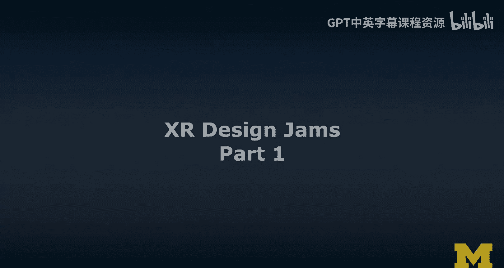
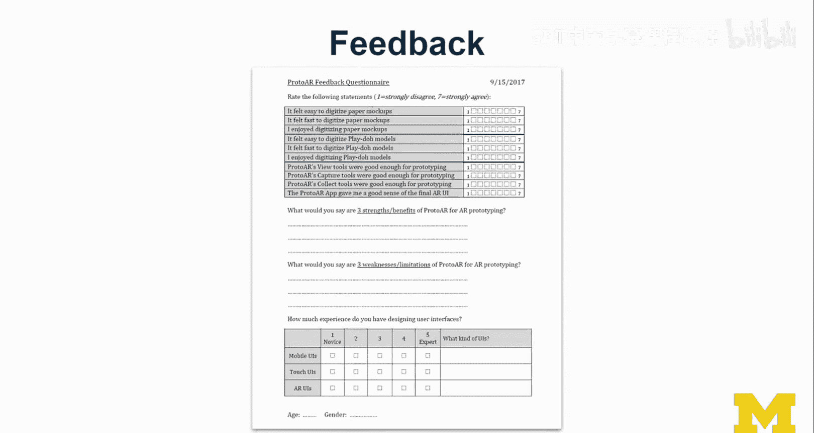
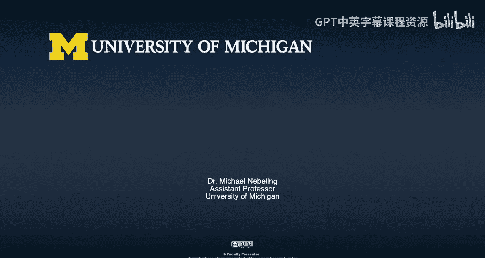

# 057：XR设计研讨会第一部分 🎨

在本节课中，我们将学习什么是XR设计研讨会，以及如何规划和运行一个有效的设计研讨会。我们将从组织者和参与者的不同视角，探讨设计研讨会的核心要素、准备工作和执行技巧。

---

## 概述

设计研讨会是一种协作式的设计活动，参与者通常在数小时内集中解决一个特定的设计任务。它类似于黑客松，但时间更短、更聚焦。这类活动能汇集利益相关者，包括目标用户和设计团队成员，共同创造和探索XR设计方案。接下来，我们将深入了解设计研讨会的关键组成部分。

## 设计研讨会的核心要素

要成功举办一个设计研讨会，需要考虑以下几个核心要素：

*   **目标与任务**：明确你希望参与者完成什么，以及你希望从活动中学习到什么。每个任务都应导向一个清晰的**交付成果**。
*   **设备与工具**：决定使用哪些AR/VR设备。提供的工具可以是物理材料（如纸张、透明胶片、纸板），也可以是特定的**数字工具**或软件模板。
*   **时间安排**：合理规划时间。即使是三小时的活动，如果安排得当，参与者也会感到高效和充实。

## 规划设计研讨会

上一节我们介绍了设计研讨会的基本要素，本节中我们来看看如何具体规划一个设计研讨会。规划是成功的关键。

首先，需要确定参与者的构成。是面向所有人开放，还是针对具有特定经验或技能的焦点小组？这会影响活动的进程和结果。

其次，考虑研讨会前后需要做的事情。例如，你可能会要求参与者在活动前填写背景问卷，或在活动后提供反馈。如果活动前进行，问卷还可以作为筛选参与者的工具。

在数据收集方面，如果你将设计研讨会作为研究项目的一部分，需要获得伦理审查委员会（IRB）的批准，并制定计划来保护参与者权利，例如对数据进行去标识化和匿名化处理。

为了确保所有参与者在活动开始时理解一致，通常可以以一个演示环节开场。例如，展示某种AR/VR技术或应用，甚至是一个创作工具。如果你们已经有一个初步设计，也可以将其作为研讨的起点。务必为参与者提供参考资料，以便他们在活动过程中随时查阅。

最后，高效的组织离不开充分的物料准备。提前准备好所有参与者可能需要的材料，能显著提升他们的参与效率和贡献度。

以下是成功规划的几个关键步骤：

1.  **明确问题陈述**：直接向参与者阐明要解决的核心问题，避免他们将大量时间浪费在理解任务上。
2.  **提供清晰的设计提示**：设计提示应简短、精确，在留有创新空间的同时，也要对参与者构成挑战。
3.  **设计一致的活动结构**：为每个活动环节设定明确的目标和任务描述，并清楚说明期望的交付成果。
4.  **计划反馈收集**：在研讨会结束时，安排汇报环节，并结合讨论和问卷来收集参与者的体验反馈和改进建议。

## 运行设计研讨会

规划完成后，接下来就是运行研讨会。本节我们将分享一些实际运行时的技巧。

从引导者的角度来看，独自运行整个研讨会是困难的。最好有一个小团队协助，负责计时、回答问题、记录观察笔记等。在正式活动前进行一次彩排也很有帮助，可以提前发现并解决一些问题。

在收集反馈时，可以设计一份简洁的问卷。开头部分可以聚焦于与研究最相关的问题，中间部分留出开放性问题空间，结尾可以收集人口统计信息。即使是开放性问题，也可以给出引导，例如：“请列出两个本次体验的优点和两个缺点。”

## 总结

本节课中我们一起学习了XR设计研讨会的基本概念、核心要素以及规划和运行的完整流程。设计研讨会是一个强大的工具，能够快速汇集创意、验证想法并吸引人才。通过精心的规划、清晰的引导和有效的反馈收集，你可以组织一场富有成效且令人愉悦的设计协作活动。