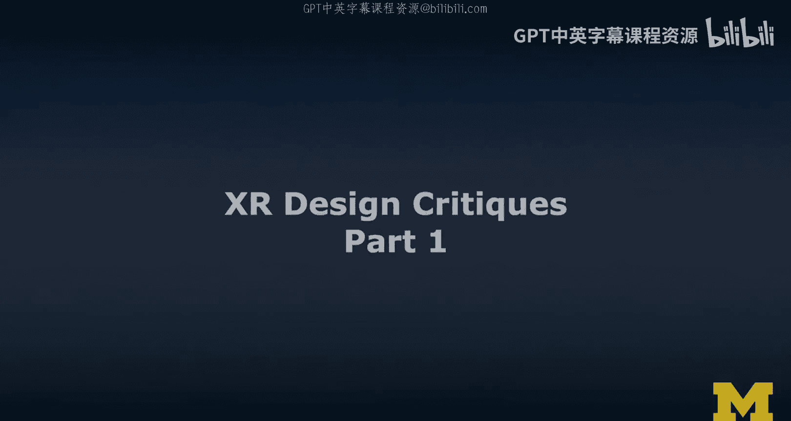
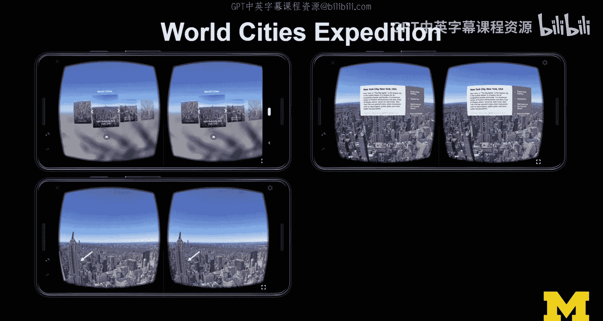
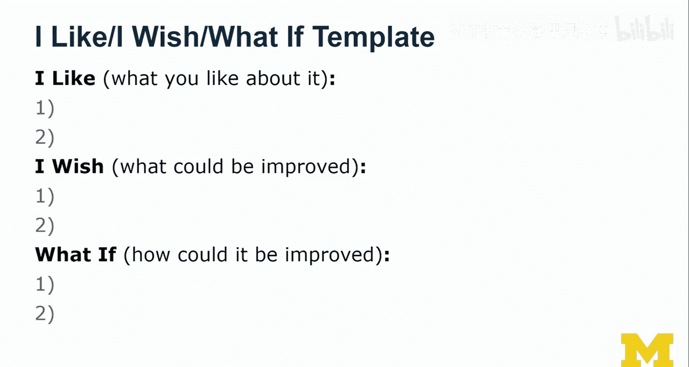
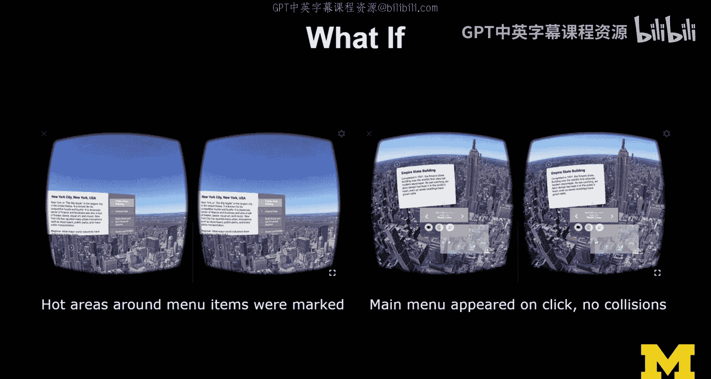

# 059：XR设计评审第一部分 🎯

在本节课中，我们将学习如何进行XR设计评审。设计评审是一项至关重要的技能，它能帮助我们系统地评估和改进设计。我们将介绍一种名为“我喜欢、我希望、如果…会怎样”的结构化评审方法，并以Google Expeditions应用为例进行实践。

---

## 什么是设计评审？ 🤔

设计评审，或称“设计评论”，是许多领域（包括建筑和设计）中广泛实践的一种活动。它本质上是一种**建设性的批评**，旨在进行彻底的审查。评审时，我们会参考设计准则以及自身创建体验的经验。

上一节我们介绍了设计评审的概念，本节中我们来看看评审的核心价值。我认为，最优秀的设计师都具备批判性眼光，能够发现设计中的问题。发现问题相对容易，而**提出包含改进建议的建设性评审**则更具挑战性。这不仅仅是说“不行”，而是要提出“或许可以换个思路”或“为什么不试试这个”的建议。同时，优秀的设计师也需要具备**回应和处理反馈**的能力。

---

## 实践工具：Google Expeditions 📱

为了进行实践，我们需要一个工具。如果你有一部兼容Google Cardboard或其衍生品的智能手机，就可以跟随操作。我将使用一个塑料版本的Cardboard。Google Expeditions应用同时支持iOS和Android系统，并能在VR和AR模式间切换，这为我们提供了绝佳的评审案例。

接下来，我将对Google Expeditions应用进行评审，重点关注其VR体验、360度视图切换功能以及AR展览示例。请注意，Expeditions作为一个平台，可以加载由不同供应商创建的各种“探险”内容，这为我们提供了丰富的评审素材。

---

## 初步探索与问题发现 🔍

现在，让我们启动Google Expeditions应用，并使用Cardboard进行初步探索。我将以“纽约市之旅”为例。

在探索过程中，我注意到了一些设计上的优点和问题。以下是我在“出声思考”过程中发现的一些关键点：

*   **视觉引导出色**：我喜欢应用使用箭头等视觉线索来引导用户找到地标，这非常有效。
*   **场景切换菜单**：主菜单允许用户切换不同场景，这个功能很好。
*   **菜单交互问题**：然而，菜单的**可供性**和**视觉反馈**不够清晰。有时我不清楚如何调出菜单，菜单出现的方式似乎与某种头部移动方式有关，但这并不直观。
*   **意外触发**：在尝试选择特定场景（如“哈德逊河日落”）时，我容易误触其他选项，需要格外小心。
*   **视角不适**：当视角需要大幅向下移动时，由于只有**三自由度**（仅头部旋转，无位置追踪），体验会有些不适。用户虽然可以身体前倾，但场景并不会做出相应反应。
*   **音频提示缺失**：尽管我开启了音频功能，但全程没有听到解说员的叙述。应用本应具备旁白功能，但在此次体验中未能生效。
*   **菜单重叠**：有时菜单会相互重叠，干扰视线，并且不清楚哪个菜单项会被触发。

---

## 结构化评审方法：“我喜欢、我希望、如果…会怎样” 📝

为了更系统、更建设性地组织我们的评审意见，我将介绍一个在斯坦福大学等设计思维课程中广泛使用的模板。这个模板能帮助我们从积极反馈过渡到建设性批评。

以下是该模板的结构与应用方法：

1.  **我喜欢**：首先，指出设计中你最喜欢的两点。这不应是为了说好话而说好话，而是要真诚地指出那些让你觉得惊艳、给你灵感，甚至你想融入自己设计实践的优点。这为评审奠定了积极的基调。
    *   **示例**：我喜欢视觉线索帮助我找到地标的方式。

2.  **我希望**：接着，提出你认为最需要改进的两个方面。这是批评的部分。请专注于最重要的两点，不要罗列过多，以免让负面评价压倒之前的正面反馈。最好能引用设计准则或相关研究来支撑你的观点，增加说服力。
    *   **示例**：我希望菜单的可供性和视觉反馈能更清晰一些。

3.  **如果…会怎样**：最后，也是最重要的一步，针对“我希望”部分提出具体的改进建议。不要只指出问题，还要构思解决方案。可以尝试提出两个“如果…会怎样”的设想。这部分最能体现评审的建设性价值。
    *   **示例**：*如果*我们在菜单项周围设置明确的热区标记，*会怎样*？*如果*主菜单能在点击时出现，并且确保菜单间不发生重叠碰撞，*会怎样*？

---

## 应用模板：评审Google Expeditions ✨

现在，让我们将“我喜欢、我希望、如果…会怎样”模板快速应用到刚才的Google Expeditions体验中。

*   **我喜欢**：
    1.  视觉线索能有效帮助我定位地标。
    2.  主菜单提供了便捷的场景切换功能。

*   **我希望**：
    1.  菜单的可供性和视觉反馈能更清晰。
    2.  能有更明确的方式来触发主菜单（而不是依赖不直观的头部动作）。

*   **如果…会怎样**：
    1.  *如果*我们在菜单项周围设计明确的热区或高亮标记，*会怎样*？这能显著提升点击的准确性和反馈感。我们可以通过简单的图像叠加来演示这个改进。
    2.  *如果*主菜单能在用户明确点击时出现，并且通过算法避免菜单间的重叠碰撞，*会怎样*？考虑到这是**三自由度**体验，我们无法依赖Z轴深度，因此必须在二维界面布局上精心设计，防止视觉干扰。

---

## 继续探索与总结 🚀

在初步评审后，我们可以继续探索应用的其他功能，例如其出色的360度视图切换，以及AR展览示例。你可以尝试用同样的“我喜欢、我希望、如果…会怎样”方法对这些部分进行独立评审。

通过观察他人如何探索界面并即时提出批评，你可以学习到宝贵的评审技巧。关键在于保持开放心态，既能看到设计的闪光点，也能精准定位问题并提供可行的解决方案。

---

本节课中我们一起学习了XR设计评审的重要性，并掌握了一种名为“我喜欢、我希望、如果…会怎样”的结构化评审方法。我们以Google Expeditions应用为案例，实践了如何发现设计问题、给出积极反馈以及提出建设性的改进建议。记住，优秀的评审是推动设计进步的关键。