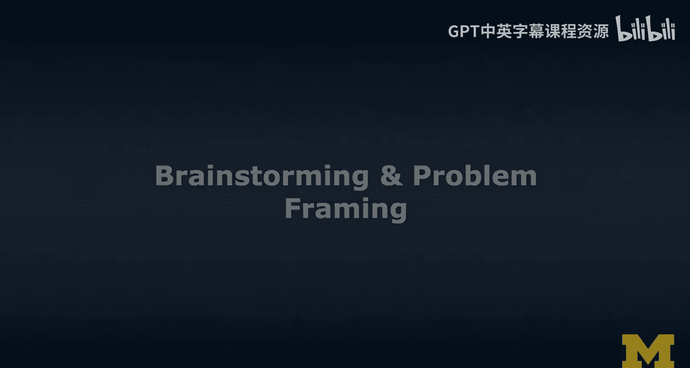
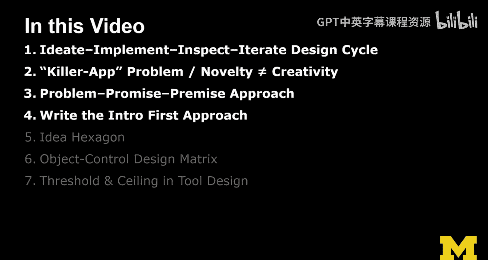
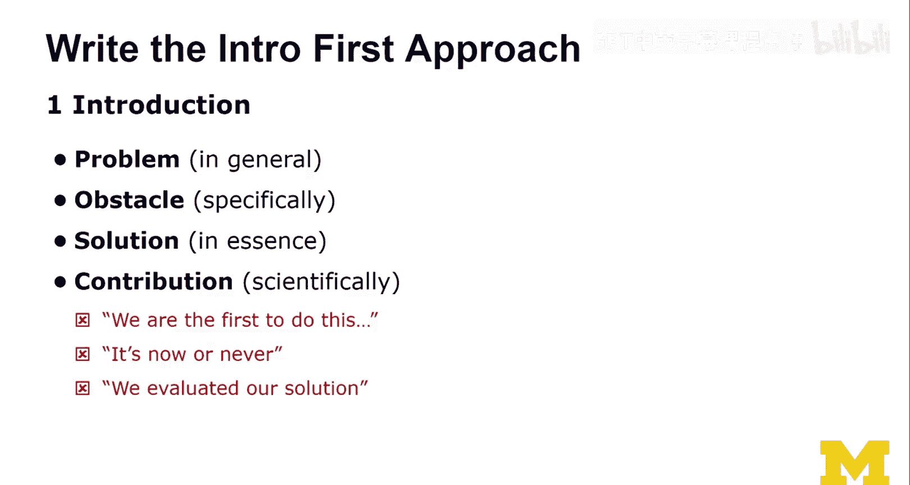
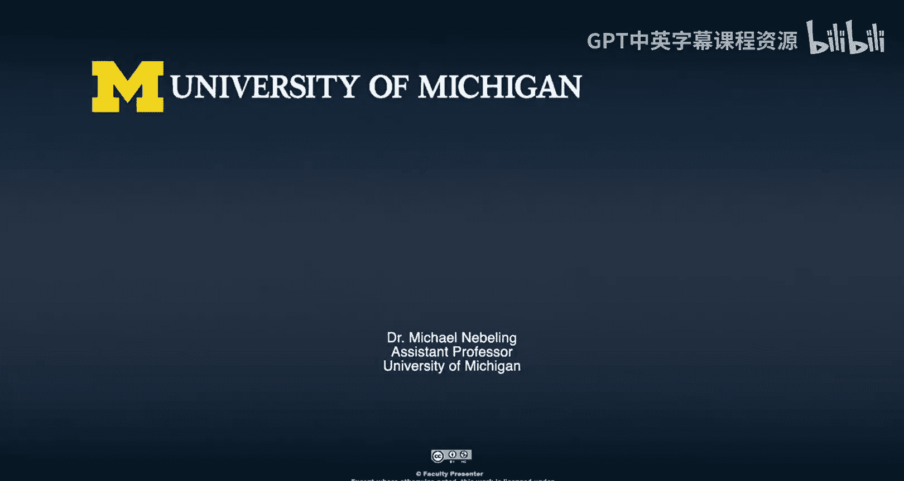

# 063：创意构思与问题定义 🧠

在本节课中，我们将探讨在扩展现实（XR）领域进行创意构思与问题定义的方法。我们将学习如何发现真正有价值的问题，并介绍一系列实用的技巧来帮助你进行创新。

## 概述

在扩展现实（AR和VR）的背景下，创意构思与问题定义至关重要。目前，我们可能尚未完全掌握正确的方法，核心问题在于我们并非总能精准地定义和解决问题。本节课程将分享七种技巧，帮助你找到好问题、识别问题，并有效地进行创新。

## 创意构思与问题定义技巧

上一节我们概述了课程目标，本节中我们来看看具体的七种创新技巧。

### 1. 构思-实现-检验-迭代设计循环

第一种技巧是我称之为“构思-实现-检验-迭代”的设计循环。一切始于一个想法，你必须进行构思。构思的一部分实际上是实现这个想法，即创建一个原型。然后检验它——不仅仅是作为设计师自我检验，更重要的是与用户一起测试和验证。最后，基于反馈进行迭代。通过原型设计，我们可以深入了解实际问题本身，而不仅仅是我们的解决方案。我将构思用于问题定义，这是一个非常重要的认识。因此，构建原型以帮助你理解问题的本质，与用户一起测试，观察他们的反应，并通过迭代来深化你对问题的理解，同时完善你的解决方案。

### 2. 杀手级应用问题与局部创新

第二种技巧更多是关于如何思考问题。所谓的“杀手级应用问题”是指你试图寻找那个颠覆性的应用，但可能目标定得过高。与其试图发明一个全新的事物，你也可以着眼于现有事物，只需在其中某一个方面展现出创造性和新颖性即可。实际上，新颖性和创造性并非同一回事。在我看来，新颖性意味着成为第一个做某事的人，但这个主张本身并不总是强有力的，因为你可能是第一个提出或实现一个非常糟糕想法的人。而创造性则意味着你以不同的方式看待事物，或者通过提出一个小的新事物来进行创新。当我谈到“设计瑰宝”时，我已经讨论过这种思想：在你处理问题、执行方法、制作原型和实现方案的方式上力求创新。我认为这非常酷，这才是你应该发挥创造力的地方。但你不需要在整个想法上都追求新颖，这一点非常重要。所以，专注于做好一件事，并在那里实现突破。

### 3. 问题-承诺-前提方法

接下来我想讨论的是如何定义问题，以及如何验证你是否提出了正确的问题。我称之为“问题-承诺-前提”方法。关于你试图做的事情，我要问的第一个问题是：你的XR解决方案要解决什么问题？如果没有问题，那么你就没有解决方案。如果你很难告诉我问题是什么，那么你应该重新思考。此外，如果你认为自己知道问题是什么，那么它难在哪里？为什么它很重要？这里我有一个小的区分：为什么它对你很重要？因为泛泛而谈某事的重要性，我常常感到困难。但我可以告诉你，我所从事的一些研究至少对我很重要，因为我观察到人们（尤其是学生）在学习设计时遇到的困难。在我关于XR（特别是原型工具）的研究中，我观察到新手设计师在掌握XR概念和技术时确实很吃力，这至少是我关心的问题。实际上，事实证明这确实是一个问题，很多人正试图在这个领域进行创新（尽管并非总是有好主意）。因此，大家对这个问题的共识，实际上是一个信号，表明你找对了方向。接下来我要问你的问题是：你的XR解决方案的承诺是什么？即，你提供了什么？XR能在哪里提供帮助？这是你的价值主张。然后，我想更仔细地审视“为什么是XR”这个想法。你的XR解决方案的前提是什么？请批判性地、仔细地问自己：为什么XR能解决这个问题？当我说XR时，你应该更明确地说明增强现实（AR）还是虚拟现实（VR）是正确的方法。然后，你的假设是什么？就像每个解决方案都有一些假设一样，每个设计我们都会做出假设，请先把它们写下来。

### 4. 科学贡献的阐述

如果你考虑一篇论文的引言部分，现在我来谈谈其中应包含的内容。首先是**问题**，这是在更一般的层面上。然后是**障碍**，在这个大问题中，你试图解决的具体是什么。你应该把它说清楚。你在这个大问题中具体讨论什么？接着，你应该在本质上介绍**解决方案**，而不是全部细节（你可以在论文的其余部分描述）。本质上，从宏观视角看，这里的解决方案是什么？然后是最难的部分：科学地阐述你的**贡献**。很多人在这里遇到困难，包括一年级博士生和经验丰富的老教授，都很难精准地定义贡献。多年来我观察到一些让我很困扰的表述，也许你应该尽量避免，因为我认为它们并不是很好的论据。

以下是几种应避免的无效贡献表述：

*   **我们是第一个做这个的**：正如我所说，这并不意味着这是个好主意，而且这实际上不是一个强有力的论据。
*   **机不可失**：这就像在说“请现在就接受我的论文吧”。我经常看到这种说法。
*   **时效性**：科学界其实很清楚，如果你试图解决一个老问题，我可以说我们可能没有取得正确的进展。
*   **我们评估了我们的解决方案**：这最后一个可能只是针对科学界而言，评估你的解决方案并不是一种贡献，这只是预期要做的事情。我们是科学家，显然我们会评估自己的解决方案。所以不要把它当作贡献来宣称。

好了，我的“吐槽”结束了，我们可以继续看一些更偏向设计导向的技巧。

### 5. 以用户为中心的原型测试

通过构建原型并让真实用户进行测试，是验证问题定义和解决方案有效性的关键。观察用户如何与你的原型互动，倾听他们的反馈，这能揭示你最初可能忽略的问题本质或新的使用场景。

### 6. 跨学科视角借鉴

从其他领域寻找灵感。游戏设计、工业设计、心理学、建筑学等领域的方法和原则，常常能为XR的问题定义和解决方案带来全新的、富有创造性的视角。

### 7. 约束条件下的创意激发

有时，明确的限制（如技术限制、预算限制、时间限制）反而能激发更强的创造力。尝试在特定约束下进行构思，例如“如何只用手机AR解决这个问题？”或“如何在一天内做出一个可测试的原型？”，这能迫使你专注于核心问题并产生更务实的创意。

## 总结

本节课中，我们一起学习了在扩展现实领域进行有效创意构思与问题定义的七种核心技巧。我们从“构思-实现-检验-迭代”的设计循环开始，强调了通过原型理解问题的重要性。接着，我们探讨了避免好高骛远、专注于局部创新的价值，并介绍了用于厘清思路的“问题-承诺-前提”方法。我们还讨论了如何科学地阐述贡献，并指出了几种应避免的无效论据。最后，我们简要提及了以用户为中心、跨学科借鉴和在约束下激发创意等实用方法。掌握这些技巧，将帮助你更精准地定义XR领域中有价值的问题，并为其设计出创新且有效的解决方案。