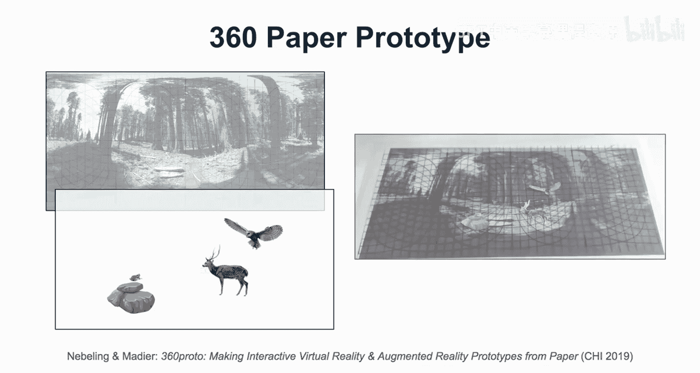
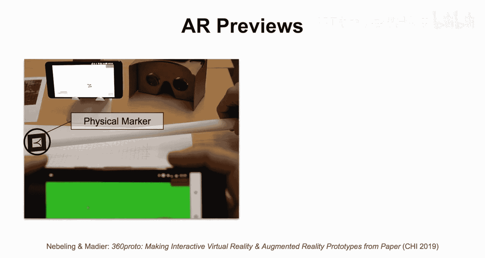
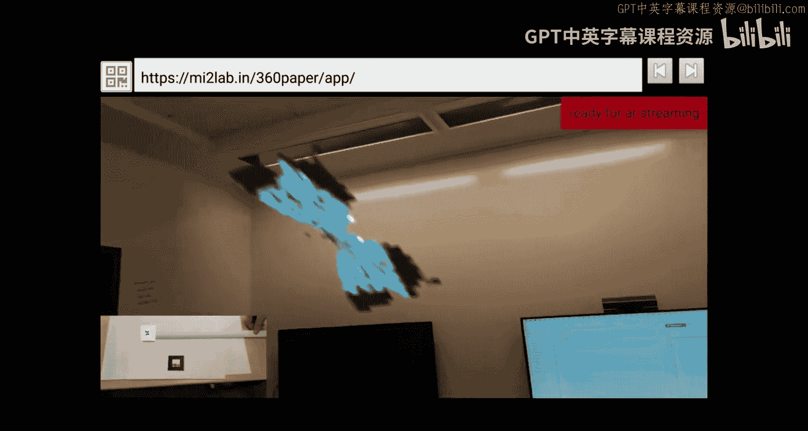

# 069：实体原型设计Ⅰ

## 🎯 概述

在本节课中，我们将学习实体原型设计。实体原型设计是整体原型设计流程中至关重要的一环，它位于故事板设计和数字原型设计之间。我们将探讨几种不同的实体原型技术，包括纸面原型、360度纸面原型、立体模型以及粘土建模。掌握这些技术能帮助你更高效地构思和验证设计，从而在后续的数字开发阶段节省大量时间。

---

## 📄 实体原型设计的重要性

实体原型设计是整个原型设计流程中非常关键的一步。我个人认为它极其强大，值得投入相当多的时间。因为如果你能把实体原型做对，就能深入了解数字原型，从而在后续工作中少走弯路，更快地进行迭代。这就是为什么我认为它在整体原型流程中如此重要。

接下来，我将展示一些在我的课程和研究中创建的实体原型例子。

---

## 🛠️ 实体原型技术概览

在这一部分，我将介绍几种不同的技术。我会沿用之前使用的分析框架：如何从低保真度向高保真度过渡，以及这些技术在从易到难的谱系中处于什么位置。

我们刚刚看到了一个纸面原型的例子，这对于思考基本交互方式来说是一个非常好的方法。但对于某些需要原型的特定AR/VR交互技术来说，它可能有些局限。因此，我还会向你介绍**360度纸面原型**。

此外，我将讨论**立体模型**。立体模型是你想要创建的AR/VR场景的微型3D实体原型。我认为这是思考**空间关系**的绝佳方式。这里所说的空间关系，指的是我们AR/VR体验中的用户（可能不止一个）、他们使用的设备，以及体验中任何物理和虚拟对象之间的空间布局。你可以在不使用任何数字工具的情况下，实体化地原型设计所有这些内容。

最后，我们将讨论通过实际使用**建模粘土**进行实体原型设计。我认为这是在3D空间中快速建模的一种非常快捷的方式。就我个人而言，我不太擅长使用3D建模工具。如果你有建筑背景，或许可以跳过这一步。但总的来说，在更大的实体原型设计工作流中，使用粘土进行3D建模对于创建主要的3D角色和在物理上演绎故事，然后再进行数字实现，是非常有益的。

---

## 📝 纸面原型设计

让我们从纸面原型开始。1994年有一篇著名的论文《为小巧手指设计的纸面原型》，引入了使用纸面原型进行测试的想法。

以下是纸面原型测试的基本角色设置：
*   **用户**：尝试体验原型的人。
*   **协调者**：引导测试流程的人。
*   **“计算机”**：一个真人，负责根据设计师预先制作好的素材，选择和展示不同的屏幕。
*   **记录员**：记录测试过程的人。

那么，这个想法如何转化到AR/VR原型设计中呢？在我们的研究项目“360 Proto”中，我们进一步发展了这些想法。

现在，我们的用户在VR或AR中。我们仍然有一个协调者，但这个协调者还有一个额外的任务：实际拍摄我们在纸上制作的这些模型。我们仍然有“计算机”角色，他仍在生成素材，但我们使用了特定的模板——即我之前提到的360度故事板模板——来真正创建360度纸面原型。在整个过程中，我会展示一些例子。你可以让这些原型“活”起来，让测试用户实际上在VR或AR中体验纸面原型，这非常强大。

---

### 纸面原型的类型与优势

我们可以将纸面原型区分为两种：
1.  **传统纸面原型**：不使用任何特定模板。
2.  **360度纸面原型**：使用专门的360度网格模板，这使得原型制作过程和最终用户体验都不同。

那么，纸面原型（特别是传统纸面原型）到底好在哪呢？

它们能让故事板变得生动。这正是我们所做的：我们拿着一个故事板，向其他设计师或用户解释它。你可以向用户演示交互。用户可以通过一些想象力来感知这个原型，从而理解这些设计如何转化为AR/VR交互。

在图像中，你可以看到我们如何使用纸板、小棍或牙签。在后面的例子中，你会看到我们如何将平面人物图贴在牙签上，从而在用户面前相对流畅地让物体动起来，让他们感觉这确实是一个交互式原型，尽管它仍然在纸上。

**以下是一个具体例子：**
在一个VR体验原型中，用户用VR控制器指向森林动物，周围的设计师则根据用户的交互来让这些动物做出反应。这是一个非常交互式的故事板，你可以让新元素出现，比如一只青蛙，由用户与VR控制器的交互触发。这极大地帮助用户理解，当他们与森林动物等不同元素互动时，这个VR体验将如何展开。

---

### 360度纸面原型

现在，如果你用360度模板来原型设计同样的体验，情况会有些不同。你必须注意模板，并相应地移动这些动物等元素。

这样，你就可以在用户周围360度地布置内容，但要注意网格线意味着什么。你不能太快地移动物体，必须遵循这些网格线，这需要一点练习，但确实是原型设计360度体验的强大方法。

正如我所说，你可以沿着这些网格线演示交互，例如，让某个东西绕着用户飞。你还可以使用不同大小的物体来模拟深度。

请记住，360度照片故事和360度照片，正如我之前提到的，实际上没有深度，并非真正的3D。因此，模拟深度的一种方法就是使用不同大小的物体。

**其工作方式是：**
设计师正在原型设计一只鸟飞下来。现在，这只猫头鹰已经落在了树上，我们基本上只是替换了模型。这个想法正在实现。这是我们与学生一起原型设计的一个体验。在这个阶段，我们并没有特别注意网格线，我们还在熟悉模板。但我会展示我们如何能将这个故事板提升到下一个层次。

因为核心思想是，你实际上可以拍摄这个视频，并在360度环境中回放。记住，它遵循360度格式，我们实际上可以为VR用户可视化这个纸面原型。

---

### 将纸面原型带入VR

接下来我将快速展示这一点。我们可以组合一个场景：将360度网格模板放在上面，然后添加我们想让用户看到的元素。你可以将它们间隔开，可以剪下来，可以画出来，可以与故事板关联。但对于纸面原型，我通常使用剪纸，这样可以更容易地制作动画，可以重复使用或替换模型，非常强大。

然后，你可以像这样组合一个场景。因为这里仍然遵循360度模板，我们现在可以做的就是：给模板拍一张特写照片，将照片包裹在纸板中，然后在VR中体验它。我来快速说明一下。

这是一张纸面原型的特写照片。我们拍下照片，进入VR，然后通过立体视图看到它。我会在视频中展示同样的效果。

这是我正在拍摄一个先前原型设计的体验。我点击按钮，手机已经在纸板里了，我可以开始预览，在某种意义上预可视化这个3D场景。你可以看到网格线。如果你使用透明层或其他方法，可以移除这层网格线。这样你就有了一个非常快速的可视化纸面原型的方法。

现在，你可以让协调者或“计算机”对这个场景构图进行调整。我们可以看到，猫头鹰移动得更近了。如果你将此与实时流媒体结合，你实际上可以模拟交互式的360度故事板。这是我的“360 Proto”研究工作中的一部分。

---

### 创建AR预览

稍微有点棘手的是用这种方式创建AR预览。我现在要展示的是我在“360 Proto”研究项目中开发的一个想法。

我们将使用360度模板，对其进行映射。我们给它拍张照片，将其映射到一个3D球体中。我们的目标是让一只蝴蝶围绕用户动画，或者至少让一只蝴蝶停留在空中，这样AR用户就可以四处走动，实际体验那只蝴蝶。

在这个例子中，我没有移动蝴蝶，但你仍然能看到一个很酷的效果。那么我们如何原型设计这个呢？我们可以使用额外的AR技术，比如标记。这里使用了一个物理标记。我们可以用手机捕捉并实时流传输，然后我们可以拍下那张照片，移除背景（白色变成绿色，然后变成透明），提取出蝴蝶，并在确切的位置显示它。

我们这样做的方法是：再次使用360度网格来注意物体在用户周围的位置，并用我们的虚拟叠加层（本例中是蝴蝶）替换那个标记。

**让我们体验一下：**
这实际上是我和我的学生凯蒂一起工作。我们现在让这只蝴蝶在我们的摄像头前移动，并将此实时流传输到你在背景中看到的另一部手机上。下一步我将向你展示如何操作。

我拿起手机，然后蝴蝶就在那里了。因为我们使用的是带有摄像头的AR技术，智能手机摄像头需要暴露出来才能工作，我们实际上可以绕着这只蝴蝶走。在这个阶段，如果我们将其实时流传输给VR或AR用户，他们就能获得非常酷的体验。

---

## 📚 总结

本节课我们一起学习了实体原型设计的第一部分。我们探讨了实体原型在整体设计流程中的关键作用，并重点介绍了**纸面原型**和**360度纸面原型**这两种技术。我们看到了如何将简单的纸张和模板转化为可交互、甚至可在VR/AR中预览的生动原型。这些方法能帮助你在投入数字开发之前，快速、低成本地验证空间布局、交互逻辑和用户体验。

这只是实体原型设计的第一部分，但我希望已经向你阐明了如何用纸张创造出数字化的体验。这些内容在我的研究中都有更详细的描述，我和其他研究者也一直在致力于此。希望未来能有更好的工具支持。同时，我会提供我在研究中创建的一些工具的访问权限。