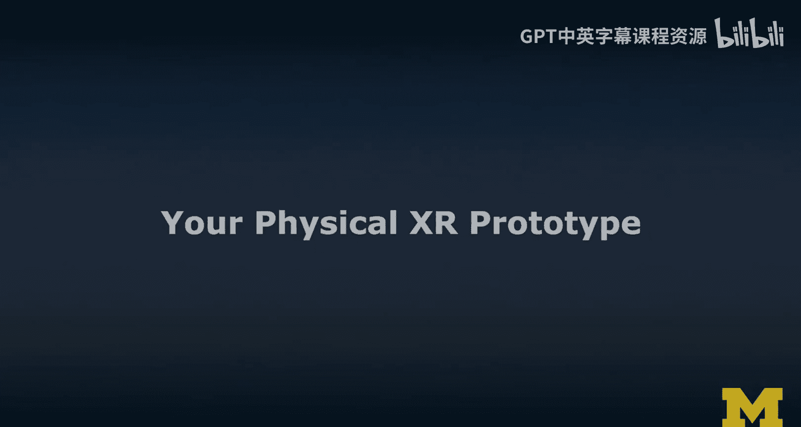
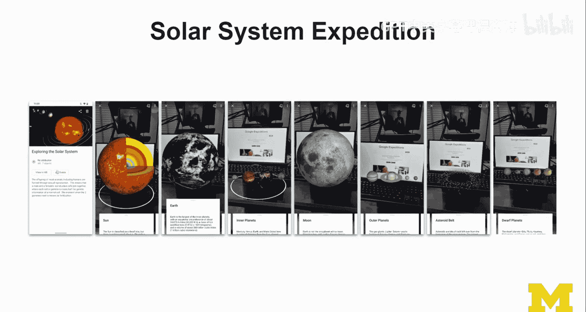
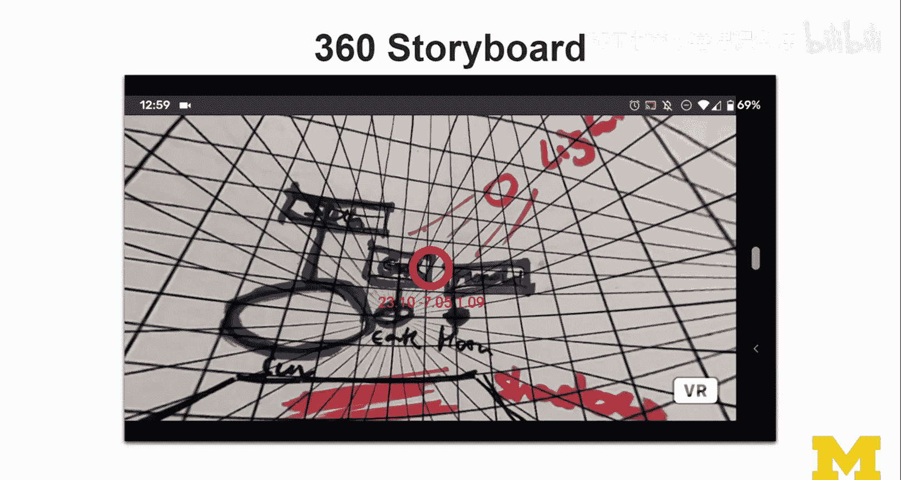
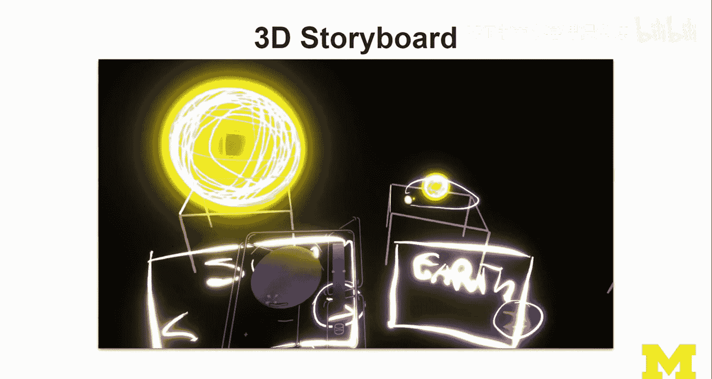
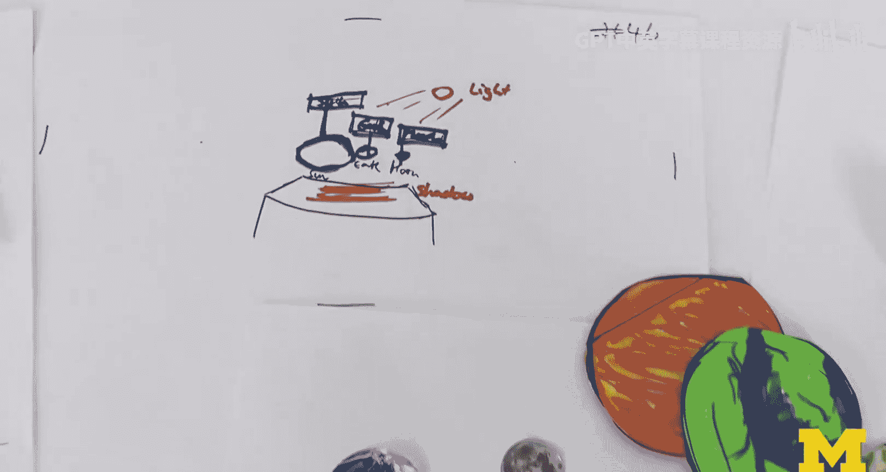
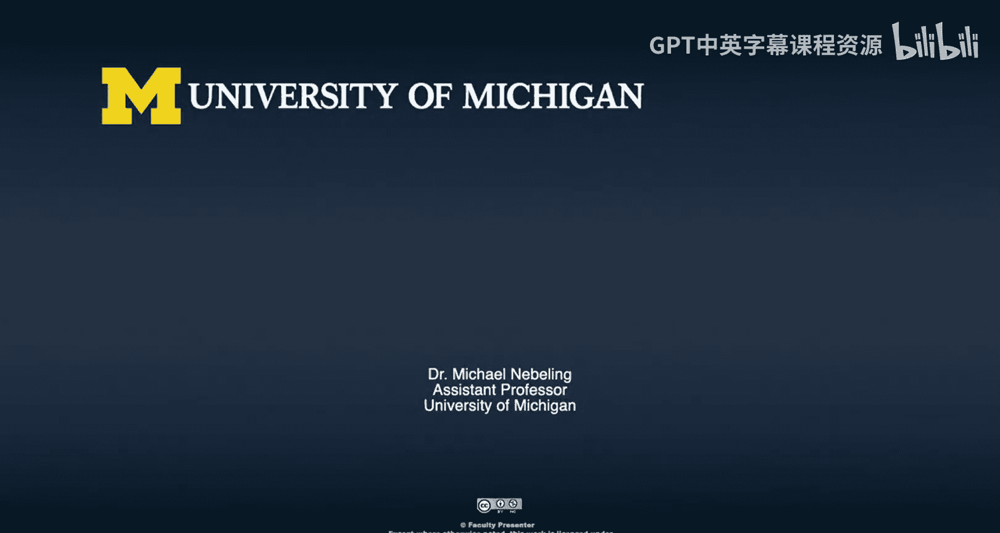

# 072：XR实体原型实践 🛠️

在本节课中，我们将学习如何为XR应用创建实体原型。实体原型是设计过程中的关键步骤，它允许我们在投入数字开发之前，以低成本、快速的方式探索和验证交互、故事和空间关系。

上一节我们讨论了故事板和设计构思，本节中我们将把这些想法转化为更具体、可触摸的实体形式。

## 概述：实体原型的目标

实体原型的目标是**聚焦于关键交互**。虽然内容也很重要，但现阶段我们需要在交互设计上取得更多进展。我们将通过以下方式实现：
*   创建应用的纸质原型。
*   使用黏土制作3D角色模型。
*   构建一个立体布景来定义故事。

立体布景不必非常复杂，可以像立体书一样，让元素从纸面上“弹出”，进入物理空间。我们不只是做平面纸质原型，而是要更实体化。

## 任务说明

你的任务是创建一个类似“探险”应用的XR实体原型。规则如下：
*   **应用类型**：类似“Google探险”，但不限于此。它可以是VR、AR或360度视频体验。
*   **核心活动**：创建关键交互的纸质原型。
*   **扩展活动**：
    1.  用黏土制作2-3个主要3D角色。
    2.  用这些角色创建一个立体布景来讲述故事。
    3.  录制一段视频，并解说其中的交互。这能让你的原型生动起来，也便于分享。
*   **可选活动**：创建一个360度纸质原型来定义环境上下文。如果你之前做过360度故事板，这尤其有意义，可以将其细化为原型。

以下是不同类型原型的预期产出价值：
*   **更好地理解问题、环境和故事**：这些是XR（乃至所有用户界面）的关键要素，故事在XR中尤为重要。
*   **识别关键元素**：明确环境和3D角色，这有助于为后续的数字原型和开发确定资源需求。
*   **探索交互**：实体原型允许你摆弄材料，尝试不同的构图、场景转换和动画效果。许多需要在数字世界中编程实现的动作，现在可以在物理世界中直接模拟。
*   **感受技术和数字原型需求**：这是进行实体原型制作的主要原因。

## 实体原型实践指南与心得

我将分享自己在准备课程时进行原型制作的经验和技巧。

### 从纸质原型开始

我通常从在纸上勾勒屏幕开始。即使设计一个AR体验，也可以先画出智能手机上的不同界面状态。这不仅仅是线框图，可以上色，做成更像屏幕的样子。

**一个有用的技巧是**：将这些草图拍照，然后用手机在不同屏幕和状态间切换预览。你还可以在纸上标出交互区域（例如，用蓝色高亮），思考用户点击后的反馈。

### 探索360度纸质原型

接下来，我使用了360度模板。这个模板本身没有深度，但你可以通过使用不同尺寸的物体来模拟深度感，并尝试各种转场和“轨道运行”效果。

**关键在于预览**：这个模板采用等距角格式，可以转换为球形并放入3D场景，从而在VR或AR中预览。我会在不同阶段拍照并预览，这常常能带来关于比例的意外发现。

为了提高保真度，你完全可以打印出图片素材（如地球、太阳的图片）贴在模板上使用，而不必手绘一切。模板非常灵活，只需注意物体的比例和位置。

### 制作3D黏土模型

使用黏土制作3D模型是迈向更高保真度的一步。在物理世界中制作模型会面临分辨率和物体尺寸的限制，但这恰恰能引发有趣的思考：这些限制如何转化为VR/AR中的尺度问题？尺度是我们最容易出错的地方之一。

你可以制作不同尺寸的同一物体，用于特写或远景。使用纹理板可以为模型增加表面细节，使其在视频中更突出。用牙签或其他方式固定物体，可以方便你摆弄它们，尝试不同的构图和“动画”效果。

### 构建立体布景

立体布景是前期实体原型步骤的集大成者。我将所有材料整合在一起，搭建了一个场景。更有趣的是，我再次使用工具进行了AR预览。

**一个很酷的环节是混合物理与数字**：我让数字AR物体漂浮在实体桌面上，然后尝试加入一个实体月亮模型。这时会发现遮挡关系无法正确实现，因为摄像头难以识别离镜头太近的物体，当前AR框架也尚未实现肢体分割。这些都是在实体原型阶段就能发现的技术问题。

## 总结与回顾

本节课中，我们一起学习了XR实体原型制作的完整流程。我们从简单的纸质原型和360度模板入手，逐步进阶到使用黏土制作3D模型，并最终构建了混合物理与数字预览的立体布景。

实体原型的力量在于，它让你摆脱技术限制，专注于核心的交互、故事和空间设计。通过动手摆弄这些物理材料，你能获得对尺度、构图和用户体验的直接洞察，这些都是在直接进行数字编程前极其宝贵的发现。

请尝试完成这个练习的至少一部分，录制并分享你的视频。更重要的是，反思这个过程：你学到了什么？这种方法有什么局限性？例如，在做VR设计时仅使用纸张有何困难？360度体验如何转化为AR？提出这些问题，将促使更深入的思考和讨论。

记住，现阶段请坚持使用实体材料。我们将在接下来的课程中，再进入数字原型和开发的世界。