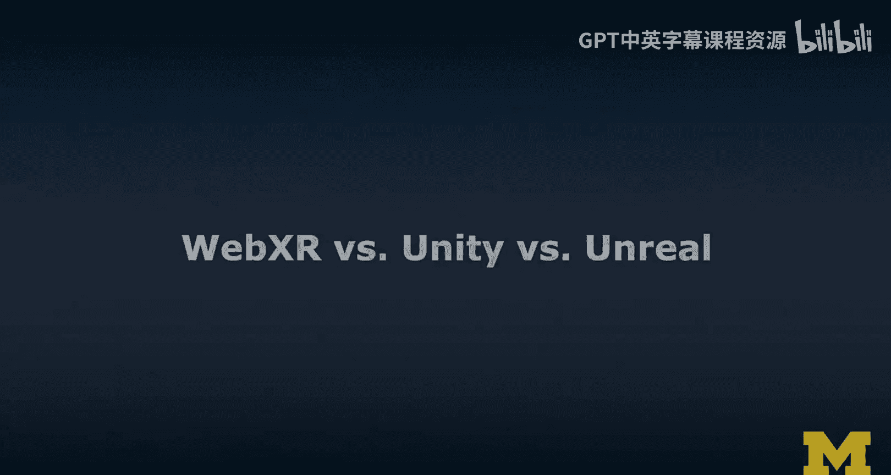
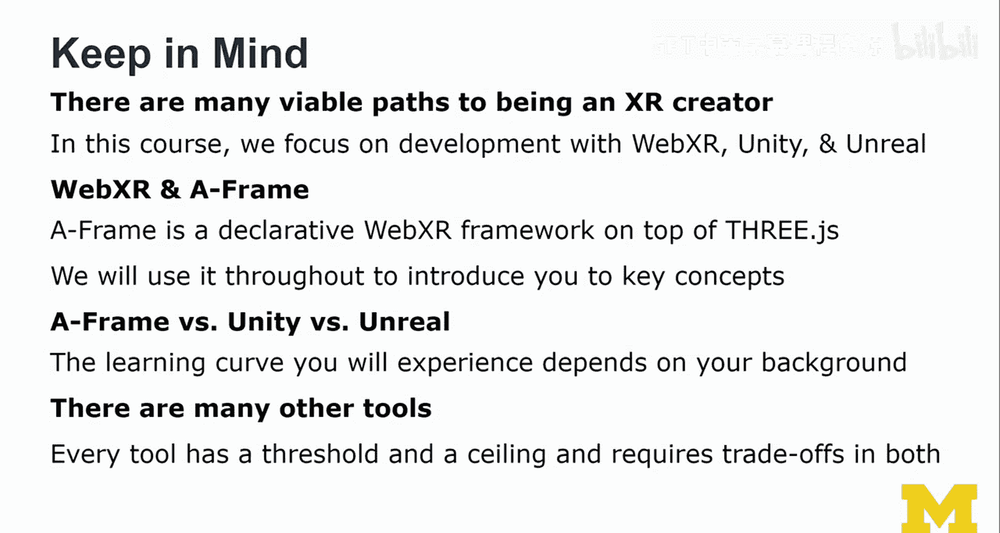

# 088：WebXR、Unity与Unreal引擎对比分析 🎮

在本节课中，我们将对三种主要的XR开发工具——WebXR（以A-Frame为代表）、Unity和Unreal引擎——进行全面的对比分析。我们将探讨它们各自的定位、特点、适用场景以及如何根据你的背景和目标选择合适的工具。

## 概述

上一节我们介绍了WebXR及其相关技术栈。本节中，我们将深入比较Unity、Unreal引擎和A-Frame这三种主流的XR开发平台。通过分析它们的特点和适用性，帮助你为未来的项目选择最合适的工具。

## Unity：主流的XR开发平台

Unity最初是一个游戏引擎，但现已发展成为一个成熟的XR开发平台。可以说，它是XR应用开发的事实标准。许多你体验过的AR和VR应用很可能都是用Unity开发的。

Unity对XR的支持日益完善，其生态系统包括：
*   **XR插件**：提供跨设备的XR功能支持。
*   **XR交互工具包**：简化XR交互的开发。
*   **AR Foundation**：统一AR开发框架。

在当前的招聘市场中，XR相关职位通常会考察你的Unity技能。

## A-Frame：声明式的WebXR框架

A-Frame是一个声明式的WebXR框架，基本遵循WebXR规范。它最初仅支持VR，后来通过AR.js库增加了对AR的支持，这大大提升了A-Frame的普及度和易用性。

A-Frame构建于Three.js之上。许多初学者发现A-Frame入门相对容易，但在构建复杂项目时可能会变得繁琐，除非你熟练掌握相关工具。

在设备支持方面，A-Frame对主流XR设备提供了良好的WebXR支持，但需要注意浏览器兼容性：
*   **桌面端VR**：使用Firefox。
*   **移动端AR**：在支持ARCore的安卓设备上使用Chrome。
*   **Oculus Quest**：使用其内置的Oculus浏览器。
*   **HoloLens**：使用其内置的Edge浏览器（未来将基于Chromium统一）。

## Unity与Unreal引擎如何选择？

Unity与Unreal引擎之间的选择并非易事，这很大程度上取决于你的具体情况。我个人有更多的Unity经验，主要是因为在我起步时，Unreal对XR的支持不如Unity完善。

你可以通过回答以下四个问题来帮助自己做出选择：

**1. 你对视觉效果的追求是什么级别？**
如果你追求电影级的高质量视觉效果，**Unreal引擎**通常是更好的选择。Unity虽然通过可编程渲染管线（SRP）和HDRP等技术在不断进步，但目前业界仍普遍认为Unreal在视觉质量上更胜一筹。

**2. 你是开发者还是设计师？**
如果你是**开发者**，可能会更倾向于**Unity**，因为它对编程非常友好。如果你是**设计师**，可能会更青睐**Unreal引擎**，因为它提供了强大的**蓝图（Blueprints）** 视觉脚本系统，初期看起来更直观易用。当然，这只是普遍观察，并非绝对。

**3. 你的开发环境如何？**
这是基于我的经验提出的问题。**Unity**允许你在性能较低的设备（如普通笔记本电脑）上开发复杂的项目。而**Unreal引擎**需要一台性能强大的PC和高速网络环境，因为它经常需要下载数GB的内容。如果你的设备配置不像专业工作室那么高，使用Unreal会比较困难。

**4. 你的项目目标设备是什么？**
**Unreal引擎**支持XR，但存在一定的性能开销，它并非为XR原生设计的平台，更侧重于高端游戏和视觉效果。**Unity**近年来则发展出了对XR的原生支持，在这方面已经发生了显著变化和进化。

## 课程总结与学习路径

本节课我们进行了初步概述，并提到了许多术语（如SDK、API）。本课程面向那些对技术有更多思考的学习者。如果你不熟悉某些术语，可以在空闲时搜索了解，它们并非本课程的核心障碍。

请记住以下几点作为本节的总结：

**存在多种成为XR创作者的可行路径。** 本课程将重点聚焦于以下三种：
1.  **WebXR（A-Frame）**：一个声明式的WebXR框架，构建于Three.js之上。我们将大量使用A-Frame来介绍关键概念，因为它能快速创建示例。
2.  **Unity**
3.  **Unreal引擎**

**学习曲线取决于你的背景。** 我个人的学习路径是：先**A-Frame**，然后**Unity**，最后是**Unreal引擎**。我发现即使拥有计算机科学博士学位，Unity初期也令人望而生畏。A-Frame帮助我平滑地过渡到这些更复杂的工具中。因此，我坚信从A-Frame到Unity，再到Unreal是一个合理的进阶路径。

**每个工具都有其门槛和上限。** 市场上还有许多其他XR开发工具。我选择的这三种工具拥有相当大的开发者社区和影响力。需要注意的是，每个工具都有其**入门门槛（阈值）** 和**能力上限（天花板）**。通常，能力上限高的工具，其入门门槛也高。不存在一个门槛极低同时又能实现一切的“万能工具”，这是开发领域的现实。

## 下一步实践

在接下来的课程中，我们将开始动手实践，深入WebXR、Unity和Unreal引擎的世界。我们将既开发VR项目，也开发AR项目，这将会非常有趣！

本节课中，我们一起学习了WebXR（A-Frame）、Unity和Unreal引擎的核心特点与对比，并为你提供了根据自身情况选择工具的决策框架。理解这些平台的差异是成为一名XR开发者的重要第一步。