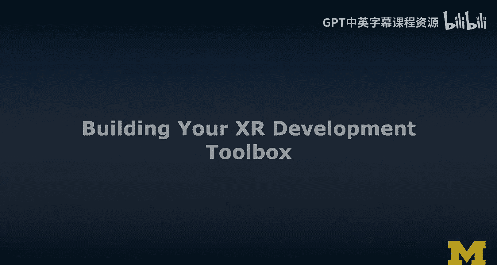
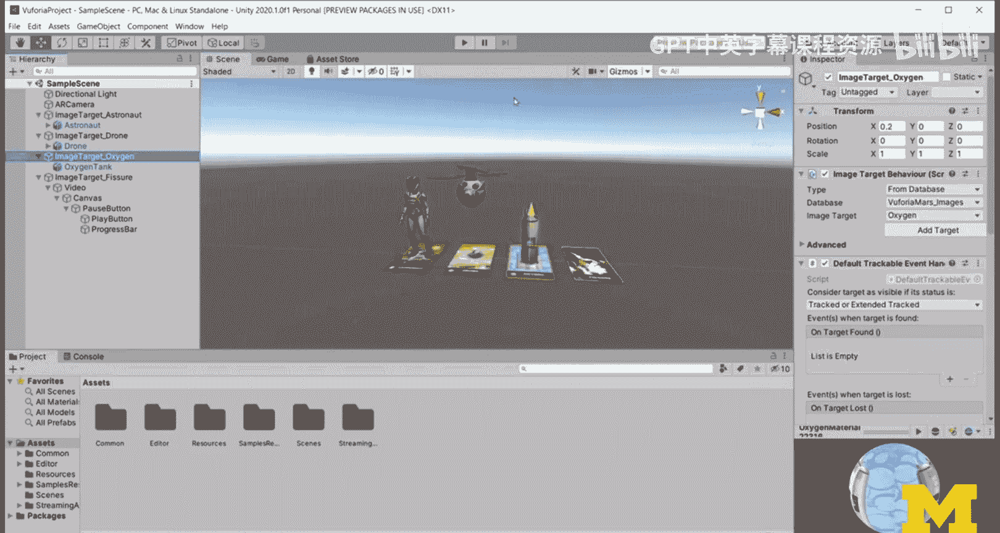
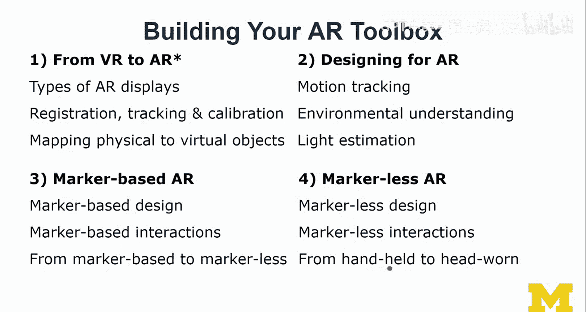
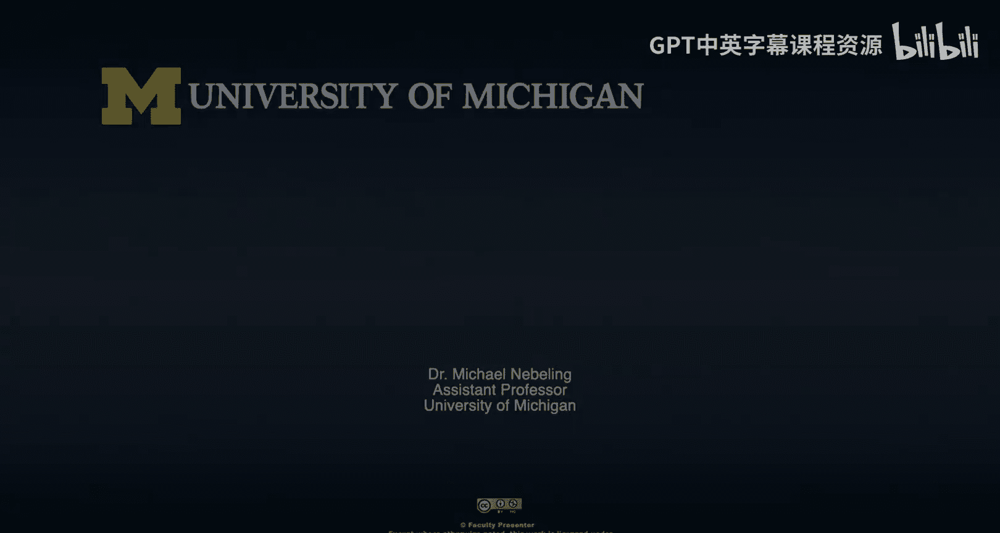

# 089：构建XR开发工具箱 🧰

在本节课中，我们将开始构建我们的XR开发工具箱。本课程的核心目标是，通过直接基于这些技术进行构建，帮助你更好地学习VR和AR技术。我们无需从零开始，市面上已有许多工具和工具包可以简化我们的工作。因此，我们首先要完成的重要任务之一，就是更好地概览整个XR开发领域。

本节课，我将简要介绍可用的平台和工具包，展示一些示例，并详细阐述拥有一个“工具箱”意味着什么。我会说明工具箱的主要构成要素，我们应该在其中放入哪些东西，以及在本MOOC后续课程中我们将详细学习哪些内容。

## 平台概览 🖥️

我认为我们主要覆盖三个平台：**WebXR**、**Unity** 和 **Unreal**。

*   **WebXR** 是一个正在发展、并有望被广泛采纳的标准，它将网页AR和VR带入了浏览器。它使用网络作为AR/VR应用的实现和交付平台，非常酷。我们将花相当多的时间在WebXR上，并使用 **A-Frame** 作为编程工具之一。
*   **Unity** 是一个非常流行的选择，市场份额很大，值得学习。请注意，这不是一门Unity课程，我们学习Unity是为了学习AR/VR。如果你想深入学习Unity，应该访问其官方网站获取更多资源。
*   **Unreal** 对AR/VR的支持正在不断增强，在某些方面，尤其是在沉浸式创作方面，我认为它甚至比Unity更有优势。其编辑器中的VR支持集成得很好，使用直观。

接下来，我们将更详细地了解这些平台和工具包。

## 工具包与平台映射 🗺️

首先，我们需要区分VR和AR。以下是主要工具包及其对应平台的初步映射。

上一节我们介绍了三个主要平台，本节中我们来看看具体的开发工具包如何与这些平台配合。

以下是当前XR领域的主要工具包分类：

*   **VR侧工具包**：包括 A-Frame、SteamVR、Unity XR Interaction Toolkit、Oculus/Meta SDKs 以及 Mixed Reality Toolkit (MRTK)。
*   **AR侧工具包**：需要区分基于标记（Marker-based）和无标记（Marker-less）AR。
    *   **基于标记AR**：例如 AR.js（网页端）和 Vuforia（Unity端）。
    *   **无标记AR**：例如 ARKit（苹果）、ARCore（谷歌）、A-Frame的AR模块、Unity的AR Foundation以及Mixed Reality Toolkit。

现在，我们将逐一查看这些工具包，更详细地了解它们支持的平台和设备。

### A-Frame 🌐

A-Frame 是一个基于Three.js和Web的平台工具包，并与WebXR集成。它最初主要是一个Web VR工具包，支持列表中的所有VR头显。

在AR方面，A-Frame本身不直接支持通过摄像头进行基于标记的AR，但你可以使用AR.js来实现。对于无标记AR，目前支持最好的是通过Chrome浏览器使用ARCore。在iOS上，可以通过Firefox或WebXR Viewer应用使其在ARKit上工作，但无法在标准Safari浏览器中运行。在HoloLens上，通过配置浏览器标志也能工作，但支持并不完善。

**示例**：这是一个标准的A-Frame场景，包含一些基本形状、光影效果。我添加了传送控制组件，你可以看到每个控制器的模型和发出的射线，通过指向物体可以与之交互。

### AR.js 🎯

AR.js 基于JSARToolkit（即ARToolkit），主要针对基于标记的网页AR。以下是一个示例：我将之前的A-Frame场景缩小并附着到一个标记上。

我们将在专门讲解标记的课程中学习更多内容。**请不要低估基于标记的AR**，不要认为它过时了。它对于原型设计非常强大且灵活。例如，我可以快速用它来测试用户界面元素的合适朝向或尺寸，这是一种利用标记进行沉浸式创作的有效方式。

### SteamVR 🎮

SteamVR 是一个非常流行的虚拟现实平台/工具包，它很好地抽象了各种VR设备（如Oculus、Vive），并与Unity配合工作，可以支持多种VR头显。

**示例**：这是一个更复杂的示例场景，展示了各种交互行为。工具包的核心价值之一就是提供开箱即用的控制器交互支持。例如，我可以捡起一个虚拟遥控器来控制一辆小车，或者使用弓箭进行交互。虽然其文档可能有所欠缺，但这样的示例场景能帮助你快速学习和适应。

### Mixed Reality Toolkit (MRTK) 👓

现在，我们进入增强现实领域。Mixed Reality Toolkit 与Unity配合良好，最初专注于HoloLens，现已扩展支持Windows Mixed Reality VR，并逐渐增加对ARKit和ARCore的支持，成为一个相对通用的平台。

**示例**：这是MRTK的手部交互示例场景，非常酷。它将各种交互控件并排展示，让你可以直观地比较不同工具包的感觉和支持程度。例如，你可以在这里弹奏一下虚拟钢琴。

### Vuforia 📱

如果你已经是Unity的爱好者，Vuforia 可能是一个不错的选择。它主要用于基于标记的AR，也提供一些对ARCore、ARKit和HoloLens的支持，可以实现从基于标记到无标记AR的无缝切换。

**示例**：这是Vuforia的图像目标示例。每个图像标记都关联了一个3D物体。当摄像头识别到标记时，相应的物体（如宇航员或动画无人机）就会出现在标记上方。

### AR Foundation & XR Interaction Toolkit 🛠️

AR Foundation 是Unity内置的平台，它很好地抽象了ARCore和ARKit，同时也支持HoloLens。XR Interaction Toolkit 是Unity的最新交互框架，同时支持AR和VR。

**AR示例**：这是XR Interaction Toolkit与AR Foundation结合的示例。你可以在检测到的平面上放置物体，点击后可以拖动和缩放它们。

**VR示例**：这是XR Interaction Toolkit的VR示例，展示了传送功能（允许你在有限的物理空间内探索更大的虚拟空间）以及复杂的抓取交互（例如捡起一个虚拟的羊驼模型）。

## 构建你的XR工具箱：学习路径 🧭

以上是对一些主要工具包的初步概览，帮助我们理解平台、工具包以及它们如何协同工作。这个映射关系会不断演变，但它是我们一个很好的起点。

接下来，我们将专注于如何学习和构建我们的AR/VR工具箱。以下是本课程后续的学习路径规划。

### VR部分学习路径

首先，我们将学习如何从2D思维跳跃到3D世界。

*   **3D基础**：学习3D物体、变换、使用3D模型和基础的3D交互。这是我们进入VR世界的基础。
*   **VR设计**：学习如何为VR设计环境、构建世界。在此过程中，我们需要考虑光照、阴影、动画和空间音效（不仅仅是视觉）。
*   **基础VR交互**：学习在VR中的移动（如传送）、物体选择（拾取物品）、以及凝视、手势和语音输入。
*   **高级VR交互**：深入学习菜单设计、物体摆放、操作（涉及碰撞检测和根据控制器/手部运动进行变换）、物理系统和粒子效果。

掌握以上内容，你将具备坚实的VR开发基础。我们还将通过一个**案例研究**——夜间动物园导览体验，来综合应用这些知识。这个案例基于底特律动物园设计，允许用户在虚拟世界中完成一些现实中无法进行的互动（如虚拟投喂）。

### AR部分学习路径

AR部分的学习建立在VR部分的基础之上。我们将主要关注智能手机（手持式AR），也会简要介绍头戴式AR。

*   **AR显示类型与核心概念**：了解不同类型的AR显示设备，并学习注册、跟踪和校准等核心概念（这些通常由工具包处理）。
*   **映射与跟踪**：学习如何将虚拟物体映射到物理世界，包括物体识别与跟踪。
*   **AR设计**：学习运动跟踪、环境理解（空间映射）、语义场景理解和光照估计。光照估计能调整虚拟物体的光照以更好地融入真实环境。
*   **基于标记的AR**：学习基于标记的AR设计、交互，以及如何从基于标记过渡到无标记AR。
*   **无标记AR**：深入学习无标记AR的设计与交互。
*   **从手持到头戴**：学习如何将应用从智能手机AR扩展到HoloLens等头戴设备。

我们将通过第二个**案例研究**——一个用于教育的AR课堂应用，来实践这些概念。这个项目最初构建的是无标记AR版本，展示了如何将AR技术有意义地融入教育场景。

## 总结 📝

本节课中，我们一起学习了构建XR开发工具箱的初步框架。我们概述了三大平台（WebXR、Unity、Unreal），并详细浏览了多个核心工具包（如A-Frame、SteamVR、MRTK、Vuforia、AR Foundation等），了解了它们的功能、支持平台和设备。我们还规划了本课程后续的VR和AR学习路径。

本课程的目标是，让你在结束时能够从容地概览整个XR开发领域，就像我刚才所做的那样，清楚地知道哪个工具包能做什么、支持什么平台、当前的浏览器兼容性如何。希望这节课为你提供了一个良好且有用的开端。