# 091：从2D到3D的跨越（第二部分）

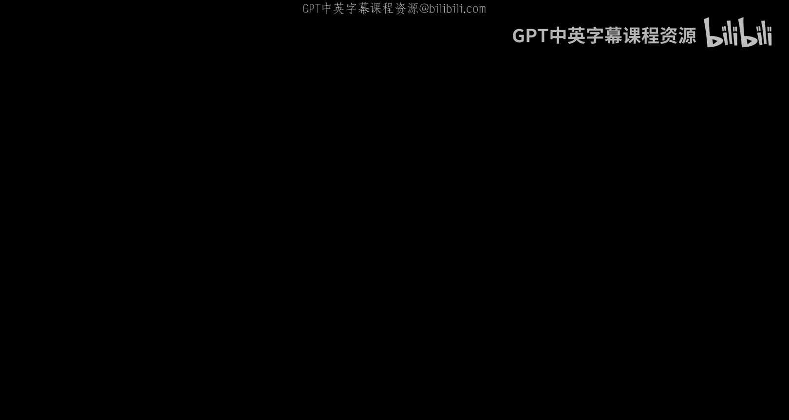

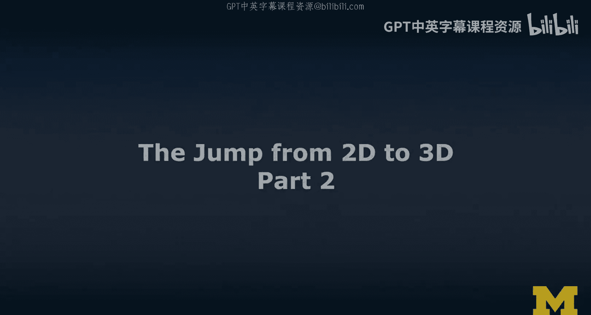

在本节课中，我们将深入学习3D模型的核心概念、获取与创建方法，并比较3D模型与360度照片的差异，为后续的VR和AR开发打下基础。

## 3D模型基础

上一节我们介绍了从2D到3D的基本概念，本节中我们来看看3D模型的具体构成和工作原理。

3D模型由几何体、网格和蒙皮组成。这包括顶点位置、法线（用于确定方向）、面片和纹理坐标。我们可以将其理解为模型的“布局”。

而模型的“设计”则通过材质来实现。材质使用**着色器**进行渲染，并能应用不同的视觉效果，也可用于后期处理。此外，我们还可以使用凹凸贴图、法线贴图或其他类型的环境贴图来为3D模型增加细节，而无需增加过多的顶点数量。这是一种模拟细节的技术。

纹理是另一个重要组成部分，它们是附着或包裹在3D模型上的图像精灵。

你可以在网上找到已绑定骨骼的3D模型，这意味着模型内部有骨架并可以播放动画。为此，骨骼绑定包含骨骼，而动画则由姿势和关键帧构成。

## 3D文件格式

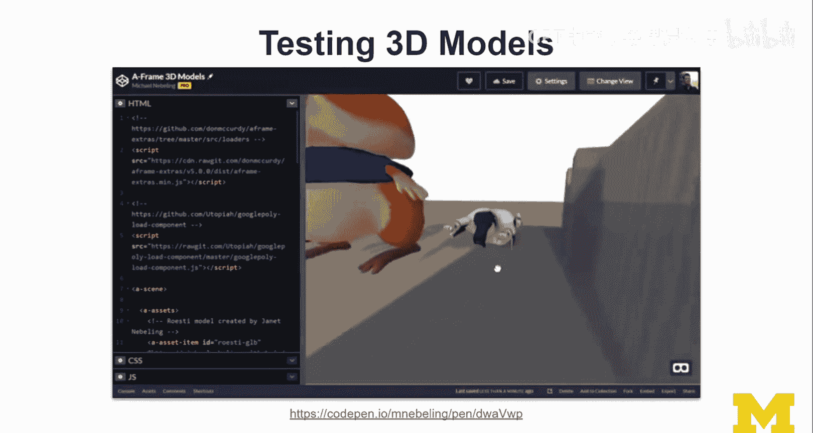

在处理3D模型时，你将需要处理不同的文件格式。

以下是常见的3D文件格式：
*   **GLTF**：在Web领域，GLTF已成为一种标准格式。
*   **FBX**：在Unity引擎中，FBX是常用的格式。
*   **DAE**：数字资产交换格式仍然很流行，你会经常看到导出为DAE的选项。
*   **OBJ和MTL**：这是一种较早但仍然流行的文件格式。大多数工具都能导出OBJ格式，但材质需要单独导出为MTL文件，纹理通常以JPG或PNG格式提供。这意味着你需要同时管理三种文件。

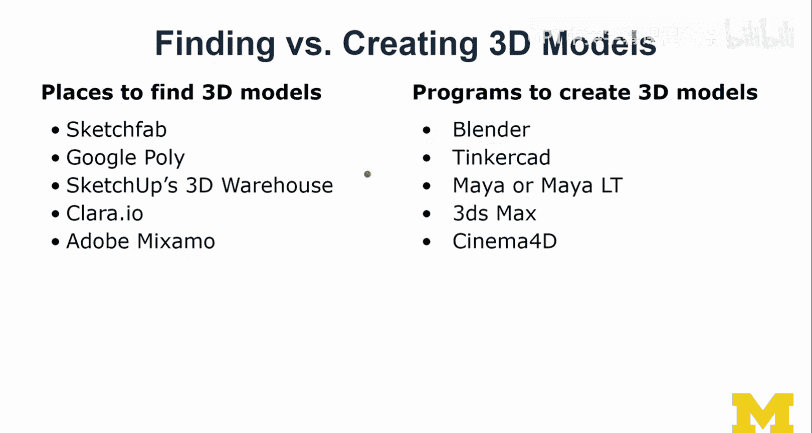

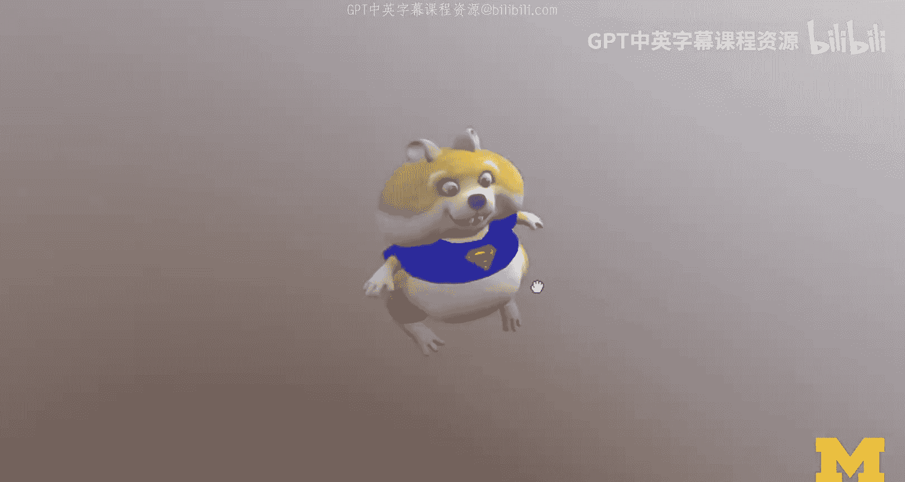

GLTF文件可以打包成GLB文件，这在我制作A-Frame示例时经常使用，非常方便。

## 寻找与创建3D模型

除非你是一名熟练的3D美术师，否则在创建3D内容时，寻找现有资源通常是第一步。

以下是一些可以找到3D模型的平台：
*   Sketchfab
*   Google Poly
*   SketchUp 3D Warehouse
*   Clara.io
*   Adobe Mixamo

创建3D模型的软件（如Blender、Tinkercad、Maya、3ds Max、Cinema 4D等）超出了本课程的范围，但了解它们的存在是有益的。

## 理解3D模型：以仓鼠为例

让我们通过一个具体的例子来深入理解3D模型。这里有一个仓鼠模型，它来自Sketchfab平台，由用户Laina创建并以知识共享协议分享。

这个模型内部包含一套骨骼绑定，这些骨骼使得仓鼠能够行走和动画。当我们将这个模型导出并嵌入到A-Frame场景中后，可以为其添加路径，让它四处走动。

## 使用Adobe Mixamo为角色添加动画

Adobe Mixamo是一个强大的工具，它可以为一系列现成角色应用各种动画。

在Mixamo中，你可以预览多种动画，例如不同的舞蹈动作。你还可以为每个动画调整和控制各种参数。例如，你可以改变角色的“警觉度”，让它更多地环顾四周。Mixamo是一个值得尝试的工具，我的许多学生用它创建了非常酷的场景。

## 使用Model Viewer查看3D模型

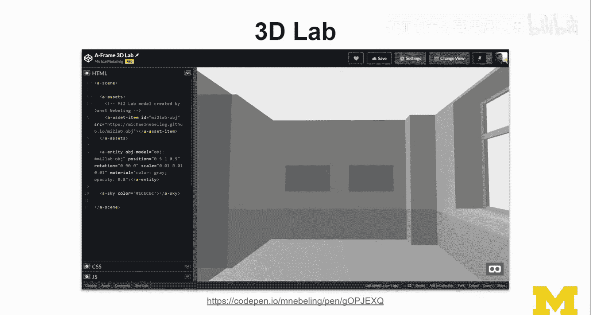

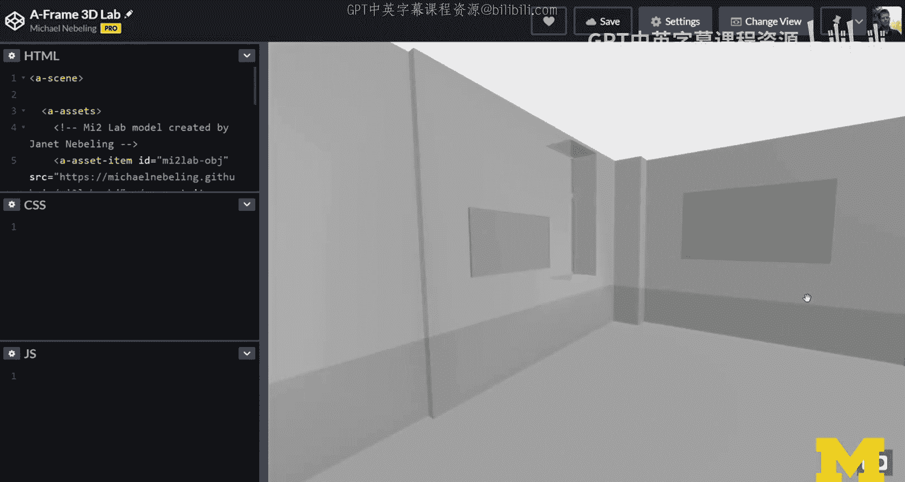

如果你的主要目标只是查看3D模型，而不想经历A-Frame或Unity等复杂流程，那么Model Viewer是一个很好的选择。

它是一个高度可定制的JavaScript库。其中一个我想重点介绍的示例是结合WebXR功能的演示。Model Viewer可以在手机上运行，并提供了一个WebXR演示，允许你将家具（如椅子）预览并放置到3D空间中。通过移动手机进行初始追踪和平面检测，物体就能出现在房间内，你还可以调整其大小或更换其他模型。

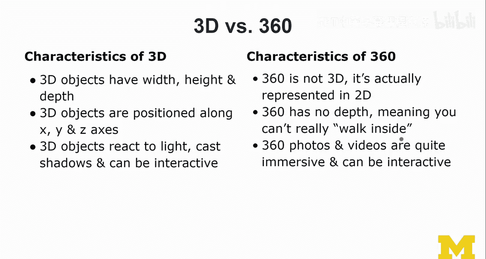

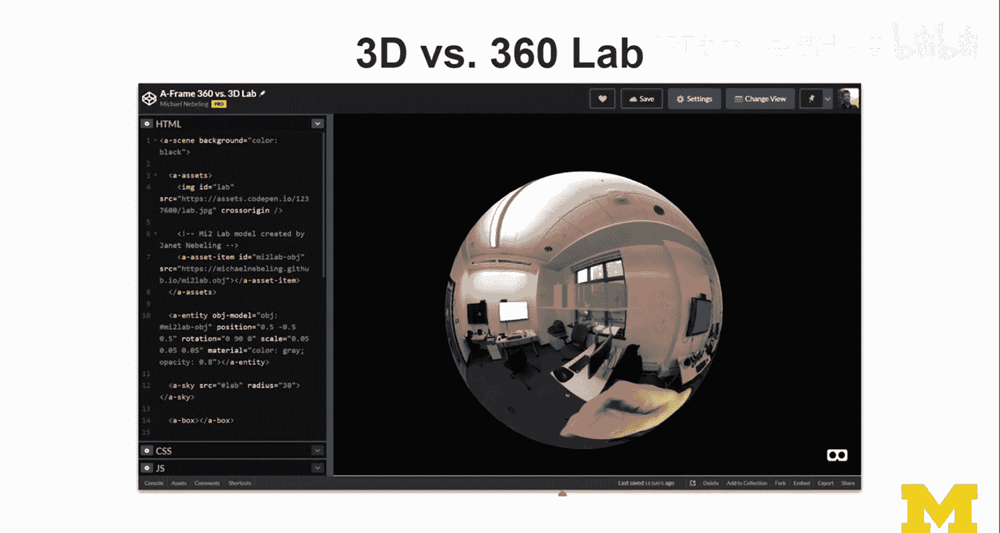

## 从360度照片到3D模型

从2D跨越到3D的过程中，360度内容是一个强大的工具，尤其适用于原型设计和VR场景的快速构建。

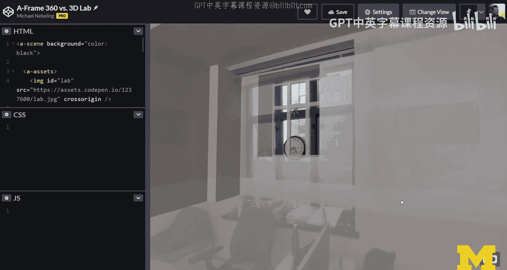

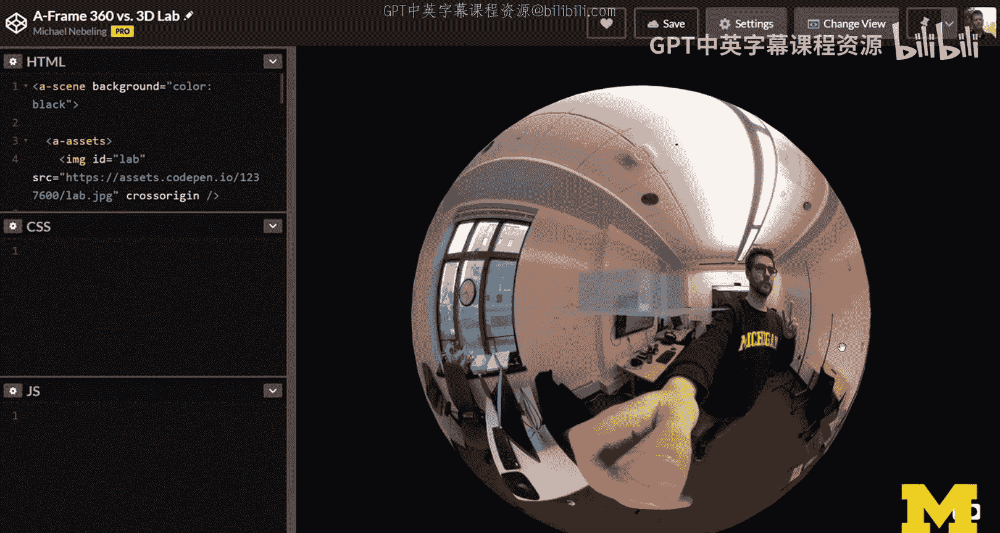

如果你有一台360度相机，你可以拍摄一张360度全景照片。这种等距柱状投影格式的图像经过拼接，可以包裹在一个球体内部进行渲染，从而创造出一种沉浸式的“小行星”视图效果。

然而，360度照片并非真正的3D。它通过投影函数从2D角度映射到球形格式，营造出深度错觉，但实际上并没有深度信息。这意味着你无法真正在其中行走。尽管如此，360度照片和视频仍然非常具有沉浸感，并且可以通过定义图像内的可交互区域来实现一定的交互性。

相比之下，基于3D模型构建的场景则允许你自由调整视角，在场景中行走，这是360度照片无法做到的。

## 核心概念对比总结

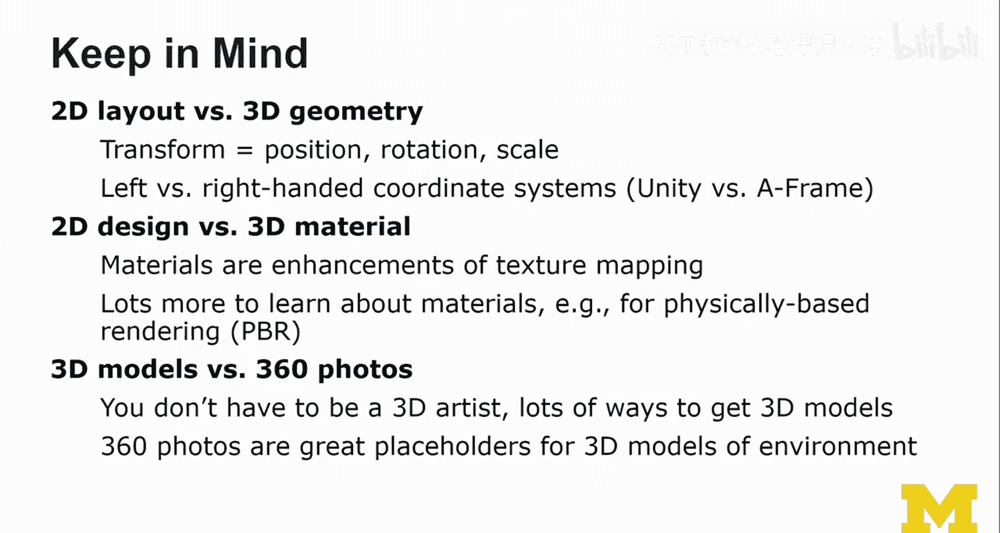

本节课我们一起学习了3D模型的核心知识。最后，让我们总结一下几个关键对比：

*   **2D布局 vs 3D几何**：这是我们应该使用的术语。
*   **变换**：这个术语用于控制2D和3D对象的位置、旋转和缩放。
*   **左手 vs 右手坐标系**：理解两者的差异对3D开发很重要。
*   **2D设计 vs 3D材质**：在语言上，材质是纹理映射的增强。关于材质（例如基于物理的渲染）还有很多深入的知识可以学习。
*   **3D模型 vs 360度照片**：谁更胜一筹？在深度和细节方面，3D模型获胜。但360度照片能帮助你快速构建原型，无需成为3D美术师。在开始像我们建模实验室那样进行精细建模之前，拍摄一张360度照片是快速近似可用3D空间的好方法。但请记住，360度照片本质上是2D表示，没有真正的深度。

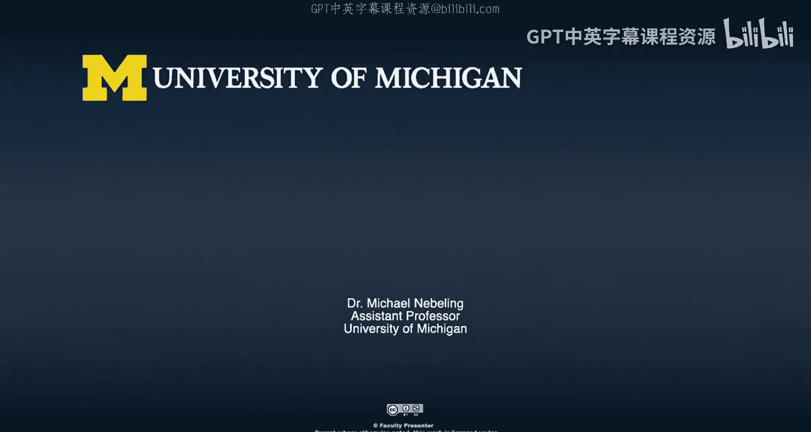

我希望这是一节有用的课程。希望我们共同完成了从2D到3D的跨越，并让你开始感到更有信心。请加入实践环节，尝试我为你准备的一些练习，在那里你可以基于自己喜欢的电影场景或想象中的画面来构建一个3D场景。你可以在WebXR、A-Frame、Unity甚至Unreal Engine中尝试3D创作。我相信这将是一个很好的起点，让我们能在接下来的几周里学习更多关于VR和AR的知识。希望这节课为我们探索AR和VR这些有趣的世界铺平了道路。