# 093：Unity引擎基础入门 🎮

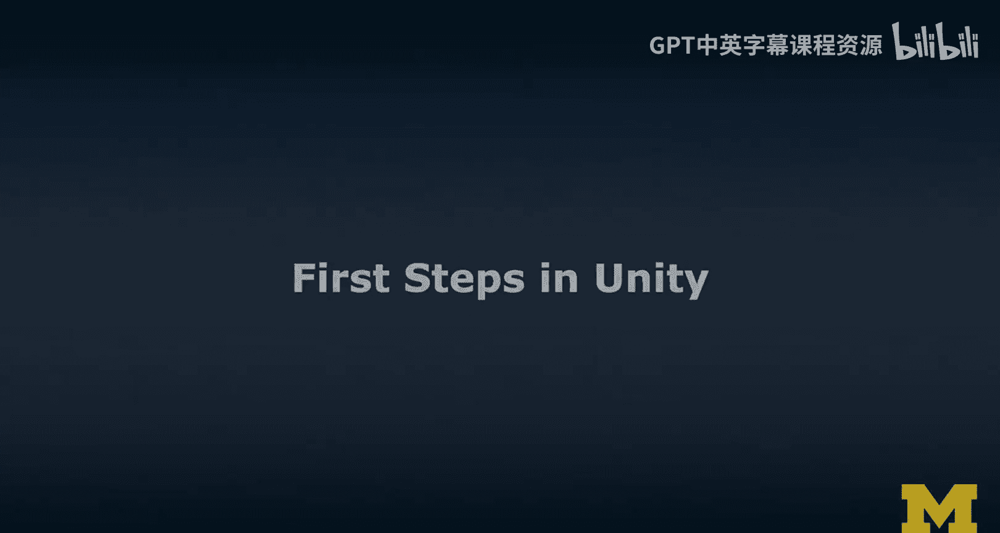

在本节课中，我们将学习Unity引擎的基础操作，并创建一个简单的3D场景。我们将把这个场景分别适配到VR（虚拟现实）和AR（增强现实）环境中，体验从3D建模到跨平台部署的完整流程。

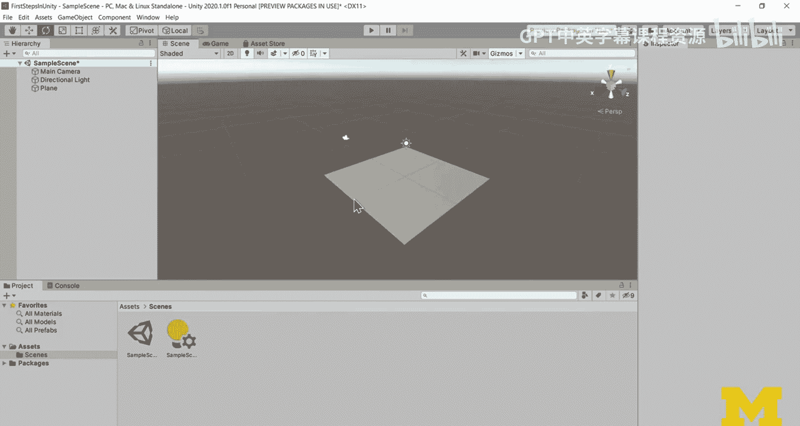

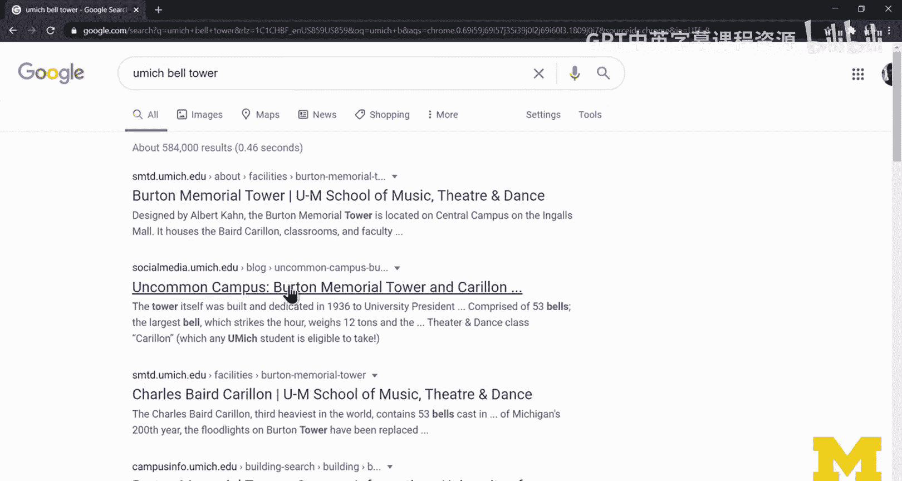

## 概述

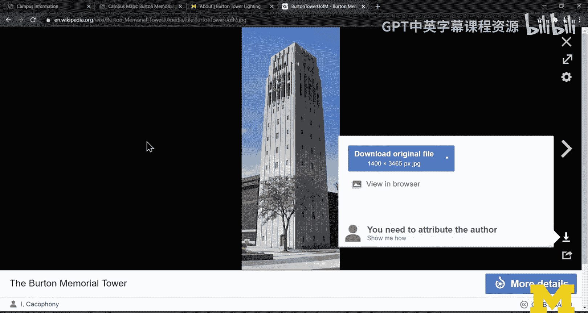

我们将从创建一个基础的3D场景开始，然后学习如何将其转换为VR体验，最后再将其适配到基于标记（Marker-based）和无标记（Marker-less）的AR应用中。整个过程将涉及场景搭建、对象操作、光照调整以及不同XR（扩展现实）插件的配置。

## 创建基础3D场景 🏗️

首先，我们需要在Unity中创建一个新的3D场景。场景初始包含一个主摄像机和一个方向光。

上一节我们介绍了课程目标，本节中我们来看看如何搭建一个简单的3D场景。

1.  **插入一个平面**：这个平面将作为我们场景的地面。将其放置在原点 `(0, 0, 0)`。
2.  **导入参考图片**：为了更精确地建模，我们可以导入一张参考图片。将图片作为资产导入项目，然后将其添加到一个新的平面对象上，作为建模的视觉参考。
3.  **创建主要物体**：根据参考图，使用Unity的基本3D物体（如立方体）来搭建主要结构。例如，我们可以创建一个名为“Tower”的立方体来代表一座塔楼。
4.  **调整物体位置与缩放**：使用变换工具（移动、旋转、缩放）将塔楼放置在平面上，并调整其大小以匹配参考图的比例。可以通过在检视器中输入精确的数值来调整，例如将位置设为 `(0, 3.5, 0)` 使其站立在地面上。

## 调整摄像机与光照 🌞

创建好基本物体后，我们需要调整视角和光照来让场景看起来更生动。

上一节我们放置了基础物体，本节中我们来看看如何优化场景的视觉效果。

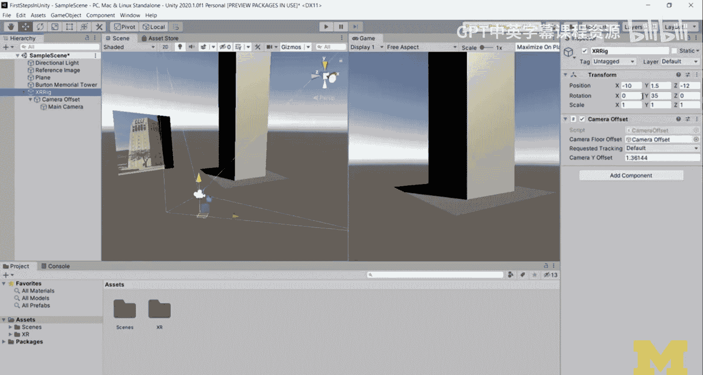

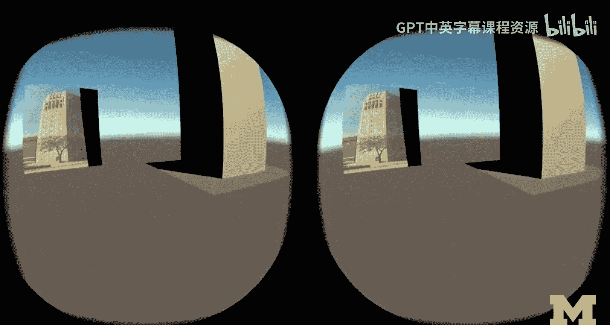

1.  **移动摄像机**：使用移动工具将摄像机从默认位置移开，以获得更好的观察角度。例如，可以将其向左移动并向后拉远。
2.  **旋转摄像机**：使用旋转工具调整摄像机的朝向，使其对准我们创建的塔楼。
3.  **操作光源**：选中场景中的方向光（代表太阳），通过旋转来模拟一天中不同时间的光照效果，如日出或日落。这会在物体上产生动态的阴影变化。

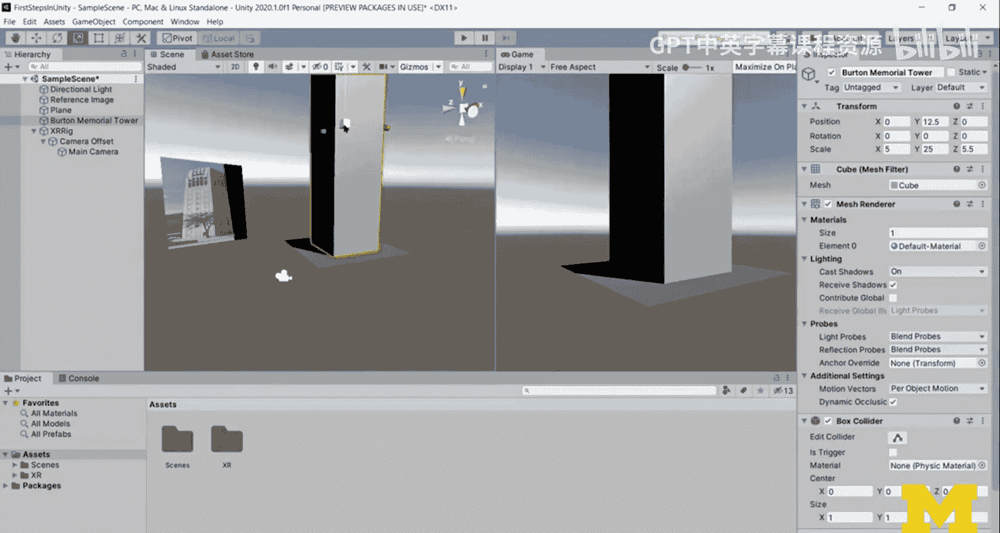

完成这些步骤后，我们就拥有了一个包含物体、摄像机和动态光照的基础3D场景。按下播放按钮，可以在游戏视图中预览场景。

## 适配到虚拟现实（VR） 👓

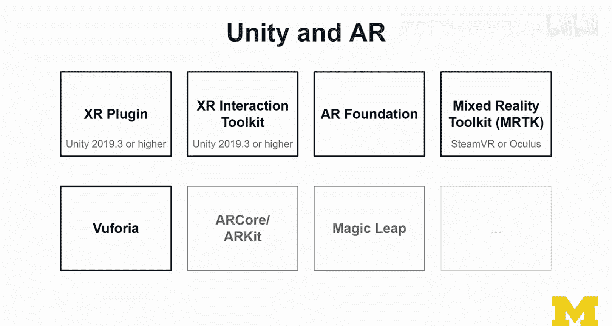

接下来，我们将把这个3D场景转换为VR体验。

上一节我们完成了基础3D场景，本节中我们来看看如何为VR头显进行适配。

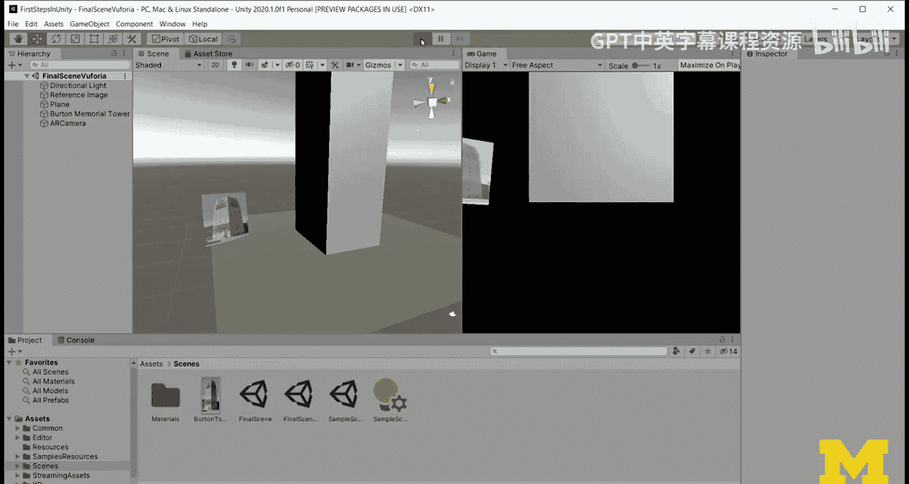

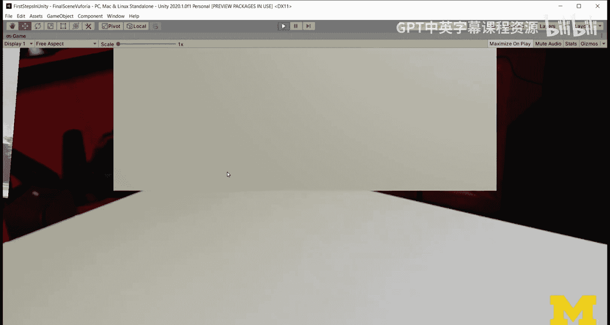

1.  **调整场景比例**：在VR中，比例感非常重要。为了获得更真实的沉浸感，可能需要增大塔楼等物体的缩放比例，让用户在VR中感觉物体尺寸合理。
2.  **调整摄像机（XR Rig）位置**：VR中的摄像机通常由XR Rig管理。需要调整XR Rig的位置，让用户站在一个理想的观察点，例如塔楼的正前方。
3.  **配置XR插件**：通过Unity的Package Manager安装并配置Oculus XR Plugin等VR插件，将场景与VR头显（如Oculus Rift）连接起来。

核心概念是使用 **XR Interaction Toolkit** 来管理VR中的交互，但本教程主要关注场景的初始设置和显示。

## 适配到增强现实（AR） 📱

最后，我们将把同一个场景部署到AR环境中。AR主要有两种方式：基于标记的和无标记的。

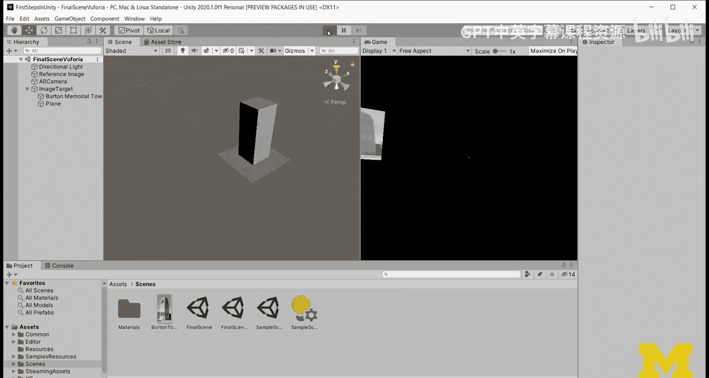

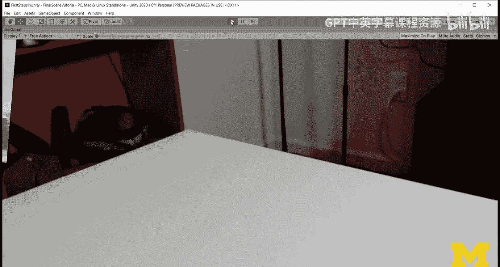

上一节我们设置了VR场景，本节中我们来看看如何为AR设备进行适配。

### 基于标记的AR（使用Vuforia）

以下是使用Vuforia引擎创建基于标记的AR应用的步骤：

1.  **准备新场景**：从VR场景另存一个新场景，并移除XR Rig。
2.  **导入Vuforia**：通过Package Manager将Vuforia Engine包导入项目。
3.  **添加AR摄像机**：在场景中添加Vuforia的“AR Camera”来代替原有摄像机。
4.  **设置图像目标**：从Vuforia预置数据库（或自行创建）选择一个标记图（例如宇航员图片），将其作为“Image Target”添加到场景中。
5.  **重新调整物体比例**：AR中物体相对于真实世界的标记显示，因此需要将塔楼和平面等物体**显著缩小**，使其能适配到标记图上方。例如，将缩放值设置为 `(0.1, 0.1, 0.1)` 或更小。
6.  **将物体关联到标记**：将塔楼等物体设置为图像目标的子物体，或将其位置精确放置在标记上方（如 `Y=0.75`），这样当摄像头识别到标记时，物体就会出现在标记之上。

### 无标记的AR（使用AR Foundation）

以下是使用AR Foundation创建无标记（地面检测）AR应用的步骤：

1.  **准备新场景**：再次从原始场景另存一个新场景。
2.  **配置AR Foundation**：通过Package Manager安装AR Foundation以及对应平台（如ARCore for Android, ARKit for iOS）的插件包。
3.  **添加AR Session和AR Session Origin**：在场景中添加这两个核心组件。AR Session Origin包含AR摄像机，并管理AR内容的坐标系。
4.  **大幅缩小场景物体**：在无标记AR中，物体将锚定在检测到的真实世界平面上。需要将整个场景（包括塔楼、平面）的**整体比例缩小**，使其看起来像桌面模型，而不是真实大小的建筑。可以将所有物体放入一个空的父级GameObject中，然后统一缩放该父对象（例如缩放为 `(0.25, 0.25, 0.25)`）。
5.  **切换构建平台与部署**：在`File -> Build Settings`中，将平台切换为Android或iOS。确保在`Player Settings`中启用了ARCore/ARKit支持。通过USB连接手机，点击“Build and Run”即可将应用安装到手机上进行测试。

## 总结

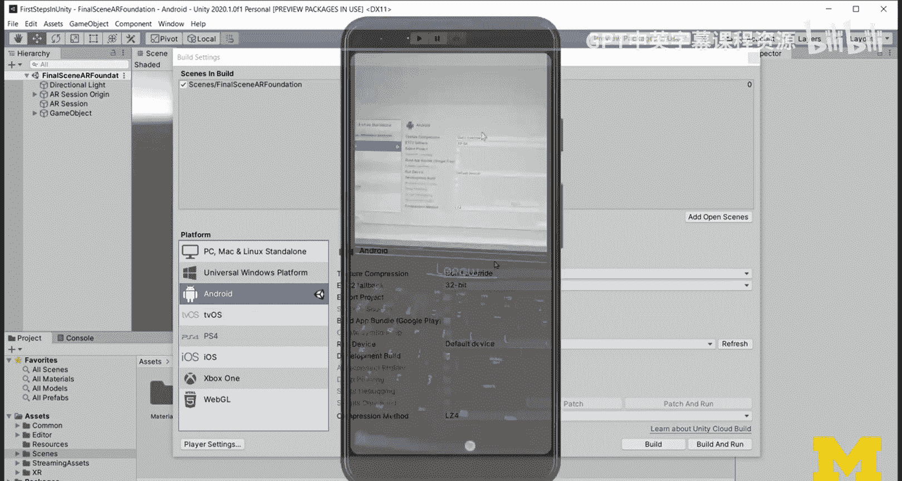

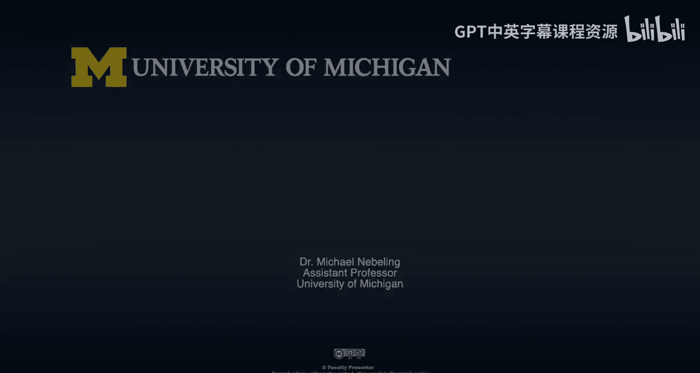

本节课中我们一起学习了Unity引擎的入门操作。我们从创建一个简单的3D场景开始，学习了如何操作物体、调整摄像机和光照。接着，我们探索了如何将这个场景扩展到VR和AR领域：通过调整比例和配置XR插件来适配VR头显；通过使用Vuforia和AR Foundation分别实现了基于标记和无标记的AR体验。整个流程的关键在于**根据不同的XR环境灵活调整场景的比例**，并正确配置相应的开发工具包。这为后续深入开发VR/AR应用打下了坚实的基础。