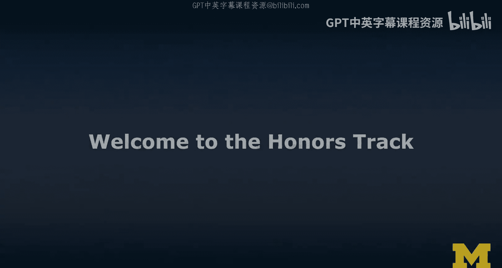
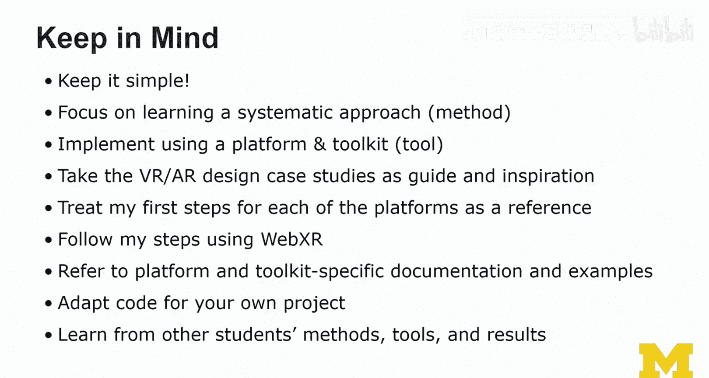
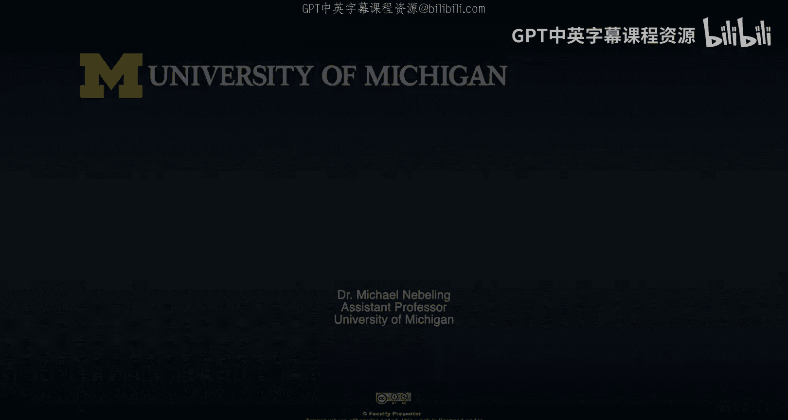

# 095：荣誉课程框架与学习指南 🎯

在本节课中，我们将一起了解荣誉课程的整体框架、学习目标以及如何利用课程资源完成实践项目。课程旨在提供一个灵活的系统性学习方法，让你能够根据自己的设备和兴趣选择平台与工具包，共同学习扩展现实（XR）开发。

## 课程概述与目标

上一节我们了解了课程的基本结构，本节中我们将深入探讨荣誉课程的具体学习路径。我的核心目标是建立一个框架，让我们能够共同学习。你可以选择平台，也可以选择工具包。市面上可能存在比我介绍的更新的工具包，这完全没问题，你完全可以自由选择。

我希望我们能以一种更实际的方式接触这些技术。因此，本视频的目的是引导你了解我为荣誉课程设计的心智模型，并解释我做出某些课程设计决策的理由。这个框架在校内项目中运行良好，我也希望它同样适用于在线学习的你。

接下来，我将为你介绍荣誉课程的结构，以及我们如何共同学习和互动。

## 荣誉课程核心结构 🏗️

如你所知，本课程分为四个模块。首先，我们学习通用的开发方法，并构建我们的XR开发工具箱。然后，我们实际完成从2D到3D的跨越。

接着，我们专注于VR开发，学习基础及更高级的沉浸式VR体验的设计与开发。我们也会学习AR，包括基于标记（Marker-based）和无标记（Marker-less）的AR，了解它们的一些区别，以及如何从移动端（手持式）AR过渡到头戴式AR。我涵盖了所有这些主题。

此外，还有一些特殊主题，这些内容超出了荣誉课程的核心要求。因此，在荣誉课程中，我们会有额外的内容和练习。

以下是荣誉课程的核心实践项目，我们将按顺序完成：

*   **3D场景练习**：我们将基于一个草图来构建3D场景。我建议你先在纸上画出构思的草图，并以此作为模板。在后续的练习指南中，我会详细说明如何着手。
*   **VR场景练习**：接着，我们将基于已创建的3D场景，制作一个VR版本。你不应从头开始，而应在3D练习成果的基础上构建，并可能添加一些元素使其更具沉浸感。
*   **AR场景练习**：最后，你将把同一个3D场景带入AR。我认为最好从3D场景开始，利用一些工具将其放入AR。对于Unity和Unreal，从3D到VR再到AR的转换可能更复杂，因为需要移除某些内容和插件。因此，3D场景是我们的起点。

这三个场景之间存在关联。在3D场景中，你从草图开始，适当挑战自己但不必过于困难。可以是一个简单的电影场景。我提供了一些指导方法，例如在Unity的第一步中，我展示的示例灵感来自Burt纪念塔。我所做的就是用那张照片进行创作，这某种意义上就是我的“草图”。我主要使用3D基本体创建了这个塔。这是第一步，下一步可能是用更高保真度的3D模型替换它，但第一步中我不要求这样做。我为你提供了进一步探索的资源。

然后，你将自己创建的3D场景，制作成一个基础的虚拟现实版本。这意味着你需要添加相机、相机装置，可能还需要启用传送等功能，使其更具沉浸感。交互部分是难点，但如果你不进行复杂交互，或者遵循Unity等工具包提供的示例（如XR Interaction Toolkit），可以避免大量编码。

接下来是AR场景。你将学习基于标记或无标记的AR。这部分更具可选性，因为我不确定你拥有什么设备。你可能有一个网络摄像头，那么你应该能够完成基于标记的AR版本。如果你拥有支持ARKit和ARCore的最新款智能手机，你也可以尝试无标记AR。你不需要每次都完成所有类型。

项目最后是同伴互评。你们将互相提供反馈。你需要提交自己感到自豪和已完成的作品。我会提供更多关于如何提交的指导。然后，你将收到一份或多份评价。同时，我也会要求你评价其他学习者的作品。这个同伴互评过程对我们非常重要，我相信它将丰富你的学习体验。

## 如何利用课程资源 📚

上一节我们明确了项目流程，本节中我们来看看如何有效利用课程资源。我的想法不是由我坐下来制作无数个不同的原型（虽然我有很多，但它们都在合适的位置），而是在这里引导你如何使用本课程中提供的资源。课程中还有一些指向第二门课程的链接。

第二门课程更侧重于设计，但它首先建立了一个关于如何进行XR设计与开发的更大框架。其中“XR涉及什么”的讲座非常有用。我会将那个讲座的一些关键元素融入这里，但本文档主要是荣誉课程的指南。

你还会在“构建你的XR开发工具箱”讲座中找到额外的信息和材料。你可能已经看到，它就在本周内容里。你可能已经在考虑从2D跳转到3D，那里有很多示例和步骤。实际上，我为设计VR和AR体验，特别是WebXR，提供了更深入的示例。我的很多示例基于A-Frame，我认为它是一个在线学习（如在CodePen或Glitch上）的绝佳工具。

我理解，也许你来这里是因为你觉得已经了解AR/VR，并且想学习Unity或Unreal。当我说“构建你的XR工具箱”时，我指的正是这些。我在讲座中讨论了所有这些内容。所以，请将荣誉课程视为真正实践这条路径：从2D到3D（即3D场景），然后设计一点VR（即带有基础交互的基础VR场景，但其中一些交互是可选的，如移动和选择），再到AR。

在AR工具箱方面，我们真正实现从VR到AR的跨越。如果你选择基于标记的方法，例如使用AR.js或Vuforia，就可以实现。如果你的智能手机支持无标记AR（ARCore和ARKit），你可以使用WebXR实现。否则，我建议只做基于标记的AR。交互部分同样是难点，我鼓励你尝试，但为了顺利完成课程，这些更多是可选的。

## 你的选择与系统性方法 ⚙️

在最高层面，你有几个选择需要做出：

1.  **选择平台**：WebXR、Unity或Unreal是我们主要的工作平台。
2.  **选择工具包**：因为我不想让你从零开始。在本周的讲座中，你已经了解了一些可选的工具包。我将左侧的每个工具包映射到了相应的平台和所支持的设备。
3.  **选择设备**：本质上需要选择两个设备，一个用于VR，一个用于AR。

如果你不确定能否实现某个基于标记AR的酷炫想法，或者如何使用Unity或WebXR来实现，可以参考这些映射，或者在论坛中咨询，看看其他人是如何做的。我们有一些作品集，你应该能从中获得很多灵感和课程之外的信息。

贯穿始终的是系统性过程。在荣誉课程中学习实践，正是聚焦于此。显然，我希望你完成整个XR specialization，涵盖所有内容，这样你就能从纸上原型快速跃升。但从这里（草图）跳转到3D是我们的第一个重要阶段和目标。

## 从低保真到高保真：项目演进 🚀

将你的项目（包含3D、VR和AR三个场景）视为从低保真度向高保真度演进。我建议你从使用占位符内容开始，然后逐步将其打磨得更精细。这可能意味着仅为基本体应用颜色和材质，或者实际使用3D模型。网上有很多免费的3D模型可供使用。

接着，我们将尝试添加隐式和显式交互。例如，用户应该至少能够注视一个物体（例如，如果你有Cardboard这类设备，注视交互是可行的）。然后，我们考虑点击后改变视觉外观，思考反馈以及“可供性”这个概念（即界面中的一些视觉线索），以引导用户进行交互。

在本课程中，我们主要将其转化为具体的内容列表、显式交互列表和隐式交互列表。你将在3D、VR和AR场景中实际完成这些，就像核对清单一样：必须处理环境，可能涉及物理效果（也可能跳过），以及声音（我鼓励你加入声音，不仅仅是视觉）。菜单和手部交互等内容，我留给你决定，不会做硬性要求。

显式交互方面，你可以进行一些探索。很多隐式交互与相机、AR中的标记，或者在无标记AR中将某些物体或环境特征带入视野有关。我们将探索这些，但不会过多涉及GPS定位，除非你可能是为家中或工作场所的特定区域进行设计。

## 给学习者的关键建议 💡

在你进行这些荣誉课程练习时，请记住：**保持简单**。不要给自己太大压力。评判的标准不是复杂度。保持简单是学习的最佳方式。当一切运作起来后，你可以再逐步增加难度。

你应该专注于学习系统性方法，这正是我教学的重点。如果你遵循这个方法——先使用占位符、先在纸上画草图——并展示出你理解我所讲的系统性方法，你就会取得好的成果。

你通过使用某个平台和工具包来实现，从而学习AR/VR。本课程的重点不是学习某个特定工具，而是**使用工具来学习这些技术**，这正是本课程的独特之处。

此外，你应该学习接下来的AR/VR案例研究。你将看到由我的两位学生贡献的案例研究，请将它们视为指导和灵感来源，但仍然要努力保持简单。同时，将我提供的针对每个平台的“第一步”指南作为参考进行查阅。

我为WebXR（A-Frame）提供了更多步骤，因为我推测我们中的大多数人会选择这条路径。这些工具日新月异，WebXR规范也在不断演进。对于Unity和Unreal，它们本身提供了大量优秀的资源，并且频繁更新，它们的文档和示例可能更及时。你应该参考平台和工具包特定的文档及其示例，从中学习并改编代码用于你自己的项目。

最后，从其他学生的方法、工具和成果中学习，这正是同伴互评如此重要的原因。

## 总结与展望 🌟

本节课中，我们一起学习了荣誉课程的整体框架和学习指南。我们明确了课程将通过三个关联的练习项目（3D、VR、AR场景）来引导你系统性地学习XR开发。关键在于选择适合自己的平台与工具，从简单的草图开始，利用占位符内容，逐步迭代，并积极参与同伴互评。

我真心希望我们都能乐在其中。我希望我设计的方式和所做的决定，能为我们提供足够的灵活性和自由度，让你能够利用现有的设备，选择你想学习的工具包和平台。我期待在关于荣誉课程的更多讲座中见到你，届时我将更详细地指导你完成每一个步骤。

感谢观看。