# 096：三维场景构建 🏗️

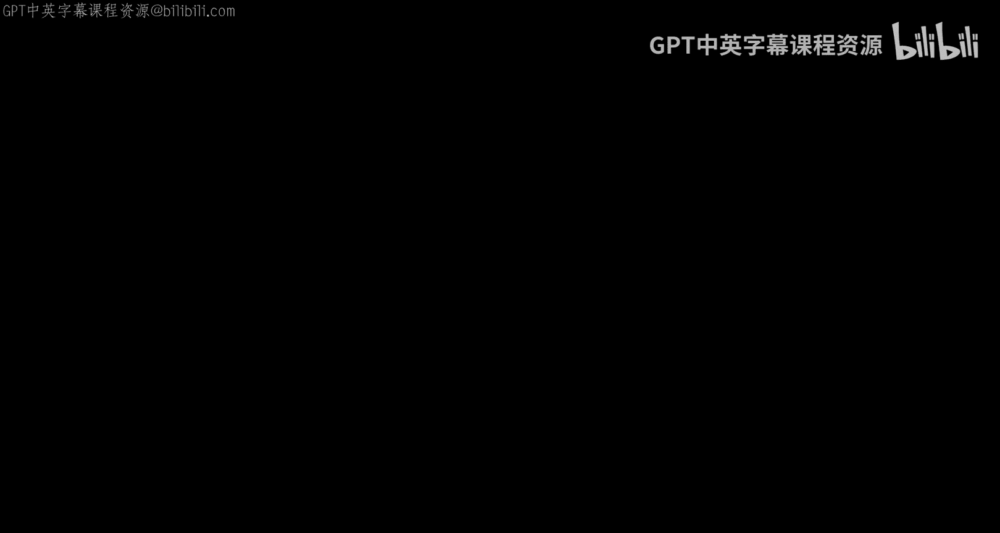

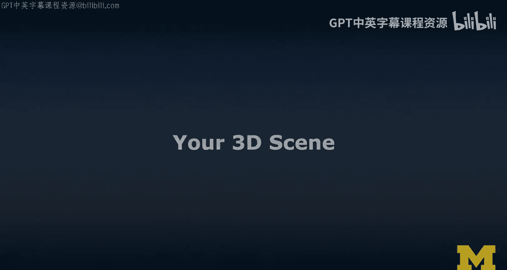

在本节课中，我们将学习如何构建一个三维场景。这是后续所有虚拟现实和增强现实项目的基础。我们将遵循一个系统化的方法，从草图开始，逐步增加场景的细节和真实感。

## 概述

三维场景构建是扩展现实开发的核心基础。本节将引导你完成创建第一个三维场景的完整流程，涵盖从规划到实现的关键步骤。

## 规划你的场景 📝

首先，你需要规划你想要创建的三维场景。这应该基于一个模板或灵感来源，例如电影场景、书籍描述或一张照片。

以下是规划步骤：
1.  在纸上画出场景的草图。
2.  明确场景的构成、物体布局和整体构图。
3.  设定清晰的目标，以便在后续制作中对照检查。

## 用基本体进行原型设计 🔲

上一节我们介绍了如何规划场景，本节中我们来看看如何开始构建。首先，使用2到3个三维基本体来搭建场景原型。

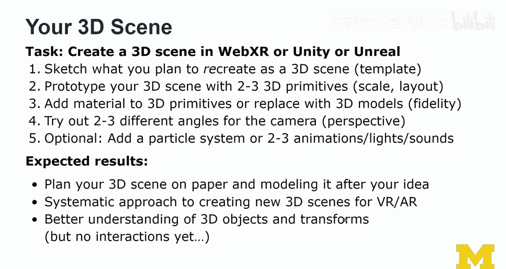

以下是原型设计要点：
*   保持简单，仅使用立方体、球体、圆柱体等基本几何形状。
*   专注于物体的**位置**、**旋转**和**缩放**（即三维变换）。
*   在此阶段，暂时不需要考虑材质、灯光或阴影。

在代码中，放置一个立方体基本体可能类似于：
```html
<!-- 在A-Frame中的示例 -->
<a-box position="0 1 -3" rotation="0 45 0" scale="1 2 1" color="#4CC3D9"></a-box>
```

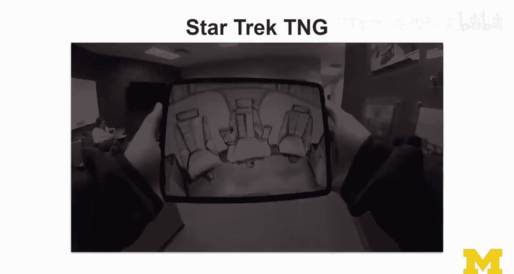

## 增加细节与真实感 ✨

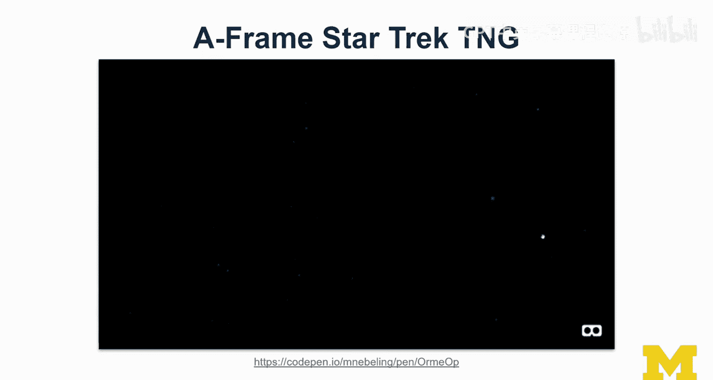

原型搭建好后，下一步是提升场景的保真度。我们可以为基本体添加材质，或者用更精细的模型替换它们。

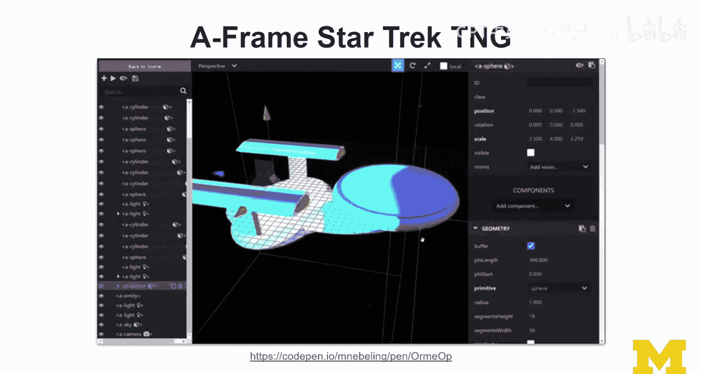

以下是提升细节的方法：
1.  为基本体添加颜色、纹理等材质属性。
2.  理想情况下，使用下载或自己创建的高精度三维模型替换基本体。
3.  你也可以通过组合多个小型基本体来构建复杂模型。

## 设置摄像机视角与构图 🎥

场景内容构建完毕后，我们需要思考如何展示它。尝试从两到三个不同的角度观察你的场景。

以下是关于摄像机视角的建议：
*   在Unity、Unreal或A-Frame中移动摄像机位置。
*   找到能最佳展示场景构图的起始位置和角度。
*   根据摄像机视角，你可能需要回头调整场景中物体的布局。
*   从不同角度截取屏幕截图。

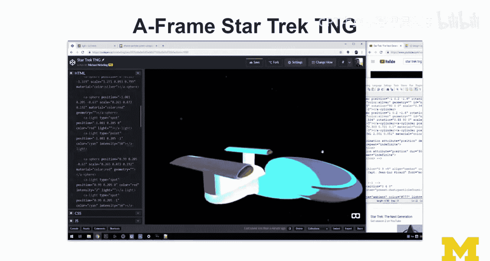

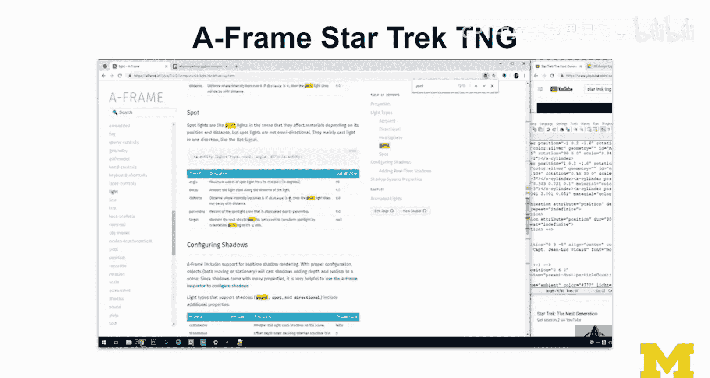

## 添加特效与动态元素（可选） 🌌

为了让场景更生动，你可以考虑添加一些动态元素。请注意，这并非所有场景的必需步骤。

以下是可选的增强内容：
*   **粒子系统**：用于表现烟雾、灰尘、火焰等效果。
*   **动画**：让场景中的物体运动起来。
*   **灯光**：布置光源以营造氛围。
*   **声音**：添加环境音效或背景音乐。

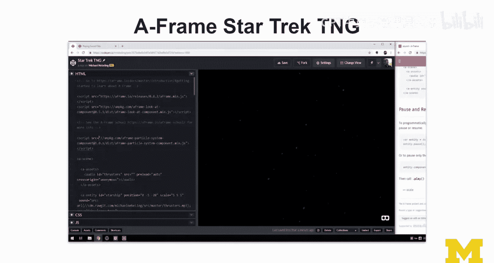

## 案例学习：星际迷航场景 🚀

为了加深理解，我们来看一个《星际迷航》场景的构建案例。构建者首先根据剧集片头绘制了详细的草图作为蓝图。

在原型阶段，仅使用了A-Frame中的基本几何体和粒子系统来搭建整个场景。最困难的部分是**灯光设置**，需要反复调试以达到原片中的效果。通过查阅文档和创造性解决问题（例如使用一个近乎透明的球体来反射光线），最终成功实现了目标效果。

这个案例表明，即使只用基本体，通过系统化的方法和对灯光、动画的细致调整，也能创造出富有表现力的三维场景。

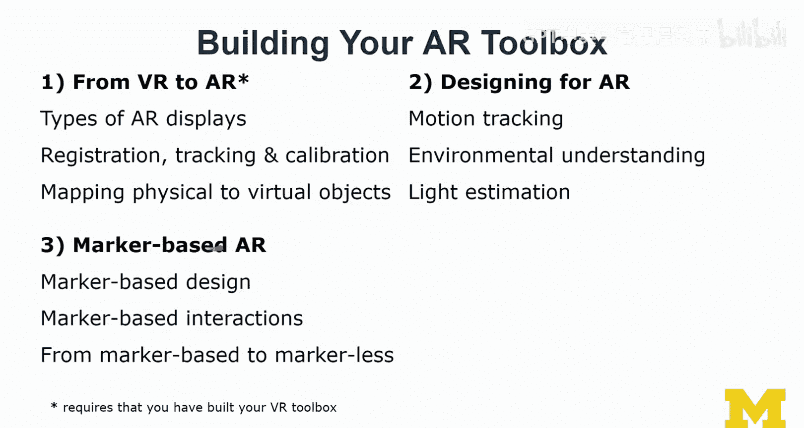

## 总结


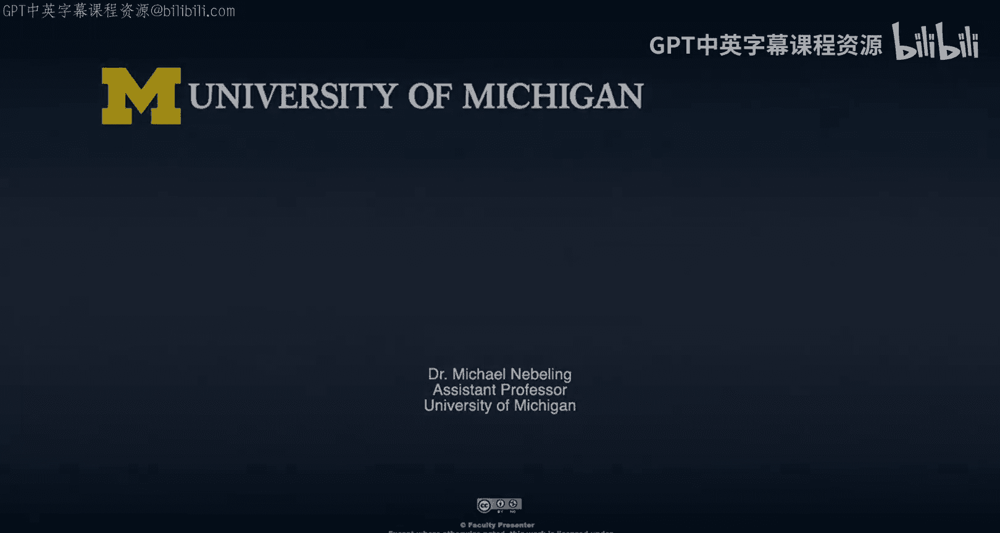

本节课中我们一起学习了构建三维场景的系统化方法。我们从**规划草图**开始，然后用**基本体搭建原型**，接着**提升细节和真实感**，并设置**摄像机视角**，最后可以**可选地添加特效**。这个过程帮助你建立了对三维空间、物体变换和场景构图的理解。你所创建的这个场景，将成为后续进入虚拟现实和增强现实模块开发的坚实基础。记住，在论坛中与同学互相帮助，可以解决许多实践中遇到的问题。现在，你已经为接下来的VR与AR之旅做好了准备！