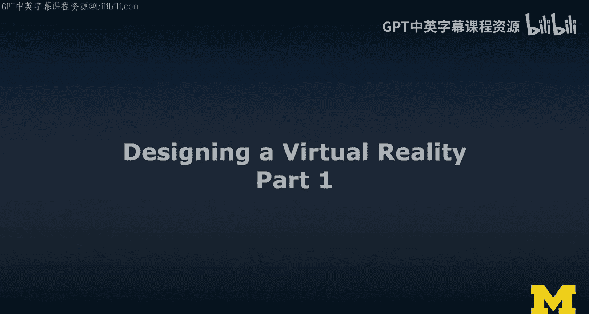
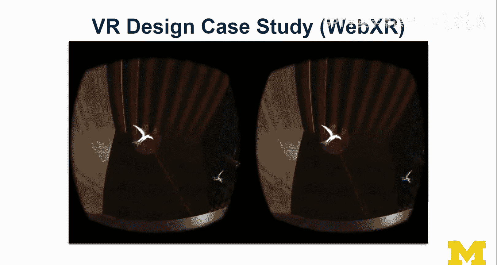
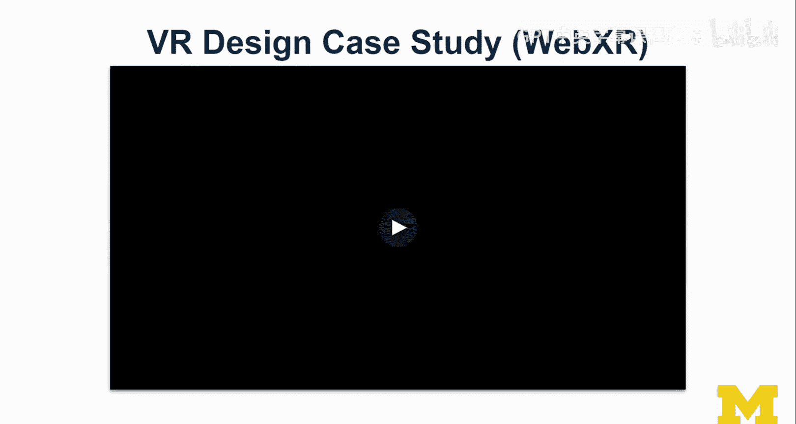
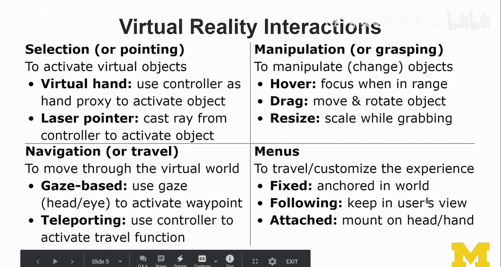
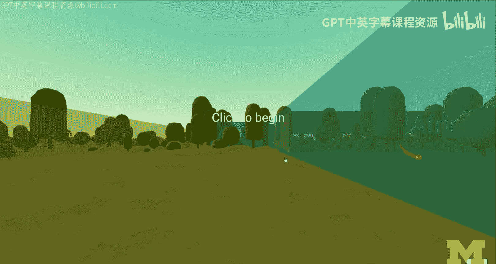
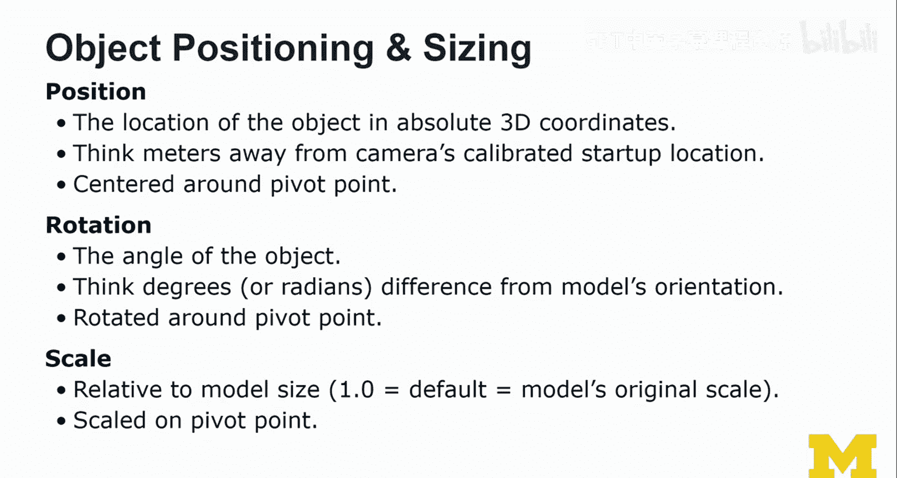
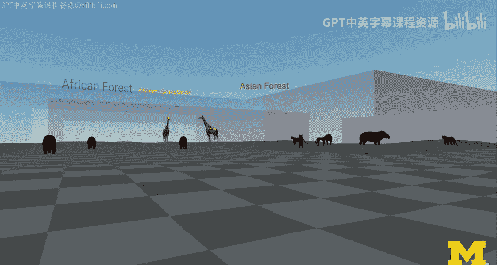
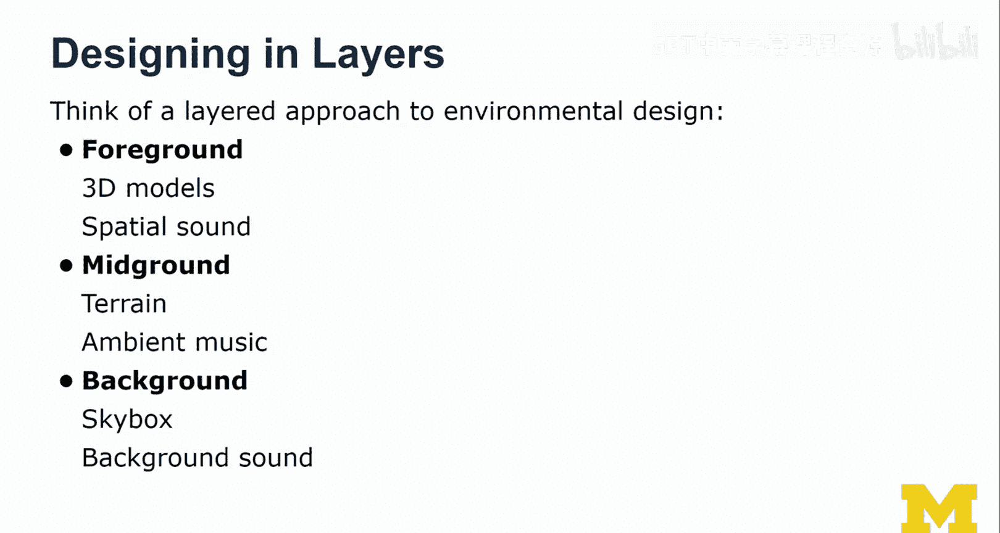

# 098：虚拟现实设计原理第一部分 🎮

在本节课中，我们将学习虚拟现实设计的基础知识，包括环境设计、内容构成、交互方式以及对象放置的核心概念。我们将通过一个虚拟动物园的案例研究，来具体探讨这些原理的实际应用。

---

## 课程概述

欢迎来到虚拟现实设计课程。本周我们将学习虚拟现实设计的基础知识。我将分享一些设计技巧，并通过一个由学生贡献的虚拟动物园案例来具体说明。这个案例最初源于一次在线办公时间，后来发展成一个用于教学的完整项目。

上一节我们介绍了课程的整体安排，本节中我们来看看虚拟现实设计的具体内容。

## 虚拟现实内容构成

设计一个虚拟现实体验，其内容构成包含多个关键要素。

以下是创建虚拟现实内容的核心组成部分：

*   **3D模型与动画**：虚拟世界中的角色和物体，它们是构成体验的主要成分，可以处于前景或背景中。
*   **光影与渲染**：环境需要光源才能被看见。这包括环境光、定向光以及像手电筒这样的聚光灯。光影能为用户提供重要的视觉线索。
*   **环境与地形**：指用户行走其上或所见的场景，如地形、树木、岩石等。Unity和A-Frame等工具都提供了强大的环境组件来构建这个世界。
*   **物理系统**：模拟现实世界的物理规则（如重力、碰撞）对于营造可信的VR体验至关重要。如果用户预期存在的物理效果缺失，会破坏沉浸感。
*   **空间音频**：超越立体声的3D音频。声音会根据物体位置、障碍物和空间大小（如产生回声）发生变化，这对于营造沉浸感非常关键。
*   **用户界面与菜单**：VR中的菜单设计有其特殊性，例如抬头显示空间菜单。它们允许用户触发功能、导航和自定义VR体验。

## 虚拟现实交互方式

虚拟现实中的交互主要可以分为几个大类。

以下是主要的VR交互方式：

*   **选择**：常见方式包括显示虚拟手部模型、控制器模型，或直接使用手部追踪技术。激光指针也是一种常用的选择工具。
*   **操纵**：指抓取并改变虚拟世界中物体的状态，例如移动、旋转物体，这比选择更具挑战性但也更令人兴奋。
*   **导航与移动**：实现用户在虚拟空间中的移动。方式包括：
    *   **凝视移动**：用户看向哪里，就走向哪里。
    *   **传送**：使用控制器指定目标位置进行瞬间移动。
    *   即使只有3自由度（3DoF）的设备也能实现基础的移动体验。
*   **菜单设计**：菜单可以固定在场景中的某个位置（世界锚定），也可以附着在相机上跟随用户视线移动（通常带有延迟），后者更为常见。

一些设计模式在AR和VR之间可以很好地通用，而另一些则是各自独有的。

## 案例研究：虚拟动物园设计流程

我们将通过虚拟动物园案例，一步步了解设计流程。最初，我放置了一个基础环境并启用了传送功能，开始规划区域地图。随后，学生Kara加入，美化了场景，添加了动物并优化了光照。

我们添加了菜单系统（将在下一讲详细讨论），它允许用户在世界中导航。此外，我们还构建了一个“喂养动物”区域（纯属虚构，现实中不可行）。最终，我们将所有元素整合，形成了一个完整的体验。

## 虚拟世界中的对象放置

在虚拟世界中放置物体时，有几种关键方式，尤其是在使用WebXR时。

以下是对象放置的几种主要类型：

*   **叙事层内**：物体存在于3D世界内部，是故事的一部分。它们可以固定在某个位置，或在世界中浮动、跟随用户。
*   **叙事层外**：物体以2D形式悬浮在3D场景之上，通常附着在用户的头戴显示器或虚拟相机上。它不参与故事，仅对用户可见。
*   **页面/DOM内**：物体放置在渲染3D场景的画布之外，例如网页的DOM中。在VR模式下，这些物体不可见。
*   **附着式**：以上方式的结合，物体可以锚定在用户的视线、控制器或手上。

## 对象的位置、旋转与缩放

从普通3D设计过渡到VR设计时，对象的定位和尺寸是需要重点考虑的问题。

以下是关于对象变换的三个核心属性：

*   **位置**：物体在3D空间中的绝对坐标，通常以米为单位，相对于相机或世界的初始校准位置。
*   **旋转**：物体围绕其轴心的角度。通常用度数或弧度表示。旋转中心（轴心点）的设置至关重要，它决定了物体如何旋转。
*   **缩放**：物体的尺寸比例。需要注意的是，不同3D模型自带的原始缩放比例可能不一致，这会导致将它们导入同一场景时尺寸失调，需要手动调整。

## 分层设计技巧

设计虚拟现实体验时，采用分层思维会很有帮助。

以下是按层次构建VR体验的建议：

*   **前景层**：放置用户近距离交互的3D模型（如案例中的动物）和需要精确定位的空间音效。
*   **中景层**：用于营造氛围，包括地形、环境装饰物（如树木、岩石）以及一些背景声效。
*   **背景层**：构成世界的边界和基础氛围，通常是天空盒（一个360度的球体或立方体贴图），并搭配循环播放的环境音乐。

在我们的案例中，前景是动物，中景是带有树木的地形，背景则是我们调整后的天空盒和全局光照。通过分层设计和不断调整，我们最终整合出了一个令人满意的虚拟动物园体验。

---

## 课程总结

本节课我们一起学习了虚拟现实设计的基础原理。我们探讨了VR内容的构成要素，包括模型、光影、物理和音频。我们分析了VR中的主要交互方式：选择、操纵和导航。通过虚拟动物园的案例，我们了解了从规划、环境搭建、交互添加到最终整合的设计流程。我们还学习了在VR中放置对象的几种不同方式，以及控制对象位置、旋转和缩放的重要性。最后，我们介绍了通过前景、中景和背景分层来构建沉浸式VR世界的实用技巧。这些基础知识将为后续更深入的学习和实践打下坚实的基础。