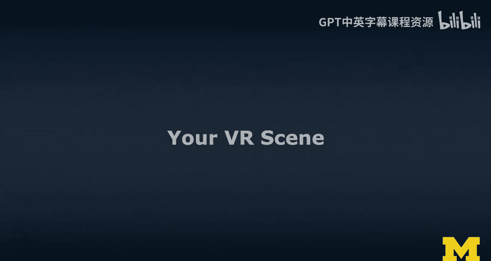
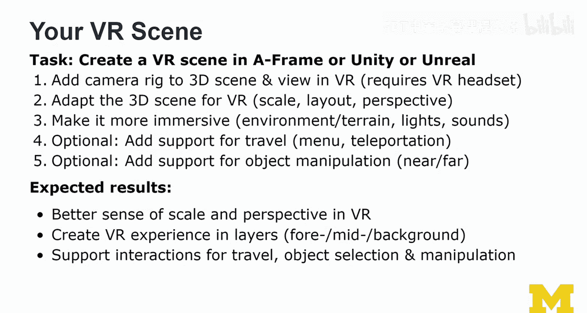
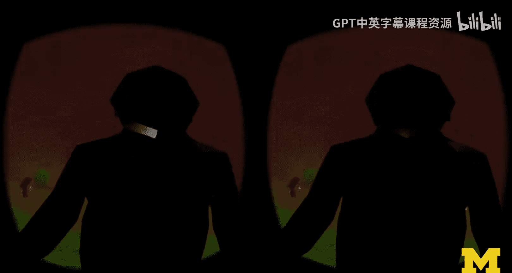
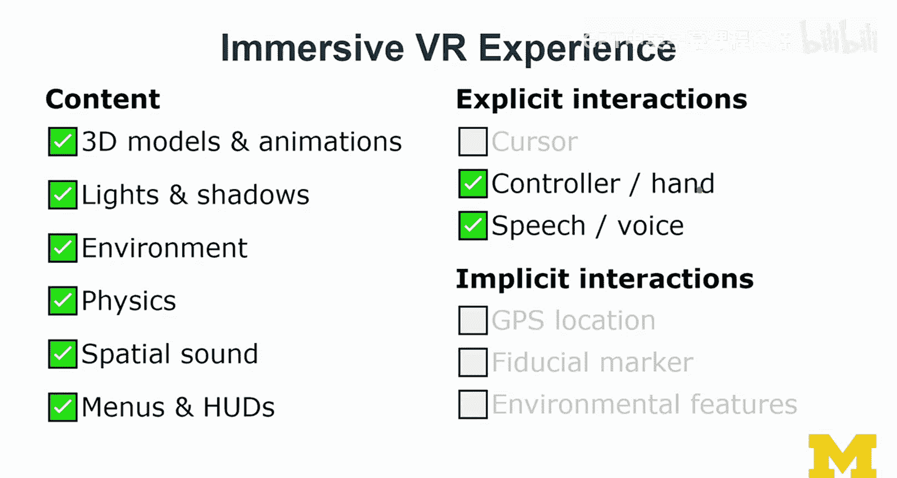

# 108：VR场景构建实践 🏗️

在本节课中，我们将学习如何将一个基础的3D场景转化为一个完整的虚拟现实体验。我们将从添加VR核心组件开始，逐步增加沉浸感、交互功能，并最终创建一个支持漫游和物体操作的VR场景。

## 概述

我们将基于之前模块中创建的3D场景，通过一系列步骤将其升级为VR场景。这个过程包括添加VR摄像机、调整场景比例与布局、增强环境与音效，并最终实现交互功能。无论你使用的是A-Frame、Unity还是Unreal引擎，本教程都将为你提供核心的构建思路。

## 从3D场景到VR场景

上一节我们完成了3D场景的构建，本节中我们来看看如何将其转化为VR场景。起点是上一个模块中的3D场景。这个基础非常重要。

显然，当你进入VR空间时，可能会对该3D场景进行优化和调整。但我建议你先按照我的方法完成3D练习，然后再进行VR转换。尽管你可能迫不及待地想进入VR世界——我理解这是一个迷人的领域。

## 设备要求与可选步骤

进行本练习需要一些设备。你可以使用Cardboard和手机（将手机放入其中）来完成。这是为了让绝大多数学习者至少能够尝试。因此，练习中的某些步骤我标记为**可选**。如果你只有**三自由度（3DoF）** 设备，这些步骤可能无法实现。

如果你拥有像Oculus Rift S或Quest这样的**六自由度（6DoF）** 设备，则可以体验更多功能。对于这类设备的用户，可以考虑使用Unity或Unreal引擎进行开发。

我的许多在校学生都使用Cardboard，我们也能用它创造出很酷的作品。请注意，我们甚至可以用Cardboard进行增强现实开发，这将在AR练习部分讨论。

即使没有其他设备，你也应该努力体验**立体视觉**，这能带来质的改变。理想情况是将设备佩戴在头上。如果完全没有VR设备，你可以在**360度**模式下模拟场景，但这并非真正的虚拟现实，不要混淆两者。

## 核心任务：构建VR场景

以下是你的VR场景构建任务：在A-Frame、Unity或Unreal中创建一个虚拟现实场景。请参考我在这些平台上的入门指南以更好地理解操作步骤。此时，你应该已经完成了3D场景，并做出了平台选择。

### 第一步：添加摄像机装置

从你的3D场景出发，第一步是添加一个**摄像机装置**。
*   在A-Frame中，是添加一个XR摄像机。
*   在Unity中（使用XR插件时），是添加一个摄像机装置。

目标是能够在VR中查看场景，这显然需要VR头显。在VR中查看时，你很可能会发现需要调整场景。

### 第二步：为VR调整场景

你需要为虚拟现实调整3D场景。重点考虑**比例**，很可能需要放大物体而非缩小，以获得正确的比例感，尤其是当你站立时。如果你使用的是6DoF头显，能够完全在3D空间中追踪移动，那么获得正确的比例和布局就更为关键。

同时思考场景布局是否需要调整：你希望用户有多少移动空间？虚拟世界应该有多大？即使只是看着智能手机屏幕，一旦放入Cardboard，你也会感觉空间变大了。这种环绕头部的体验会极大地改变你对比例的感知。

考虑添加一些**视觉提示**来引导用户视线。

### 第三步：增强沉浸感

接下来，请添加**环境或地形**以增强沉浸感。
*   在Unity和Unreal中，你可以添加岩石、树木等，效果会很出色，但这需要一些时间。
*   在A-Frame中，最简单的方法是使用**环境组件**并进行配置。你也可以使用模板来快速创建森林区域等。

**灯光和声音**对于沉浸感至关重要。请考虑添加额外的灯光，并务必添加声音。

### 第四步：实现交互功能（可选）

这是一个虚拟现实世界，你应该支持**移动**。这可以通过菜单实现，但需要一些深入研究。
*   在Unity中，可以使用Canvas或SteamVR、Mixed Reality Toolkit、XR Interaction Toolkit等组件库中的示例。
*   在A-Frame中，有**传送组件**，相对容易实现，但这需要控制器和VR头显支持，因此我将其标记为可选。

**物体操作**也是一个高级功能。你可以考虑近处和远处的物体操作。我展示过的每个工具包都有相关示例。在A-Frame中，这通常需要**光线投射**，可以使用激光控制器并响应点击事件。

## 练习目标与设计原则

本练习的核心目标是，引导你探索一种系统性的方法来创建一个包含所有基础要素的VR场景：**沉浸感、移动支持和物体操作**。如果实现了菜单或操作，也就包含了**选择**功能。这涵盖了我在讲座中谈到的所有基本要素。

通过这个过程，你将更好地理解VR中的**比例和透视**。你需要从3D场景进行调整，我确信你会学会如何分层构建VR体验。

为了让场景更沉浸，你应该考虑**视差**效果。让事情发生在远景、背景、中景和前景，而不仅仅是设计前景。像迪士尼电影一样分层设计会带来巨大不同。至少设置一个天空盒，在远处添加一些元素，在中景到背景中添加一些东西（比如几只鸟），再加上前景。

支持**移动、物体选择和操作**的交互，意味着你拥有了一个真正的虚拟现实世界：你可以在其中行走、探索、拾取和操纵物体。

## 学生案例与期望管理

在这个阶段，我的学生们通常非常兴奋，想创造一个超级酷的游戏。但这会非常困难。游戏的问题在于，你通常需要花费大量时间研究游戏机制等。如果你有游戏想法，请专注于**一两个交互**即可，不需要在这里制作完整的游戏。

让我们回顾一下我们的案例研究。这是一个非常复杂的虚拟现实场景的优秀例子。我的学生Kara花费了数小时来构建它。请不要被误导，虽然这可能看起来不像迪士尼的作品，但对于A-Frame来说，这已经是相对高质量的了。这是一个动物园场景，支持移动到不同区域，并实现了物体选择和操作（例如在宠物区喂食动物）。这是一个相当高级的场景，是完成了我的课程的学生花费数小时辛勤工作的成果。

## XR体验层次概述

这让我想到了XR体验的概述。我们应该区分**显式交互**和**隐式交互**。

一个**基础的VR体验**（也是本课的目标）包含：3D模型（可能多个）、动画、灯光和阴影（初始免费获得，但应考虑添加额外灯光并调整阴影）。在Cardboard上，常见的交互方式是屏幕中央有一个**光标**，用于指向和导航。

当我们过渡到**沉浸式VR体验**时，会包含更多内容：环境、物理效果、**空间音效**、菜单和抬头显示器。随着环境变得更复杂，沉浸式体验通常包含这些。交互方式也更多样：控制器或VR中的手部交互、语音交互。在A-Frame中，有使用特征识别的语音组件。

大多数交互仍然是基于**控制器**的，支持不同的按钮（扳机键、握柄键）。这取决于你使用的VR硬件类型。

即使在Cardboard上，你也可以进行交互（有一个按钮），并且可以实现**隐式交互**，例如**驻留**（凝视触发）。因此，不要认为基础就等于Cardboard，沉浸式就等于高级头显。通过投入精力，你同样可以用Cardboard创建沉浸式VR体验，尽管在硬件性能上可能有些限制。

## 工具选择与后续安排

你可以选择工具：WebXR（A-Frame）、Unity或Unreal。你可能在制作3D场景时已经做出了选择。但如果你想想尝试不同的工具，可以先试试。不过，如果你想快速完成，我不建议尝试不同的主题或不同的3D场景。

在我的在校课程中，学生们通常同时使用Unity和A-Frame完成所有内容。虽然这可能有些重复，但我看到了很多很酷的多样性。当相同的场景用相同的工具制作时，观察其中的差异非常有趣。

无论如何，我希望你能坚持下去，挑战自己，学习更多关于VR的知识，而不仅仅是快速完成练习。如果你希望在本周完成，请保持简单，将其视为一个起点，之后可以在此基础上迭代。

下一个模块的荣誉课程将专注于**增强现实（AR）**。在VR部分我不会再进一步推进，但我们将探讨AR，这将会很有趣且富有挑战性。这将帮助你形成一个完整的概览。

## 总结

在本节课中，我们一起学习了如何系统地将一个3D场景构建成功能完整的VR体验。我们从添加XR摄像机开始，逐步调整场景比例、增强环境与音效的沉浸感，并探讨了实现移动与物体操作等交互功能的方法。无论你使用A-Frame、Unity还是Unreal，核心原则都是分层设计、注重比例与交互，以创造出身临其境的虚拟世界。

祝你好运。我期待在论坛的作品展示区看到大家的提交。如果有问题，请随时联系。另外，不要忘记最后会有同行评审，请准备好你的材料，思考你将提交什么。评审基调将是公平、建设性和友好的。希望大家互相给予良好、有帮助的反馈。

我们将在接下来的课程以及荣誉课程的下一个模块中再见。