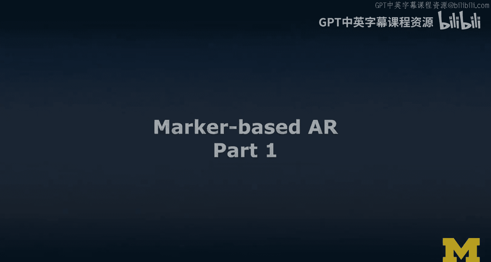
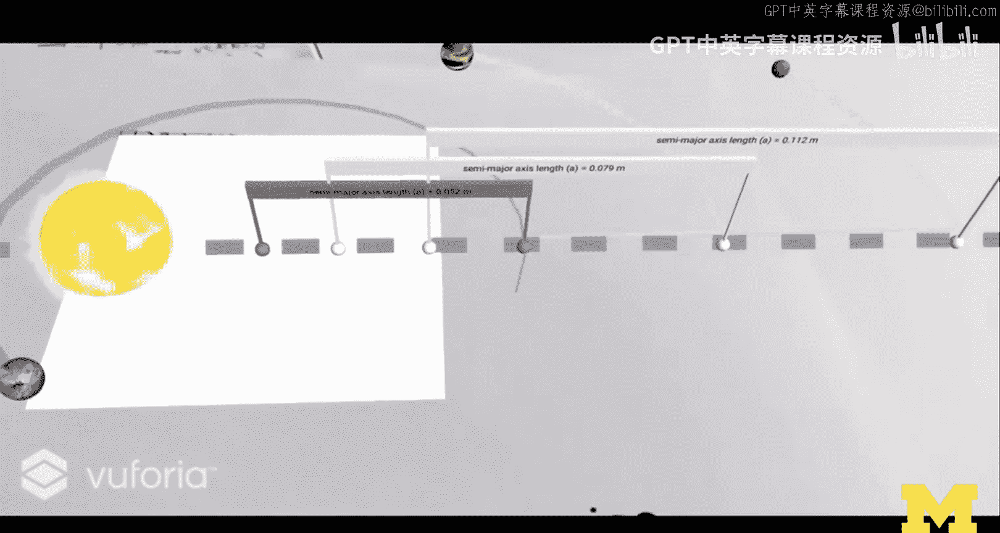
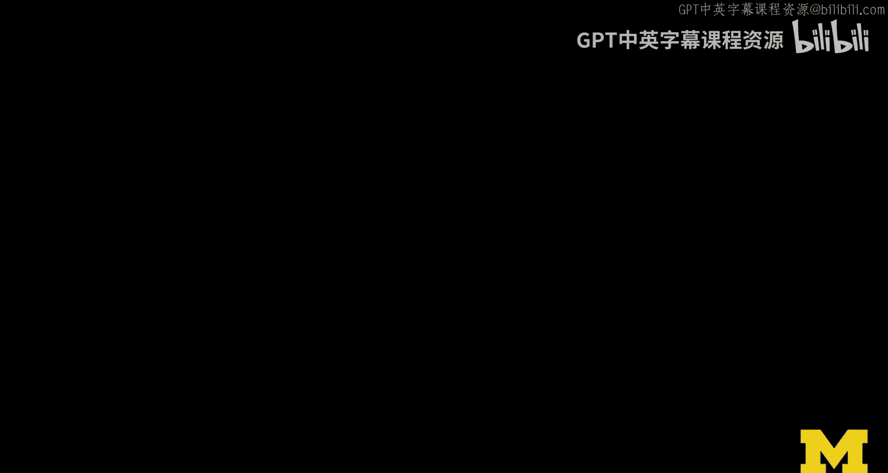
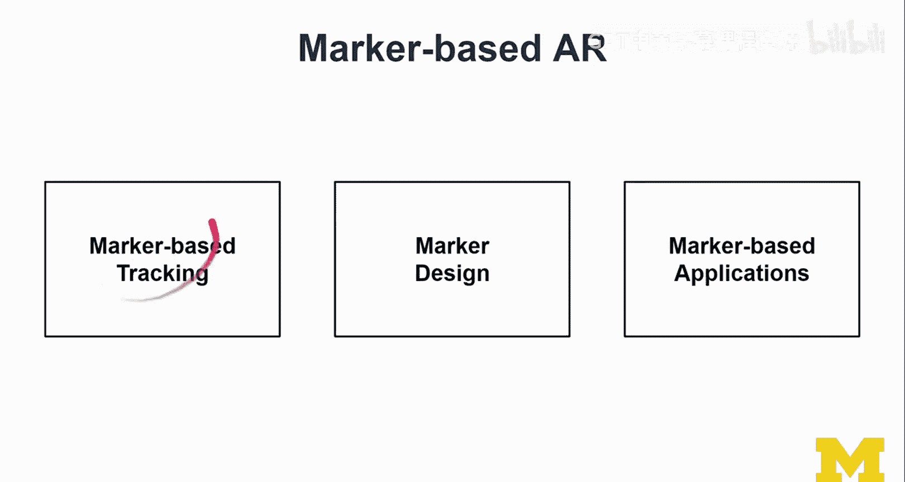
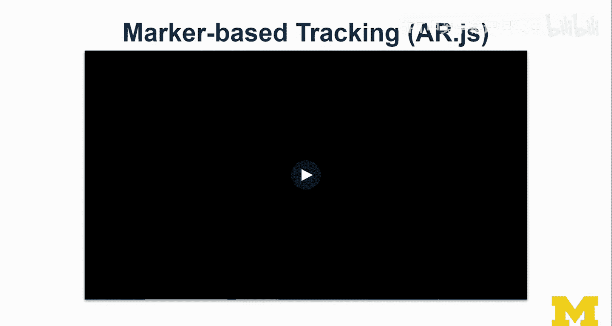
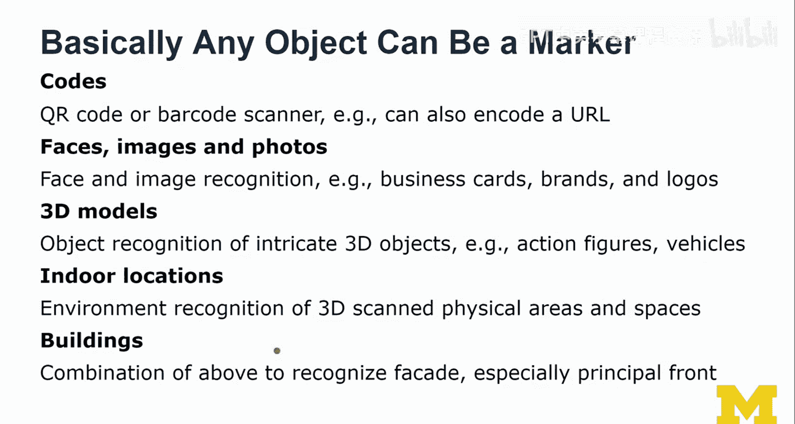
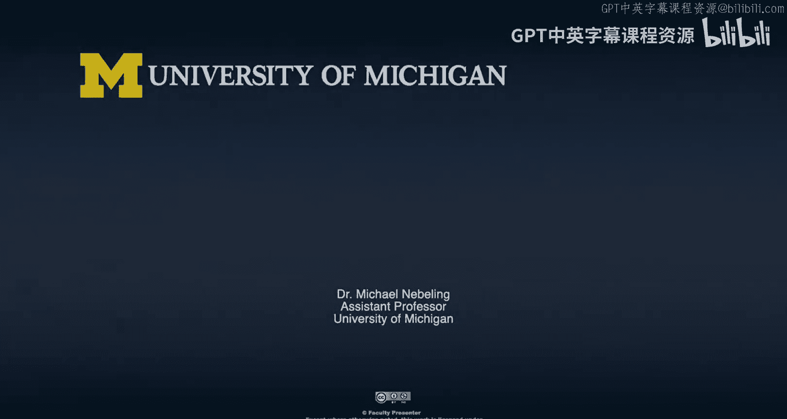

# 113：基于标记的AR开发第一部分 🎯

在本节课中，我们将学习基于标记的增强现实开发。我们将探讨标记是什么、如何设计它们，以及它们如何与虚拟内容进行交互。课程将围绕一个关于开普勒行星运动定律的案例研究展开，展示如何将复杂的科学概念通过AR技术生动地呈现出来。

---

上一节我们概述了基于标记AR的主题，本节中我们来看看具体的实现案例。

在之前的独立研究中，我们首先设计了无标记的AR版本，随后实现了基于标记的AR版本。我们围绕纸质材料进行设计，实现了基于标记的增强效果，这已成为我们最新研究的一个主题。

以下是我们在当时创建的基于标记的AR版本演示。这是一个较长的视频，展示了之前您见过的内容。

*   在第一定律部分，用户可以靠近观察。当开始与决定轨道的标记交互时，可以看到投影在纸上的数值随之变化。
*   在第二定律部分，通过更换不同的纸张来切换展示的定律。这意味着我们可以部署此类应用程序，并让学生非常容易地操作它，因为他们无需学习复杂的界面。
*   第三定律部分内容非常丰富。虚拟天体围绕太阳旋转和轨道运行的方式是恒定的。将模拟内容从纸张上拖拽出来的交互非常有趣。

让我们更多地关注交互本身，而不是我试图解释背后的原理。这些实际上是相对复杂的、在Unity中实现的模拟，涉及一些数学和计算。

---

上一节我们通过案例看到了基于标记AR的应用，本节中我们来深入了解其核心技术。

基于标记的AR。我们将讨论基于标记的跟踪技术，这显然是实现这一切的使能技术。我们还将讨论一些标记设计。在这个案例研究中，我们可以学到很多，因为我们利用了纸张，并在纸上打印信息，同时使用AR进行投影可视化。

我们也将学习一些基于标记的应用程序示例。这部分会稍微脱离案例研究，看看其他例子。

让我们从基于标记的跟踪开始。

---

基于标记的跟踪是AR技术的核心。以AR.js为例进行说明。

将标记放置在一个表面上，系统会显示该标记的虚拟副本。当移开纸张时，该虚拟副本消失，跟踪停止工作。这就是其工作方式：当标记丢失时，我们隐藏虚拟对象；当标记被找到时，我们显示它。然后系统持续跟踪并调整其姿态（位置和旋转），但比例和大小保持不变。

为了更好地说明，这里展示一个虚拟立方体，它应该完美地贴合在那个标记上。当拿起标记时，跟踪仍然有效。即使这是一个基于1999年ARToolKit的技术，它也非常稳健。

---

上一节我们看到了跟踪的效果，本节中我们来了解其背后的算法原理。

AR.js基于JavaScript的ARToolKit。了解其工作原理很有意义。以下是算法步骤的简要说明：

1.  系统获取原始图像帧。
2.  构建一个阈值图像，进行二值化处理。
3.  寻找连通区域，构建轮廓，获取标记的大致形状。
4.  检测标记边缘。
5.  提取标记区域，并拟合一个正方形到该区域上。
6.  最终得到标记在3D空间中的姿态信息。

这就是算法的快速概述。

---

上一节我们了解了算法，本节中我们来探讨标记设计的关键要点。

这里展示的是之前看到的标记，称为“Hiro”模式，是ARToolKit的默认模式之一。标记设计非常重要：

*   标记周围连续的黑色边框至关重要，不要省略它们。
*   打印标记时，尺寸应尽可能大。标记越小，检测和跟踪越困难。
*   标记的尺寸决定了虚拟物体的比例尺度。在实现中，一个单位长度对应标记的实际尺寸。
*   标记内部的内容可以自定义。这指的是标记图案本身的设计，而不仅仅是放置在标记上的虚拟内容。

我们可以制作自定义标记。例如，AR.js有图案生成工具，Vuforia也用于生成标记。在我们的案例中，我们生成了标记的这部分图案，将其身份信息编码其中，然后将其打印在纸上。我们将一些增强内容与该标记对齐，使其显示在纸上，包括填写此处的一些公式和数值。

---

基于标记的AR应用非常广泛。基本上，任何物体都可以作为标记。

*   可以使用二维码和条形码，它们既能用于跟踪，也能编码URL将用户重定向到特定网站。
*   图像和照片可以作为标记。可以使用Vuforia等工具对图像进行训练。
*   甚至有基于人脸的标记跟踪，例如Snapchat和Lens Studio。
*   3D模型也可以作为标记。例如，一个玩具猫头鹰，虽然是一个毛绒玩具，但理论上也可以被训练为标记。
*   室内地点可以作为标记。使用环境识别技术，预先扫描这些区域，通过摄影测量法构建3D几何信息来理解和检测。
*   建筑物立面也可以被检测。结合投影式AR，可以在建筑上投影增强内容，迪士尼是这方面的大师。

---

本节课中，我们一起学习了基于标记的增强现实开发。我们从实际案例出发，了解了基于标记的跟踪技术、标记设计的关键原则，以及算法的大致工作原理。我们还看到了标记应用的多样性，从简单的打印图案到复杂的3D物体和环境都可以作为AR的入口。掌握这些基础知识，是设计和开发更丰富、更稳健的AR体验的第一步。