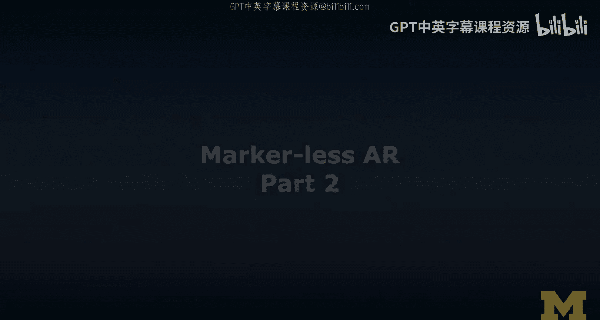
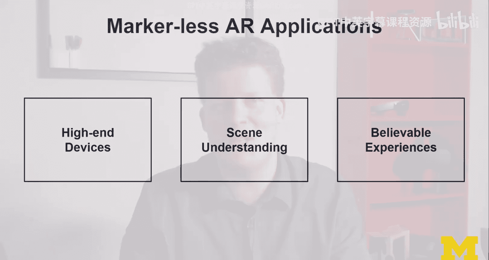
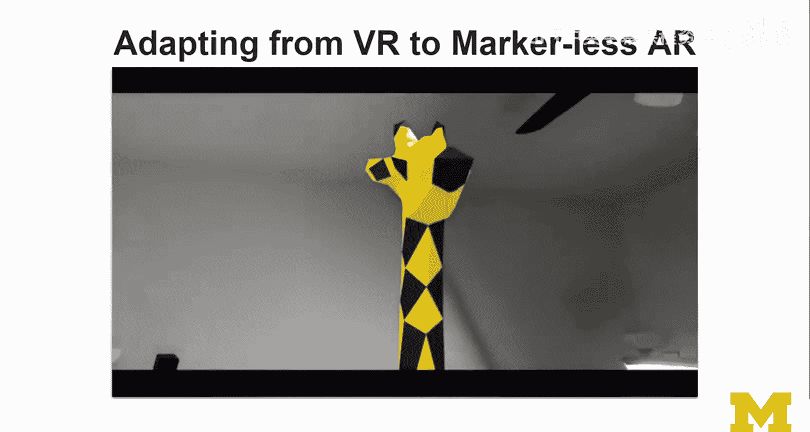

# 116：无标记AR开发第二部分 🚀

在本节课中，我们将继续深入探讨无标记增强现实（AR）的开发。我们将回顾案例研究，分析无标记交互的具体实现，并比较其与基于标记AR的异同。同时，我们会将虚拟现实（VR）中学到的概念应用到AR场景中，并展望AR技术的未来发展方向。

---

## 回顾案例研究

上一节我们介绍了基于标记的交互，本节中我们来看看无标记AR的交互方式。在无标记版本中，核心交互功能与基于标记的版本相同，但实现方式有所不同。

以下是主要的交互方式：

*   **放置**：用户不是放置标记，而是选择一个平面。设备移动时，会渲染一个指示器（例如一个黄色指示器）来辅助定位。用户选定位置后，界面内容就会在该位置出现。
*   **锚定与追踪**：内容出现后，ARKit/ARCore的追踪功能开始工作。虚拟内容被锚定在真实世界的那个位置，就像固定住了一样。即使用户移动设备，只要不看向那个方向，就看不到虚拟内容，但它依然存在于那个空间坐标中。
*   **指向与遮挡**：用户可以直接用手指指向虚拟内容。如果启用了人物分割功能（例如在iPad上），手指甚至能部分遮挡住虚拟内容，实现更自然的交互。虽然目前效果还不完美，但随着技术进步，未来我们将能更无缝地在物理世界中直接与虚拟内容交互。
*   **点击**：用户可以直接点击虚拟内容。在当前实现中（尤其是ARCore），尚不支持在设备后方进行点击交互。这需要手部追踪技术的支持。
*   **拖放**：与之前一样，支持多指触控的拖放操作。

## 无标记AR的技术考量

那么，开发无标记AR应用意味着什么呢？

*   **设备要求**：它主要面向2017年之后的高端智能手机设备。这意味着你的应用可能无法覆盖所有用户群体，在设计解决方案时需要考虑到这一点。
*   **WebXR支持**：WebXR目前仍处于实验阶段。虽然可以实现无标记AR，但交互体验较差。不过，相关规范正在快速演进，例如**射线投射（Ray Casting）**和**命中测试（Hit Testing）**功能已被加入。
    *   **命中测试（Hit Testing）**：当检测到平面并准备放置内容时，系统会从屏幕上的点向场景中投射一条射线，检测其与虚拟平面或表面的交点，内容将出现在这个交点上。我们在VR课程中讨论过射线投射和命中测试，这个概念同样适用于AR，只不过对象变成了由虚拟平面和表面近似的物理世界。
*   **渲染叠加**：在AR场景上渲染内容（称为DOM叠加）目前仍属实验性功能，实现起来尚有挑战，但预计在未来几个月内会变得更加可用。

## 场景理解与未来应用

无标记AR应用，特别是在考虑无障碍功能时，潜力巨大。例如，结合HoloLens等设备更先进的**空间映射（Spatial Mapping）**和**语义场景理解（Semantic Scene Understanding）**技术，我们可以理解摄像头所拍摄的场景内容。

这能为有特殊需求的用户提供宝贵信息。主要的挑战将转移到用户体验设计上。无论是本地处理还是云端处理，场景理解都将是未来AR更重要的应用方向。

此外，在远程维修、远程医疗等场景中，专家可以远程在用户的真实视野中进行标注和绘图指导，这需要空间映射和场景理解技术的支持。这正是ARKit等高级技术真正大显身手的地方。

## 实现更可信的体验

目前，这些技术能帮助我们实现更**可信（Believable）**的体验（而非完全真实）。关键在于：
1.  **逼真的遮挡渲染**：正如一些示例所示，虚拟物体被真实物体正确遮挡是关键。
2.  **光线估计**：在第一门课中我们见过ARCore的光线估计示例。如果能更广泛地应用光线估计，虚拟物体就能更好地匹配真实环境的光照，从而提升体验的可信度，减少“出戏感”。

## 实践：将VR概念应用于AR

现在，让我们将VR中学到的知识应用到ARKit AR中。我们可以导入一个3D模型，比如一只长颈鹿。

与基于标记的体验相比，现在我可以放置一个与房间等比例的真实尺寸模型。虽然这个用Google Blocks创建、来自Poly网站的模型多边形数量不高，但你可以自由探索更精细的高多边形模型。你可以走近观察，这非常酷。

## 构建完整的AR动物园体验

更有趣的是，我们可以构建一个完整的AR动物园。我将所有动物模型放置在地板上。

你会看到，当处理这种大尺度、房间大小的内容时，追踪可能并不完美，稳定性会有所下降。如果在HoloLens上运行，效果会更好。此外，光照条件也可能影响ARCore的表现。

虽然体验还达不到照片级真实，但在相当程度上是可信且有意义的。用户可以真正探索这个动物园，在脑海中构建虚拟动物园的空间布局心理模型，并理解其与物理空间的映射关系。

像长颈鹿和斑马这样显眼的动物，可以作为视觉线索，极大地帮助用户在场景中定向。在设计自己的AR体验时，也可以考虑融入这样的元素。

## 总结与工具整合

本节课中我们一起学习了无标记AR开发的深入内容。

请记住，**命中测试（Hit Testing）**和**射线投射（Ray Casting）**在AR中依然扮演着核心角色。你在第一周学习的关于基础3D场景、几何网格的知识，以及第二周专注于VR的内容，都需要掌握，因为它们能让你更轻松地学习AR。

我们学习了基于标记和无标记的AR，这些知识都是相互关联的。至此，你已经拥有了一个相对完整的工具箱，可以做出深思熟虑的技术决策。

接下来，我们将进一步比较手持式AR与头戴式AR，并了解一些更高端的设备。如果你想学习更多关于实现基于标记和无标记AR的具体方法，现在是查看实践项目内容的好时机。

希望这些通过Unity和WebXR分享的项目，能帮助你更深入地探索AR开发的世界。