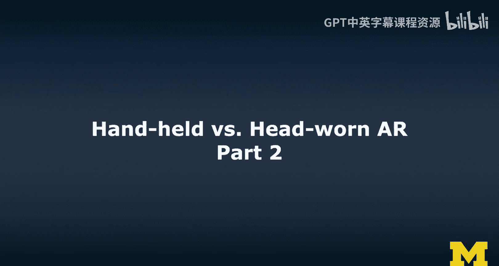
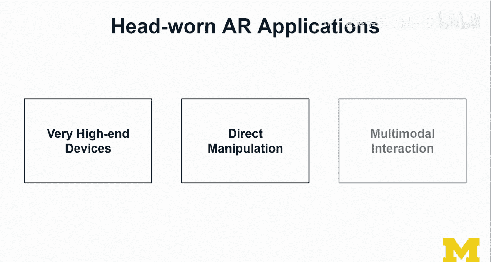
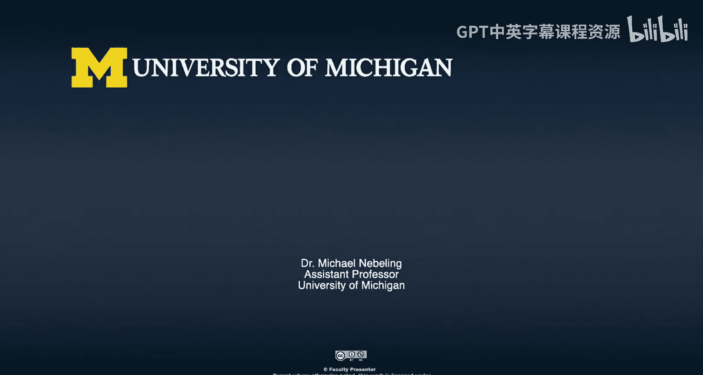

# 118：手持式与头戴式AR对比（第二部分）🎮

在本节课中，我们将继续探讨手持式与头戴式增强现实（AR）的对比，重点关注头戴式AR的交互方式，并通过一个具体的立方体交互演示来理解近距与远距操作的区别。

## 立方体交互演示 🧊

上一节我们介绍了AR的基本交互概念，本节中我们来看看一个具体的应用实例。我将展示一个关于立方体的交互示例，这个例子我非常喜欢。

我之前已经给大家看过一点预览，现在我希望你们能仔细听我讲解这个演示过程。请欣赏。

### 演示过程

我将进行以下操作：在我面前有一个虚拟的立方体平面。这些立方体既能响应远距操作，也能响应近距操作。

*   **近距操作与物理反应**：我可以直接伸手进去抓取一个立方体。它们同样遵循物理规则。例如，我不会只是把它放在我的小桌子上，正如你所见，它现在正放置在这个物理桌子上。我用了这个白色柱状物来支撑这个玻璃桌，这里用了一点小技巧。
*   **放置物体**：我们试试看能否把这个立方体放到我的架子上。跟我来。好的，我们尝试把它放在这里。这里通常是放节日装饰品的地方，但现在我们放上了这个立方体。
*   **远距操作**：对于这个立方体，我将使用远距操作。我会“抓住”它，然后……就像这样……让它掉在这里，看看会发生什么。它掉在了地板上。目前，它还不能将座椅识别为障碍物，因此没有进行遮挡渲染。
*   **再次操作与遮挡效果**：我再抓取它一次，然后把你放在这里——桌子上。这个立方体在桌子下面，所以你能看到两者之间的遮挡关系。一个在地板上，一个在桌子上。
*   **组合操作**：此外，如果我拿起这个……然后像这样丢在这里……砰，它会掉在另一个立方体旁边的地板上。接着我实际上使用了远距操作。这个操作有点棘手，也有点敏感。

总的来说，这绝对非常酷。我要把你放回这个虚拟架子上。这就是我们开始的地方。演示结束。

这就是我想表达的内容。现在，所有这些技术正融合在一起：我们有了空间映射，可以引入物理系统，并支持近距和远距操作。因此，我开始感觉自己在以一种直观且自然的方式与这个虚拟世界互动，或者如他们所说，是本能式的交互，而非仅仅是自然的交互。这超越了“自然”的范畴。当然，如果你是像我一样的人机交互研究者，你会理解这一点，甚至可能觉得这很有趣。

## 近距操作与远距操作对比 👐➡️👆

我们刚刚探索了两个示例。

*   **近距操作示例**：一个是我拿起立方体并将其放入红色架子的过程。这是近距操作的例子，我的手实实在在地进入了物体所在的空间。
*   **远距操作示例**：在右侧，你看到的是远距操作。就像激光或蛛网从我的手中射出，这显然延伸了我的触及范围。因此，我不需要走到物体旁边，也不需要传送。在AR中，传送并不好用，实际上会让人非常困惑。所以，这种远距操作是一种有效的解决方案，而且效果相当不错。我不必跑过去拿那个立方体，这真的很酷。

## 头戴式AR应用的特点 🥽

接下来，我们看看头戴式AR应用的特点。

*   **触及范围与设备层级**：这确实是非常高端的设备。除非你使用像基于智能手机的AR设备，例如HoloKit（可以称之为AR版的Cardboard），我们仍然可以使用智能手机。但当我们谈论高端设备时，比如我现在使用的HoloLens 2，它价格昂贵，集成了许多突破性的酷炫功能，但除非你在企业环境中工作，否则很少有人能接触到它。显然，如果你有足够的资金，你也可以获得它。
*   **直接操作**：我们讨论的是非常高端、直接的操控方式。感觉非常自然，尤其是近距操作方面，就像你真的伸手抓住了内容并移动它。目前，你至少需要做出这样的手势。我认为未来我们也能支持更直观的交互方式。人们希望进行各种操作，但并非所有想法都能实现。我在这里快速演示各种手势，这是你希望它工作的方式，但目前还远未达到《少数派报告》中的水平。不过，我们确实支持直接操作。这不同于通过触摸屏的操作（我们也称之为某种直接操作）。但仔细想想，当内容存在于现实空间中时，通过触摸屏直接操作内容——虽然在你移动物体时是合理的——但你实际上是在与一个空间上“在那边”的内容交互，只是它被渲染在你的屏幕上。那么，这还算真正的直接操作吗？在头戴式AR的语境下，直接操作意味着你可以走到那个位置，亲手拾起它。这就是我在这里所指的，使用你的双手直接与内容互动。
*   **多模态交互**：例如，结合手势和语音，或不同类型的交互模态。结合手势和语音是提高可靠性的一种方式。单独使用手势或语音进行密码输入并不理想，但如果结合这些模态，显然可以减少误判，这是一种更好、更可靠的方式，特别是在我们针对无障碍应用时，多模态交互会非常有意义。

## 总结与展望 🚀

以上就是我想讨论的内容。接下来，我们将会观看一段独立的视频。制作这个视频非常酷。所以，当你有空时，请务必观看。你应该全屏观看，甚至可以准备点爆米花。“Mission Unreal”示例是使用Unreal引擎和HoloLens 2所能实现的最酷的事情之一，是一个非常棒的案例。我为你单独准备了那个视频。

如果你对无标记AR感到兴奋，或者对头戴式AR感到兴奋，那么我认为现在你已经掌握了所有的基础模块，可以尝试进行一些更高级的开发了。很高兴我们涵盖了所有这些内容。

期待在“诚实追踪”部分见到大家。实际上，我并没有专门针对头戴式AR准备特定的内容，我原以为感兴趣的人不会太多。但我很乐意添加更多内容。我们在那个领域有很多正在进行的工作，我可以提供更多关于在HoloLens上使用MRTK的示例。所以，请让我们知道你的需求。

感谢观看本讲内容。