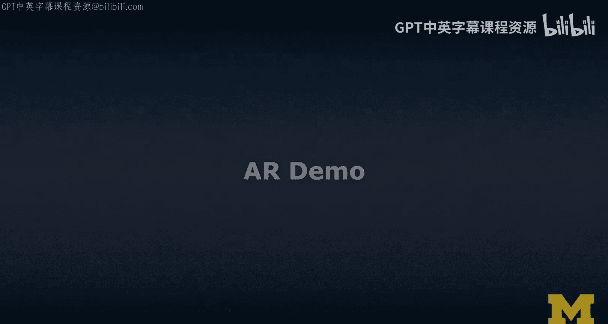
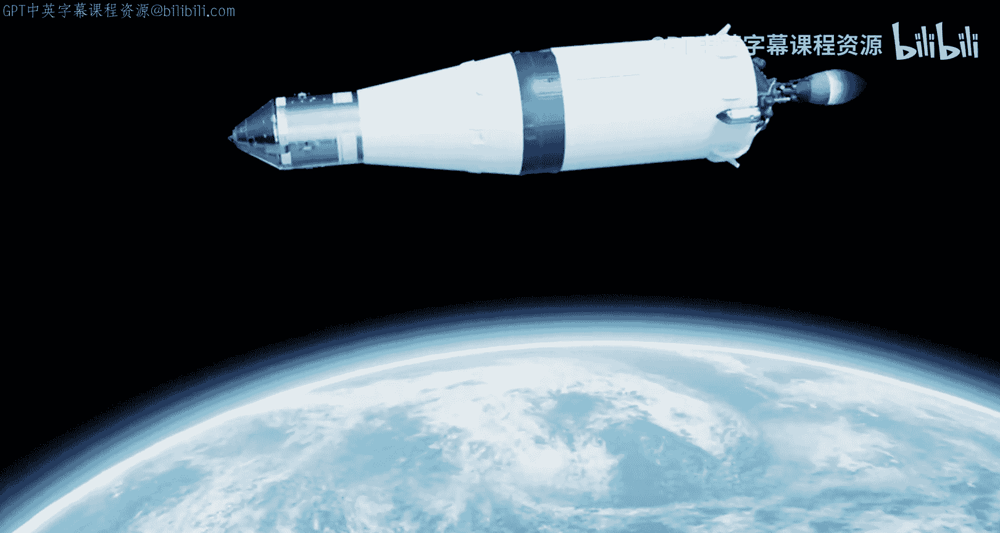
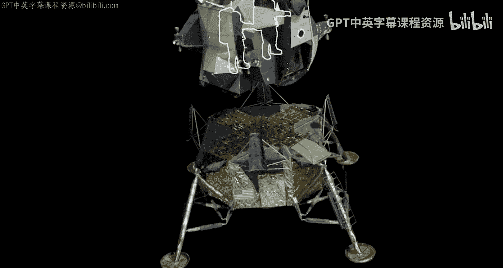
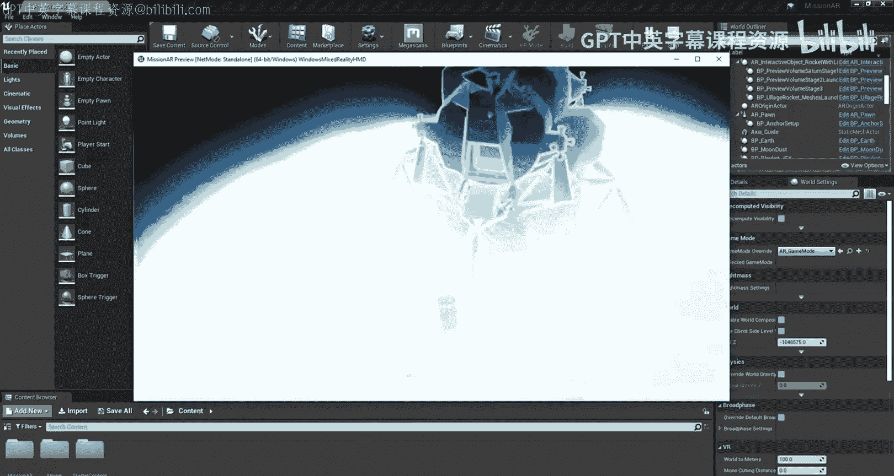
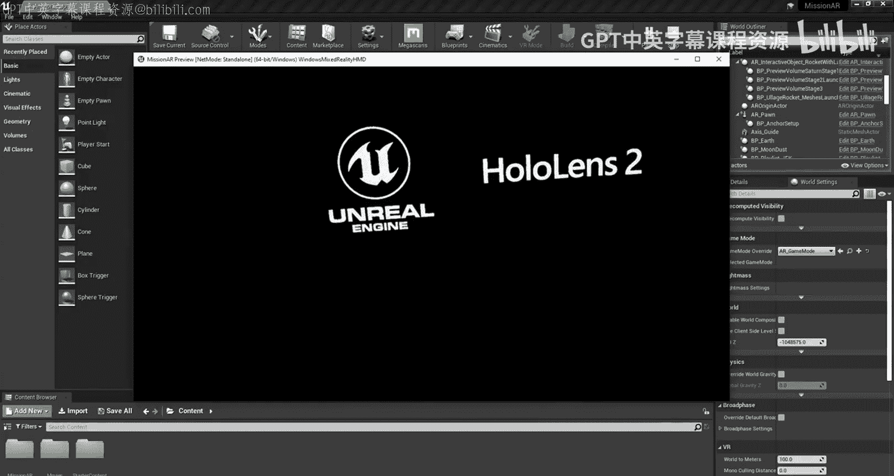
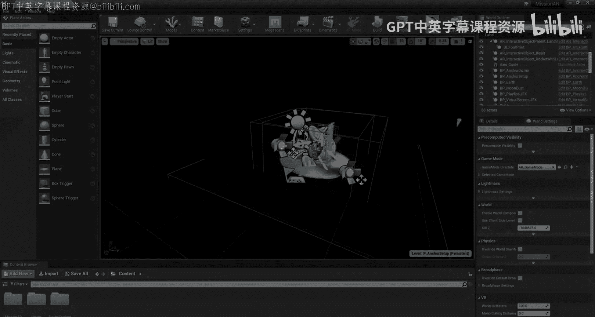
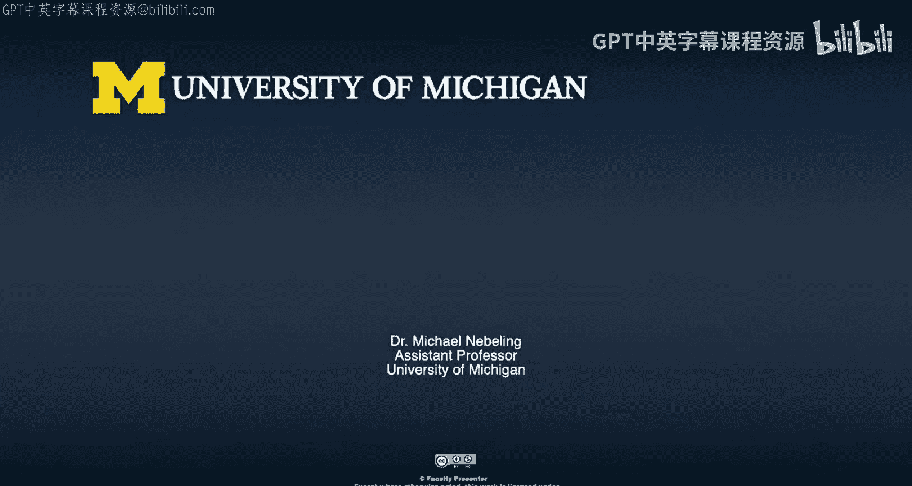

# 119：AR技术演示 🚀

在本节课中，我们将通过一个具体的增强现实（AR）技术演示案例，学习AR如何被用于创建沉浸式的教育体验。我们将跟随一个模拟阿波罗11号登月任务的AR演示，了解其关键交互步骤和背后的技术逻辑。

---

## 概述

这个AR演示重现了阿波罗11号登月任务的关键阶段。用户通过触摸虚拟场景中的特定元素，可以逐步触发火箭发射、飞船分离、登月舱着陆等历史性事件。这展示了AR技术将复杂信息转化为直观、互动体验的强大能力。

---

## 演示启动与土星五号发射 🚀

上一节我们介绍了AR演示的背景，本节中我们来看看演示的启动与火箭发射阶段。

演示始于用户触摸土星五号火箭发光的基座，以启动发射序列。随后，系统播放点火指令和引擎启动的音效。土星五号是一枚三级火箭，每一级都承担着将飞船从地球送往月球的不同任务。

以下是发射序列的关键步骤：
*   **用户交互**：触摸火箭基座。
*   **系统反馈**：播放“点火程序开始”、“所有引擎运行”等音频。
*   **技术目标**：模拟火箭发射的初始动力阶段。

---

## 进入轨道与地月转移 🌍➡️🌕

在成功模拟发射后，我们来看看飞船如何进入地球轨道并飞向月球。

发射后，火箭的第三级引擎首次点火，将阿波罗11号送入环绕地球的“驻留轨道”。在进行了数小时的系统检查后，第三级引擎再次点火，推动飞船踏上前往月球的旅程。这个过程在AR演示中通过视觉变化（如地球逐渐变小）来表现。

---

## 指令舱与登月舱分离 🛰️

当飞船抵达月球轨道后，下一个关键步骤是指令舱与登月舱的分离。

用户按下“指令舱”按钮后，登月舱“鹰号”与指令舱分离。由于登月舱专为太空真空环境设计，它无需考虑空气动力学，因此重量被降至绝对最低。其舱壁厚度仅相当于几层铝箔。宇航员甚至没有座椅，他们站立着驾驶飞船，本质上是在进行一场从轨道开始的受控降落。

以下是登月舱的设计特点：
*   **结构**：舱壁极薄，`weight = minimal`。
*   **驾驶方式**：宇航员站立驾驶。
*   **设计原理**：为真空环境优化，舍弃空气动力学设计。

---

## 月球着陆与历史性一步 👣

分离完成后，登月舱将执行着陆程序。

用户按下“鹰号”登月舱的舱门，七小时后，指令长沿梯子走下，站在登月舱的支脚上。在月球六分之一的重力下，指令长及其宇航服的总重360磅仅相当于60磅，使得移动异常轻松。最后，指令长迈出了“个人的一小步，人类的一大步”，踏上月球表面。这个脚印代表了近40万人十年的工作成果，它是人类历史上最伟大探索时期的结晶，并且很可能留存至今。按下这个脚印，即可结束演示并返回地球。

---

## 总结

本节课中，我们一起学习了一个完整的AR教育演示案例。从**触发发射**到**完成登月**，我们看到了AR如何通过**简单的交互**（如触摸虚拟物体）来引导用户、讲述复杂故事，并将抽象的科学和历史概念转化为**身临其境的体验**。这个演示充分体现了AR在提升学习沉浸感和理解深度方面的巨大潜力。

