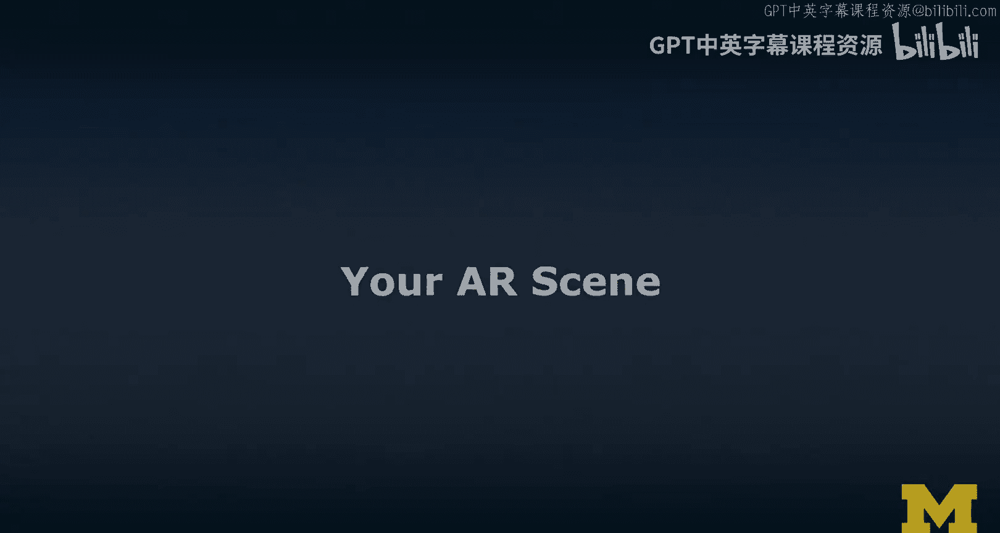
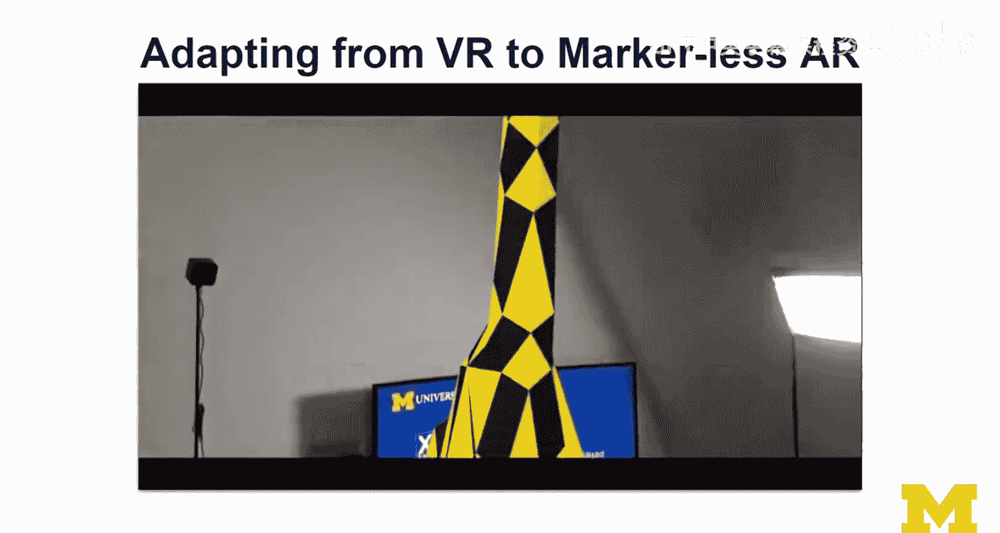
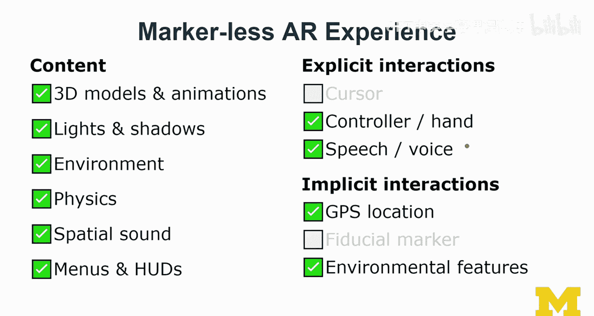

# 122：AR场景构建实践 🚀

在本节课中，我们将学习如何将之前完成的3D或VR场景，转化为增强现实（AR）体验。我们将概述实践任务，探讨基于标记和无标记的AR实现方法，并介绍如何优化场景以更好地融入真实环境。

## 概述

本次实践的核心任务是创建一个AR场景。你可以选择使用A-Frame、Unity或Unreal引擎作为开发平台。首先，你需要为所选平台添加AR功能模块或插件。然后，你将调整原有的3D或VR场景，使其适应AR的观看方式和交互逻辑。

## 任务详解

以下是本次实践需要完成的具体步骤。

### 1. 选择平台并集成AR功能

你的第一步是选择一个开发平台（A-Frame、Unity或Unreal）并集成其AR模块。
*   在Unity或Unreal中，你需要安装并激活相应的AR插件（如AR Foundation、ARKit、ARCore）。
*   在A-Frame中，如需实现基于标记的AR，你需要添加`AR.js`等库来获取AR相机和会话功能。

### 2. 转换并调整原有场景

接下来，你需要将之前完成的3D或VR场景转换为AR版本。这通常涉及对比例和布局的调整。
*   如果使用**基于标记的AR**，你需要打印出标记图。在A-Frame中，标记的尺寸通常被定义为1个单位，因此你需要根据标记的实际大小来调整场景中物体的比例和位置。
*   如果使用**无标记的AR**，你需要确保场景物体在真实环境中的放置位置合理。例如，在较小的房间内，物体不宜放置得过远。

### 3. 优化环境融合度

为了使虚拟物体更好地融入真实环境，你需要从多个维度进行优化。
*   **光照**：尝试调整虚拟物体的光照，使其与真实环境的光照条件匹配。一些高级AR工具支持**环境光估计**，可以自动完成此过程。
*   **声音**：添加空间音频是增强沉浸感的有效方法。例如，为动物园场景添加雨林背景音效，能显著提升体验的真实感。声音可以作为视觉出现前的过渡，平滑地引导用户进入AR世界。

### 4. 实现交互功能（可选）

你可以为AR场景中的3D物体添加交互功能。
*   在**手持设备**上，可以实现点击、拖拽等触屏交互。
*   如果使用**Cardboard**等头戴式设备模拟AR，可以利用凝视（Gaze）和按钮进行交互，例如通过注视物体并按下按钮来触发事件。
*   在**HoloLens**等高级设备上，则可以利用完全的手势追踪进行更自然的交互。

### 5. 尝试不同AR模式（如果条件允许）

如果你有相应的设备，鼓励尝试将项目从一种AR模式转换到另一种。
*   例如，将基于标记的AR体验，转换为使用ARKit/ARCore的无标记AR体验。这个过程能让你深入理解两种技术路径的差异与实现要点。

## 不同AR模式的特点

上一节我们介绍了实践步骤，本节中我们来看看基于标记和无标记AR在体验设计上的主要区别。

### 基于标记的AR体验特点

基于标记的AR体验通常相对简单，核心是识别预设的图案。
*   **内容**：以展示3D模型和简单动画为主，可能包含基础的光影效果。
*   **交互**：通常使用**光标**进行交互。在A-Frame中，可以设置一个始终位于屏幕前方的光标，用户通过移动设备将光标对准物体来互动。
*   **稳定性**：标记需要保持在相机视野内才能稳定追踪。确保标记有足够的黑色边框，并在光照均匀、无反光的环境下使用，以获得最佳识别效果。

### 无标记的AR体验特点

无标记AR（如ARKit/ARCore）能提供更复杂、更自由的体验。
*   **环境理解**：可以利用**空间网格**、**语义分类**（识别平面、椅子、窗户等）和**光照估计**来让虚拟物体更逼真地与环境互动。
*   **物理模拟**：可以轻松实现物理效果，例如让虚拟物体在检测到的真实桌面或地面上弹跳。
*   **高级交互**：在智能手机上以触屏交互为主；在头戴设备上，则可以结合**手势追踪**、**语音命令**等更丰富的交互方式。

## 总结与建议

本节课中，我们一起学习了如何构建一个AR场景。从选择平台、集成AR功能，到调整场景、优化融合度并实现交互，你已掌握了创建基础AR体验的完整流程。

这是一项自由度很高的实践，旨在鼓励你探索和解决问题。AR技术发展迅速，核心思路是相通的，但具体工具和API可能更新。如果你在过程中遇到困难，建议：
1.  回顾课程中关于基于标记和无标记AR的具体实现讲座。
2.  参考各平台（A-Frame/Unity/Unreal）从3D到VR再到AR的“第一步”指导视频。
3.  积极在课程论坛中与同学交流，互相帮助。

通过自主研究和实践，你将成长为一名更独立的开发者。如果你和同学们都无法解决某个问题，教学团队会提供支持。祝你实践顺利，期待在作业互评中看到你的精彩作品！